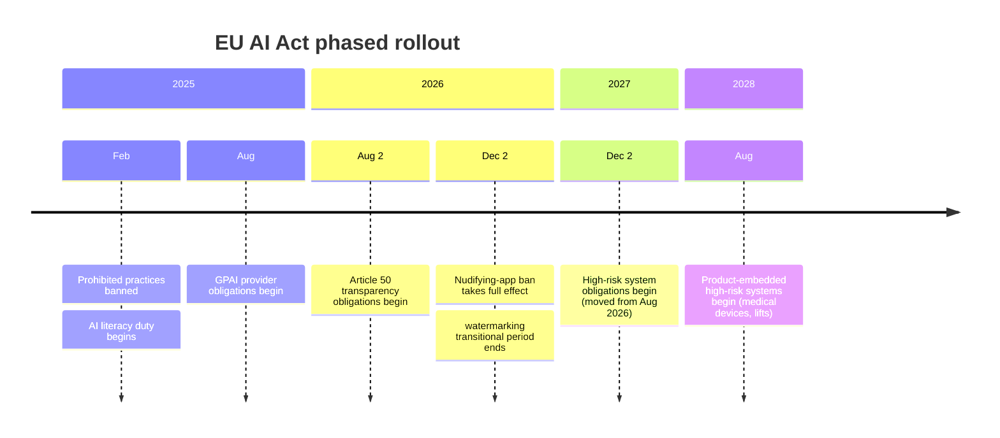

If you'd been putting off the EU AI Act because "the deadline is next year, I'll deal with it then," here's an update worth reading before you keep putting it off: the deadline moved, the move is now final, and there's no more trilogue drama left to wait out.

{/* truncate */}

## Where things actually stand

The Act entered into force in August 2024 and rolls out in phases, not all at once:

- **Prohibited practices** (social scoring, certain biometric surveillance) have applied since **February 2025**.
- An **AI literacy duty** also started in February 2025: any organization deploying or providing AI systems has to make sure its staff have a reasonable level of understanding of how those systems work. It's easy to miss because it has no product requirements attached, just a training and documentation one.
- A newer prohibition, added via the Digital Omnibus rather than the Act's original Article 5 list, bans AI "nudifying" apps that generate non-consensual intimate imagery. It comes with its own transitional period: full compliance isn't required until **December 2, 2026**.
- Obligations for **general-purpose AI model providers** began in **August 2025**.
- The big one, obligations for **high-risk AI systems** (hiring, credit scoring, education, critical infrastructure), was originally set for **August 2, 2026**.

## The deadline move is no longer a maybe

Back in May 2026, EU negotiators reached a political agreement, the "Digital Omnibus on AI," to push that high-risk deadline out. At the time, it was still provisional: a deal that hadn't cleared Parliament or the Council yet.

That's no longer where things stand. Since then:

- The European Parliament formally endorsed the deal on **June 16, 2026** (423 votes in favor, 57 against).
- The Council of the EU gave **final approval on June 29, 2026**.
- The regulation was published in the Official Journal and entered into force on **July 27, 2026**.

:::info
Translation: this isn't a "keep watching the news in case it reverts" situation anymore. The new dates below are locked in, not provisional.
:::

The finalized high-risk deadline is now **December 2, 2027**, with product-embedded high-risk systems (medical devices, lifts, radio equipment) pushed further, to **August 2028**.

One deadline actually moved the *other* direction, and it's easy to conflate with the nudifying-app grace period above since both land on the same date. There's a common misconception that general AI-content transparency (the rule that chatbots must disclose they're AI, and that AI-generated or manipulated content gets labeled) was delayed wholesale. It wasn't: those Article 50 obligations still apply from **August 2, 2026** for any new system. The only carve-out is narrower and separate, a transitional period through **December 2, 2026** for the watermarking sub-obligation specifically, and only for GPAI systems already on the market before August 2, 2026.

## What "high-risk" obligations actually require

If a system you're building or deploying falls into a high-risk category, the Act requires things most of this curriculum already treats as good practice, just made mandatory with penalties attached:

- A documented risk-management process across the system's lifecycle
- Human oversight built into the system, not bolted on after the fact
- Logging sufficient to trace decisions after the fact
- A conformity assessment before the system goes to market

:::warning
Penalties are real money: up to **€35 million or 7% of global turnover** for prohibited practices, up to **€15 million or 3%** for high-risk non-compliance. The Act also has GDPR-style extraterritorial reach, it applies to any provider placing an AI system on the EU market, regardless of where the company is based.
:::

## Why "finalized" still isn't "ignore it"

With the deadline locked in and 16 months further out than originally planned, it's tempting to file this under "solved" and move on. Two reasons that's the wrong read:

1. **Sixteen months isn't infinite runway** if your product touches a regulated category and you haven't started documenting your risk process yet. A conformity assessment process, done properly, takes real calendar time to build.
2. **The finalization removes your excuse to wait, not your work.** Before June 2026, there was a legitimate argument for "let's see if this actually sticks before we invest." That argument is gone now. The date is fixed, and the AI literacy duty from February 2025 is already in force today, whether or not you've acted on it.

## Where this connects if you're building agents

An agent that makes or influences decisions in hiring, credit, or education isn't a hypothetical high-risk case, it's close to the textbook example. The mistake worth avoiding isn't missing the deadline itself, it's treating a longer runway as permission to start the risk-management and logging work later rather than now, since a conformity assessment done properly takes real calendar time regardless of when the deadline lands. If the business side of that conversation, translating a regulation like this into what a product actually needs to ship, is the part that interests you, our [AI Solutions Architect / Presales Engineer track](/career-tracks/ai-solutions-architect-presales) and [AI Product Manager track](/career-tracks/ai-product-manager) both cover that ground.
