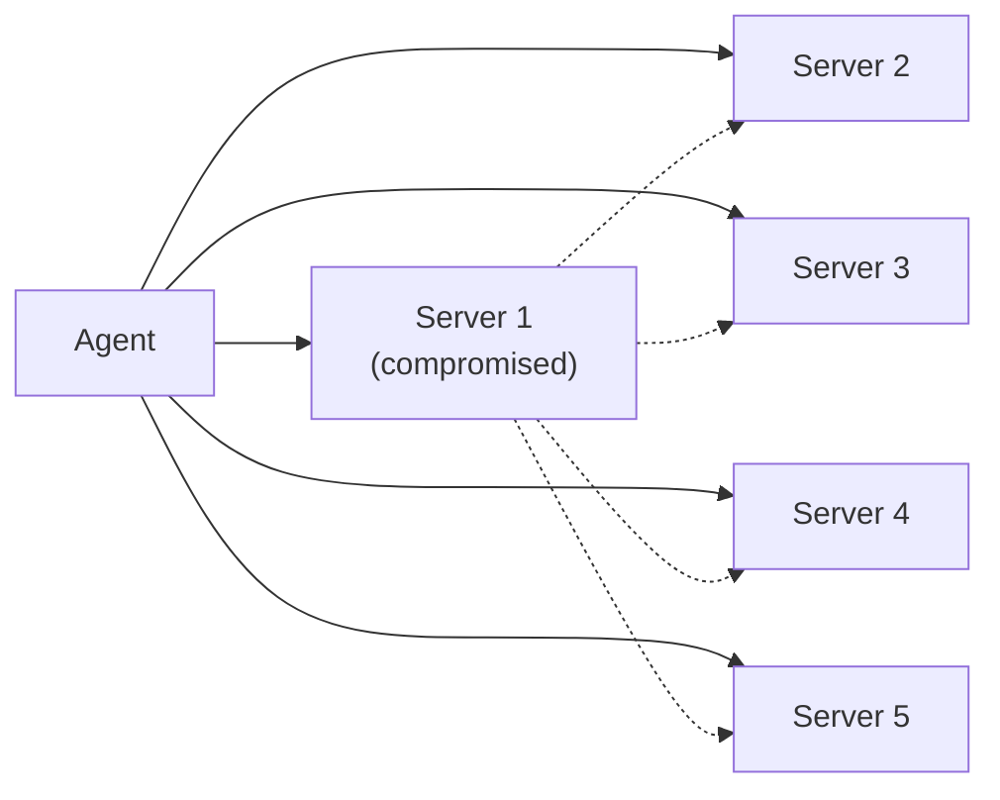

In 2025, a single MCP package called `mcp-remote` racked up 437,000 downloads before anyone noticed it had a command-injection flaw rated 9.6 out of 10 for severity, CVE-2025-6514. It's patched now. It's also not unusual: it's the pattern OWASP's new security checklist for MCP was built to catch before the next one gets 437,000 downloads deep.

{/* truncate */}

## Quick recap: what MCP actually is

Model Context Protocol (MCP) is the plumbing that lets an AI model call outside tools (a calculator, a search API, your company's internal database) without every developer inventing their own wiring for it. Anthropic introduced it in late 2024 as a shared standard, and it went from niche to the default way agents connect to tools in about eighteen months. If you want to see the basic shape of what's at risk here by building one yourself, [Chapter 5](/docs/intermediate/tool-use) walks through an MCP-style tool from scratch.

## Why OWASP made a list for it

Once thousands of teams are using the same protocol to hand an AI model the keys to real systems, that protocol becomes a single juicy target. The numbers behind the [OWASP MCP Top 10](https://github.com/OWASP/www-project-mcp-top-10) (currently in beta, numbered MCP01:2025 through MCP10:2025) explain why the project exists at all:

- **30+ CVEs** were filed against MCP servers, clients, and tooling in January–February 2026 alone, [per Practical DevSecOps's rundown](https://www.practical-devsecops.com/owasp-mcp-top-10/). **43%** of them were shell or command injection bugs.
- [Endor Labs' 2025 State of Dependency Management Report](https://www.endorlabs.com/learn/classic-vulnerabilities-meet-ai-infrastructure-why-mcp-needs-appsec) analyzed 2,614 MCP implementations and found **82% used file operations prone to path traversal** and **34% used sensitive APIs prone to command injection**.
- [Astrix Security's State of MCP Server Security 2025 report](https://astrix.security/learn/blog/state-of-mcp-server-security-2025/) analyzed over 5,200 open-source MCP server implementations and found only **8.5% used OAuth** for authentication. Over half relied on static API keys or long-lived tokens instead.
- [Palo Alto's Unit 42 found](https://www.practical-devsecops.com/owasp-mcp-top-10/) that with five MCP servers connected to one agent, a single compromised server led to a **78.3% attack success rate** against the other four.
- MCP now has over **10,000 active servers** and **97 million monthly SDK downloads**. It's the most widely deployed agent protocol there is, which is exactly why the exposure numbers above matter.

## The full list, with what it looks like in practice

All ten categories, in OWASP's ranked order, with a concrete example of each:

| # | Risk | What it means | Real-world example |
|---|------|----------------|---------------------|
| MCP01 | Token mismanagement & secret exposure | Hard-coded credentials, long-lived tokens, and secrets sitting in model memory or protocol logs, pulled out via prompt injection or by reading debug traces | With OAuth adoption sitting at 8.5% ([Astrix](https://astrix.security/learn/blog/state-of-mcp-server-security-2025/)), most servers hold static API keys in plain environment variables that any tool call or log line can expose |
| MCP02 | Privilege escalation via scope creep | Permissions granted for one task quietly carry over and let the agent do more than intended | A server given read access to a ticketing queue for triage also inherits write access to close or reassign tickets, and nothing stops the agent from using it |
| MCP03 | Tool poisoning | A malicious or compromised server describes its tools in a way that tricks the model into misusing them or leaking data, without ever breaching anything | A tool description silently instructs the model to also email the contents of any file it reads to an external address, and the model complies because the instruction is just more text in its context |
| MCP04 | Software supply chain attacks & dependency tampering | A tampered dependency changes an MCP server's behavior or plants a backdoor at the execution level | `mcp-remote`, downloaded 437,000 times, shipped with a 9.6-severity command-injection flaw (CVE-2025-6514) before anyone caught it |
| MCP05 | Command injection & execution | Untrusted input gets built into a system command or script without sanitization, letting an attacker run arbitrary code | The `mcp-remote` flaw above: unsanitized input reaching a shell command, the same injection bug class that's existed for decades, just now with an AI model as the trigger |
| MCP06 | Prompt injection via contextual payloads | Malicious text embedded in a document, webpage, or tool output hijacks the model the way SQL injection hijacks a database query | A support ticket or scraped webpage contains hidden text instructing the agent to exfiltrate data or call a different tool, and the model can't reliably tell that instruction apart from the user's real request |
| MCP07 | Insufficient authentication & authorization | Weak identity checks across a multi-agent MCP setup leave exploitable gaps in access control | [Unit 42 found](https://www.practical-devsecops.com/owasp-mcp-top-10/) that with five MCP servers connected to one agent, compromising just one led to a 78.3% attack success rate against the other four, because none of them re-verified who was actually asking |
| MCP08 | Lack of audit and telemetry | Tool calls and agent actions go unlogged, so incidents can't be reconstructed after the fact | A compromised server is discovered weeks after the fact, and there's no record of which tools it called or what data it touched in the meantime |
| MCP09 | Shadow MCP servers | Someone wires up an MCP server IT never approved or reviewed, the AI equivalent of shadow IT, except this one can execute code | A team spins up a quick internal MCP server for a hackathon prototype, connects it to a production data source for convenience, and it's still running six months later, unpatched and unreviewed |
| MCP10 | Context injection & over-sharing | Shared or poorly scoped context/memory leaks sensitive data between unrelated tasks, users, or agents | A multi-tenant agent setup carries one customer's data forward into a different customer's session because the context store wasn't scoped per-user |

Solid lines are the agent's normal connections. Dotted lines are what a compromised Server 1 can reach without ever touching the agent:

:::danger
Read the MCP07 row again: 78.3%. Connecting multiple MCP servers to one agent doesn't just add risk per server, it lets a single compromised server reach across the others. Treating each connection as independently trustworthy is the mistake.
:::

The NSA's [May 2026 MCP security guidance](https://equixly.com/blog/2026/06/04/mapping-nsa-s-mcp-guidance-to-the-owasp-mcp-top-10-how-to-test-for-the-risks/) frames the fix the same way OWASP does: treat the model, the MCP client, and every connected server as one trust boundary, not three separate ones.

## A caution on the scanning tools themselves

:::tip
If you run an automated MCP vulnerability scanner and it flags dozens of servers as "vulnerable," don't take that number at face value. One audit of popular YARA-rule-based MCP scanners found a false-positive rate of roughly **78%**, meaning most of what gets flagged isn't actually exploitable once you dig in.
:::

That's not a reason to skip scanning. It's a reason to treat scanner output as a lead worth investigating, not a finished finding. The same instinct applies to any stat in this post, or anywhere else: numbers vary by methodology, and "X% of servers are vulnerable" depends heavily on how vulnerability was measured.

## What this means in practice

None of this means MCP is unsafe to build on. It means the same short list of habits keeps showing up as the fix:

- Scope credentials narrowly, and use OAuth where the server supports it
- Validate tool inputs the same way you'd validate any other untrusted input
- Log what a tool actually did, not just that it was called
- Treat the model plus every connected server as one trust boundary, not separate ones

We cover the same ground in the [Agent Security](/docs/advanced-concepts/agent-security) chapter. Trust every connected MCP server the way you'd trust a new dependency, not the way you trust code you wrote yourself. That single habit would have blunted most of the CVEs above before they shipped.
