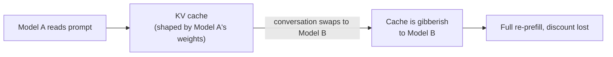
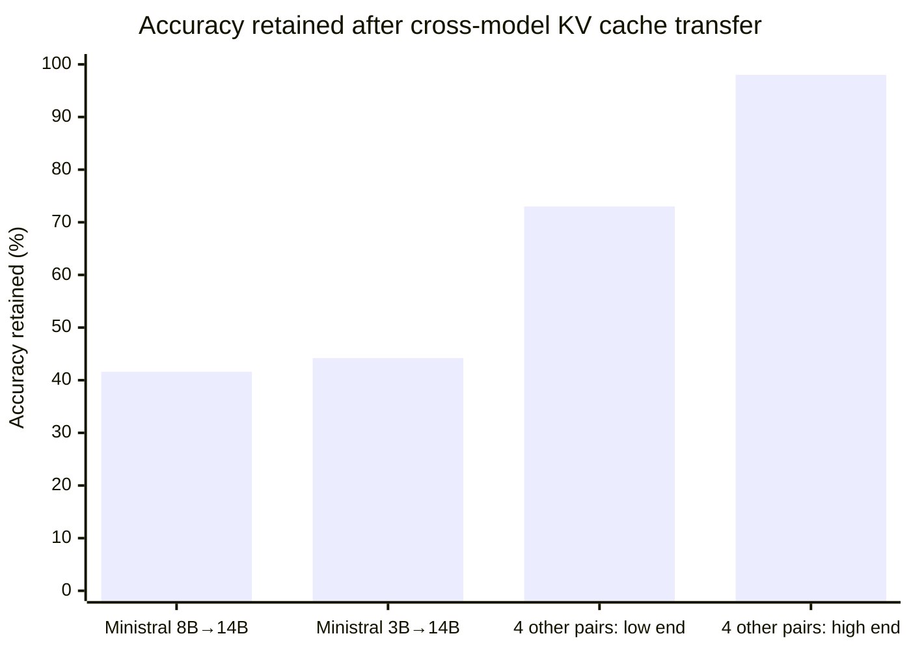

A week ago on this blog we called [agent memory its own product category](/blog/agent-memory-first-class): LangMem, Mem0, Zep, all racing to give agents something that remembers past turns. That's memory as recall, deciding what's worth keeping. There's a more literal kind of memory sitting underneath all of it: the notes a model takes while it's reading your prompt, called the **KV cache**. Normally those notes get thrown away the moment you send that same conversation to a different model. While researching prompt caching for our [Token & Cost Management chapter](/docs/advanced-concepts/token-cost-management), I found a new paper out of NVIDIA, ["Cross-Model KV Cache Transfer in LLM Families"](https://arxiv.org/abs/2608.03893) (arXiv:2608.03893), that treats that waste as a problem worth solving instead of just how things are.

{/* truncate */}

:::tip[TL;DR]
Every time a conversation moves to a different-sized model, that model has to reread the whole thing from scratch, even though a cheaper cache hit was sitting right there a second ago. NVIDIA built a fast, one-time formula that lets one model's cache reused by a different-sized model in the same family. It works well on 4 of 6 tested pairs (73-98% accuracy kept, up to 25x faster), and the paper is upfront that the other 2 pairs are weaker. Skip to [What it actually gets you](#what-it-actually-gets-you) if you just want the payoff, or [Where it doesn't work as well](#where-it-doesnt-work-as-well) for the limits.
:::

## Why the cache breaks on a model swap

An LLM has no memory between API calls. Send it a long conversation, and it has to read the entire thing again before writing a single new word, every single time. That read-through is called **prefill**, and you're billed for it as input tokens. Think of it as the model taking notes while it reads: for every word, at every layer of the network, it writes down a compressed summary called a key and a value. Keep those notes around and the model can keep talking without rereading. Throw them out, and it has to start over.

If the same conversation hits the same model twice in a row, most of that prefill is identical: same system prompt, same tools, most of the same history. Providers cache that work so the repeat call is cheap, and both major providers land on the same discount. On [Anthropic's pricing](https://platform.claude.com/docs/en/build-with-claude/prompt-caching), a cache hit costs exactly 10% of the base input price, Claude Sonnet 5 charges $2 per million input tokens and $0.20 per million for a cache hit. On [OpenAI's pricing](https://developers.openai.com/api/docs/guides/prompt-caching), GPT-5.1 charges $1.25 per million input tokens and $0.125 per million cached, the same 10%.

The catch: that cache only works for the model that built it. The notes are shaped by that specific model's weights, so a small model's notes are gibberish to a bigger model, even one from the same family trained on similar data. And a lot of production systems now route a single conversation across model sizes mid-conversation, a cheap model for easy turns, a bigger one when the question gets hard.



The paper says it plainly: "each swap forces the receiver to repay the prefill from scratch." Every swap wipes out the discount.

## Two models' notes turn out to be related

NVIDIA's team first checked something basic: does a small model's notes have any relationship at all to a bigger model's notes, given the two were trained completely separately? Using Qwen3 14B and 32B, a single plain linear formula built from one layer of the small model already predicted 56% of the big model's key values and 32% of its value values. That's not nothing. It means the two models' internal notes share real structure, they aren't unrelated noise.

From there, the actual method has three pieces:

- **A separate formula per layer and head**, fit with a stable version of linear regression called ridge regression, the standard fix for a formula that would otherwise be unreliable.
- **Each target layer pulls from several source layers, not just one.** A 14B model and a 32B model don't line up layer-for-layer, so instead of matching one layer to one layer, each target layer draws from its several most useful source layers at once. For the 14B→32B pair, using the top 8 source layers instead of 1 raised key-prediction accuracy from 56% to 79%.
- **Position gets stripped out, then reapplied separately.** Part of what makes a key hard to predict is *where* in the sentence the word sits, models apply a rotation for that (a technique called RoPE). The team removes that rotation before fitting the formula, so it only has to learn the relationship between the two models, not "where in the sentence" too. The target model's own rotation gets reapplied afterward.

None of this involves training a neural network in the usual sense. The whole thing is fit once, using 500 short snippets of web text, and takes 47 to 87 minutes on a single 8-GPU machine, once per model pair, not once per conversation.

## What this looks like in code

The paper doesn't release code, but the shape of using it is simple: fit the mapper once, offline, then drop it into whatever part of your serving stack currently pays for a fresh prefill on a model swap.

```python
# without cross-model transfer: every model swap re-reads the whole prompt
def get_response(model, conversation):
    kv_cache = model.prefill(conversation)  # full cost, every time
    return model.generate(kv_cache)

# with a fitted mapper: reuse the smaller model's notes instead of re-reading
def get_response_with_transfer(source_model, target_model, conversation, mapper):
    source_kv = source_model.prefill(conversation)  # already paid for
    target_kv = mapper.transform(source_kv)         # closed-form, no re-read
    return target_model.generate(target_kv)
```

`mapper` here stands in for the ridge-regression weights the paper fits once per model pair. Everything else in a normal serving stack, the router, the prompt, the generation call, stays the same.

## What it actually gets you

Across six model pairs from three families (Qwen3, Llama 3.1, Ministral 3), four of them keep 73-98% of the accuracy the target model would have gotten by reading the prompt itself, measured across five standard benchmarks plus two more checks for text quality and multi-turn handoffs. Because there's no rereading involved, converting a small model's cache into a big model's cache runs 2.7 to 25 times faster than reprocessing the prompt from scratch. Going the other direction, big to small, it's 3 to 7 times faster.

It's training-free too, which is what makes it usable. Earlier attempts at this problem needed a separately trained neural network for every pair of models you wanted to support, or only worked when both models shared the exact same architecture. NVIDIA's version is closed-form math: fit once per model pair in under 90 minutes, no training loop, no cluster running for days.

## Where it doesn't work as well

The 73-98% headline only covers four of the six pairs. The other two both target the same 14B Ministral 3 model, and they're meaningfully worse with the plain linear version:

- **Ministral 3B → 14B:** retains 44.2% of accuracy
- **Ministral 8B → 14B:** retains 41.6% of accuracy



That's the honest middle of the paper, not just its best number.

:::info
Swapping in a small trained neural network instead of the closed-form linear formula recovers a lot of that gap. On one benchmark (HellaSwag), 3B→14B jumps from 68.0% to 92.3% retention, and 8B→14B from 58.7% to 95.5%. The tradeoff is direct: give up the "no training" property, get back most of the accuracy.
:::

### What's still untested

- **Different head configurations.** All six tested pairs share the same number of attention heads and head size ("matched-KV"). Mismatched configurations aren't tested.
- **Other kinds of text.** The calibration data comes from one source, FineWeb-Edu web text. Other domains aren't tested.
- **Non-standard architectures.** The method covers regular transformers only. NVIDIA's own newer models that mix in state-space layers, like Nemotron, aren't covered.
- **A small amount of benchmark leakage.** Picking the "top-k" setting using the same benchmarks that measure it adds up to 2.49 percentage points of optimism, by the paper's own accounting.

:::tip
If you're evaluating this for a routing setup, don't anchor on the 73-98% headline. Check whether your specific pair matches: same family, similar architecture, same head configuration. Outside that box, it's untested territory, not something the paper claims to cover.
:::

## Where this connects

Our [Token & Cost Management chapter](/docs/advanced-concepts/token-cost-management) covers provider-native prompt caching, the same caching this paper's speedups are measured against. Nothing in that chapter changes because of this paper. What changes is the ceiling on what caching can do once a serving stack starts routing between model sizes instead of sticking to one, within the limits above.

This post is based on NVIDIA's paper ["Cross-Model KV Cache Transfer in LLM Families: A Closed-Form Linear Mapping for Prefill Reuse"](https://arxiv.org/abs/2608.03893) (arXiv:2608.03893, submitted 4 Aug 2026, licensed CC BY 4.0).
