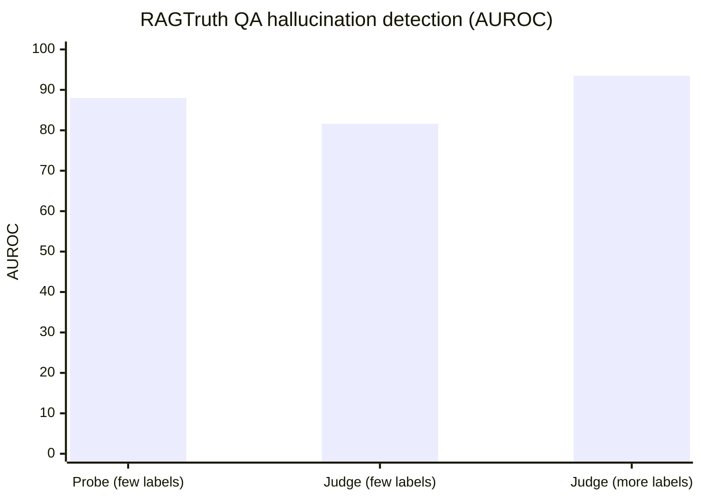

Our [Chapter 8: Evaluating What You Built](/docs/intermediate/evaluating) lab uses a second LLM call as a judge: ask the judge model to compare a generated answer against a reference answer and reply `PASS` or `FAIL`. It works, but it's one technique among several, and the lab's own real output caught the judge writing `PASS` on the first line while its own one-sentence explanation said the answer "fails to provide accurate information about its location." A team of researchers built a toolkit, [SIRIN](https://arxiv.org/abs/2608.00033) (arXiv:2608.00033), around exactly that gap: instead of picking one hallucination-detection method and living with its blind spots, run three unrelated methods on the same answer and see where they agree.

{/* truncate */}

:::tip[TL;DR]
SIRIN is an open-source toolkit that unifies three different ways to catch a RAG system making things up: a second-model judge, a classifier trained on the model's internal hidden states, and an uncertainty score fused from 38 separate estimators. None of the three wins outright, on RAGTruth a lightweight probe beats a judge trained on the same small amount of labeled data, but the judge pulls ahead once it gets more labels. Skip to [How the three methods actually stack up](#how-the-three-methods-actually-stack-up) for the numbers, or [The gap our own lab already found](#the-gap-our-own-lab-already-found) for why one method alone isn't enough.
:::

## Three ways to guess a model is making things up

**Judge-style verification** is the one our own Chapter 8 lab already uses: a second model reads the evidence and the answer and checks whether they contradict each other. It's black-box, it needs no access to the model's internals, and it reads like a person grading an essay against an answer key. It's also just another LLM call, with all the same failure modes an LLM call can have.

**Representation probing** works differently. It trains a small classifier on the model's hidden states, the internal numbers a model produces while generating, learning to separate "this generation pattern usually means a faithful answer" from "this pattern usually means a hallucinated one." It's white-box: you need access to those internals, which rules it out for a model you only reach through an API.

| Method | Access needed | What it reads |
|---|---|---|
| Judge-style verification | Black-box (API-only fine) | A second model's read of evidence vs. answer |
| Representation probing | White-box (needs internals) | The model's own hidden states while generating |
| Uncertainty estimation | Black-box | How confident the model was (entropy, perplexity, 38 fused estimators) |

**Uncertainty estimation** doesn't read the answer's content at all. It looks at how confident the model was while generating it, things like entropy and perplexity, and SIRIN fuses 38 separate estimators of this kind (wrapping an existing library called LM-Polygraph) into one calibrated score. A model that's "unsure" in a measurable way is more likely to be guessing.

Three methods, three completely different signals: what a second model thinks, what the first model's internals show, and how confident the first model was. SIRIN's premise is that none of them alone is trustworthy enough to be the whole answer.

## How the three methods actually stack up

The paper backs that premise with numbers across three datasets: RAGTruth (QA, summarization, and data-to-text), SQuAD 2.0 (response-level detection plus answerability), and PsiloQA (span-level, English subset). There's no single winner, which method comes out ahead depends on how much labeled data you have:



- **With few labeled examples, probing wins.** On RAGTruth, a lightweight probe reaches 88.0 AUROC on QA and 85.3 on data-to-text, beating a LoRA-tuned judge trained on that same small amount of data (80.2-81.6 AUROC).
- **With enough labeled examples, the judge wins.** Given more supervision, a LoRA-tuned Qwen3-4B judge climbs to 91.8-93.5 AUROC on RAGTruth and 87.0 AUROC / 70.2 F1 on SQuAD 2.0, roughly 9 points ahead of the best probe on RAGTruth.
- **Uncertainty estimation needs no labels but trails both.** On SQuAD 2.0, the best individual estimator reaches 58.8-67.4 AUROC, and fusing all 38 together adds only 1.6 points, landing at 69.0 AUROC. It wasn't tested on RAGTruth at all: the paper notes that uncertainty read off a separate proxy model doesn't line up with the actual generator's real uncertainty, a real limitation of running this method in a black-box setting.
- **On span-level localization (PsiloQA)**, probing edges out the judge on ranking which sentence is unsupported (76.0 vs. 75.8 AUROC), but the judge writes a better localization once fine-tuned (74.8 F1, 69.3 IoU). Asked to tag spans zero-shot, without fine-tuning, the judge collapses entirely: 50.0 AUROC, 0.0 F1, chance level.

That's the real argument for running more than one detector: which one to trust depends on how much labeled data you have and what you're checking, not a fixed ranking.

## What SIRIN actually unifies

Before SIRIN, using more than one of these methods meant standing up three separate codebases, each with its own config format and its own idea of what a "detector" looks like. SIRIN puts all three, plus a fourth related task, under one interface:

- **One config system and evaluation pipeline** for all three detector families, instead of three separate ones.
- **Response-level and span-level scoring.** A response-level score grades the whole answer; a span-level score can point at the specific sentence that isn't supported by the evidence.
- **Query answerability**, a pre-generation check for whether a question can be answered from the given context at all, before the model even generates a response. Tested on SQuAD 2.0, a small dedicated DeBERTa-v3 model reaches 91.3 AUROC, on par with a zero-shot GPT-5.4-mini judge (also 91.3) and close to a LoRA-tuned judge (95.7), without needing an LLM call. Useful for filtering out unanswerable questions in a RAG pipeline before they produce a confident-sounding non-answer.
- **A web UI** for pasting in a context-question-answer triple and comparing what all three detectors say about it, side by side.

SIRIN was also tested as a faithfulness gate inside a long-term memory system (SimpleMem, on the LongMemEval benchmark): an ungated baseline serves an accurate answer 62.4% of the time, with 20.2% of served answers strictly unfaithful to what's actually stored. Gating every write with the judge lifts served accuracy to 79.3% and cuts unfaithfulness to 9.8%, at the cost of the system abstaining on 35.9% of turns instead of answering. A probing gate gets most of the same gain (76.8% accuracy, 11.6% unfaithfulness) without a second LLM call per check. The same pattern held, testing separately, on two other memory systems, Mem0 and LightMem. The pattern is the same one our own Chapter 8 lab uses for grading, just applied one step upstream, before something bad gets written down instead of after it's already been said.

## The gap our own lab already found

Chapter 8's real lab output shows the exact failure SIRIN is aimed at. The question was where Whistlepost Coffee's most popular drink is located; the model's generated answer admitted the context didn't say. The judge's verdict:

```
verdict: PASS -- The candidate answer correctly identifies Whistlepost's most
popular drink as the Smoked Maple Cold Brew, but fails to provide accurate
information about its location and context regarding its introduction year.
```

`PASS`, followed immediately by a sentence explaining why the answer is incomplete. That's not a one-off glitch, it reproduced across two separate runs of the lab. A judge model is still just an LLM making a call, and it can write a verdict that contradicts its own reasoning in the same breath. A probing detector or an uncertainty score wouldn't automatically catch what a judge misses, but they're wrong in different ways than a judge is wrong, which is the whole argument for running more than one.

## What this looks like in code

SIRIN's actual API (from its [GitHub repo](https://github.com/sb-ai-lab/SIRIN), Apache 2.0-licensed) runs a detector on a list of context/answer turns and calls `.detect()`:

```python
from sirin.detectors import SequenceLinearProbingDetector, SequenceOpenAIJudge

sample = [
    {"role": "user", "content": "Where is Whistlepost's flagship location?"},
    {"role": "assistant", "content": "The context doesn't say."},
]

probe = SequenceLinearProbingDetector(config=probing_config, feature_processor=processor)
probe.load("./models/ensemble_detector")
probe_result = probe.detect([sample])

judge = SequenceOpenAIJudge(config=judge_config)
judge_result = judge.detect([sample])
```

Same shape as our Chapter 8 `judge()` function, a question, an answer, a verdict, except SIRIN gives you a second, unrelated detector to run on the same input and compare.

## Where it's still limited

- **English only.** Every detector is trained and tested on English data; the paper doesn't validate multilingual performance.
- **One generator backbone.** The memory-gating results all check the output of a single generator model. The paper doesn't test whether a gate trained against one model's outputs transfers to a different model's outputs.
- **Domain match matters.** A detector trained on one kind of text needs recalibration before it's reliable on a different domain, the numbers above don't automatically carry over to your data.

## Where this connects

Our [Chapter 8: Evaluating What You Built](/docs/intermediate/evaluating) chapter already says the honest thing about LLM-as-judge: "treat pass rates as a useful signal... not as proof any individual answer is correct." SIRIN is one concrete answer to what to do about that, run a second, structurally different detector alongside the judge, and see where they disagree.

This post is based on the paper ["SIRIN: A Unified Toolkit for Detecting Contextual Hallucinations in Retrieval-Augmented and Memory-Grounded LLM Systems"](https://arxiv.org/abs/2608.00033) (arXiv:2608.00033, submitted 20 Jul 2026, licensed CC BY 4.0).
