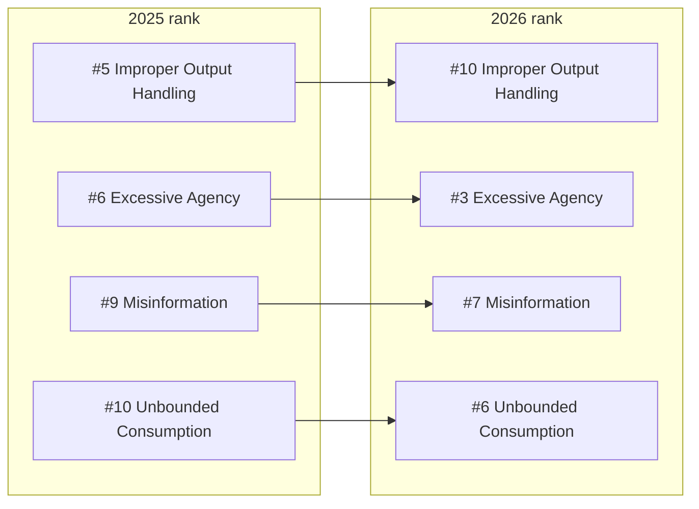

Every year OWASP's LLM Top 10 has been built the same way: ask hundreds of practitioners what scares them, rank by the vote. For the 2026 release, published August 4, 2026, they did something new. They pulled 7,714 real incidents from public vulnerability databases and an AI-harm database, classified 6,639 of them, and checked whether what practitioners fear actually matches what goes wrong in production. It mostly did. Where it didn't is the interesting part.

{/* truncate */}

## Where the vote and the evidence disagreed

Rank the risks by raw incident count alone, and prompt injection falls out of the top 10 entirely. Practitioners still rank it #1. OWASP's own explanation is that this is a defense effect: teams fight prompt injection hard enough that clean, publicly-reported exploits are rarer than the underlying exposure would suggest, so the incident count understates a risk that mature teams are already spending real money to hold off. It kept the top spot.

Misinformation moved the other way, and further. Practitioners ranked it near the bottom. The incident record put it near the top, the widest gap of any category, in the direction that costs money: a fluent, confident wrong answer becomes a wrong action once it drives a tool call or a decision. It didn't just hold steady, it climbed two spots.

:::tip
OWASP weighted the practitioner vote at three-quarters and the incident data at one quarter, on purpose. A single year of incident data doesn't get to override the community's judgment, but it's enough to move a category a tier or two when the gap between belief and evidence runs wide. That's the mechanism behind every reorder below.
:::

## The full 2026 list, and what moved

The biggest movers, before the full detail:

| 2026 | Risk | 2025 rank | Move | What it looks like |
|---|---|---|---|---|
| LLM01 | Prompt Injection | #1 | steady | A hidden instruction inside a document, image, or tool output changes what the model does, without the user ever seeing it. Aim Security's zero-click exfiltration against Microsoft 365 Copilot needed no user interaction at all. |
| LLM02 | Sensitive Information Disclosure | #2 | steady | The March 2023 ChatGPT Redis bug exposed payment details for 1.2% of Plus subscribers. DeepSeek's January 2025 ClickHouse exposure leaked over a million rows of logs and API keys the same way. |
| LLM03 | Excessive Agency | #6 | **up 3, most consequential move** | A mail-reading tool also has send permissions it never needed. An indirect injection uses the send capability the read task never required. |
| LLM04 | Supply Chain | #3 | down 1 | A malicious `torchtriton` package shadowed the real PyTorch-nightly dependency on PyPI and exfiltrated data before anyone caught it. |
| LLM05 | Data and Model Poisoning | #4 | down 1 | As few as 250 poisoned documents can compromise models from 600M to 13B parameters, regardless of how large the rest of the training set is. |
| LLM06 | Unbounded Consumption | #10 | **up 4, biggest rank climb** | A long-running agent session re-processes its full accumulated context on every turn. Per-turn cost climbs from about $0.001 on turn one to roughly $0.50 by turn 100, and no single request ever trips a rate limit. |
| LLM07 | Misinformation | #9 | up 2 | A coding assistant recommends a plausible but nonexistent package. An attacker has already registered that exact name and filled it with malicious code, a technique called slopsquatting. |
| LLM08 | Hidden Context Exposure | #7 (as "System Prompt Leakage") | renamed, broadened | Conversational probing extracts a tool's parameter schema from the model's hidden context, no credential leaked, no policy overtly bypassed, just a concrete target list for the next attack. |
| LLM09 | Vector and Embedding Weaknesses | #8 | down 1 | Embeddings aren't a safe way to store data at rest. Inversion techniques reconstruct up to 92% of short text inputs from a leaked embedding, so an "embeddings-only" leak is really a source-document breach. |
| LLM10 | Improper Output Handling | #5 | **down 5, biggest drop** | A chat UI auto-renders a markdown image referenced in the model's output. The image URL's hostname carries exfiltrated conversation data out, and the user just sees a broken image icon. |

:::tip
The two moves worth remembering tell the same story from opposite directions. Excessive Agency climbing to #3 says the damage is landing in what agents are *allowed to do*, not just what gets typed at them. Improper Output Handling dropping to #10 doesn't mean unsanitized output stopped mattering, it means the field has gotten better at catching it before it ships.
:::

## One boundary got clearer this year

Reading through all ten entries, one line from the project leads' preface is worth keeping in mind: **this list owns the risk when the model is a component inside your application.** The moment it becomes an actor, with tools it can call, memory that persists between sessions, and downstream consequences it sets in motion on its own, that risk belongs to a separate project, the OWASP Top 10 for Agentic Applications. You'll see it referenced throughout the 2026 entries as ASI02 (tool misuse), ASI03 (identity and privilege abuse), ASI04 (agentic supply chain), and so on.

That's also where the [OWASP MCP Top 10](/blog/owasp-mcp-top-10) sits, a narrower, protocol-specific slice of that same agentic-risk territory, not a subset of this list. Read them as a pair: this one for what can go wrong with the model itself, the MCP list for what goes wrong in the plumbing that connects it to tools.

## What this means for the labs on this site

[Agent Security](/docs/advanced-concepts/agent-security) is built around LLM01, the indirect-injection half specifically: a hidden instruction arriving as tool output rather than user input. [RBAC](/docs/advanced-concepts/rbac) maps to Excessive Agency, now LLM03, and its lab is about exactly one of OWASP's three root causes (excessive permissions), scoping what a tool can do based on who's calling it rather than granting the same access to everyone. Neither chapter needed to change for this reorder; the underlying attack shapes didn't move, only where OWASP ranks the risk of not defending against them.

If you're building anything that reads untrusted content or calls tools on a model's behalf, work through this list starting at #1, and don't skip #3 just because it used to sit at #6.
