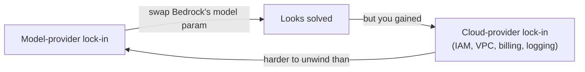

A 2026 survey of 100 enterprise CIOs found 37% now run five or more AI models in production, up from 29% the year before. A separate Zapier survey of enterprise leaders, published the same year, found 81% at least somewhat worried about depending too heavily on one AI vendor, and 47% said losing their primary vendor would disrupt a real business function. That fear is exactly what "model platforms" like Amazon Bedrock, Azure OpenAI Service, and Google's Vertex AI Model Garden are sold as the fix for: one integration, many models, switch providers without rewriting your app.

It's a good pitch. It's also not quite true. Routing your calls through a hyperscaler's managed layer doesn't remove a dependency, it relocates one. You stop depending on a single model provider and start depending on a single cloud provider instead, and that second dependency is usually stickier than the first.

{/* truncate */}

:::tip[TL;DR]
Bedrock, Azure OpenAI, and Vertex AI Model Garden mostly charge the same per-token price as calling OpenAI, Anthropic, or Google directly, so the pitch isn't really about cost. The real trade is operational: you get unified billing, IAM, and compliance certs in exchange for your app now living inside that cloud's identity and networking stack, which is a harder thing to migrate off than a model name in a config file. New models also tend to land on the provider's own API first and the platform mirror days or weeks later. If you're a startup prototyping fast or you're not already deep in one cloud, calling the provider directly is usually still the better default.
:::

## What these platforms actually are

All three do roughly the same job: put a hyperscaler's identity, billing, and networking layer in front of someone else's model.

- **Amazon Bedrock** lets you call Anthropic, Meta, Mistral, Cohere, AI21, and OpenAI's models (including the GPT-5.6 family) through one AWS-native API, billed against your existing AWS spend.
- **Azure OpenAI Service** is Microsoft's managed front door to OpenAI's models specifically, deployed into your own Azure tenant with Entra ID (Microsoft's identity and login system) instead of a bare API key.
- **Google's Vertex AI Model Garden** does the same for Gemini plus a catalog of third-party and open models (Claude, Llama, Mistral, Gemma, DeepSeek), deployed on Google Cloud infrastructure.

None of these are new models. They're the same underlying models you'd get calling OpenAI, Anthropic, or Google directly, wrapped in your cloud provider's account, identity and access management (IAM), and billing.

## The trade nobody puts on the slide

Here's the part the "avoid vendor lock-in" pitch skips: switching Bedrock's model parameter from Claude to Llama is genuinely easy. Switching your whole application off AWS, once it's wired into Bedrock's IAM roles, private network (VPC) endpoints, and CloudWatch logging, is not. You've traded a one-line config change (swapping which provider's API key you use) for a cloud migration.

That's not automatically a bad trade. If your company is already all-in on AWS, Azure, or GCP for everything else, adding the model layer to infrastructure you're not leaving anyway costs you almost nothing extra. The mistake is treating "we moved to a model platform" as solving vendor risk in general, when it really just moves that risk one layer up, from a model company to a cloud company, and cloud contracts are usually harder to unwind than model contracts.

## Where the three actually differ

Pricing is close to a non-factor day-to-day: all three generally track the underlying model's per-token rate. It's not a guaranteed match, though. OpenAI's own documentation on its Bedrock listing warns that Bedrock-specific pricing can differ from calling OpenAI directly, including regional processing premiums and other AWS-specific terms, and tells you to compare both before you launch. What varies more reliably is everything around the model call itself:

| | Amazon Bedrock | Azure OpenAI Service | Vertex AI Model Garden |
|---|---|---|---|
| Model catalog | Widest: Anthropic, Meta, Mistral, Cohere, AI21, OpenAI, Amazon | OpenAI models only | Google models plus a growing third-party catalog |
| Auth | AWS IAM | Microsoft Entra ID (skip API keys entirely) | Google Cloud IAM |
| Compliance certs | Standard AWS certs (SOC 2, ISO 27001, HIPAA-eligible) | HIPAA BAA, FedRAMP in select regions, SOC 2, ISO 27001 | Standard GCP certs, VPC Service Controls for data residency |
| New-model lag | Weeks behind OpenAI's own launches in past cycles | Weeks behind OpenAI's own API historically | Ships alongside Google's own Gemini releases |
| Regional pricing | Cross-region inference routing can shift price ~10% either way depending on scope, per third-party pricing guides | Flat per-token rate | Regional premiums vary by model; global vs. non-global endpoint pricing diverges starting July 1, 2026 for Gemini 3+ |

The compliance row is the one that actually moves decisions in practice. Both OpenAI and Azure OpenAI can get you a signed HIPAA Business Associate Agreement, but not the same way: Azure bundles it into standard Microsoft licensing, so it's in place as soon as you sign your Azure agreement, while OpenAI's direct API requires applying for one separately, a process that can take weeks. If your compliance team needs that agreement fast, that gap is a real, concrete reason to take on the platform dependency, not a hedge against an abstract "vendor risk."

:::info
💡 One AWS pricing note worth knowing if you're comparing bills: on July 30, 2026, Amazon cut Bedrock's on-demand price for GPT-5.6 Luna by 80% and GPT-5.6 Terra by 20%. Managed-platform pricing isn't static, and it tends to move in response to whatever the underlying model provider is charging, not the other way around.
:::

## When calling the provider directly is still the better call

Three situations where the platform layer buys you little or nothing:

1. **You're prototyping.** A managed platform's IAM setup, VPC wiring, and billing integration are overhead you don't need yet. A bare API key gets you to a working prototype faster, every time.
2. **You want the newest model on day one.** New releases have historically shown up on the model provider's own API first, with the platform version following days to weeks later. If being current matters more than unified billing, go direct.
3. **You're not already committed to one cloud.** If your infrastructure genuinely spans providers or lives outside the big three clouds entirely, adopting Bedrock or Vertex AI doesn't reduce your dependency count, it adds one.

The platforms earn their keep once you're already deep in one cloud's ecosystem and need the compliance certs, centralized billing, or IAM controls that a raw API key can't give you. That's an infrastructure decision, not a hedge against a single company disappearing.

## Where this connects

Every lab in this curriculum, starting with [Chapter 6: Your First Agent](/docs/intermediate/your-first-agent), uses a single `PROVIDER` value to switch between Ollama, OpenAI, and Anthropic with an if/elif block, no shared abstraction required. A managed model platform is that same idea taken to the infrastructure level: you're still picking a string that decides where the call goes. The difference is what you're actually signing up to depend on once you pick it.

Sources: [Amazon Bedrock pricing announcement for OpenAI GPT-5.6 models, AWS](https://aws.amazon.com/about-aws/whats-new/2026/07/openai-gpt-terra-luna-pricing-bedrock/); [OpenAI's documentation on Amazon Bedrock](https://developers.openai.com/api/docs/guides/amazon-bedrock); [Azure OpenAI vs OpenAI API comparison, Synextra](https://www.synextra.co.uk/knowledge-base/azure-openai-vs-openai-api/); [Vertex AI Model Garden guide, Nicheelab](https://nicheelab.com/en/articles/gcp/vertex-ai-model-garden/); [Multi-model AI strategy and CIO survey data, AvePoint](https://www.avepoint.com/blog/manage/ai-vendor-lock-in-multi-model-strategy); [AI vendor loss would disrupt 3 in 4 enterprises, Zapier survey](https://zapier.com/blog/ai-vendor-lock-in-survey/).
