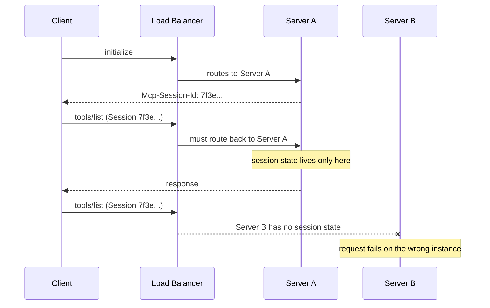
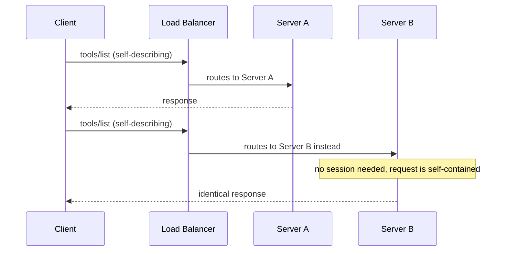
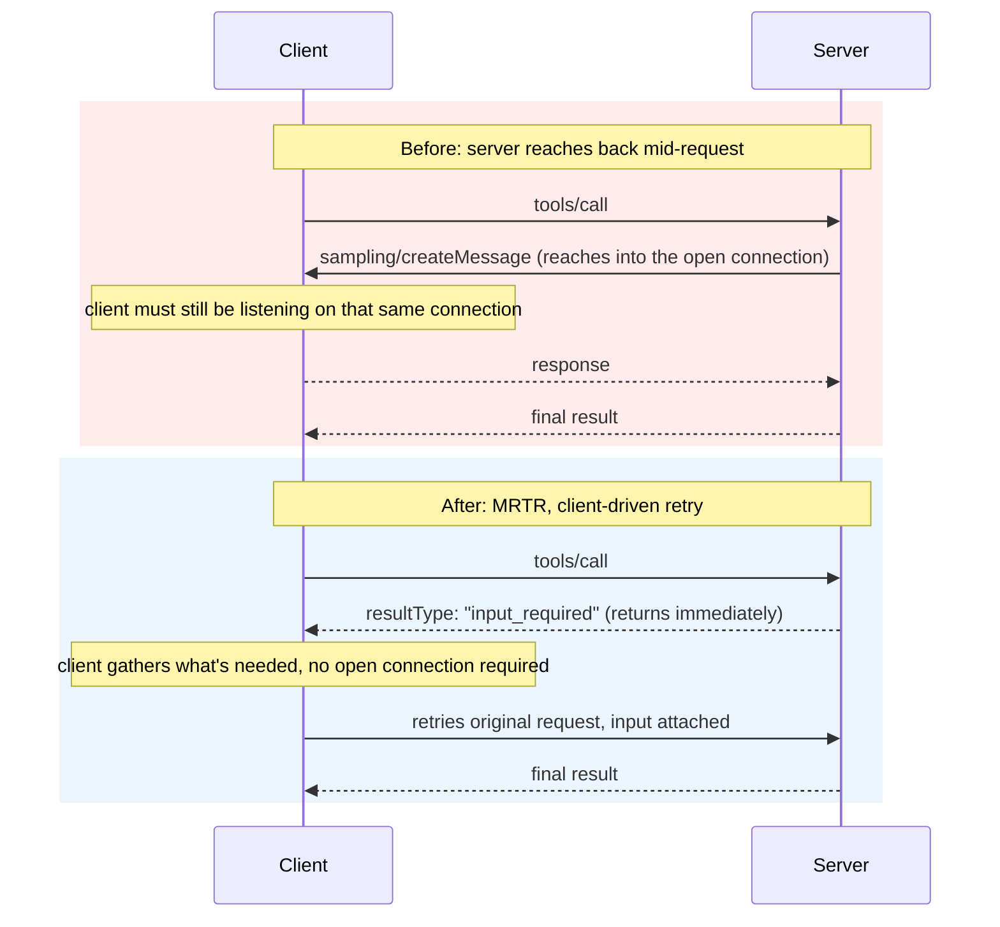

MCP's HTTP transport has worked like a phone call since Streamable HTTP shipped in March 2025: a client dials in with `initialize`, the server answers and hands back an `Mcp-Session-Id`, and every request after that stays pinned to whoever picked up. Hang up on the wrong server instance and the whole conversation is gone with it. Sixteen months later, the [2026-07-28 spec revision](https://modelcontextprotocol.io/specification/2026-07-28/changelog) rips the phone call out entirely. MCP is now stateless. Every request carries everything it needs, and any healthy server behind a load balancer can answer it cold.

{/* truncate */}

:::tip[TL;DR]
The July 2026 revision deletes MCP's session ID and the `initialize` handshake, so requests are now fully self-describing. Three features, Sampling, Roots, and Logging, are deprecated on a mandatory twelve-month clock, not removed outright. The quieter changes matter more day to day: server-initiated requests are replaced by a client-driven retry pattern, caching metadata is now mandatory on list results, and OAuth got a real hardening pass. Nothing here breaks a working client today, but it's the moment to stop building new infrastructure around sessions.
:::

## Why the phone call had to go

Streamable HTTP inherited a very ordinary assumption from MCP's original stdio roots: a client and server stay connected for the life of a conversation, the same way a local process would. That's a fine assumption when client and server run on the same machine. It stops being fine once the server is a fleet of pods behind a load balancer.

Session affinity is the tax that assumption charges. Whoever runs the server has to keep a session store, route every follow-up request back to the exact instance that issued it, and figure out what happens to that state when the instance autoscales down or gets redeployed mid-conversation. None of that is actually MCP's job. It's infrastructure plumbing that only exists because the protocol needed somewhere to put connection state. This revision's answer isn't a smarter session store. It's removing the need for one.

## What "stateless" actually means

Two separate SEPs (spec enhancement proposals) combine to do this:

**Sessions are gone ([SEP-2567](https://github.com/modelcontextprotocol/modelcontextprotocol/pull/2567)).** The `Mcp-Session-Id` header is removed from Streamable HTTP. List endpoints like `tools/list` no longer vary per connection, so every client gets the same answer regardless of which server instance handled the request. If a server genuinely needs to remember something across calls, it now mints an explicit handle and hands it back as an ordinary tool argument. That's state the client carries, not state the server holds open.

**The handshake is gone ([SEP-2575](https://github.com/modelcontextprotocol/modelcontextprotocol/pull/2575)).** `initialize` and `notifications/initialized` are removed. Every request now self-describes: protocol version and client capabilities travel in `_meta` fields (`io.modelcontextprotocol/protocolVersion`, `io.modelcontextprotocol/clientCapabilities`) on that request alone. A version mismatch returns a plain `UnsupportedProtocolVersionError` instead of failing a multi-step negotiation. There's a new `server/discover` RPC, but it isn't a mandatory first step. Clients *may* call it up front to pick a version or use it as a compatibility probe on stdio, and servers must support it if asked.

Put together: no session store to shard, no sticky routing to configure, no "which pod has this client's handshake state" question to answer.

**Before**, a session pinned every follow-up request to the one instance that issued it:



**After**, every request carries what it needs, so any healthy instance can answer it:



Concretely, on the wire:

```jsonc
// Before (2025-11-25 and earlier): a stateful handshake, then a pinned session
// 1. Client -> Server
{"jsonrpc": "2.0", "id": 1, "method": "initialize", "params": {"protocolVersion": "2025-11-25", "capabilities": {}}}
// 2. Server -> Client, response carries Mcp-Session-Id: 7f3e...
// 3. Client -> Server (every later call pinned to that session)
{"jsonrpc": "2.0", "id": 2, "method": "tools/list"}
// headers: Mcp-Session-Id: 7f3e...

// After (2026-07-28): no handshake, no session, every request is self-contained
{
  "jsonrpc": "2.0", "id": 1, "method": "tools/list",
  "params": {
    "_meta": {
      "io.modelcontextprotocol/protocolVersion": "2026-07-28",
      "io.modelcontextprotocol/clientCapabilities": {}
    }
  }
}
```

That second request can land on any server instance, cold, with no prior call, and get the identical answer. Most MCP clients never made you touch this layer directly. Libraries like `langchain-mcp-adapters` handled the handshake and session header for you, which is exactly why this revision could remove both without breaking well-behaved clients on the next release. The thing being deleted was never really application code's problem. It was infrastructure's.

## Three features deprecated, one transport reclassified

[SEP-2577](https://github.com/modelcontextprotocol/modelcontextprotocol/pull/2577) deprecates Sampling, Roots, and Logging. None are removed yet, deprecated features stay functional through a minimum twelve-month window, but new implementations shouldn't build on them:

| Deprecated | Migrate to |
|---|---|
| Sampling (server asks the client's model to generate text) | Call your LLM provider's API directly |
| Roots (client tells the server which directories are in scope) | Pass paths as tool parameters, resource URIs, or server config |
| Logging (`logging/setLevel`, `notifications/message`) | `stderr` on stdio, or OpenTelemetry |
| HTTP+SSE transport (soft-deprecated since 2025-03-26) | [Streamable HTTP](https://modelcontextprotocol.io/specification/2026-07-28/basic/transports/streamable-http) |

Sampling is the one worth sitting with. It let a server ask the client's model for a quick completion mid-task instead of holding its own API key, an elegant idea on paper. Per the spec's own migration note, it just didn't get built out widely enough across the ecosystem to keep. The revision's position: give the server a key and let it call a provider directly. One fewer indirection, one fewer thing only half of implementations ever actually shipped.

## The changes nobody's tweeting about

The stateless rewrite is the headline, but these four are the ones that will actually move your numbers.

**Server-initiated requests are gone.** `roots/list`, `sampling/createMessage`, and `elicitation/create` used to require the server to reach back into an open client connection mid-request. The new **MRTR** pattern (Multi Round-Trip Requests, [SEP-2322](https://github.com/modelcontextprotocol/modelcontextprotocol/pull/2322)) replaces that with a result the server returns immediately: `resultType: "input_required"`, carrying whatever it still needs. The client answers by retrying the *original* request with that input attached. No server holds a socket open waiting on a round trip it doesn't control the timing of.



**Caching stopped being optional.** A new `CacheableResult` interface now requires `ttlMs` and `cacheScope` on every result from `tools/list`, `prompts/list`, `resources/list`, and `resources/read`. That's a server stating, explicitly, how long a client can trust an answer without re-asking, and whether a shared proxy is even allowed to cache it.

**Tool order stopped being random.** `tools/list` should now return a deterministic order. Combined with list results no longer varying per connection, that's the difference between an LLM provider's prompt cache reliably hitting on your tools block, versus quietly missing every time the list happens to get rebuilt in a different order.

**OAuth got a real hardening pass, not a footnote.** Authorization servers should send an `iss` parameter per RFC 9207, and clients must validate it against the recorded issuer before redeeming a code. Dynamic Client Registration is deprecated in favor of Client ID Metadata Documents, though it still works for authorization servers that haven't caught up. If your MCP server sits behind OAuth, this is a real review, not a changelog skim.

## Governance grew up alongside the protocol

Two process changes underpin all of this. The SEP workflow is now formal: numbered, PR-based proposals with sponsor responsibilities and status tracked through PR labels. And a real feature lifecycle now exists:


Sampling isn't going away next sprint. It's going away on a published clock.

That's the same signal [A2A's steering committee and versioned 1.0 release](https://a2a-protocol.org/) sent for agent-to-agent communication earlier this year: this isn't a fast-moving experiment you build against nervously anymore. It's infrastructure with a change process, which is exactly what you want before betting production traffic on it.

## What to actually do

Nothing here breaks a well-behaved existing client today, deprecated isn't removed yet. But if you're standing up new MCP infrastructure, build it stateless from day one and stop provisioning session affinity you no longer need. Route Sampling to a direct provider call instead of leaning on it. Put OAuth `iss` validation on your list for the next review.

If I had to bet on which change shows up in a graph first, it isn't the stateless rewrite. That one saves your infra team a category of bug, real, but invisible once it's fixed. My money's on the caching triad: deterministic `tools/list` ordering plus mandatory `ttlMs`/`cacheScope` is the one that touches the token bill on every hosted-model call, not just the deploy story. Sessions were an ops problem. Cache misses on a growing tools block are a cost problem, one that compounds with every agent you ship. This is the first time the spec itself hands you the fields to fix that instead of hoping your client library gets it right.

We cover MCP's current shape in the [MCP track](/docs/mcp/overview), including a chapter on [A2A](/docs/mcp/a2a), the sibling protocol this revision stayed complementary to rather than absorbing.
