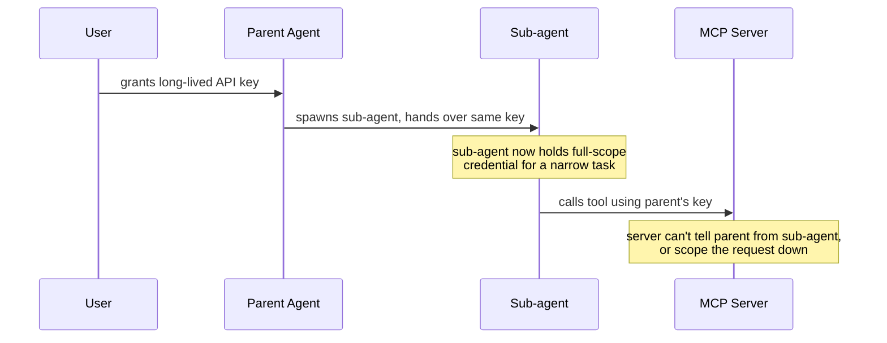
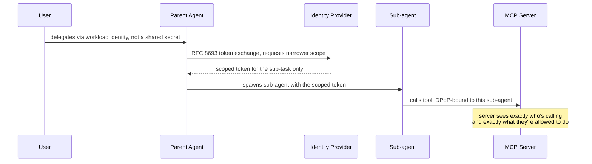
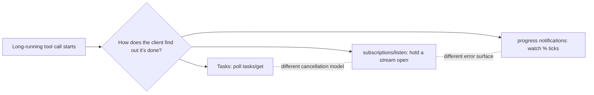

MCP's own [roadmap](https://modelcontextprotocol.io/development/roadmap) says the quiet part out loud: "MCP authorization assumes a person with a browser at consent time." Then, one sentence later, it admits that assumption is already wrong. "Increasingly the caller is an agent: a cloud workload with its own identity, acting for a user who isn't present, or spawning sub-agents that should get narrower authority than their parent." That's not a footnote. It's one of five priority areas the Core Maintainers named for the next spec release, published August 22, 2026, and it's the only one with a working group that doesn't exist yet.

{/* truncate */}

:::tip[TL;DR]
MCP's roadmap for the next six to twelve months names five priority areas: agentic messaging primitives (Tasks, server-push events), HTTP-native transport unification (HTTP/2 over stdio, ETag caching), agent identity and enterprise security (DPoP, delegated identity), improved primitives (a `tools/call` redesign, progressive discovery), and SDK developer experience (spec-generated SDKs). Four of these are infrastructure catching up to decisions already made. The fifth, agent identity, is the one still recruiting a working group, coordinating with IETF OAuth and WIMSE externally, and deciding whether an agent acting with no human present gets a real identity or keeps borrowing someone else's API key.
:::

## The part that'll bite first: nobody knows who your agent is

Here's how most MCP servers handle authorization today: a long-lived API key or refresh token, pasted into a config file or an environment variable, indistinguishable from a human's own credentials. That's fine when a person is sitting at a keyboard clicking "allow" on an OAuth consent screen. It stops being fine the moment an agent runs unattended on a schedule, or a supervisor agent spawns three sub-agents to split a task and hands each of them... what, exactly? Its own full-scope token, because that's the only one it has?

The roadmap's **Agent Identity and Enterprise-Ready Security** priority area exists because that gap is already showing up in production. Two Core Maintainers, [Paul Carleton](https://github.com/pcarleton) and [Den Delimarsky](https://github.com/localden), are driving it, and the concrete deliverables for this period are narrow on purpose:

- **DPoP** (Demonstrating Proof of Possession): finalize the spec and push for actual adoption, so a stolen bearer token stops being enough on its own to impersonate a caller.
- **Delegated identity**: an opinionated way for an MCP server to be reached by an agent's own identity, or by a user-delegated one, built on [Workload Identity Federation](https://github.com/modelcontextprotocol/modelcontextprotocol/pull/1933) (SEP-1933), the ID-JAG grant already used by [Enterprise-Managed Authorization](https://modelcontextprotocol.io/extensions/auth/enterprise-managed-authorization), and [RFC 8693](https://www.rfc-editor.org/rfc/rfc8693) token exchange.

The RFC 8693 piece is what actually solves the sub-agent problem. Token exchange lets a parent agent trade its own credential for a *narrower* one scoped specifically to what a sub-agent needs, instead of forwarding the same token down the chain and hoping every downstream server enforces its own limits.

**Today**, a sub-agent either gets the parent's full-scope credential or nothing:



**Under the delegation model this roadmap targets**, a token exchange narrows scope at every hop:



That second diagram is still a proposal, not shipped protocol. But it's the shape the roadmap is explicitly pointing at, coordinated with the IETF OAuth working group and [WIMSE](https://datatracker.ietf.org/wg/wimse/about/) (Workload Identity in Multi-System Environments), not invented from scratch inside MCP.

## The other four are plumbing catching up to decisions already made

The remaining priority areas matter, but they're mostly MCP fixing seams that opened up after the [2026-07-28 spec revision](https://modelcontextprotocol.io/specification/2026-07-28/changelog) went stateless. None of them need a new working group formed from zero, which is exactly why they'll likely land sooner than identity does.

### Agentic messaging: three answers to "is it done yet?"

MCP has grown three separate ways to find out whether long-running work has finished, and none of them share a lifecycle. [Tasks](https://modelcontextprotocol.io/extensions/tasks/overview) means polling `tasks/get` until a status flips. [`subscriptions/listen`](https://modelcontextprotocol.io/specification/2026-07-28/basic/patterns/subscriptions) means holding a stream open and waiting. [Progress notifications](https://modelcontextprotocol.io/specification/2026-07-28/basic/patterns/progress) means watching percentage ticks go by on a request that's still technically in flight. A client that implements one has no guarantee the others behave the same way if the work fails halfway, or what "cancel" even means across all three.



The Triggers & Events working group's deliverable this period is server-initiated push, channels and webhooks, so a server can tell a client "this finished" without the client burning a connection on expensive polling. But the bigger-ticket item is the **composition review** across the Agents, Transports, and Triggers & Events groups: making sure Tasks, subscriptions, and triggers actually compose instead of quietly becoming three parallel async models a client author has to special-case separately.

### HTTP-native transport: collapsing two pipelines into one

Since the [2026-07-28 revision](https://modelcontextprotocol.io/specification/2026-07-28/changelog) made a remote MCP server a normal HTTP workload, servers increasingly carry transport-level information in HTTP headers and status codes, mechanisms that simply don't exist on stdio. Every feature built that way needs a second, stdio-specific design just to keep working locally, and SDK maintainers end up carrying two transport pipelines side by side, with protocol metadata duplicated across HTTP headers and message fields that servers have to cross-validate by hand.

The fix under discussion is running Streamable HTTP as the *only* binding, spoken over HTTP/2 even for a local subprocess talking over stdin and stdout. That gets multiplexed HTTP semantics locally, one transport model instead of two, while keeping the security and lifecycle guarantees of a subprocess you started yourself.

The other deliverable extends caching to ETags, building on the `ttlMs` and `cacheScope` fields the stateless revision [already made mandatory](/blog/mcp-goes-stateless) on list results. The exact wire shape isn't finalized, but the direction is a conditional-request pattern like this:

```jsonc
// Illustrative, not finalized spec: the shape ETag caching is pointed at
// First call: server tags the result with a version
{"jsonrpc": "2.0", "id": 1, "result": {"content": [/* ... */], "_meta": {"etag": "\"a1b2c3\""}}}

// Later call: client asks "is a1b2c3 still good?" instead of re-running the tool
{"jsonrpc": "2.0", "id": 2, "method": "tools/call",
 "params": {"name": "search", "arguments": {/* ... */}, "_meta": {"ifNoneMatch": "\"a1b2c3\""}}}
// A server can answer "still valid" without re-executing the tool at all
```

That's a step past "don't re-fetch this list." It's "here's proof this specific tool result is still valid," which matters anywhere a tool call is expensive or a downstream side effect you don't want to trigger twice.

### Improved primitives: fixing the parts implementers keep tripping on

`tools/call` currently lets a server return `content` (content blocks meant to be read) and `structuredContent` (a JSON object meant to be consumed programmatically) in the same response, with no rule for which one wins when they disagree, or what a client should do if it only handles one of the two. The roadmap is blunt about the result: it's "confused server and client authors alike and produced diverging implementations." A newly forming Core Primitives working group's first job is redesigning that interface so a tool result has one clear shape instead of two competing ones.

**Progressive discovery** targets a different pain point: a client connected to several MCP servers today pulls every tool description into context up front, whether or not the model ever calls most of them. That's tokens spent, and attention diluted, before the conversation even starts. The roadmap wants clients to learn tools and resources as they're needed instead, explicitly coordinated with the caching work above so discovery and caching don't end up solving the same problem twice.

And in a rare bit of institutional honesty, the roadmap floats *removing* something: [content annotations](https://modelcontextprotocol.io/specification/2026-07-28/server/resources#annotations) exist to mark a piece of content's intended audience and priority, but most implementers "haven't adopted these annotations and may not be aware of their purpose." If extending them to tool results and resources doesn't fix that, the stated plan is to deprecate them rather than keep carrying a feature nobody uses.

### SDK developer experience: let the spec generate the SDK

Anyone who's used an MCP SDK the week after a spec revision ships has felt the drift problem: the spec moves, each language SDK catches up on its own schedule one PR at a time, and quickstart examples go stale in the gap. Today, SDKs, reference servers, and quickstarts are all maintained by hand.

Two things are planned to change that. The **extension contract** work nails down which role, host, client, server, or agent, an extension like Tasks or Sampling binds to, what an SDK must support natively versus optionally, and how capability additions to an already-shipped extension get versioned instead of silently changing behavior underneath implementers. The **generated-artifacts experiment** is the more radical bet: build one candidate Tier 1 SDK and its companion quickstarts by generating them directly from the specification, validate both against the conformance test suite, and publish findings on which layers should stay deterministic codegen forever versus which still need a person, or a model, writing genuinely new code. If it works, "the SDK is behind the spec" stops being a standing condition of every release instead of a bug to fix after the fact.

### Quick reference

| Priority area | Core deliverable this period |
|---|---|
| Agentic Messaging Primitives | Server-push events (channels/webhooks); composition review across Tasks, Transports, Triggers & Events |
| HTTP-Native Transport Unification | HTTP/2 as the single transport binding, including over stdio; ETag caching on top of `ttlMs`/`cacheScope` |
| Agent Identity and Enterprise Security | DPoP finalization; delegated identity via Workload Identity Federation, ID-JAG, RFC 8693 token exchange |
| Improved Primitives | `tools/call` redesign; progressive discovery; possible annotation deprecation |
| Improved SDK Developer Experience | Extension contract definition; spec-generated candidate SDK and quickstarts |

## What I'd actually track

The roadmap is explicit that "this reflects current thinking rather than firm commitments" and that priorities may shift. Take that at face value; SEPs get reprioritized, working groups stall, timelines slip. But look at which area is the outlier: Agent Identity is the only one of the five whose working group is still "forming during this roadmap period." Every other area already has a group running and shipping.

That's usually the tell for which piece takes longest, because it's also the one with the most external dependencies. MCP doesn't get to move at its own pace on identity, it has to land in step with IETF OAuth and WIMSE, standards bodies MCP doesn't control. If you're building anything that runs without a person present, a scheduled agent, a sub-agent spawned by another agent, a background workflow acting on a user's behalf after they've logged off, this is the piece worth watching closest. Architect your token handling so it can be replaced later, instead of hard-coding today's pasted-API-key pattern as if it's permanent. It was never designed to be.

We cover MCP's current authorization model in [Chapter 6: MCP Security](/docs/mcp/mcp-security), and the multi-server, multi-agent territory this identity work eventually has to reach is exactly what [Chapter 3: One Agent, Many Servers](/docs/mcp/one-agent-many-servers) and [Chapter 7: A2A](/docs/mcp/a2a) already sketch the shape of.
