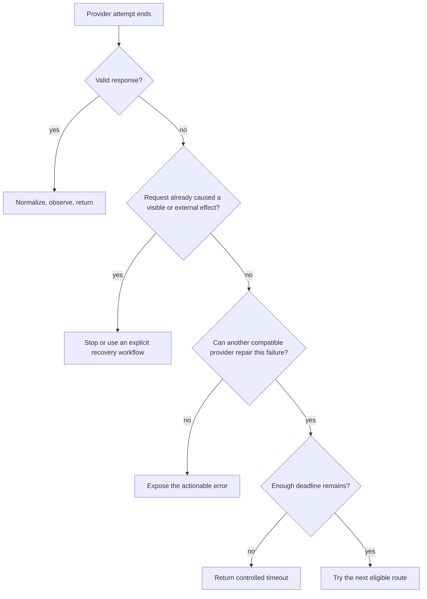

Calling an LLM provider's SDK directly is a good way to build a prototype. Letting every product feature call that SDK directly is how a provider detail becomes an application architecture.

The distinction matters. “Stop calling LLM APIs directly” does not mean every team needs to install a commercial gateway. It means production code should call a boundary your application owns. Behind that boundary, you can make explicit decisions about providers, deadlines, errors, data policy, and degraded behavior.

Without it, adding a second API key gives you another provider. It does not give you a fallback.

{/* truncate */}

## Outages reveal the dependency you already had

On June 2, 2026, Claude had a [major incident affecting its API and Claude Code](https://www.thoughtworks.com/en-us/insights/blog/generative-ai/claude-outage-june-2026). Anthropic's [status history](https://status.claude.com/history) recorded more disruptions from June 5 through June 16, and [Tech Times counted ten incidents across twelve days](https://www.techtimes.com/articles/318514/20260616/claude-outage-tenth-disruption-12-days-exposes-anthropic-infrastructure-strain.htm). OpenAI's [status history](https://status.openai.com/history?page=2) later recorded separate incidents on July 22, 23, 24, and 25.

These were not uninterrupted multiweek outages, and they are not evidence that either provider is uniquely unreliable. They are evidence that model APIs are infrastructure. Every infrastructure dependency eventually returns errors, slows down, rejects traffic, or becomes unreachable from part of the network.

The useful question is not, “Which provider never goes down?” It is, “What does our product do when the provider we chose cannot complete this request?”

Many systems have no considered answer. A route handler imports an SDK, catches whatever exception appeared during development, and returns a generic 500. A background worker has a different timeout. An agent loop retries independently. The same provider dependency now has three unrelated failure policies.

That is the first reason to introduce a boundary. Failover comes later.

## A fallback in configuration can still be fake

Consider a support assistant configured like this:

```text
primary:  model-a at provider-one
fallback: model-b at provider-two
```

It looks redundant. Now ask five questions:

1. Can both models accept the same request?
2. Which failures move traffic to the fallback?
3. How much of the user's time budget remains when that happens?
4. What if the first attempt already streamed text or requested a tool?
5. Has the complete fallback path succeeded recently?

If the team cannot answer those questions, the fallback is aspirational. It may help during one narrow outage and fail during the incident that actually occurs.

### 1. Does the application own the contract?

An OpenAI call exposes OpenAI model names, parameters, response objects, error classes, usage fields, and tool-call conventions. An Anthropic call exposes a different SDK and content-block protocol. Ollama has another HTTP shape.

A useful application boundary starts with the smallest contract the product needs. For a simple support answer, that might be:

```python
answer = generate_text(messages, deadline_seconds=8)
```

The feature should not care which provider answered. Provider adapters behind the boundary translate the request, normalize the response, and preserve useful metadata such as model, latency, token usage, and request ID.

Do not make the internal contract a copy of the first vendor's entire API. That only relocates the coupling. Own a narrow product-level contract and let specialized paths remain specialized.

### 2. Can the fallback perform the same job?

“Both models accept text” is a weak compatibility test. Production requests may include images, strict JSON output, tool definitions, a long conversation, safety constraints, or regional processing rules.

Tool calling is a good example. Anthropic's API represents a tool request as a [`tool_use` content block followed by a matching `tool_result`](https://platform.claude.com/docs/en/agents-and-tools/tool-use/handle-tool-calls). Its [strict tool mode](https://platform.claude.com/docs/en/agents-and-tools/tool-use/strict-tool-use) constrains inputs to a supported JSON Schema subset. Another provider may express the same idea differently or support a different subset.

A gateway can translate formats. It cannot guarantee equivalent model behavior or invent an unsupported capability. The fallback pool should therefore be selected by contract:

- text-only support answers may have several eligible models;
- a vision request needs models tested with the required image types and sizes;
- an agentic turn needs compatible tool semantics and duplicate-action protection;
- regulated data needs routes allowed by the same policy.

Sometimes the correct fallback is a smaller feature, such as search results without generated prose. Sometimes it is a clear error. Honest degradation is better than returning an answer that violated the original contract.

## Error handling is policy, not plumbing

OpenAI's [API error guide](https://developers.openai.com/api/docs/guides/error-codes) and Anthropic's [error documentation](https://platform.claude.com/docs/en/api/errors) distinguish invalid requests, authentication failures, rate limits, connection failures, and provider-side errors. A routing layer that catches every exception destroys information the providers worked to expose.

A connection error, deadline, or 503 may justify trying an independent backend. A 401 usually means the deployed system is misconfigured. A 400 often means the request itself is invalid. Sending either to more providers can hide the defect behind extra latency and spend.

A 429 needs context. If one provider exhausted a provider-specific quota, another provider may help. If your own application imposed the limit to protect a budget or tenant, routing around it defeats the control.

This is why “retryable” should be a named application concept, not a broad `except Exception`. The classifier expresses what another route can plausibly repair.



That middle question is easy to omit. It is also where model failover differs from retrying a read-only database query.

## Partial work changes the decision

Suppose a provider streams “To cancel your subscription, first...” and the connection drops. Starting a second model is technically possible, but transparent failover is not. The second model did not produce the hidden continuation of the first sentence. It may restart, contradict the visible text, or choose a different procedure.

The interface needs an explicit policy: stop with an interruption notice, restart and tell the user, or buffer content until a safe point. Silently stitching two model outputs together should not be the default.

Tool use raises the stakes. If the model already requested `send_email` or `create_refund`, replaying the turn can produce a duplicate action. [HTTP defines idempotency](https://www.rfc-editor.org/rfc/rfc9110.html#name-idempotent-methods) by whether repeated requests have the same intended effect, not by whether a retry mechanism happens to resend them. Kong's own [AI Gateway failover documentation](https://developer.konghq.com/ai-gateway/load-balancing/) makes retrying non-idempotent POST requests an explicit criterion rather than an invisible default.

The safe design usually puts idempotency keys and durable action state at the tool boundary. A gateway controls model traffic. It does not automatically make the business operations requested by a model safe to repeat.

## A 30-second timeout can make a fallback useless

Failover consumes time. If the product promises a response within 12 seconds but the primary call waits 30 seconds, the backup never gets a meaningful chance.

Start with the end-to-end budget. An illustrative policy might give the primary 5 seconds, reserve 6 seconds for one fallback, and leave 1 second for application and network overhead. A batch summarization job would choose different numbers. The point is ownership: the user-facing deadline should determine per-attempt deadlines and retry counts.

Watch for retries hidden inside SDKs. Three SDK attempts followed by two gateway routes can turn one product request into six provider calls. The exact behavior changes by SDK and configuration, so make one layer responsible and observe every attempt.

A timeout is also ambiguous. It proves that your client stopped waiting. It does not prove that the provider never received or processed the request. OpenAI recommends [client-generated request IDs](https://developers.openai.com/api/docs/guides/error-codes#request-ids) for cases where network trouble prevents receipt of the provider's request ID. Carry one trace ID across the original and fallback attempts so you can investigate duplicated work and charges.

## Independence is something you investigate

Two model names are not necessarily two failure domains. They may share:

- the same provider account and quota;
- the same cloud region;
- the same DNS or outbound network;
- the same identity or secrets system;
- the same gateway process;
- the same faulty adapter release.

Even different providers can share infrastructure. That does not make multi-provider routing pointless. It means independence is a claim to examine, not a property conferred by two rows in a configuration file.

The often-used availability arithmetic shows the best case. If two providers each have 99.5% uptime and fail independently, simultaneous provider downtime is `0.005 × 0.005 = 0.000025`, or about 13 minutes per year. Real failures are correlated, the gateway can fail, and compatible capacity may not be available. Measure success at the product boundary instead: did a valid answer arrive within the promised time?

## Exercise the path or remove it from the diagram

Fallback code tends to run during the least forgiving moment: an incident, after months of inactivity, when the primary path is already unhealthy. That is a poor time to discover that the backup key expired, the model name changed, a tool schema is rejected, or the fallback takes longer than the entire request budget.

Test the path continuously:

- Send a small synthetic request through every eligible provider.
- Inject timeouts, connection failures, 429s, 5xx responses, and invalid credentials.
- Confirm only the intended classes trigger another route.
- Run contract tests for text, structured output, tools, and every required modality.
- Record fallback success rate, added latency, model used, and answer-quality regressions.
- Practice what happens when every route fails.

This is not busywork around the gateway. It is the evidence that the gateway provides resilience.

## The practical architecture

There are three reasonable stages:

| Stage | Appropriate when | What to own |
|---|---|---|
| Direct provider behind one local function | Prototype or low-impact feature | One call site, timeout, clear errors |
| Application-level adapters and router | One product needs a few deliberate routes | Compatibility contract, failure policy, traces, tests |
| Shared gateway service | Several applications need common controls | Highly available data plane, credentials, tenant policy, routing, observability |

Moving to the third stage too early adds another service to deploy and another network hop to debug. Staying at the first stage after model calls become a critical dependency leaves policy scattered across the product. The middle stage is often the useful first move because it creates the right seam without pretending the team already needs a platform.

Tools such as LiteLLM, Portkey, and Kong can implement parts of the shared-gateway stage. Their feature lists are not the architecture. Your application still owns the definition of a compatible response, the errors worth routing around, the time available, and the behavior when no route is safe.

The [AI Gateways Advanced Concepts chapter](/docs/advanced-concepts/ai-gateways) builds that middle stage in plain Python and tests both a retryable outage and a non-retryable configuration failure.

Do one thing before adding another provider: find every model call in the application and put a product-owned contract in front of it. Until that boundary exists, a fallback is a configuration idea. After it exists, resilience becomes a policy you can inspect, test, and improve.
