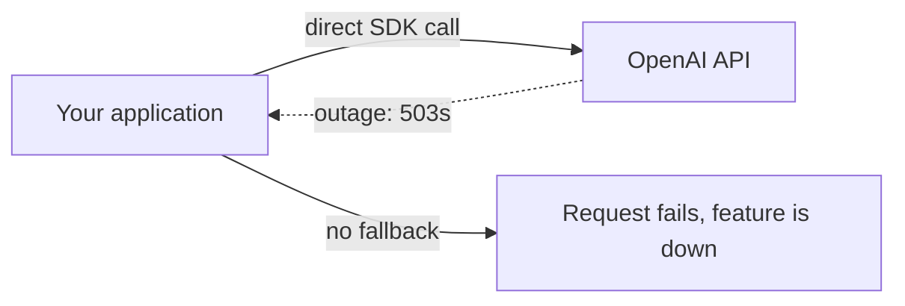
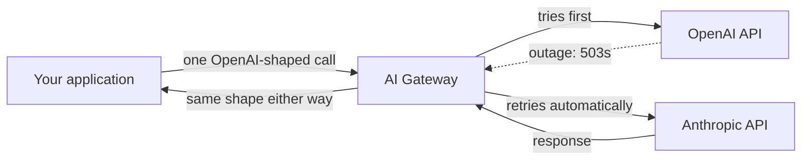

Anthropic logged ten separate service disruptions in twelve days starting June 5, 2026, including a five-and-a-half-hour outage on June 2 that took down Claude.ai, the API, Console, and Claude Code together. Seven weeks later, OpenAI had its own rough stretch: four disruptions in four days between July 23 and July 25, with the July 25 incident knocking out ChatGPT, the API, and Codex at once. If your app calls one provider's SDK directly with no fallback, both of those weeks were your outage too.

That's the argument for an AI gateway: a thin routing layer that sits between your code and every model provider, so a dead endpoint is a retry instead of a page-out. It's not a new idea, API gateways have fronted microservices for over a decade, but 2026 is the year it became the default way serious teams call an LLM at all, not an optional layer you bolt on later.

{/* truncate */}

:::tip[TL;DR]
An AI gateway is a proxy layer, self-hosted or managed, that gives you one API for every model provider, with automatic failover, load balancing, request logging, and centralized API-key management built in. Three widely used options are [LiteLLM](https://github.com/BerriAI/litellm) (open-source, MIT-licensed proxy, 57k+ GitHub stars, used by Stripe and Google ADK), [Portkey](https://github.com/portkey-ai/gateway) (MIT-licensed, hosted-first, strong on observability and guardrails), and [Kong AI Gateway](https://github.com/Kong/kong) (Apache 2.0, extends Kong's existing API gateway to LLM and MCP traffic for teams already running Kong). Run the failover math on two providers each at 99.53% uptime and independent failures, and you go from roughly 41 hours of expected downtime a year to about 12 minutes. That's the whole pitch in one number.
:::

## This is a different layer than "pick a cloud"

We've written before about [managed model platforms](/blog/managed-ai-platforms-lock-in) like Bedrock, Azure OpenAI, and Vertex AI, and it's worth being precise about how a gateway differs. Those platforms put a hyperscaler's identity and billing layer in front of a model catalog you still access as an SDK call, with one provider (AWS, Microsoft, or Google) doing the routing behind the scenes. An AI gateway does the routing itself, in your own infrastructure or a vendor's dedicated one, across whichever raw provider APIs you choose: OpenAI, Anthropic, Gemini, Bedrock, a self-hosted vLLM instance, all at once. You can run a gateway in front of Bedrock, or instead of it. They solve overlapping but distinct problems.

## What a gateway actually buys you

Strip away the marketing and a gateway is doing four concrete jobs:

1. **One interface, many providers.** Your code calls an OpenAI-shaped `/chat/completions` endpoint once; the gateway translates it to whatever the actual provider expects behind the scenes.
2. **Failover and load balancing.** If the primary provider errors out or rate-limits you, the gateway retries against a fallback automatically, inside the same request.
3. **Centralized keys and cost tracking.** Provider API keys live in one place, not scattered across services, and spend gets tracked per project or per user instead of reconstructed from separate billing dashboards after the fact.
4. **Caching and rate limiting.** Repeated identical prompts can be served from cache instead of re-billed, and per-consumer rate limits stop one bad actor or buggy loop from burning your whole budget.

**Without a gateway**, a dead provider is a dead feature:

**With a gateway**, the same outage is invisible to the caller:

## The three worth knowing

| | LiteLLM | Portkey | Kong AI Gateway |
|---|---|---|---|
| License | MIT (core), paid enterprise tier | MIT (gateway core), paid hosted tiers | Apache 2.0 (Kong Gateway, including AI plugins) |
| Deploy model | Self-hosted proxy (Docker, Helm, Terraform) or SDK | Hosted-first, with an open-source self-hosted gateway too | Self-hosted, built on the existing Kong API gateway |
| Providers | 140+ providers, 2,600+ models claimed | 1,600+ models across ~40+ providers | Multi-LLM (OpenAI, Anthropic, Bedrock, Gemini, Azure, Mistral, and more) via a universal API |
| Where it fits | Teams that want a self-hosted, OSS-first proxy with deep cost/spend tracking | Teams that want managed observability and guardrails without running infrastructure | Teams already running Kong for regular API traffic, now extending it to LLM and MCP traffic too |

All three do the core job: one endpoint, many providers, automatic fallback. The real decision is less "which gateway is best" and more "which one fits infrastructure you already run." A team already operating Kong for its REST APIs gets LLM routing nearly for free by turning on a plugin. A team with no gateway at all and a preference for open source typically reaches for LiteLLM first, since it's the most widely adopted and has the deepest self-hosted feature set. Portkey is the fastest path if you'd rather not run the proxy yourself and want polished dashboards on day one.

:::info
💡 A gateway is itself a new dependency, not a way to remove one. If you self-host LiteLLM or Kong, you've added a service that needs to stay up, get patched, and get monitored, in exchange for the provider-level outage protection. If you use Portkey's hosted option, you've swapped "my provider is down" risk for "my provider or my gateway vendor is down" risk, which is a smaller number but not zero. Read the failover math above as "much better," not "solved."
:::

## Where the failover number comes from

The 12-minutes-a-year figure in the TL;DR isn't a vendor claim, it's arithmetic. A provider at 99.53% uptime is down about 41 hours a year (0.47% of 8,760 hours). If you run two independent providers behind a gateway and only fail when *both* are down at the same moment, the combined downtime is roughly the product of each provider's downtime share: 0.0047 × 0.0047 ≈ 0.000022, or about 11–12 minutes a year. Real providers aren't perfectly independent, a shared cloud region or a common upstream dependency can take both down together, so treat this as a best-case estimate, not a guarantee. It's still the right order of magnitude for why the pattern caught on this fast.

## Start small

You don't need to migrate everything to justify a gateway. The smallest useful version is a self-hosted LiteLLM proxy in front of your two most-used providers, wired to fail over on a 5xx or timeout, with nothing else turned on yet. Add cost tracking and caching once the failover path is proven, not before.

Every lab in this curriculum uses a plain `PROVIDER` value and an if/elif block to switch between Ollama, OpenAI, and Anthropic, starting in [Chapter 6: Your First Agent](/docs/intermediate/your-first-agent). A gateway is that same idea moved into infrastructure: the provider becomes a runtime decision the gateway makes on your behalf, instead of a constant baked into your code.

Sources: [OpenAI outage coverage, July 2026, The Next Web](https://thenextweb.com/news/openai-outage-chatgpt-codex-api-july-2026); [OpenAI July 25 outage report, BleepingComputer](https://www.bleepingcomputer.com/news/artificial-intelligence/openai-confirms-chatgpt-is-down-as-logins-and-signups-fail/); [Anthropic June 2026 outage pattern, Tech Times](https://www.techtimes.com/articles/318514/20260616/claude-outage-tenth-disruption-12-days-exposes-anthropic-infrastructure-strain.htm); [Claude outage details, Tech Insider](https://tech-insider.org/claude-outage-june-2026/); [LiteLLM repository, GitHub](https://github.com/BerriAI/litellm); [Portkey Gateway repository, GitHub](https://github.com/portkey-ai/gateway); [Kong repository, GitHub](https://github.com/Kong/kong).
