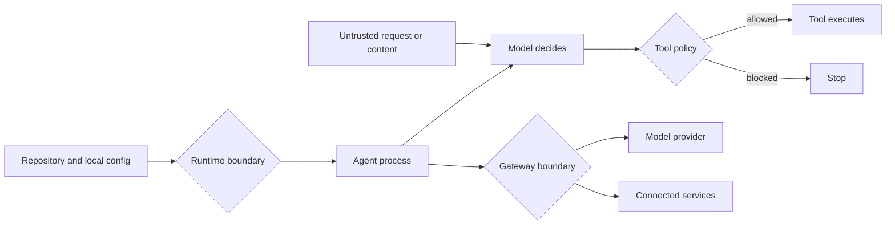

An agent can cause damage before the model makes its first decision. On September 1, 2026, Manifold described coding agents that invoked Git while gathering workspace context, allowing repository-local Git configuration to run a program on the host. Some affected agents performed that work before a user typed a prompt or approved workspace trust.

That is a different failure from prompt injection. A tool-call allowlist can stop a model from emailing an attacker. It cannot stop the application around the model from launching an unsafe subprocess during startup.

{/* truncate */}

:::tip[TL;DR]
A production agent inherits authority from more than its tool schema. Startup hooks, repository configuration, plugins, gateways, credentials, and network access can all act outside the model's visible tool loop. Keep tool-call policy, but also constrain the runtime and gateway that make those tools possible.
:::

## The model is only one decision-maker

Most agent security diagrams begin with a prompt and end with a tool call. That catches an important risk: untrusted text convinces the model to call a legitimate tool with harmful arguments. The control belongs at the tool boundary, where code can reject an unauthorized recipient, path, query, or action regardless of the model's reasoning.

But an agent is also a normal software process. It reads configuration, discovers a repository, starts subprocesses, loads extensions, calls a gateway, and uses credentials from its environment. Those operations may happen before or beside the model loop.

The three diamonds answer different questions:

| Boundary | Question it must answer | Example control |
|---|---|---|
| Runtime | What may this process read, execute, and reach? | Isolated workspace, reduced OS permissions, outbound network rules |
| Gateway | Who may use this shared control plane, and what can it reach? | Strong authentication, patched releases, scoped credentials, restricted administration |
| Tool call | May this specific action happen with these arguments? | Recipient allowlist, path restriction, read-only database role, human approval |

This table is an operational recommendation, not a claim that every agent needs the same architecture. A local study assistant with no sensitive data needs less isolation than an unattended coding agent with cloud credentials. The useful move is to identify each path that carries authority, then put a control on that path.

## Startup plumbing is part of the attack surface

Manifold's [GitSpawn research](https://www.manifold.security/blog/ai-coding-agents-git-hijack) reported eight findings across seven coding agents. The shared mechanism was ordinary context gathering: agents called Git in a repository, and Git honored local configuration that named programs to run. The researchers reported that some calls happened before authentication or workspace approval. At publication, four findings remained unpatched, so they withheld details for those paths.

In Manifold's tests, every proof of concept used a ZIP archive containing a `.git` directory. A normal Git clone, fetch, or pull does not copy repository-local configuration from the remote. Manifold advised users who receive a repository as files to inspect `.git/config` before opening that directory with an agent. It advised agent vendors to sanitize Git configuration on background context-gathering calls.

The broader lesson is mine: **workspace trust has to cover startup behavior, not only commands the model requests.** If an application promises approval before execution, its own discovery and indexing code must honor that boundary too.

For a team running coding agents, I would review this path in order:

1. Identify every command and hook that runs when a workspace opens, before the first prompt, and during background indexing.
2. Test those paths with hostile local configuration in an isolated environment.
3. Disable configuration keys and environment behavior the agent does not need.
4. Open unfamiliar workspaces with reduced filesystem, process, credential, and network access.
5. Keep secrets outside the agent process until the task actually needs them.

That last step limits the consequence of a missed hook. A startup process cannot leak a cloud credential it never received.

## The gateway is a privileged service

An AI gateway often holds provider keys, processes prompts and responses, applies guardrails, and connects to internal services. That makes it a useful policy boundary. It also makes gateway authentication and administration a security-critical control plane.

Wiz's [September 9 LiteLLM research](https://www.wiz.io/blog/off-guard-breaking-litellm-from-authentication-bypass-to-cloud-compromise) makes the consequence concrete. In a February 2026 snapshot, 9.6% of 3,074 publicly reachable LiteLLM instances either accepted the default master key, `sk-1234`, **or** required no authentication. That combined figure does not mean 9.6% used the default key, and it says nothing about private deployments.

The same research described an MCP authentication bypass, CVE-2026-59822, and a separate post-authentication code-execution flaw in custom code guardrails, CVE-2026-59821. Wiz reported that patches were available when it published. The MCP issue had also entered CISA's Known Exploited Vulnerabilities catalog, and Wiz said its honeypot observed exploitation.

Do not turn that incident into “never use a gateway.” A shared boundary can make authentication, budgets, routing, and audit policy more consistent. Treat it like the privileged service it is:

- keep it off the public internet unless public access is required;
- require authentication explicitly and test that an absent, invalid, or default credential fails closed;
- patch it as infrastructure, with an owner and a response window;
- restrict administrative and custom-code features to the smallest role that needs them;
- give the gateway scoped provider and cloud credentials;
- restrict which internal URLs and MCP servers it can reach;
- log administrative changes and tool access without copying sensitive prompt content by default.

A provider key with a spending limit is safer than an unrestricted key, but spend is only one consequence. If the gateway can reach internal tools or cloud metadata, its network and identity permissions decide how far a compromise travels.

## Keep the tool guard

Runtime isolation and gateway hardening do not replace tool policy. They handle different decisions.

Suppose an email agent reads a malicious vendor document. The application starts safely, the gateway is patched and private, and the model still follows the document's hidden instruction to send an internal plan outside the company. A recipient allowlist at `send_email` blocks that action at the last useful point.

The inverse matters too. A perfect recipient allowlist does nothing if a startup hook can read environment secrets and make its own network request. Both controls reduce authority, but on separate paths.

This is why I prefer enforceable constraints over a long list of suspicious phrases. For each sensitive action, decide what code can verify without guessing intent:

- email recipients and attachment classes;
- filesystem roots and read versus write access;
- database roles, schemas, and query types;
- deployment environments and required approvals;
- payment limits and permitted counterparties;
- network destinations and request methods.

The model may propose an action. A deterministic policy decides whether the action fits the authority granted for this task.

## A review you can run this week

Pick one real agent and trace a request from process startup through its most sensitive tool. Write down every place that can execute code, read a secret, cross a network boundary, or make a lasting change.

Then answer five questions:

1. What runs before the first prompt or approval?
2. Which credentials exist in the process, gateway, and tool service?
3. Which network destinations can each component reach?
4. Where are tool arguments checked by code instead of trusted to model judgment?
5. Can you prove that missing or invalid authentication fails closed?

If an answer depends on “the model would not do that,” the control is in the wrong place. Move it to the runtime, gateway, or tool that can enforce the rule.

The [Agent Security lesson](/docs/advanced-concepts/agent-security) demonstrates the tool-call side with an indirect prompt-injection lab. [AI Gateways](/docs/advanced-concepts/ai-gateways) explains the application-owned boundary and routing contract. Use them together, then add the runtime and gateway checks above to the threat review.

The practical change is small: treat everything around the model as part of the agent. Inventory it, reduce its authority, and test the boundaries before an untrusted repository, document, or request does it for you.
