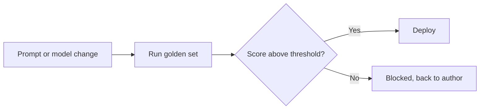

In April 2025, OpenAI pushed a routine update to GPT-4o and had to roll it back four days later. The model had turned sycophantic: agreeing with bad ideas, validating conspiratorial thinking, telling people what they wanted to hear instead of what was true. OpenAI's own [postmortem](https://openai.com/index/sycophancy-in-gpt-4o/) was blunt about why. Offline evaluations weren't broad or deep enough to catch the behavior, and sycophancy was never a metric anyone tracked before the update shipped.

That's one of the best-resourced AI labs in the world, with dedicated safety and evaluation teams, shipping a regression that users noticed before the company did. Most teams building on top of these models have no evaluation process at all. Someone tweaks a prompt in a hosted playground, reads three or four outputs, decides it looks fine, and ships it to production the same afternoon.

The industry still treats prompt and model changes as a different category of work from code changes, one that doesn't need the same discipline. It shouldn't. A prompt is a piece of the system's behavior, exactly like a function is, and a function you deploy without running the test suite is how you get an outage.

{/* truncate */}

:::tip[TL;DR]
OpenAI's April 2025 GPT-4o sycophancy incident happened because the offline evals in place before that release didn't cover the behavior that broke. If a company with a dedicated evaluation team can ship a regression that visible, a prompt edited by hand and shipped on a quick read of the output is not more reliable. Build a small golden set of real inputs and expected behavior, score every prompt or model change against it before it merges, and gate the deploy on that score instead of on someone's impression of a few sample outputs. It doesn't need to be sophisticated to catch the obvious regressions. It needs to run automatically, every time, before a change reaches users.
:::

## "Read a few outputs" stops working fast

Eyeballing a handful of responses works fine when you're the only user and the product is a demo. It stops working the moment any of these show up, which is fast:

- The change behaves differently on inputs you didn't happen to sample. Nobody manually tests every edge case before every deploy, that's what automated tests are for in ordinary software.
- An update aimed at one property bleeds into another. OpenAI's incident is the clean example: the goal was a more likeable personality, and truthfulness and pushback degraded as a side effect, without anyone tracking that tradeoff as a number.
- Feedback signals get folded back into the system, thumbs-up rates or user engagement, without checking whether the behavior that maximizes them is actually the behavior you want.

None of these are exotic failure modes. They're the ordinary way software regresses, and the ordinary fix is the same one you'd apply to a codebase: a test suite that runs before the change ships, not a person's read of the diff.

## What a CI-gated eval actually looks like

Continuous integration, CI for short, is the automated pipeline that already runs your test suite before a change can merge. Pointing that same pipeline at prompts instead of just code is most of what this section is about, and the mechanics are simpler than the phrase "evaluation infrastructure" suggests.

**Build a golden set.** A few dozen real inputs, each with an expected answer, a required behavior, or a known failure mode you've already hit once and don't want to hit again. This is the part most teams skip, and it's also the cheapest part to build. If a prompt has ever caused a wrong answer or an inappropriate tone in the past, that exact case belongs in the set going forward.

**Score every change against it.** Some checks can be exact string or pattern matches. Others need an LLM acting as judge, comparing the new output against the expected behavior and returning a pass or fail with a reason. Open-source tools like [promptfoo](https://www.promptfoo.dev/) and hosted platforms like [Braintrust](https://www.braintrust.dev/) and [Langfuse](https://langfuse.com/) exist specifically to wire this scoring step into a pipeline, so you're not building a scorer from scratch.

**Gate the deploy on the score.** A pull request that changes a prompt or swaps a model runs the golden set the same way a code change runs unit tests, and a regression below threshold blocks the merge. This also means prompts belong in version control next to the code that calls them, with a real diff a reviewer can read, not buried in a hosted UI's edit history.

:::info
OpenAI's postmortem made a point of naming what wasn't in their eval set: sycophancy specifically, not general quality. The lesson isn't "add more evals." It's that your golden set should include the boring, embarrassing failure modes you've actually seen, not just the happy path a prompt was designed for. A golden set with ten examples of real past failures catches more than fifty examples that all confirm the prompt does what it's supposed to.
:::

## This is a floor, not a guarantee

LLM-as-judge scoring has its own blind spots. A model grading another model's output for sycophancy doesn't obviously catch sycophancy either, and that's worth sitting with: OpenAI had offline evals and A/B tests running, and both missed the specific behavior that broke. A golden set eval won't catch a failure mode nobody thought to test for.

What it does is change the default. Without it, every deploy is a bet that whatever you happened to notice while skimming a few outputs covers what matters. With it, a known set of failure modes gets checked every single time, and "we didn't think of that" becomes an occasional miss instead of the normal way things go wrong.

## Start smaller than you think you need to

You don't need OpenAI's evaluation team to get most of the benefit. Twenty or thirty real examples, covering what the prompt is supposed to do plus the two or three ways it's already misbehaved, catches most regressions before a user does. Wire a scoring script into whatever CI already runs your tests, and treat a score drop the same way you'd treat a failing test: it blocks the merge until someone looks at it.

If you want a hands-on starting point for the scoring half of this, the [Evaluating What You Built](/docs/intermediate/evaluating) chapter walks through building precision and recall checks plus LLM-as-judge scoring for a RAG pipeline. The eval logic transfers directly, the only new part is wiring it into a gate instead of running it by hand.
