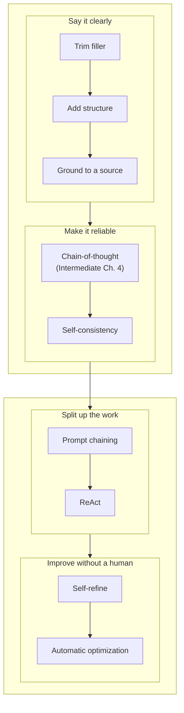
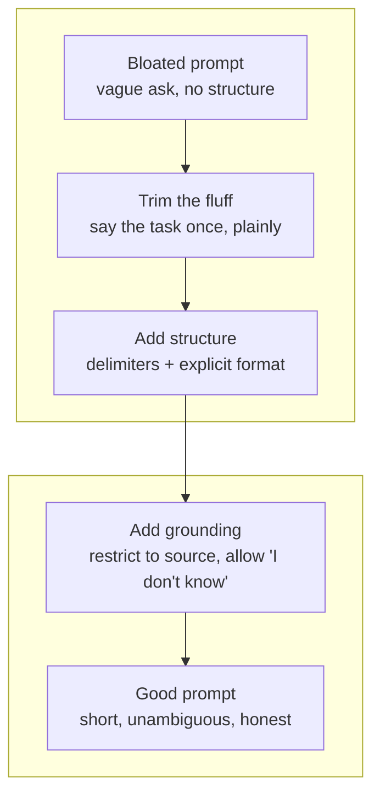

import Quiz from '@site/src/components/Quiz';
import {questions as ac1Questions} from '@site/src/data/quizzes/ac1';

# Prompt Engineering

> **Time:** 30 minutes. **Cost:** $0 with Ollama, a fraction of a cent with OpenAI or Anthropic.

Imagine leaving instructions for a substitute teacher who's never met your class and won't be around once you leave to answer follow-up questions. "Keep them busy with the usual stuff" means nothing to that person, they don't know what "the usual stuff" is. "Have them read chapter 4 silently from 9:00 to 9:20, then answer questions 1-5 on page 82" leaves nothing to guess. A friend covering for you could work with the vague version, because they share your context. A stranger can't.

A large language model is always the stranger. It has no memory of you, no shared history, no idea what you actually meant unless you wrote it down. But writing clearly is only the first problem. A clearly written prompt can still ask for something the model botches midway through a multi-step calculation, invents with total confidence when it doesn't actually know, or tries to do alone in one shot when splitting the job into stages would do better. This chapter covers both layers: how to say what you mean, and what to do once saying it clearly still isn't enough. Here's the shape of what's ahead, roughly in this order:



## What makes a prompt good

Four things, in practice:

1. **A clear task.** One sentence a stranger could repeat back correctly.
2. **Only the context that's actually needed.** Background the model needs to answer correctly, and nothing else.
3. **Explicit constraints.** Format, length, tone, what to do when information is missing, anything you'd be annoyed about if it got the "obvious" default wrong.
4. **No filler.** Politeness, hedging, and restating the same instruction three different ways don't make the model try harder. They just add words it has to read, and you have to pay for.

## Specific beats verbose (the token cost angle)

Every word you send is tokens, and tokens cost money and time, whether you're paying per token to a hosted API or just waiting longer for a local model to finish reading before it can start answering. A rambling prompt with three restatements of the same ask doesn't make the model more careful, it just makes the request longer to read and, often, harder to follow, since the model now has to figure out which of your three phrasings is the real instruction.

The fix isn't to write in fragments, it's to say the thing once, clearly, and stop. "Summarize this in 3 bullet points" beats "Could you possibly give me a summary, and if it's not too much trouble, maybe keep it fairly brief, like a few bullet points would be great, thanks so much." Same request. One is a fifth of the length.

## Structure kills ambiguity

When a prompt mixes instructions and data together in one paragraph, the model has to guess where one ends and the other begins. Two habits fix that:

- **Delimiters.** Wrap the data you're handing the model (a document, a blurb, a transcript) in something visually distinct, triple quotes, XML-style tags, a markdown code fence, so instructions and content are never one undifferentiated blob of text.
- **Say the format you want, not just the task.** "List them" is ambiguous, comma-separated? numbered? one per line? "Reply with one item per line, numbered 1 to 5" isn't.

💡 Anthropic's own documentation specifically recommends XML-style tags (`<context>...</context>`, `<question>...</question>`) when prompting Claude models, it's not just "a delimiter that happens to work," it's the format Claude was trained to expect. Other models are more delimiter-agnostic, but when in doubt, XML tags are a safe default across providers.

## Grounding is what actually reduces hallucinations

A model doesn't know what it doesn't know, it always predicts the next most likely word, whether or not the true answer is anywhere in what you gave it. Ask an ungrounded question and a model with no real answer will still produce a fluent, confident-sounding one, because "I don't know" is rarely the statistically likely continuation unless you've made it one.

The fix is a specific kind of constraint, not just "be accurate" (a model already thinks it's being accurate; that instruction changes nothing). Two things actually work:

- **Restrict the model to a source.** "Using only the information in CONTEXT above" tells the model where the honest boundary of its answer is.
- **Give it explicit permission to say "I don't know."** Without this, admitting uncertainty conflicts with the model's drive to produce a helpful-sounding answer. Naming the exact phrase you want ("Not stated in the source") removes the ambiguity about whether an honest non-answer counts as a good response.

## Beyond a single prompt

Trimming, structuring, and grounding fix a prompt that's ambiguous. They don't fix a prompt that's perfectly clear but still asks the model to do something it can't reliably do in one pass. Three things fall in that second category: working through several steps without a slip, judging whether its own first answer was actually right, and handing off part of the job to something else entirely. Those are different failure modes, and the field has a named technique for each one.

### Self-consistency: don't trust the first answer

[Intermediate Chapter 4: Prompt Patterns](/docs/intermediate/prompt-patterns) already covers chain-of-thought: asking a model to "think step by step" instead of jumping straight to a number, because an LLM predicts one token at a time and skipping the reasoning steps means skipping the chance to catch a mistake mid-calculation. That fixes the model that doesn't show its work. It doesn't fix the model that shows its work and still gets it wrong, the same way telling a person to "show your work" doesn't guarantee the arithmetic is correct, it just makes the mistake visible instead of hidden.

Self-consistency is the fix for that: run the same chain-of-thought prompt more than once and take the answer that shows up most often, instead of trusting whichever one came back first. It's the same instinct as asking three colleagues to independently estimate how long a project will take and going with the number two of them agree on, rather than whichever estimate you happened to hear first. It costs multiple model calls for a single answer, so save it for questions where being wrong is expensive and the reasoning could plausibly go two different ways. Don't reach for it on every prompt you write. You'll see this exact comparison, one chain-of-thought run against a three-run majority vote on a trickier problem, in this chapter's lab.

### Prompt chaining: splitting one big ask into a pipeline

Asking one prompt to summarize a document, extract every person and organization mentioned, and judge the overall tone is asking one worker to do three different jobs badly instead of three workers to each do one job well. Prompt chaining is that split made explicit: break a complex task into a sequence of smaller prompts, each with a single clear job, where one prompt's output becomes the next prompt's input.

The payoff shows up when something goes wrong. A single mega-prompt that returns a bad answer gives you one wall of text to debug, no way to tell whether the summarizing, the extracting, or the tone judgment failed. A chain gives you a checkpoint at every stage: you can look at exactly which step's output went bad, and fix or re-run only that step. It also means you're not stuck using one model for the whole job. A stage that just reformats text can run on something small and cheap, while the stage that actually needs to reason hard can call a stronger model. That way you're not paying premium-model prices for every step in the pipeline.

### ReAct: reasoning interleaved with action

A detective who announces a conclusion before checking any evidence is guessing. A detective who reasons out loud, checks one fact, updates the theory based on what they found, checks another, and only then names a suspect is doing something closer to real investigation. ReAct (reason plus act) is that second pattern turned into a prompting technique: instead of one reasoning pass that ends in an answer, the model alternates a **Thought** (what to check next and why), an **Action** (an actual tool call), and an **Observation** (the real result, fed back in) until it has enough grounded information to answer for real.

```
Thought: I need the current weather to answer this.
Action: get_weather(city="Millbrook")
Observation: 61°F, light rain
Thought: That's cool and wet, a jacket recommendation makes sense.
Answer: Bring a light jacket, it's 61°F and raining in Millbrook.
```

This loop, reason, call a tool, fold the real result back in, reason again, is the exact mechanism underneath every agent built in this curriculum. If you haven't built one yet, [Chapter 5: Tool Use](/docs/intermediate/tool-use) and [Chapter 6: Your First Agent](/docs/intermediate/your-first-agent) walk through it end to end with real code, there's no need to duplicate that here. What's worth naming is that ReAct isn't a separate, exotic thing from what you already know, it's chain-of-thought with a tool call allowed to interrupt it.

### Self-refine: having the model edit its own work

A first draft and a final draft are rarely the same, not because the writer got smarter in between, but because rereading your own work as if someone else wrote it surfaces mistakes that writing it fresh didn't. Self-refine (sometimes called reflection) applies that same idea to a model: generate an answer, then in a second call, ask the model to critique that exact answer against explicit criteria ("does this cite a source for every claim? does it answer all three questions asked?"), then generate a revised version based on its own critique.

This works for a simple reason: spotting a flaw in an answer that's already written is easier than avoiding that flaw while writing the answer in the first place. It's the same reason a typo you missed while typing jumps out the moment you reread it. The cost is real, two or three model calls instead of one. Save it for outputs where quality matters more than speed or price, a customer-facing email, not an autocomplete suggestion.

### Automatic prompt optimization: stop hand-tuning wording

Every technique so far still assumes a person writing and rewriting the prompt by hand. That works for one prompt. It stops working once an application has thirty prompts across a dozen features, each one hand-tuned by someone eyeballing outputs and tweaking phrasing until it feels better, with no record of whether the tweak actually helped or just felt like it did.

Frameworks like [DSPy](https://dspy.ai) (open source, from Stanford NLP) approach this differently. Instead of hand-writing a prompt's exact wording, you declare a *signature*: what goes in, and what should come out. An optimizer then searches over possible instructions and few-shot examples, and keeps whichever combination scores best against a dataset you've already scored yourself, the same kind of hand-labeled eval set [Intermediate Chapter 8](/docs/intermediate/evaluating) builds for judging a RAG pipeline. The mental shift is from tuning an engine by ear to putting it on a dyno and letting the numbers decide what setting actually performs better. A minimal DSPy program looks like this:

```python
import dspy

class AnswerFromContext(dspy.Signature):
    """Answer the question using only the given context."""
    context: str = dspy.InputField()
    question: str = dspy.InputField()
    answer: str = dspy.OutputField()

answer_question = dspy.Predict(AnswerFromContext)
# dspy.compile(answer_question, trainset=scored_examples) searches for the
# instruction and few-shot examples that score best against your dataset,
# instead of you guessing at wording and rerunning it by hand.
```

This is illustrative, not something the lab runs, it needs its own dependency (`dspy`) and a scored dataset to optimize against, which is a bigger commitment than one lab script should ask for. The idea to take away is smaller than the tooling: once you have a way to score a prompt's output, tuning the wording stops being a guessing game.

## The ecosystem: what people actually reach for

None of the above lives only in academic papers. There's a real, fast-moving market of tools built around exactly these problems, organized by which problem each one solves:

- **Prompt management and versioning.** A prompt in production is code, so it deserves the same treatment as code: version history, diffs between changes, and an easy rollback if a new version turns out worse. [PromptLayer](https://www.promptlayer.com), [Langfuse](https://langfuse.com) (open source), [Humanloop](https://humanloop.com), [Vellum](https://www.vellum.ai), and [Braintrust](https://www.braintrust.dev) all do this.
- **Testing and evaluation.** [Intermediate Chapter 8](/docs/intermediate/evaluating) has you build a small eval harness by hand, run a prompt against a set of test cases and score the results. [promptfoo](https://www.promptfoo.dev) is the open-source, packaged version of that same idea: you describe your test cases once in a config file, then it automatically re-runs them against every prompt variant or model you're comparing. Langfuse and Braintrust (above) offer similar eval features too.
- **Programmatic and optimization frameworks.** [DSPy](https://dspy.ai) is the compile-a-prompt tool described above. [Guidance](https://github.com/guidance-ai/guidance) and [Outlines](https://github.com/dottxt-ai/outlines) (both open source) solve a narrower problem: forcing a model to output valid JSON (or any format you define) by restricting which tokens it's allowed to generate at each step, rather than just asking nicely and hoping. It's a different route to the same reliable-output goal [Intermediate Chapter 4](/docs/intermediate/prompt-patterns) covers with native structured-output modes.
- **Orchestration.** [LangChain](https://www.langchain.com), [LangGraph](https://www.langchain.com/langgraph), and [LlamaIndex](https://www.llamaindex.ai) are the frameworks that call your prompts and wire them into larger chains and agents. This curriculum's Intermediate track (Chapter 6 onward) covers that layer in full, they're mentioned here only because in a real codebase, prompt engineering rarely happens separately from them.
- **Provider-native tooling**: Anthropic's Console includes a prompt generator and an evaluation tool built directly against Claude; OpenAI's Playground and Evals API do the same for GPT models. If you're only using one provider, its own console is often the lowest-friction place to iterate before reaching for a third-party tool.

💡 If you only remember three names from this list, make them **Langfuse or promptfoo** (you need to know when a prompt change made things worse before you ship it), and **DSPy** (it's the clearest sign of where prompt engineering is heading, less hand-tuned wording, more optimization against real data).

## Before you hit send: a trim checklist

Treat a prompt like a first draft, not a finished thing. Before you send it, reread it and ask:

- Could I delete this sentence and lose nothing?
- Is there a place where the model has to guess a format, a boundary, or what to do if something's missing?
- If I only trust part of what I gave the model, have I said which part?
- Would a stranger, reading this once, know exactly what to hand back?



## Hands-on lab: two experiments, one script

This lab runs two experiments back to back. The first sends the same underlying question about a fictional bike shop through four versions of a prompt, bloated, trimmed, structured, and grounded, so you can watch the same source document produce a different answer at each stage, including whether the model owns up to not knowing something. The second takes a multi-step math word problem through chain-of-thought once, then through self-consistency, running that same chain-of-thought prompt three times to see whether all three runs actually agree.

Full instructions: [`labs/advanced-concepts/01-prompt-engineering`](https://github.com/fewshot-works/academy/tree/main/labs/advanced-concepts/01-prompt-engineering)

Here's a real run, with Ollama:

```
Source document (what's actually true):
  Riverbend Bikes is a family-owned bike shop in Millbrook. We're open Tuesday through Saturday, 9 AM to 6 PM, closed Sunday and Monday. We offer full tune-ups, flat repairs, and custom builds. Returns are accepted within 14 days with a receipt, for store credit only, no cash refunds. We do not sell electric bikes.

============================================================
1. BLOATED (vague, wordy, invites a guess)
============================================================
[201 words in the prompt]

--- Response ---
**Staff Experience:**
Unfortunately, I don't have any specific information about the head mechanic's experience at Riverbend Bikes. However, based on the fact that they offer full tune-ups, flat repairs, and custom builds, it's likely that their staff has a good level of expertise in bike mechanics. It's also possible that the shop has been around for a while, which would indicate a higher level of experience among the staff.

============================================================
2. TRIMMED (specific, no filler)
============================================================
[84 words in the prompt]

--- Response ---
I couldn't find any information about the head mechanic's experience at Riverbend Bikes, as this information was not provided in the text you shared.
...
Unfortunately, I couldn't find any information about Riverbend Bikes' head mechanic or their years of experience.

============================================================
3. STRUCTURED (delimiters + explicit format)
============================================================
[88 words in the prompt]

--- Response ---
Unfortunately, the text doesn't provide information on Riverbend Bikes' head mechanic's experience.
...
3. The text doesn't mention anything about the head mechanic's experience.

============================================================
4. GROUNDED (constrained to the source, allowed to say 'I don't know')
============================================================
[121 words in the prompt]

--- Response ---
1. The store hours are Tuesday through Saturday, 9 AM to 6 PM, and closed Sunday and Monday.
2. Returns are accepted within 14 days with a receipt for store credit only, no cash refunds.
3. Not stated in the source

============================================================
SUMMARY
============================================================
1. BLOATED (vague, wordy, invites a guess): 201 words
2. TRIMMED (specific, no filler): 84 words
3. STRUCTURED (delimiters + explicit format): 88 words
4. GROUNDED (constrained to the source, allowed to say 'I don't know'): 121 words

============================================================
PART TWO: chain-of-thought and self-consistency
============================================================
Question: A farmer has 3 fields. Each field has 8 rows of 15 corn plants.
Pests destroyed 22 plants in total before harvest. The farmer sells each
remaining plant's corn for $2. How much money does the farmer make?

--- 5. CHAIN-OF-THOUGHT (single run) ---
To find out how much money the farmer makes, we need to calculate the total number of plants before harvest and subtract the destroyed ones. Then, we'll multiply the remaining plants by $2.

Step 1: Calculate the total number of plants per field:
Each field has 8 rows with 15 corn plants each.
Total plants per field = Rows x Plants/Row = 8 x 15 = 120

Since there are 3 fields, let's calculate the total number of plants:
Total plants = Fields x Total plants/Field = 3 x 120 = 360

Step 2: Subtract the destroyed plants from the total:
Pests destroyed 22 plants in total.
Remaining plants = Total plants - Destroyed plants = 360 - 22 = 338

Step 3: Calculate the farmer's earnings by multiplying the remaining plants by $2:
Earnings = Remaining plants x Price/Plant = 338 x $2 = $676

The farmer makes $676.

Final answer extracted: 676

--- 6. SELF-CONSISTENCY (same prompt, run 3 times) ---
Run 1 final answer: 676
Run 2 final answer: 676
Run 3 final answer: 676

Most common answer (3/3 runs): 676
```

💡 A few honest notes on this real run, not the tidy version:

- **The bloated prompt is the one that actually hallucinates**, just not with a fake number. It fills the gap with confident-sounding reasoning ("it's likely," "it's also possible that the shop has been around for a while, which would indicate...") instead of admitting the information isn't there. That's the same failure mode as inventing a number, dressed up as plausible inference.
- **The trimmed and structured prompts happened to decline correctly on this run too**, even without an explicit grounding instruction, `llama3.2` is decent about noticing an absence when the question is asked plainly. That's not a guarantee: nothing in those two prompts *tells* the model what to do when information is missing, it's just choosing to hedge. Run it a few times and you may see that crack on a harder question.
- **The grounded prompt is the only one with a guarantee built in.** It doesn't just get lucky, it's told exactly what phrase to use and exactly what source to stay inside. That's the difference between a prompt that resists hallucination by accident and one that resists it by design.
- **All three self-consistency runs agreed here**, which might make the technique look pointless on this particular problem. `llama3.2` just handles this one reliably most of the time. But "most of the time" isn't "always": across several runs while writing this chapter, one produced 676, 676, and 720, the third run slipped on the final multiplication step. Self-consistency's job is exactly for that run, overruling the one bad answer with two good votes, and you can't tell in advance which run that'll be.
- **Full prompt bodies and full chain-of-thought reasoning are printed in your own run**, this excerpt only shows the response for each variant to keep it readable. Run Part Two a handful of times yourself, small local models don't slip on every run, but they slip often enough that trusting a single one is a real risk, not a theoretical one.

## Checkpoint

<details>
<summary>The bloated prompt's response about staff experience never states a fake number of years, yet the chapter still calls it a hallucination. Why?</summary>

Hallucination isn't only "invents a specific wrong fact," it's answering with unearned confidence when the honest answer is "I don't know." The bloated prompt's response reasons its way to a flattering conclusion ("it's likely... it's also possible... which would indicate a higher level of experience") using no actual evidence, just plausible-sounding inference dressed as an answer. A reader skimming that paragraph could easily walk away believing something the source document never said.
</details>

<details>
<summary>The trimmed and structured prompts both declined to answer question 3 correctly on this run, without any explicit "say I don't know" instruction. Does that mean grounding constraints are unnecessary?</summary>

No, it means this run got lucky. Nothing in the trimmed or structured prompt tells the model what to do when information is missing, it just happened to notice the gap and hedge appropriately this time. The grounded prompt is the only one that removes the guesswork: it names the exact source to stay inside and the exact phrase to use when something isn't there. Relying on a model's good judgment is not the same as constraining its behavior, one is a habit, the other is a guarantee.
</details>

<details>
<summary>The grounded prompt (121 words) is longer than the trimmed prompt (84 words). Doesn't that contradict the "specific beats verbose" advice earlier in the chapter?</summary>

No, those are two different kinds of length. The bloated prompt's extra 117 words (over the trimmed version) were filler, politeness, hedging, restating the same ask three ways, that could be deleted without losing anything. The grounded prompt's extra 37 words (over the trimmed version) are a real constraint doing real work: naming the source boundary and the exact fallback phrase. Trimming cuts words that do nothing. Grounding adds words that do something specific. The goal was never "shortest possible prompt," it was "no wasted words."
</details>

<details>
<summary>In Part Two's shown run, all three self-consistency runs landed on the same answer. If they all agree anyway, was running the prompt three times a waste of two extra calls?</summary>

On that particular run, yes, in hindsight. But you can't know it's safe to skip the extra runs until after you've already made them, that's the catch. The chapter's honest notes mention a separate run where the identical prompt produced 676, 676, and 720, one run slipped on the final multiplication step even though nothing about the prompt changed between calls. That's possible because a model doesn't always pick its single most likely next word, it samples from several likely options each time, so identical input doesn't guarantee identical reasoning, especially on a smaller model working through several arithmetic steps in a row. Self-consistency isn't there for the runs that agree, it's insurance for the ones that don't, and you only find out which kind of run you got by actually voting across a few of them.
</details>

## Check Your Knowledge

<details>
<summary>Click to start quiz</summary>

<Quiz chapterId="ac1" questions={ac1Questions} />

</details>

## What's next

Every prompt you write from here on can go through this same trim: cut the filler, make the ask specific, add structure, and ground it in whatever source is actually true. The techniques past that, self-consistency, chaining, ReAct, self-refine, automatic optimization, aren't things to apply everywhere by default, they're tools to reach for once you've noticed which specific failure mode you're actually up against. Come back to Advanced Concepts whenever a new chapter title catches your eye, nothing here needs to be read in order.

This chapter is about writing and shaping a prompt, not about defending it once it's live, or building the agent loop that calls it. Three related things live elsewhere in this curriculum: actually building the ReAct loop described above (see [Chapter 5: Tool Use](/docs/intermediate/tool-use) and [Chapter 6: Your First Agent](/docs/intermediate/your-first-agent)), someone deliberately trying to hijack your prompt (see [Guardrails and Safety](/docs/advanced/guardrails-and-safety) in the Advanced track), and paying for the same prompt over and over (see the caching section of [Production Concerns](/docs/advanced/production-concerns)).
