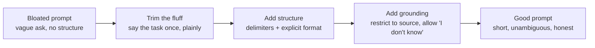

import Quiz from '@site/src/components/Quiz';
import {questions as ac1Questions} from '@site/src/data/quizzes/ac1';

# Prompt Engineering

> **Time:** 20 minutes. **Cost:** $0 with Ollama, a fraction of a cent with OpenAI or Anthropic.

Imagine leaving instructions for a substitute teacher who's never met your class and won't be around once you leave to answer follow-up questions. "Keep them busy with the usual stuff" means nothing to that person, they don't know what "the usual stuff" is. "Have them read chapter 4 silently from 9:00 to 9:20, then answer questions 1-5 on page 82" leaves nothing to guess. A friend covering for you could work with the vague version, because they share your context. A stranger can't.

A large language model is always the stranger. It has no memory of you, no shared history, no idea what you actually meant unless you wrote it down. Every extra word you add costs money and processing time; every ambiguous word you leave in gets resolved by the model guessing, not by it asking you to clarify. Prompt engineering, stripped of the buzzword, is just this: writing instructions precise enough that a stranger with no follow-up questions can't get them wrong.

## What makes a prompt good

Four things, in practice:

1. **A clear task.** One sentence a stranger could repeat back correctly.
2. **Only the context that's actually needed.** Background the model needs to answer correctly, and nothing else.
3. **Explicit constraints.** Format, length, tone, what to do when information is missing, anything you'd be annoyed about if it got the "obvious" default wrong.
4. **No filler.** Politeness, hedging, and restating the same instruction three different ways don't make the model try harder. They just add words it has to read, and you have to pay for.

## Specific beats verbose (the token cost angle)

Every word you send is tokens, and tokens cost money and time, whether you're paying per token to a hosted API or just waiting longer for a local model to finish reading before it can start answering. A rambling prompt with three restatements of the same ask doesn't make the model more careful, it just makes the request longer to read and, often, harder to follow, since the model now has to figure out which of your three phrasings is the real instruction.

The fix isn't to write in fragments, it's to say the thing once, clearly, and stop. "Summarize this in 3 bullet points" beats "Could you possibly give me a summary, and if it's not too much trouble, maybe keep it fairly brief, like a few bullet points would be great, thanks so much." Same request. One is a fifth of the length.

## Structure kills ambiguity

When a prompt mixes instructions and data together in one paragraph, the model has to guess where one ends and the other begins. Two habits fix that:

- **Delimiters.** Wrap the data you're handing the model (a document, a blurb, a transcript) in something visually distinct, triple quotes, XML-style tags, a markdown code fence, so instructions and content are never one undifferentiated blob of text.
- **Say the format you want, not just the task.** "List them" is ambiguous, comma-separated? numbered? one per line? "Reply with one item per line, numbered 1 to 5" isn't.

💡 Anthropic's own documentation specifically recommends XML-style tags (`<context>...</context>`, `<question>...</question>`) when prompting Claude models, it's not just "a delimiter that happens to work," it's the format Claude was trained to expect. Other models are more delimiter-agnostic, but when in doubt, XML tags are a safe default across providers.

## Grounding is what actually reduces hallucinations

A model doesn't know what it doesn't know, it always predicts the next most likely word, whether or not the true answer is anywhere in what you gave it. Ask an ungrounded question and a model with no real answer will still produce a fluent, confident-sounding one, because "I don't know" is rarely the statistically likely continuation unless you've made it one.

The fix is a specific kind of constraint, not just "be accurate" (a model already thinks it's being accurate; that instruction changes nothing). Two things actually work:

- **Restrict the model to a source.** "Using only the information in CONTEXT above" tells the model where the honest boundary of its answer is.
- **Give it explicit permission to say "I don't know."** Without this, admitting uncertainty conflicts with the model's drive to produce a helpful-sounding answer. Naming the exact phrase you want ("Not stated in the source") removes the ambiguity about whether an honest non-answer counts as a good response.

## Before you hit send: a trim checklist

Treat a prompt like a first draft, not a finished thing. Before you send it, reread it and ask:

- Could I delete this sentence and lose nothing?
- Is there a place where the model has to guess a format, a boundary, or what to do if something's missing?
- If I only trust part of what I gave the model, have I said which part?
- Would a stranger, reading this once, know exactly what to hand back?



## Hands-on lab: one bloated prompt, four rewrites

This lab sends the same underlying question about a fictional bike shop through four versions of a prompt, bloated, trimmed, structured, and grounded, so you can watch the same source document produce a different answer at each stage, including whether the model owns up to not knowing something.

Full instructions: [`labs/advanced-concepts/01-prompt-engineering`](https://github.com/fewshot-works/academy/tree/main/labs/advanced-concepts/01-prompt-engineering)

Here's a real run, with Ollama:

```
Source document (what's actually true):
  Riverbend Bikes is a family-owned bike shop in Millbrook. We're open Tuesday through Saturday, 9 AM to 6 PM, closed Sunday and Monday. We offer full tune-ups, flat repairs, and custom builds. Returns are accepted within 14 days with a receipt, for store credit only, no cash refunds. We do not sell electric bikes.

============================================================
1. BLOATED (vague, wordy, invites a guess)
============================================================
[201 words in the prompt]

--- Response ---
**Staff Experience:**
Unfortunately, I don't have any specific information about the head mechanic's experience at Riverbend Bikes. However, based on the fact that they offer full tune-ups, flat repairs, and custom builds, it's likely that their staff has a good level of expertise in bike mechanics. It's also possible that the shop has been around for a while, which would indicate a higher level of experience among the staff.

============================================================
2. TRIMMED (specific, no filler)
============================================================
[84 words in the prompt]

--- Response ---
I couldn't find any information about the head mechanic's experience at Riverbend Bikes, as this information was not provided in the text you shared.
...
Unfortunately, I couldn't find any information about Riverbend Bikes' head mechanic or their years of experience.

============================================================
3. STRUCTURED (delimiters + explicit format)
============================================================
[88 words in the prompt]

--- Response ---
Unfortunately, the text doesn't provide information on Riverbend Bikes' head mechanic's experience.
...
3. The text doesn't mention anything about the head mechanic's experience.

============================================================
4. GROUNDED (constrained to the source, allowed to say 'I don't know')
============================================================
[121 words in the prompt]

--- Response ---
1. The store hours are Tuesday through Saturday, 9 AM to 6 PM, and closed Sunday and Monday.
2. Returns are accepted within 14 days with a receipt for store credit only, no cash refunds.
3. Not stated in the source

============================================================
SUMMARY
============================================================
1. BLOATED (vague, wordy, invites a guess): 201 words
2. TRIMMED (specific, no filler): 84 words
3. STRUCTURED (delimiters + explicit format): 88 words
4. GROUNDED (constrained to the source, allowed to say 'I don't know'): 121 words
```

💡 A few honest notes on this real run, not the tidy version:

- **The bloated prompt is the one that actually hallucinates**, just not with a fake number. It fills the gap with confident-sounding reasoning ("it's likely," "it's also possible that the shop has been around for a while, which would indicate...") instead of admitting the information isn't there. That's the same failure mode as inventing a number, dressed up as plausible inference.
- **The trimmed and structured prompts happened to decline correctly on this run too**, even without an explicit grounding instruction, `llama3.2` is decent about noticing an absence when the question is asked plainly. That's not a guarantee: nothing in those two prompts *tells* the model what to do when information is missing, it's just choosing to hedge. Run it a few times and you may see that crack on a harder question.
- **The grounded prompt is the only one with a guarantee built in.** It doesn't just get lucky, it's told exactly what phrase to use and exactly what source to stay inside. That's the difference between a prompt that resists hallucination by accident and one that resists it by design.
- **Full prompt bodies are printed in your own run**, this excerpt only shows the response for each variant to keep it readable. Run it yourself to see the actual prompt text and full replies side by side.

## Checkpoint

<details>
<summary>The bloated prompt's response about staff experience never states a fake number of years, yet the chapter still calls it a hallucination. Why?</summary>

Hallucination isn't only "invents a specific wrong fact," it's answering with unearned confidence when the honest answer is "I don't know." The bloated prompt's response reasons its way to a flattering conclusion ("it's likely... it's also possible... which would indicate a higher level of experience") using no actual evidence, just plausible-sounding inference dressed as an answer. A reader skimming that paragraph could easily walk away believing something the source document never said.
</details>

<details>
<summary>The trimmed and structured prompts both declined to answer question 3 correctly on this run, without any explicit "say I don't know" instruction. Does that mean grounding constraints are unnecessary?</summary>

No, it means this run got lucky. Nothing in the trimmed or structured prompt tells the model what to do when information is missing, it just happened to notice the gap and hedge appropriately this time. The grounded prompt is the only one that removes the guesswork: it names the exact source to stay inside and the exact phrase to use when something isn't there. Relying on a model's good judgment is not the same as constraining its behavior, one is a habit, the other is a guarantee.
</details>

<details>
<summary>The grounded prompt (121 words) is longer than the trimmed prompt (84 words). Doesn't that contradict the "specific beats verbose" advice earlier in the chapter?</summary>

No, those are two different kinds of length. The bloated prompt's extra 117 words (over the trimmed version) were filler, politeness, hedging, restating the same ask three ways, that could be deleted without losing anything. The grounded prompt's extra 37 words (over the trimmed version) are a real constraint doing real work: naming the source boundary and the exact fallback phrase. Trimming cuts words that do nothing. Grounding adds words that do something specific. The goal was never "shortest possible prompt," it was "no wasted words."
</details>

## Check Your Knowledge

<details>
<summary>Click to start quiz</summary>

<Quiz chapterId="ac1" questions={ac1Questions} />

</details>

## What's next

Every prompt you write from here on can go through this same trim: cut the filler, make the ask specific, add structure, and ground it in whatever source is actually true. Come back to Advanced Concepts whenever a new chapter title catches your eye, nothing here needs to be read in order.

This chapter is about writing a prompt that says exactly what you mean, not about defending it once it's live. Two related problems live elsewhere in this curriculum: someone deliberately trying to hijack your prompt (see [Guardrails and Safety](/docs/advanced/guardrails-and-safety) in the Advanced track) and paying for the same prompt over and over (see the caching section of [Production Concerns](/docs/advanced/production-concerns)).
