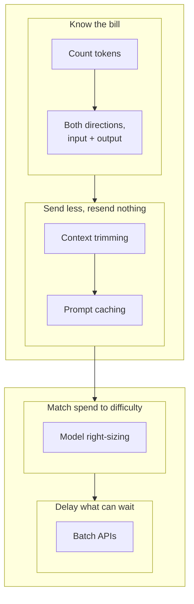
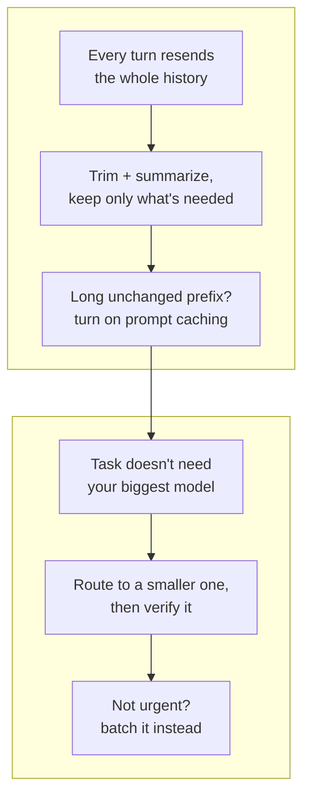

import Quiz from '@site/src/components/Quiz';
import {questions as ac2Questions} from '@site/src/data/quizzes/ac2';

# Token & Cost Management

> **Time:** 25 minutes. **Cost:** $0 with Ollama, a fraction of a cent with OpenAI or Anthropic.

Imagine hiring a translator who bills you by the word, for every word you say to them and every word they say back. If you re-explained your entire company history at the start of every single meeting instead of trusting them to remember what you already covered, that wouldn't be thoroughness, it would be a bill you're creating on purpose. Nobody would do that with a person they're paying by the word.

Plenty of AI applications do exactly that with a model. Every API call is stateless, the model has no memory of a conversation unless you resend it, so an app that just keeps appending to the message list pays for the same early turns again and again, every single time the user says one more thing. This chapter isn't about writing a better prompt, [Advanced Concepts: Prompt Engineering](/docs/advanced-concepts/prompt-engineering) already covers that. It's about controlling how much of that prompt you're sending, and how often, without cutting the answer short.



## What you're actually paying for

A quick recap from [Foundations Chapter 2](/docs/foundations/what-is-an-llm): a model doesn't read or write in whole words, it reads and writes tokens, small chunks of text. Every hosted API bills per token, usually at two different rates, input tokens (what you send) and output tokens (what the model sends back), with output typically costing more per token than input. A long system prompt, a big pasted document, an entire conversation history resent on every turn, all of that is input tokens, billed whether or not the model actually needed all of it to answer this particular question.

Ollama running locally isn't billed per token, there's no invoice. But every extra token still costs real wall-clock time and RAM on your own machine, a longer prompt takes measurably longer to process before the model can even start answering. The habits below are worth having on a local model too, the currency is just time instead of money.

The lab in this chapter uses [`tiktoken`](https://github.com/openai/tiktoken), OpenAI's own tokenizer, as a rough, consistent ruler for comparing "more tokens" against "fewer tokens" across all three providers. It won't match Ollama's or Anthropic's tokenizer exactly, but it's close enough to see the difference between a bloated request and a trimmed one.

## Context trimming: don't resend what you don't need

A chat API has no built-in memory. If you want a model to "remember" that a user is on the Pro plan, or that a bug was already reported ten turns ago, you resend that fact, every single call, because the model only ever sees whatever's in the messages you send this time. Left unmanaged, that means a long conversation gets more expensive with every single new message, even a one-line follow-up drags the entire history behind it.

[Intermediate Chapter 7: Memory](/docs/intermediate/memory) already covers folding older turns into a summary via `SummarizationMiddleware`, but for a different reason: keeping a long conversation from overflowing the model's context window and staying coherent. This chapter cares about the identical technique for a different reason, cost. Even a conversation nowhere near the context limit is still worth trimming, because every resent token is billed again whether the model needed it or not.

The catch is the same either way: a summary is only safe if it keeps whatever the next question will actually need, and you don't always know what that'll be in advance. Cut too little and you're not saving much. Cut too much and the model has no way to recover a fact you already told it. The lab makes that trade-off concrete instead of theoretical.

## Prompt caching: reusing computation on a repeated prefix

Trimming shortens what you send. Prompt caching is a different lever entirely: even an untrimmed prompt often shares a long, unchanged **prefix** across calls, a big system prompt, a pasted reference document, a tool schema, that's identical from one request to the next even though the user's actual question keeps changing. Provider-native prompt caching lets the provider reuse its internal computation over that repeated prefix instead of reprocessing it from scratch every time, which cuts both cost and latency on the cached portion, often substantially.

This is easy to confuse with the caching [Production Concerns Chapter 6](/docs/advanced/production-concerns) already covers, so it's worth naming the difference directly:

- **Response caching (Chapter 6)**: hash the *entire* prompt. If it's an exact repeat of a question already asked, return the stored full response instantly, no model call at all. Only works when the whole prompt matches something seen before.
- **Prompt caching (this chapter)**: reuse computation over a repeated *prefix*, even when the rest of the prompt, the user's real question, is different every single call. The model still runs, it just doesn't have to reprocess the part that hasn't changed.

Anthropic exposes this with an explicit `cache_control` marker on the part of the prompt you want cached:

```python
# Illustrative -- not run by this chapter's lab.
response = client.messages.create(
    model="claude-sonnet-5",
    max_tokens=300,
    system=[
        {
            "type": "text",
            "text": LONG_REFERENCE_DOCUMENT,
            "cache_control": {"type": "ephemeral"},
        }
    ],
    messages=[{"role": "user", "content": user_question}],
)
```

OpenAI applies an equivalent optimization automatically once a prompt's shared prefix crosses a length threshold, no code change required. Both have real constraints worth knowing before you plan around them: a minimum prefix length before caching kicks in at all, and a cache that expires after a short window if it isn't reused. This chapter's lab keeps this one illustrative rather than run live, the same way [Prompt Engineering](/docs/advanced-concepts/prompt-engineering) treats DSPy, the minimum token thresholds make it a poor fit for a short beginner script. Ollama, running locally, doesn't bill per token so there's no cost line to cache against, though the underlying engine can still reuse a matching prefix's computation across requests as a raw performance detail, that's a speed optimization, not a cost one.

## Model right-sizing: match the model to the task

Not every call needs your strongest, most expensive model. A one-word classification, a simple reformat, a routine lookup, these are jobs a small, fast, cheap model handles just as well as a large one, so sending them to the large model anyway is pure waste. The part worth being careful about is the other direction: a task that actually needs multi-step reasoning can quietly fail on a model that's too small for it, in ways that don't announce themselves as failures, the response still reads fluently, it's just wrong.

Right-sizing is the discipline of routing each task to the cheapest model that reliably gets it right, not the cheapest model that runs at all. "Reliably" is the operative word, and it's not something you get to assume, it's something you check, the same eval habits from [Intermediate Chapter 8: Evaluating What You Built](/docs/intermediate/evaluating) apply just as much to "did the cheaper model actually do the job" as they do to a RAG pipeline's retrieval quality. The lab in this chapter runs both directions, an easy task on a small model, and a harder task on both a small and a large model side by side, so you can see for yourself whether the larger model's extra cost actually bought anything on your own run.

## Batching: for anything that isn't urgent

Every technique so far assumes someone is waiting on the answer right now. A lot of real LLM usage isn't that: classifying a day's backlog of support tickets overnight, running the evaluation suite from [Intermediate Chapter 8](/docs/intermediate/evaluating) against every model you're comparing, labeling a large dataset, none of that needs a response in the next second.

Batch APIs (OpenAI's Batch API, Anthropic's Message Batches API) are built for exactly that gap: submit a large file of requests at once, the provider processes them asynchronously, typically within a 24-hour window, at a meaningful discount, often around half the real-time price, because the provider can pack them into spare capacity instead of guaranteeing instant turnaround.

```python
# Illustrative -- not run by this chapter's lab. Submits many requests as
# one file, gets results back later instead of one call at a time, right now.
batch_input = [
    {"custom_id": ticket_id, "method": "POST", "url": "/v1/chat/completions",
     "body": {"model": "gpt-4o-mini", "messages": [{"role": "user", "content": text}]}}
    for ticket_id, text in overnight_ticket_backlog
]
# client.batches.create(input_file_id=..., endpoint="/v1/chat/completions",
#                        completion_window="24h") -- results arrive later,
# not in this same call.
```

The trade-off is exactly the discount's mirror image: you give up "right now" to get "much cheaper." That's a bad trade for a chatbot answering a live user, and a good one for anything that was already going to run in the background.

## The ecosystem: what people actually reach for

- **Token counting.** [`tiktoken`](https://github.com/openai/tiktoken) (OpenAI, open source) is what this chapter's lab uses, a fast, local, no-API-call way to count tokens before you send anything, so you're estimating cost from a real number instead of a guess.
- **Unified routing.** [LiteLLM](https://www.litellm.ai) (open source) is the programmatic version of this chapter's small/large `if/elif`: one interface across 100+ providers, with config-driven rules for routing, automatic fallback, and cost tracking, instead of hand-writing that branching logic yourself in every project.
- **Cost dashboards.** The OpenAI usage dashboard and the Anthropic Console both show actual spend, broken down by model and by day. Nothing beats the real invoice, and it's the fastest way to notice a cost regression before it becomes a surprise. This overlaps with the broader tracing picture in [Advanced Chapter 5: Observability](/docs/advanced/observability), cost is one more signal worth watching alongside latency and errors.
- **Gateways.** [Portkey](https://portkey.ai) and [OpenRouter](https://openrouter.ai) bundle routing, caching, and cost tracking behind a single API, aimed at teams that would rather not hand-roll the `if/elif` and the dashboard themselves.

💡 If you only remember three names from this list, make them **tiktoken** (know the actual number before you argue about the bill), **your provider's own cost dashboard** (the invoice is always the ground truth), and **LiteLLM** once the `if/elif` in this chapter's lab starts to feel like real routing logic instead of a toy.

## Before you send: a cost checklist

- Am I resending information the model doesn't need to answer this specific turn?
- Does this prompt share a long, unchanged prefix with earlier calls, one worth turning prompt caching on for?
- Am I about to call my most expensive model for a task a cheaper one already handles reliably, and have I actually checked "reliably," or just assumed it?
- Does this request need an answer right now, or could it sit in a batch instead?



## Hands-on lab: two experiments, one script

This lab runs two experiments back to back. The first builds an eight-turn support conversation about a fictional app, sends a follow-up question two ways, once with the full history, once with the older turns folded into a one-line summary, and compares both the token counts and the answers. The second sends an easy one-word classification task to a small model, then sends a harder logic puzzle to both a small model and a large model from the same provider, so you can see right-sizing's other half: whether the bigger model's extra cost actually bought anything.

Full instructions: [`labs/advanced-concepts/02-token-cost-management`](https://github.com/fewshot-works/academy/tree/main/labs/advanced-concepts/02-token-cost-management)

Here's a real run, with Ollama:

```
============================================================
PART ONE: context trimming
============================================================

Full history: 10 messages, ~204 tokens
Trimmed history: 4 messages, ~136 tokens
That's a ~33% drop in the tokens sent for this one turn.

--- Response using FULL history ---
You're on the Pro plan, which is billed annually, and yes, it includes priority support.

--- Response using TRIMMED history ---
You mentioned earlier that you're on the Pro plan, which is billed annually, and you had a sync issue with your laptop and phone that was resolved after updating to app version 4.2. Prior to that update, the sync issue was causing some delays in getting updates for your tasks.

Both responses should mention the Pro plan and priority support. If the trimmed one still gets that right, the summary line preserved the one fact that actually mattered, and everything else was safe to drop.

============================================================
PART TWO: model right-sizing
============================================================

--- Easy task: one-word classification, small model only ---
  "My card was charged twice for this month's subscription." -> billing  [~53 tokens]
  "The app crashes every time I try to add a subtask." -> bug  [~55 tokens]
  "It would be great if I could set recurring tasks." -> feature  [~53 tokens]
  "How do I change my display name?" -> feature  [~50 tokens]

A small model handling a one-word classification like this is the right-sizing win: same answer quality, a fraction of the cost of routing it to the large model.

--- Hard task: logic puzzle, small vs. large model [~50 tokens each] ---
Question: Alice, Bob, and Carla finished a race in some order. Alice did not finish first. Carla finished before Bob. Bob did not finish last. What was the finishing order, from first to last? Answer with just the three names in order.
(Correct order: Carla, Bob, Alice.)

Small model's answer:
Based on the given information, we can deduce the following:

- Since Alice did not finish first, she must have finished second.
- Given that Carla finished before Bob and both finished before Alice, Carla must have finished third.
- As Bob did not finish last, he must have finished fourth.

So, the finishing order from first to last is: Alice, Carla, Bob.

Large model's answer:
Bob, Carla, Alice

Compare the two answers above against the correct order. This is the other half of right-sizing: the puzzle needs more reasoning than the classification did, so it's worth checking whether the model you picked actually delivers that reasoning, instead of assuming a bigger name automatically will.
```

💡 A few honest notes on this real run, not the tidy version:

- **The token counts (204 vs. 136, a ~33% cut) come from `tiktoken`'s `cl100k_base` encoding**, used here as a consistent ruler across all three providers, not an exact count for Ollama's or Anthropic's own tokenizer. Treat the percentage as directionally right, not exact to the token.
- **The trimmed response only worked because the one-sentence summary happened to contain the one fact the final question needed** (the plan tier). If the next question had instead needed some other detail that got compressed away, say, which troubleshooting step actually fixed the sync issue, the trimmed version would have no way to recover it. Summarizing well means guessing correctly what might get asked later, and you don't always get to know that in advance.
- **The classification task cracked on its most ambiguous case.** "How do I change my display name?" got labeled `feature` on this run, `other` on an earlier run. Both are defensible reads, that message doesn't cleanly belong to either category. That's a category-design problem more than a right-sizing one, three of the four messages landed the same both times, see [Prompt Engineering](/docs/advanced-concepts/prompt-engineering) for making instructions like this less ambiguous in the first place.
- **Neither model solved the logic puzzle correctly on this run.** The small model reasoned its way to a "4th place" finish in a three-person race, a sign it lost track of how many people were actually in the puzzle. The large model's reasoning stayed internally consistent but still landed on the wrong order. That's the honest, slightly humbling result: right-sizing decides how much reasoning budget a task deserves, it doesn't guarantee the model you routed it to actually gets the answer right. Checking that is exactly what [Intermediate Chapter 8's](/docs/intermediate/evaluating) evaluation habits are for, not an assumption you get to skip.
- **Both Ollama models here are small by hosted-API standards.** `llama3.2:1b` and the 3B `llama3.2` are both well under 4B parameters, closer to two siblings than a genuine small/large split. Running this lab with `PROVIDER=openai` or `PROVIDER=anthropic` pits `gpt-4o-mini` against `gpt-4o`, or Haiku against Sonnet, a much larger and more consistent capability gap than the two models compared above.

## Checkpoint

<details>
<summary>The trimmed conversation used about a third fewer tokens and still answered the plan question correctly. Does that mean folding old turns into a one-line summary is always safe?</summary>

No. It worked here because the summary happened to preserve the one fact the final question actually needed, that the user is on the Pro plan. If a later question in that same conversation had needed some other detail the summary dropped, the trimmed version would have no way to recover it, the information is simply gone. Trimming is a bet on knowing in advance what a later turn might ask about, and that bet doesn't always pay off.
</details>

<details>
<summary>In the real run above, the large model got the logic puzzle wrong too. Doesn't that undercut the whole idea of model right-sizing?</summary>

No, it sharpens it. Right-sizing decides how much reasoning budget a task deserves, routing the puzzle to the large model was still the correct call, the small model's reasoning was actively broken, it invented a fourth racer in a three-person race. The large model simply wasn't strong enough here either. That's the real lesson: picking a bigger model is a reasonable bet, not a guarantee, and the only way to know if the bet paid off is to check the answer, the same eval habit Intermediate Chapter 8 builds for a whole different kind of pipeline.
</details>

<details>
<summary>Prompt caching (this chapter) and the response caching from Production Concerns Chapter 6 both use the word "cache." What's actually different between them?</summary>

Chapter 6's cache is exact-match: hash the entire prompt, and if it's a repeat of a question already asked, return the stored full response instantly, no model call at all. Prompt caching reuses the model's internal computation over a repeated *prefix*, a long system prompt or reference document, even when the rest of the prompt, the user's actual new question, is different every single call. It doesn't skip the model call, it just makes the unchanged part of the input cheaper and faster to reprocess. One replaces the call entirely for identical questions; the other speeds up every call that shares a prefix, identical question or not.
</details>

<details>
<summary>The same message, "How do I change my display name?", got labeled differently across two separate runs of the classification task. What does that tell you, and what doesn't it tell you?</summary>

It tells you that this particular message is genuinely ambiguous between two of the categories, that's a real property of the message, not just random noise, and that even an "easy" one-word classification isn't perfectly deterministic on a small model. It does not tell you that right-sizing failed, or that small models can't be trusted for classification, three of the four messages landed the same label on both runs. A single ambiguous edge case is a sign the categories need tightening, not evidence the technique doesn't work.
</details>

## Check Your Knowledge

<details>
<summary>Click to start quiz</summary>

<Quiz chapterId="ac2" questions={ac2Questions} />

</details>

## What's next

None of these four techniques, trimming, prompt caching, right-sizing, batching, replace writing a good prompt in the first place, they assume you've already done that. Come back to Advanced Concepts whenever another chapter title catches your eye, nothing here needs to be read in order.

This chapter is about controlling spend before and during a call. Two related things live elsewhere in this curriculum: skipping the model call entirely on an exact repeat question (see the caching section of [Production Concerns](/docs/advanced/production-concerns)), and watching what a call actually costs in production, alongside its latency and errors (see [Observability](/docs/advanced/observability)).
