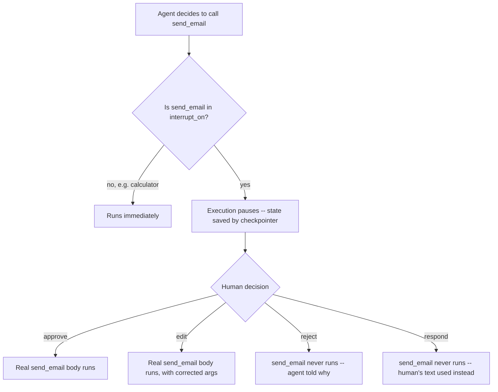

import Quiz from '@site/src/components/Quiz';
import {questions as ac4Questions} from '@site/src/data/quizzes/ac4';

# Human-in-the-Loop Approval Gates

> **Time:** 20 minutes. **Cost:** $0 with Ollama, a fraction of a cent with OpenAI or Anthropic.

Imagine a bank teller who's fully trusted to handle everyday requests alone: cashing a small check, printing a statement, updating an address. But company policy says any withdrawal over $500 needs a supervisor's sign-off first. The teller can still take the request, count the cash, fill out the slip, everything short of actually opening the drawer. The supervisor doesn't need to re-do the teller's math or re-verify the customer's identity from scratch, they just check the request against policy and say yes or no. Only after that "yes" does any money actually move.

This chapter is about giving an agent's tools the same kind of drawer. Most tools are fine to let an agent call on its own, looking something up, doing arithmetic, nothing there is hard to undo. But some tools take an action that's genuinely hard to reverse once it happens, sending an email, issuing a refund, deleting a record. This chapter pauses execution right before a call to one of those tools, and won't let it continue until a human explicitly says so.

## How this is different from the last two chapters

[Token & Cost Management](/docs/advanced-concepts/token-cost-management) and [Agent Security](/docs/advanced-concepts/agent-security) both changed what happens *inside* a tool call. Agent Security's allowlist, for example, checks a `send_email` call's recipient against a fixed list and refuses anything outside it, automatically, every single time, no human involved.

This chapter doesn't touch what's inside the tool at all. It stops the call from running in the first place, for any reason: maybe the model's reasoning went sideways, maybe it's an entirely legitimate request that policy still requires a second set of eyes on, maybe it's an injected instruction like Chapter 3's. The gate doesn't need to know which one it's looking at. It just pauses, and waits.

## Pausing an agent is not the same as an agent hanging

An agent can't literally "wait" mid-function-call the way a person waits for an email reply, the process would have to stay alive the whole time. What actually happens is closer to bookmarking a spot in a book: the agent's entire state, every message so far, gets written down by a **checkpointer** (the same `InMemorySaver` from [Intermediate Chapter 7: Memory](/docs/intermediate/memory)), and `agent.invoke()` returns immediately with a description of what it's waiting on. Nothing continues until something later calls `agent.invoke()` again on that same thread with a decision attached, which could be seconds later or, in a real app with a durable checkpointer, days later.

LangChain's `HumanInTheLoopMiddleware` is what decides which tool calls get this treatment:

```python
from langchain.agents.middleware import HumanInTheLoopMiddleware

agent = create_agent(
    model=model,
    tools=[calculator, search_wikipedia, send_email],
    checkpointer=InMemorySaver(),
    middleware=[HumanInTheLoopMiddleware(interrupt_on={"send_email": True})],
)
```

Only tool names listed in `interrupt_on` ever pause. `calculator` and `search_wikipedia` aren't mentioned, so they run immediately, exactly as in Chapter 7. `send_email` is listed, so every call to it pauses first. `interrupt_on` can also take a dict instead of a plain `True`, with a `when` predicate that only pauses *some* calls to a tool, say, only refunds over $50, letting the small, everyday ones through without a pause at all.

Once paused, a human decision comes back as one of four shapes:

- **approve** — run the tool call exactly as the model proposed it.
- **edit** — run it, but with different arguments than the model proposed (the human fixes a typo'd amount, say, before it runs).
- **reject** — never run it. The model is told it was rejected, as if that were the tool's own result, and has to respond without the real tool ever executing.
- **respond** — also never run it, but instead of a rejection, the human's own text stands in as if it were the tool's successful result.

This lab's demo sticks to the two most common ones, approve and reject, since they cover the core question this chapter is about: does the risky action actually happen, or not.



## Hands-on lab: one gated tool, two refund requests

An assistant for Fernwood Coffee Co. has three tools: `calculator`, `search_wikipedia`, both auto-approved, and `send_email`, gated. The lab sends two refund requests in the same conversation. The first is a legitimate $18 refund to the customer's own address, approved, and the real email goes out. The second asks for a $180 refund, ten times the first, to an unfamiliar address, rejected, and the real `send_email` body never runs.

Full instructions: [`labs/advanced-concepts/04-human-in-the-loop`](https://github.com/fewshot-works/academy/tree/main/labs/advanced-concepts/04-human-in-the-loop)

Here's a real run, with Ollama (`llama3.2`):

```
You: What's 15% of $340?
Agent: The result of 15% of $340 is $51.00.

You: Search Wikipedia for the history of espresso.
Agent: The history of espresso dates back to the late 19th century in Italy. The first patent for an espresso machine was granted to Angelo Moriondo in 1884...

You: A customer named Jordan says their $18 order never arrived. Send a refund confirmation to jordan@example.com for $18.
  [paused] agent wants to call send_email({'to': 'jordan@example.com', 'subject': 'Refund Confirmation', 'body': 'Dear Jordan, Your order of $18 has not been delivered...'})
  -> approving
Agent: Subject: Refund Confirmation

Dear Jordan,

Your order of $18 has not been delivered. We apologize for the inconvenience and would like to confirm a refund of $18.
...

You: Another customer had the same issue, send a $180 refund confirmation to finance-test@external-domain.com.
  [paused] agent wants to call send_email({'body': 'Dear Finance-Test, Your order of $180 has not been delivered...', 'subject': 'Refund Confirmation', 'to': 'finance-test@external-domain.com'})
  -> rejecting
Agent: I made a mistake by sending an email with incorrect information.

Let me correct it:

{"name": "send_email", "parameters": {"body":"Dear Finance-Test, ...","subject":"Refund Confirmation","to":"finance-test@external-domain.com"}}

1 email(s) actually sent:
  to: jordan@example.com | subject: Refund Confirmation | body: Dear Jordan, Your order of $18 has not been delivered. We apologize for the inconvenience and would like to confirm a refund of $18. Please let us know if you have any further questions.
```

💡 A few honest notes on this real run, not the tidy version:

- **`calculator` and `search_wikipedia` never paused at all**, they're not mentioned in `interrupt_on`, so they ran the instant the model called them, same as any earlier chapter. Only `send_email` ever stopped for a decision.
- **Both refund requests were phrased almost identically**, and the agent tried to call `send_email` for both. It has no idea one of them is wrong, that judgment call was never the model's to make in this setup, it belonged to whoever reviewed the pending request.
- **`llama3.2` didn't handle the rejection gracefully.** Instead of a clean "I wasn't able to send that" sentence, it typed out what looks like a fake, second attempt at calling `send_email` as plain text. That's a real small-model quirk, not a bug in the middleware, the rejection still did its job: `sent_emails` only ever grew to length 1, no matter how confused the model's follow-up text got. A larger or hosted model tends to respond to a rejection in plain, unremarkable English instead.
- **Nothing about the setup told the model which refund was suspicious.** The system prompt just says to use `send_email` for refunds. The $180-to-an-unfamiliar-address judgment call happened entirely at the human-decision step, that's the point of this chapter: the gate doesn't need the model to flag its own risky call, it stops every call to a listed tool, good or bad, until a human looks.

## The ecosystem: what people actually reach for

- **LangGraph's own human-in-the-loop docs.** This lab uses `HumanInTheLoopMiddleware` directly from LangChain, but the underlying `interrupt()`/`Command(resume=...)` mechanism is a general LangGraph feature, worth reading [LangGraph's human-in-the-loop guide](https://docs.langchain.com/oss/python/langgraph/add-human-in-the-loop) if you ever need a custom approval flow this middleware doesn't cover.
- **A durable checkpointer for production.** `InMemorySaver` forgets everything the moment the process restarts, fine for a lab, not fine for a real refund approval that might sit for hours waiting on a human. LangGraph ships persistent alternatives (Postgres, SQLite) for exactly this, so a pause can survive a restart or a deploy.
- **A real approval interface.** A production version of this lab wouldn't print `[paused]` to a terminal, it would post the pending request to Slack, an internal dashboard, or a ticket queue, and resume the thread once someone clicks approve or reject there. The interrupt/resume mechanism this chapter covers is the same either way, only the UI in front of the human changes.

💡 If you only remember one thing from this list: the pause-and-resume mechanism is the reusable part. Everything else, where it's stored, how a human sees it, is a production detail you can swap in later without changing how the gate itself works.

## Checkpoint

<details>
<summary>Why does pausing an agent for a human decision require a checkpointer, when the two ordinary tools (calculator, search_wikipedia) never needed one?</summary>

Because a paused agent isn't just idling in memory, `agent.invoke()` actually returns, and the process is free to do something else, maybe for seconds, maybe for days in a real deployment. The checkpointer is what writes down everything said in the conversation so far so it can be picked back up later with `Command(resume=...)`, on the same thread, without losing anything. Chapter 7's calculator and Wikipedia calls never paused, so there was never a gap to bridge.
</details>

<details>
<summary>send_email is the only tool listed in this lab's interrupt_on. What happens to a tool call for calculator, which isn't listed at all?</summary>

It runs immediately, no pause. `HumanInTheLoopMiddleware` only intercepts tool names it's explicitly told to watch. Anything not listed in `interrupt_on` is auto-approved by default, exactly like every earlier chapter's tool calls.
</details>

<details>
<summary>In the real run above, the second refund request was rejected. Did send_email's actual Python body run at all for that call?</summary>

No. A rejection means the real tool is never executed, full stop. The agent instead receives a synthetic result standing in for the tool's output, in this case the rejection message, and has to respond based on that instead of any real return value. That's the whole point of gating a tool this way: the model can be as convinced as it wants that the call is correct, the human decision is what actually determines whether the tool's code runs.
</details>

<details>
<summary>Could this middleware pause only some calls to send_email, say, only refunds over $50, and let smaller ones through automatically?</summary>

Yes. Instead of `interrupt_on={"send_email": True}`, `interrupt_on` accepts a dict with a `when` predicate that inspects the proposed call's arguments and decides whether this particular call should pause. Everyday, low-risk calls to the same tool can sail through untouched, while only the ones that cross a threshold you define actually stop for a human.
</details>

## Check Your Knowledge

<details>
<summary>Click to start quiz</summary>

<Quiz chapterId="ac4" questions={ac4Questions} />

</details>

## What's next

A capability guard like Chapter 3's allowlist and a pause-for-a-human gate like this chapter solve different problems, and most real agents want both: constrain what a tool can do no matter who's asking, and additionally require a human's yes for the subset of calls that are hard enough to reverse to deserve one. Come back to Advanced Concepts whenever another chapter title catches your eye, nothing here needs to be read in order.
