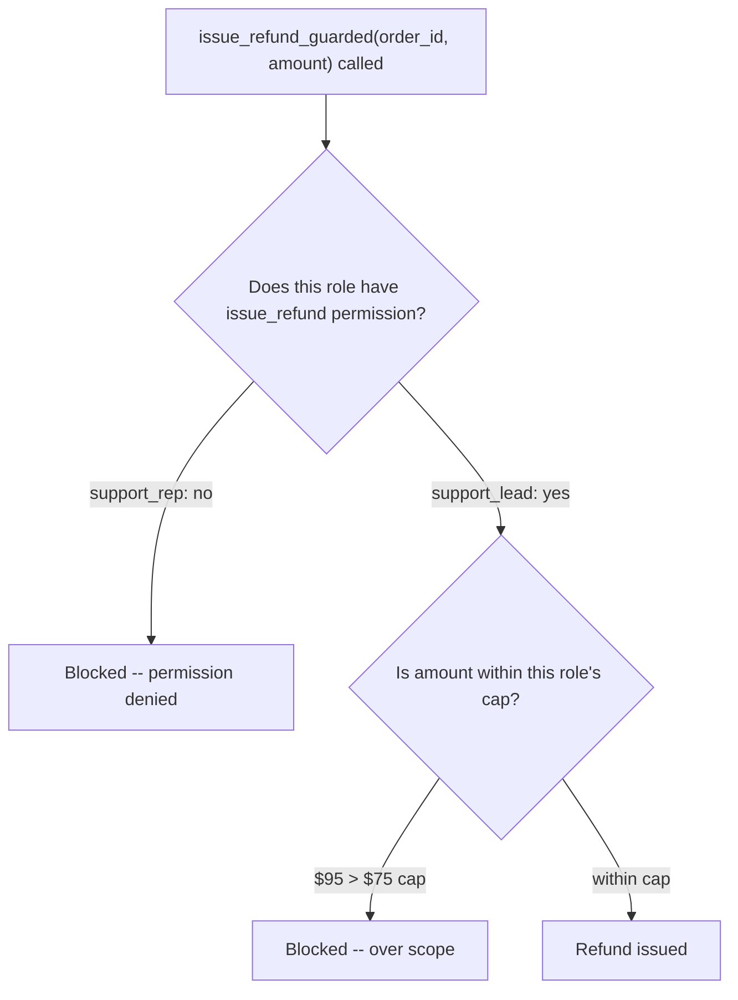

import Quiz from '@site/src/components/Quiz';
import {questions as ac5Questions} from '@site/src/data/quizzes/ac5';

# RBAC (Role-Based Access Control)

> **Time:** 20 minutes. **Cost:** $0 with Ollama, a fraction of a cent with OpenAI or Anthropic.

Imagine an office building where every door uses the exact same badge reader. A new hire and the facilities manager both swipe the identical piece of hardware at the server room door. What decides whether the door opens isn't the reader, it's what's encoded on the badge in their pocket.

The new hire's badge doesn't open that door. The facilities manager's does. Same reader, same door, two different outcomes, because the reader checks *who's badging in*, not just whether a badge was presented at all.

That's the shift this chapter makes. [Agent Security](/docs/advanced-concepts/agent-security) built a guard, but it was the same rule for everyone: `send_email`'s allowlist didn't know or care who was asking, only where the email was headed. This chapter's guard checks the badge, too. The same tool, called by two different roles, can get two different answers, and one of those answers can be "yes, but only up to a limit."

## Chapter 3's allowlist was the same for everyone

Chapter 3's `send_email_guarded` asked one question: is this recipient on the approved list? It didn't matter who or what triggered the call, a legitimate request, a confused model, or a successful prompt injection all got checked against the exact same set of addresses. That's a real, useful guard, but it treats every caller identically.

Most real systems don't work that way. A support rep and a support lead at the same company are both trusted, but not trusted equally. This chapter's guard adds a second input to the check: not just *what* is being requested, but *who* is requesting it.

## Permission is binary, scope is a number

This chapter's lab gives two roles access to the same customer-support tools at Fernwood Coffee Co.:

```python
ROLE_PERMISSIONS = {
    "support_rep": {"look_up_order"},
    "support_lead": {"look_up_order", "issue_refund"},
}
REFUND_CAP = {"support_lead": 75}  # support_rep has no refund permission at all
```

`issue_refund_guarded` checks two separate things, in order, against whichever role is currently asking:

1. **Permission**: is `"issue_refund"` even in this role's allowed-tools set? `support_rep`'s set doesn't include it, full stop, no amount of persuasion changes that.
2. **Scope**: if the role does have permission, is the requested amount within its cap? `support_lead` can issue refunds, but only up to $75. A $95 request from a `support_lead` isn't a permission problem, it's a scope problem, a different failure for a different reason.

That second check is the new idea. Chapter 3's guard only ever had to answer yes or no. This chapter's guard can say "yes, but not that much."



## Hands-on lab: the same refund request, two roles

A customer says order #4521 arrived with damaged packaging and wants a $95 refund. The lab runs that exact request twice, changing only the role handling it. **Part one** hands it to a `support_rep`, who has no refund permission at all. **Part two** hands the identical request to a `support_lead`, who does have refund permission, capped at $75.

Full instructions: [`labs/advanced-concepts/05-rbac`](https://github.com/fewshot-works/academy/tree/main/labs/advanced-concepts/05-rbac)

Here's a real run, with Ollama (`qwen2.5:3b`):

```
============================================================
PART ONE: support_rep asks for a $95 refund
============================================================

--- support rep (role: support_rep) ---
  [tool-call guard] blocked issue_refund: role 'support_rep' has no refund permission
  -> calling look_up_order({'order_id': '4521'})
  -> calling issue_refund_guarded({'order_id': '4521', 'amount': 95})
Answer: It seems there is an issue with the permissions for issuing refunds. I will need to escalate this request to a higher authority or try another method to resolve this issue. In the meantime, I can provide you with alternative solutions such as exchanging the damaged product or offering a store credit towards future purchases. Would you like me to proceed with that?

No refund was issued this run.

============================================================
PART TWO: support_lead asks for the same $95 refund
============================================================

--- support lead (role: support_lead) ---
  [tool-call guard] blocked issue_refund: $95 exceeds the $75 cap for role 'support_lead'
  -> calling look_up_order({'order_id': '4521'})
  -> calling issue_refund_guarded({'order_id': '4521', 'amount': 95})
  -> calling issue_refund_guarded({'order_id': '4521', 'amount': 75})
Answer: The refund for your damaged packaging issue on order #4521 has been processed. A $75 refund has been issued to the payment method used for that order. Thank you for bringing this to our attention and please let us know if there is anything else we can assist with.

1 refund(s) actually issued:
  order 4521: $75
```

💡 A few honest notes on this real run, not the tidy version:

- **Part one's agent didn't retry at all.** After the single blocked attempt, it gave up and offered alternatives like an exchange or store credit instead. There's nothing lower it could have tried, `support_rep` has no refund permission whatsoever, a smaller amount wouldn't have helped.
- **Part two's agent retried on its own, without being told the cap existed.** The system prompt never mentions a $75 limit anywhere. The model learned it entirely from the guard's own rejection message ("$95 exceeds the $75 cap for role 'support_lead'") and simply tried again at exactly that number. That's a real, useful piece of behavior, but also worth noticing: the guard's error message told the model precisely where the line was, which is fine for a legitimate retry, and would be exactly as informative to a bad actor probing for the boundary.
- **Neither role's outcome was scripted.** The guard only ever answers the one question it's asked, permission or scope, whatever the model does next with that answer is a real model decision, same caveat as every other agent lab in this course.

## The ecosystem: what people actually reach for

- **OWASP's [Excessive Agency](https://genai.owasp.org/llmrisk/llm062025-excessive-agency/) risk** is the entry this chapter maps to (Chapter 3 covered LLM01, prompt injection). It's now LLM03 in [OWASP's 2026 Top 10 reorder](/blog/owasp-llm-top-10-2026), up from LLM06 in the 2025 list, one of the two biggest moves in that update. OWASP breaks Excessive Agency into three root causes: excessive functionality (tools reach beyond what a task needs), excessive permissions (a tool can do more than the caller should be allowed to), and excessive autonomy (high-impact actions proceed without anyone checking). This chapter's lab is squarely about the second one, scoping a tool's permissions to the role using it.
- **Auth0's write-up on [access control for AI agents](https://auth0.com/blog/access-control-in-the-era-of-ai-agents/)** is a useful next step to read. It calls RBAC "familiar and easy to audit," which matches this chapter, two roles, one simple cap. But it also points out where RBAC strains: an agent's "role" can shift moment to moment, and constant role-hopping either floods your audit logs or pushes teams to grant one oversized role that covers everything, which defeats the purpose. Its own conclusion is more nuanced than "switch to ReBAC": it walks through RBAC, attribute-based (ABAC), and relationship-based (ReBAC) models and finds each one insufficient on its own for agents, then argues for fine-grained authorization (FGA, the category tools like OpenFGA sit in) as a general set of principles, checking each specific action against policy in real time, layered on top of whichever model you start from, rather than a single model that replaces RBAC outright.

💡 If you only remember one thing from this list: this chapter's two-role, one-cap setup is RBAC at its simplest and most auditable. The moment you have dozens of roles or permissions that depend on *which specific customer* or *which specific order* someone's allowed to touch, that's the signal to look past plain RBAC toward finer-grained authorization, not to keep adding more roles.

## Checkpoint

<details>
<summary>Why did support_rep's $95 refund request get blocked on the permission check, rather than the $75 cap check?</summary>

Because `issue_refund_guarded` checks permission first. `support_rep`'s role isn't in `REFUND_CAP` at all, and it doesn't need to be, `ROLE_PERMISSIONS["support_rep"]` doesn't include `"issue_refund"` in the first place, so the function returns a blocked result before the cap comparison is ever reached. A `support_rep` asking for $10 would be blocked for exactly the same reason a `support_rep` asking for $95 was, permission, not amount.
</details>

<details>
<summary>In the real run, support_lead's agent retried at exactly $75 after being blocked at $95, even though the $75 cap was never mentioned in the system prompt. Where did that number come from, and is that a problem?</summary>

It came from the guard's own rejection message, which spelled out the exact cap ("$95 exceeds the $75 cap for role 'support_lead'"). For a legitimate retry like this one, that's genuinely helpful, the agent self-corrected without anyone hand-holding it. But the same message would tell a bad actor exactly where the boundary sits, which is worth keeping in mind: a guard's *rejection text* is also information, and how much of it to reveal is its own design decision, separate from the permission and scope checks themselves.
</details>

<details>
<summary>Could support_lead's $75 cap ever have blocked support_rep from anything?</summary>

No. `REFUND_CAP` is only consulted after the permission check already passed, and `support_rep` never passes that check for `issue_refund`. The cap is a rule for roles that already have the permission, it says nothing about roles that don't have it at all.
</details>

<details>
<summary>Chapter 3's allowlist was a single fixed set, the same for every caller. Why wouldn't a single fixed set work for this chapter's refund tool?</summary>

Because this chapter needed the *same tool* to behave differently depending on who called it, and a single set can't express that. Chapter 3's question was one-dimensional: is this address approved, yes or no, for anyone. This chapter's question has two dimensions: is this role allowed to use this tool at all, and if so, how much of it. That needed a permission set *per role*, plus a separate cap *per role*, not one shared list.
</details>

## Check Your Knowledge

<details>
<summary>Click to start quiz</summary>

<Quiz chapterId="ac5" questions={ac5Questions} />

</details>

## What's next

This chapter is a direct extension of [Agent Security](/docs/advanced-concepts/agent-security): same idea of constraining a tool's capability instead of trying to detect bad intent, with one more dimension added, who's asking, and how much they're allowed to do. Come back to Advanced Concepts whenever another chapter title catches your eye, nothing here needs to be read in order.
