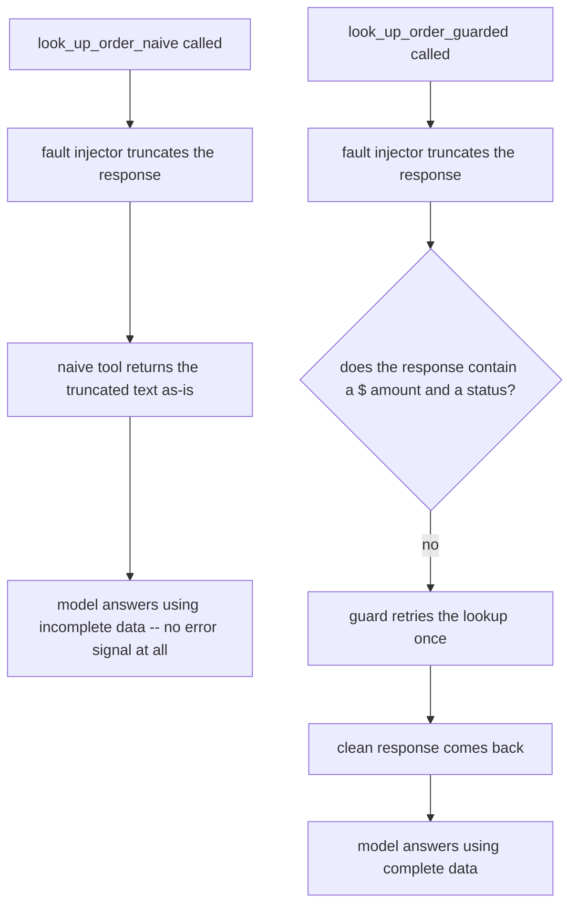

import Quiz from '@site/src/components/Quiz';
import {questions as ac6Questions} from '@site/src/data/quizzes/ac6';

# Chaos Engineering (Fault Injection)

> **Time:** 20 minutes. **Cost:** $0 with Ollama, a fraction of a cent with OpenAI or Anthropic.

In 2011, Netflix built a tool that did something that sounds backwards: in the middle of a normal business day, with real customers watching real movies, it would randomly kill a production server. On purpose. They called it Chaos Monkey.

The point wasn't to break things for fun. Netflix's servers were going to fail eventually anyway, hardware dies, networks drop, that's just reality at scale. Chaos Monkey's job was to make sure that when a server died, the system had already been tested against exactly that, on a Tuesday afternoon when engineers were watching, instead of finding out for the first time during an actual outage at 2am.

That's chaos engineering: instead of only testing that things work when everything goes right, you deliberately break one piece, on purpose, under controlled conditions, and watch how the rest of the system responds.

## Testing the happy path only tells you half the story

Every other lab in this course tests the happy path. [Intermediate Chapter 8](/docs/intermediate/evaluating) measured whether an agent's *answers* were correct, given tools that worked correctly every time. That's a real and necessary kind of testing, but it assumes the plumbing between the agent and its tools never breaks.

In production, that plumbing breaks all the time. An API times out. A database connection drops mid-query. A response gets truncated because a proxy in the middle had a bad moment. None of that is about whether your prompt is well-written or your retrieval is accurate, it's about whether your agent can survive its own tools lying to it, by accident, the way real infrastructure sometimes does.

This chapter tests that instead: not "is the answer right," but "what happens when a tool call comes back wrong."

## Three ways a tool call can go wrong

Researchers building [AgentChaos](https://arxiv.org/abs/2608.06790), a 2026 paper on fault injection for agent systems, grouped tool-call failures into three kinds. They're a useful mental model for this chapter's lab:

- **Crash fault**: the call never comes back at all, a timeout, a dropped connection, an exception. Like knocking on a door and getting no answer, at least you know nobody's there.
- **Omission fault**: the call comes back, but something in it is missing, an empty string, a blank field, a response that's technically valid but has a hole in it. Like a form that comes back with a required field left empty.
- **Value fault**: the call comes back with *something*, but that something is wrong, corrupted, truncated, or just incorrect. Like a form that comes back fully filled in, with someone else's answers.

A crash fault is loud, Python raises an exception whether you planned for it or not. An omission fault is usually easy to spot, an empty string is obviously empty. A value fault is the sneaky one: it can look enough like a real answer that nothing downstream ever raises a hand. This chapter's lab focuses on that one, because it's the type most likely to slip through unnoticed.

## A tool that trusts, and a tool that checks

This chapter's lab gives Fernwood Coffee Co.'s support assistant an order-lookup tool, wrapped in a fault injector that simulates a flaky service. The *first* call to that tool comes back truncated, cut off mid-sentence, before the dollar amount ever appears:

```python
def flaky_lookup(order_id, tool_name):
    call_count[tool_name] += 1
    real_result = _real_lookup(order_id)

    if call_count[tool_name] == 1:
        return real_result[:TRUNCATE_AT]  # cuts the response off mid-word

    return real_result
```

`look_up_order_naive` calls this and returns exactly what comes back, corrupted or not:

```python
@tool
def look_up_order_naive(order_id: str) -> str:
    return flaky_lookup(order_id, "naive")
```

`look_up_order_guarded` calls the exact same flaky service, but checks the shape of the result first. A real order line always mentions a dollar amount and a status, if either is missing, the response is incomplete:

```python
@tool
def look_up_order_guarded(order_id: str) -> str:
    result = flaky_lookup(order_id, "guarded")

    if "$" not in result or "status:" not in result:
        result = flaky_lookup(order_id, "guarded")  # retry once

        if "$" not in result or "status:" not in result:
            return "Order lookup is temporarily unavailable. Please tell the customer to try again shortly."

    return result
```

Neither tool ever raises an exception. Neither one knows *why* the service is flaky. The only difference is that one of them checks its own answer before handing it to the model, and the other doesn't.



## Hands-on lab: the same question, two tools

Fernwood's support assistant is asked the same question twice: what's the status of order #4521, and how much was it for? **Part one** hands it to `look_up_order_naive`, whose one and only call comes back truncated. **Part two** hands the identical question to `look_up_order_guarded`, whose first call is truncated the same way, but the guard catches it and retries.

Full instructions: [`labs/advanced-concepts/06-chaos-engineering`](https://github.com/fewshot-works/academy/tree/main/labs/advanced-concepts/06-chaos-engineering)

Here's a real run, with Ollama (`qwen2.5:3b`):

```
============================================================
PART ONE: naive tool, first call comes back corrupted
============================================================

--- look_up_order_naive ---
  [fault injector] corrupting this response (simulated value fault)
  -> calling look_up_order_naive({'order_id': '4521'})
Answer: The order #4521 for the product "12oz Ethiopia Yirgacheffe" was placed and is currently under processing. The total amount for this order is not specified in the provided information, as only the product details were given. Please note that without additional context, I cannot determine the exact price of the order.

============================================================
PART TWO: guarded tool, same corrupted first call
============================================================

--- look_up_order_guarded ---
  [fault injector] corrupting this response (simulated value fault)
  [fault guard] response looks incomplete, retrying once
  -> calling look_up_order_guarded({'order_id': '4521'})
Answer: The order #4521 was for a set of 12oz Ethiopia Yirgacheffe coffee beans and it originally cost $95. The delivery status is that the items have been delivered to you, but the customer reported that the packaging was damaged upon arrival.
```

💡 A few honest notes on this real run, not the tidy version:

- **Part one's tool never raised an error.** `look_up_order_naive` returned a plain string, same type, same shape as every successful call before it, just truncated to `"Order 4521: 12oz Ethiopia Yirgacheffe (3"`. Nothing in the transcript announces "this is broken." That's the value fault's whole trick.
- **The model was honest about one gap and wrong about another, in the same sentence.** It correctly noticed the dollar amount was missing and said so plainly. But it also guessed a status, "currently under processing", that isn't in the real order at all. The actual status is "delivered, customer reports damaged packaging." That's a quietly wrong answer sitting right next to an honest one, exactly the failure mode this chapter is about: nothing crashed, nothing alerted anyone, the answer was just partly fabricated.
- **Part two's retry was invisible to the model.** The guard's retry happens entirely inside the tool, the model only ever sees one call to `look_up_order_guarded` and one clean result. It never had to reason about a bad response at all, because it never saw one.

## The ecosystem: what people actually reach for

- **[AgentChaos](https://arxiv.org/abs/2608.06790)** is the direct inspiration for this chapter's framing. It injects faults at the layer between an agent and its LLM API, so the technique works on any agent system with no source-code changes, and its headline finding is sobering: across 65 fault configurations, every tested agent system degraded, with accuracy dropping by up to 50 percentage points. Just as notably, *which* agent system handled faults best stayed consistent across different backbone models, robustness came from how the agent was built, not from swapping in a smarter model.
- **Resilience patterns from ordinary backend engineering apply directly here.** This chapter's guard is the simplest possible version of a **retry**, try again once before giving up. Production systems often add a **backoff** (wait a little longer between each retry) and a **circuit breaker** (stop retrying entirely for a while after repeated failures, so a struggling service isn't hammered with more traffic). None of that is agent-specific, it's the same reliability thinking that's applied to web services for years, now pointed at the tool calls an agent makes.
- **Netflix's original [Chaos Monkey](https://netflix.github.io/chaosmonkey/)** (part of the open-source Simian Army) is worth a look if this idea is new. It's the tool that put "chaos engineering" on the map, and the core move is the same one this chapter's lab does in miniature: break something on purpose, under controlled conditions, so you find out how the system behaves before reality does it for you.

💡 If you only remember one thing from this list: a tool call returning *something* isn't the same as a tool call returning the *right* thing. This chapter's guard checks the shape of a response before trusting it, that one habit is most of what separates an agent that degrades gracefully from one that confidently repeats whatever garbage it was handed.

## Checkpoint

<details>
<summary>Why is a value fault described as "the sneaky one" compared to a crash fault or an omission fault?</summary>

Because a value fault produces no signal that anything went wrong. A crash fault raises an exception, Python's own error handling reacts whether the code was written to expect it or not. An omission fault is usually easy to detect, an empty string or missing field stands out. A value fault returns something that's the right *type* and *shape*, just wrong content, so nothing downstream has an obvious reason to object. That's exactly what happened in the real run: `look_up_order_naive` returned a normal-looking string, truncated, and the model had no error to react to, only incomplete data it didn't know was incomplete.
</details>

<details>
<summary>In the real run, part one's model said the dollar amount was missing but also invented a status ("currently under processing") that wasn't the real one. Why did the model behave inconsistently, honest about one gap and wrong about the other?</summary>

The truncated response cut off before the dollar amount appeared at all, so there was nothing there for the model to report, its honesty about the missing amount was a direct reflection of the input actually being empty on that point. But the status field also never appeared in the truncated text, and instead of saying "the status isn't available either," the model filled that gap with a plausible guess. Both gaps came from the exact same fault, the model just handled them differently, which is the real risk of a value fault: it doesn't fail predictably, some missing information gets flagged and some gets quietly guessed.
</details>

<details>
<summary>`look_up_order_guarded`'s check is `"$" not in result or "status:" not in result`. Would this guard catch a crash fault (the tool call raising an exception) the same way it caught this truncation?</summary>

No. That check only runs on a string that `flaky_lookup` successfully returned, if `flaky_lookup` raised an exception instead of returning anything, the guard's `if` line would never execute, the exception would propagate up and stop the tool call outright. This guard is built specifically to catch a value fault, an incomplete-but-present response. Catching a crash fault would need a `try`/`except` around the call itself, a different mechanism for a different fault type.
</details>

<details>
<summary>Part two's guard retried automatically and the model never saw a bad response at all. Is that always the right design, silently retrying until a tool call looks clean?</summary>

Not always, it depends on what the tool does. For a read-only lookup like this one, retrying silently is low-risk, worst case, it's a wasted call. For a tool with side effects, sending an email, issuing a refund, silently retrying could mean *doing the action twice* if the first attempt actually succeeded but the confirmation response was what got corrupted. That's a different problem this chapter's lab doesn't cover, and it's exactly the kind of case where you'd want the retry to be paired with an idempotency check, some way to confirm the first attempt didn't actually go through, before trying again.
</details>

## Check Your Knowledge

<details>
<summary>Click to start quiz</summary>

<Quiz chapterId="ac6" questions={ac6Questions} />

</details>

## What's next

This chapter is a different angle on a theme this section keeps returning to: an agent is only as reliable as the guarantees built around it, not the model's judgment alone. [Agent Security](/docs/advanced-concepts/agent-security) constrained what a tool could do when malicious input reached it; this chapter constrains what a tool is allowed to *report* when the response itself can't be trusted. Come back to Advanced Concepts whenever another chapter title catches your eye, nothing here needs to be read in order.
