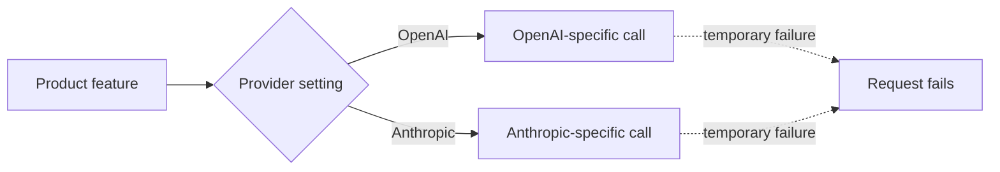
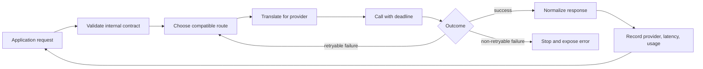

import Quiz from '@site/src/components/Quiz';
import {questions as ac8Questions} from '@site/src/data/quizzes/ac8';

# AI Gateways: Build the Boundary

> **Time:** 30 minutes. **Cost:** $0 with the default simulated OpenAI primary and Ollama fallback; a fraction of a cent if you choose a cloud fallback.

TaskFlow's fictional support assistant began as one feature with one model call. Like most labs in this course, it used Ollama by default, with OpenAI and Anthropic available as alternatives. For any one run, the `PROVIDER` setting selected exactly one backend. The application sent `messages` to that backend, read text from the response, and showed it to the customer. That was a good design for a prototype.

Then the feature became important. Customers used it during onboarding. Support linked to it from the help center. A failed model call was no longer a developer inconvenience. It was a failed product interaction.

The obvious response is, “Add another provider.” The hard question is not which provider to add. It is **where the application should decide what to do when any provider is slow, unavailable, misconfigured, or unable to perform the requested job**.

By the end of this chapter, you will build that decision boundary, use it to fail over on a temporary outage, and prove that it refuses to hide a non-retryable error.

## One model call grows roots

The same coupling appears whichever provider you select. To make it concrete, imagine that a production deployment chooses the lab's optional OpenAI path. Its direct SDK call looks self-contained:

```python
client = openai.OpenAI()
response = client.chat.completions.create(
    model="gpt-4o-mini",
    messages=messages,
)
answer = response.choices[0].message.content
```

But the surrounding application now knows several OpenAI-specific facts:

- where credentials come from;
- what the model is called;
- how messages and system instructions are represented;
- which exception means timeout, rate limit, bad authentication, or server failure;
- where text, token usage, request IDs, and tool calls live in the response.

Those are the roots of the integration. If the same code appears in a web route, a background worker, and an evaluation script, reliability policy becomes scattered too. One caller may retry a rate limit three times. Another may wait forever because it has no timeout. A third may catch every exception and accidentally conceal a bad API key.

Adding an `if/elif` can select another provider at startup, but selection is not failover:

```python
if PROVIDER == "openai":
    answer = call_openai(messages)
elif PROVIDER == "anthropic":
    answer = call_anthropic(messages)
```

Once this process starts, it still has one chosen path. If that path fails, nothing decides whether another path is safe.



## Create one application-owned boundary

The first architectural move is not buying a gateway. It is giving the application one internal call shape that it owns:

```python
answer, answered_by = generate(messages)
```

Everything behind `generate` can change without teaching the support widget a new SDK. Three separate responsibilities sit behind that boundary:

| Responsibility | Question it answers | Lab implementation |
|---|---|---|
| **Provider adapter** | How do I call this provider and translate its response or errors? | `call_provider` |
| **Routing policy** | Which compatible provider should receive this request next? | `call_with_failover` |
| **Operational controls** | How long may an attempt take, and what should be logged, limited, or measured? | timeout plus routing messages |

The boundary can begin as a module inside one application. An **AI gateway** puts that boundary on the request path, usually as a proxy shared by multiple features or services. It receives model requests, applies policy, calls one or more model backends, and returns a response in a known shape. A team can self-host that proxy or use a managed one.

This lab keeps the mechanism in one Python process so you can see every decision without deploying infrastructure. The same responsibilities remain when the boundary moves into a gateway service. Failover, authentication, spend controls, rate limits, caching, logging, and guardrails are common gateway policies. This chapter stays focused on the reliability path: adapters, failure classification, deadlines, and fallback routing.

:::tip[TL;DR]
💡 A gateway is useful because it gives provider-specific behavior and routing policy one owner. It does not make models interchangeable. A fallback is real only when it is compatible with the request, has time to answer, fails independently enough to help, and is exercised before an incident.
:::

## Follow one request through the gateway

The gateway does more than forward an HTTP request:



1. **Validate the request.** Determine whether this is plain text, structured output, vision, streaming, or a tool-using turn.
2. **Choose an eligible route.** Remove providers that cannot satisfy that contract before considering price or preference.
3. **Adapt the request.** Translate the internal message shape into the selected provider's API.
4. **Call within a deadline.** An attempt that can wait forever can consume the entire user-facing time budget.
5. **Classify the outcome.** Success returns. A retryable failure may take another route. A request or configuration error stops.
6. **Normalize and observe.** Return the application shape and record which route answered.

That separation matters. Translation answers “how do I call Anthropic?” Routing answers “should Anthropic receive this request now?” They should not be the same decision.

## The interface is a lowest common contract

The lab's request is deliberately portable: system text, user text, and a short text answer. OpenAI, Anthropic, and Ollama can all perform it.

Real applications often depend on more. Tool APIs have provider-specific request and response structures. Anthropic, for example, returns tool requests as [`tool_use` content blocks tied to later `tool_result` blocks](https://platform.claude.com/docs/en/agents-and-tools/tool-use/handle-tool-calls), while its [strict tool mode](https://platform.claude.com/docs/en/agents-and-tools/tool-use/strict-tool-use) validates inputs against a supported JSON Schema subset. Structured-output fields and supported schema features also vary by provider and model.

This makes a gateway abstraction **leaky**. It can normalize the common subset, but it cannot manufacture a capability the fallback lacks. Before a route becomes eligible, decide whether it matches the request's contract:

- required input types, such as images or audio;
- context and output limits;
- tool definitions and tool-result protocol;
- structured-output guarantees;
- streaming behavior;
- safety and moderation requirements;
- acceptable latency and cost;
- data residency, retention, and compliance rules.

If a request requires a feature unique to the primary, the honest fallback may be a controlled error or a reduced-function experience. Sending it to an incompatible model is not resilience. It is a different failure.

## Failure is a routing decision

OpenAI's [error guide](https://developers.openai.com/api/docs/guides/error-codes) and Anthropic's [API error guide](https://platform.claude.com/docs/en/api/errors) distinguish client, authentication, rate-limit, connection, and server failures. A gateway should preserve those distinctions.

| Outcome | Try another provider? | Reason |
|---|---|---|
| Connection fails before a response | Usually | Another independent endpoint may be reachable. |
| Attempt exceeds its deadline | Usually | The primary cannot answer within this request's budget. |
| Provider returns 500, 502, 503, or overload | Usually | The request may be valid while that provider is unhealthy. |
| Provider returns 429 | It depends | A provider-specific capacity or quota limit may be routable. Your own application limit should not be bypassed. |
| Authentication fails | No | Another route would hide a credential or deployment error. |
| Request is malformed | No | Repeating a broken request adds cost and latency without fixing it. |
| Context is too large | Only by explicit policy | Route only to a model known to accept that input and preserve required behavior. |
| Stream fails after text reached the user | Usually no transparent replay | A second answer can duplicate or contradict text already displayed. |
| Model already requested a side-effecting tool | Not automatically | Replaying the turn can lead to duplicate actions unless the workflow is designed for idempotency. |

The lab simplifies 429 responses into `RetryableProviderError`, which is reasonable for a provider-specific support-bot quota. In a larger system, the classifier needs more context. “Retryable” is a business policy expressed in code, not an eternal property of an HTTP status.

:::warning
Once a provider has started streaming visible text, failover is no longer invisible. You can stop with a clear error, restart the answer and tell the user, or design buffered output that is not released until safe. Silently splicing a second model's continuation onto the first model's text is not a sound default.
:::

## Give the fallback time to work

Imagine the support widget promises an answer within 12 seconds. If the primary's timeout is 30 seconds, the fallback exists on paper but can never meet the product promise.

A useful budget might reserve 5 seconds for the primary, 6 seconds for one fallback, and 1 second for gateway and network overhead. Those numbers are illustrative, not universal. The important part is that per-attempt deadlines come from an end-to-end budget.

Retries underneath the gateway can quietly consume that budget. The lab disables the OpenAI and Anthropic SDKs' internal retries with `max_retries=0`, then lets one visible layer own the next decision. A production policy may retry the same provider before failing over, but the total number of attempts and total time should be deliberate.

There is another ambiguity: a client timeout proves that the client stopped waiting, not necessarily that the provider did no work. OpenAI recommends [client-generated request IDs](https://developers.openai.com/api/docs/guides/error-codes#request-ids) partly because a timeout or network problem can prevent the client from receiving the provider's request ID, while support may still be able to determine whether the request arrived. Log one trace ID across every attempt so duplicated work, latency, and charges can be investigated.

## Hands-on lab: build and test the boundary

TaskFlow's support assistant needs to answer, “How do I export my tasks to CSV?” The lab uses a live fallback but injects deterministic faults before the primary touches the network.

Full setup: [`labs/advanced-concepts/08-ai-gateways`](https://github.com/fewshot-works/academy/tree/main/labs/advanced-concepts/08-ai-gateways)

The routing policy is intentionally small:

```python
def call_with_failover(messages, providers, provider_call=call_provider):
    last_error = None

    for provider in providers:
        try:
            reply = provider_call(provider, messages)
            return reply, provider
        except RetryableProviderError as error:
            print(f"  [gateway] {provider} failed ({error}), trying next provider")
            last_error = error

    raise RuntimeError(f"All providers failed. Last error: {last_error}")
```

Its narrow `except` is the central decision. The script runs three cases:

1. A direct call receives a simulated connection failure and has no fallback.
2. The gateway receives the same retryable failure and reaches live Ollama.
3. The gateway receives a simulated configuration error and deliberately does not call Ollama.

A fresh run produced:

```text
============================================================
PART ONE: no gateway, direct call to openai (simulated outage)
============================================================
  [fault injector] simulating outage for openai (connection refused)

Request failed: simulated outage: openai is not responding
No fallback exists here. The support widget shows an error until the provider recovers.

============================================================
PART TWO: with a gateway, openai -> ollama on failure
============================================================
  [fault injector] simulating outage for openai (connection refused)
  [gateway] openai failed (simulated outage: openai is not responding), trying next provider

(answered by: ollama)
To export your TaskFlow tasks to a CSV file, open the project, choose More actions, and then choose Export CSV.

============================================================
PART THREE: a non-retryable error stops immediately
============================================================
  [fault injector] simulating bad configuration for openai

Request stopped: simulated configuration error: invalid openai API key
Fallback was not called. Another provider cannot repair configuration.
```

The model's wording will vary. The meaningful evidence is the route: part two reaches Ollama, while part three stops before the fallback.

## What availability math does and does not prove

Suppose two providers each have 99.5% uptime and their failures are independent. One is unavailable about 44 hours per year. The probability that both are unavailable at the same moment is `0.005 × 0.005 = 0.000025`, which is about 13 minutes per year.

That hypothetical calculation describes only the provider path. It does not include:

- correlated failures caused by a shared cloud, network, identity service, or DNS dependency;
- the gateway's own availability;
- incompatible fallback requests;
- exhausted latency budgets;
- software defects in shared adapters or routing policy.

The formula is useful because it shows why independent redundancy can help. It is dangerous when presented as an uptime promise. Real availability must be measured at the product boundary: did the user receive a valid response within the promised time?

## Build, buy, or stay direct

Not every application needs a deployed gateway.

| Situation | Sensible starting point |
|---|---|
| Prototype, internal experiment, or low-impact feature | Call one provider directly, but keep the call behind one local function. |
| One application needs basic failover | Use an application-owned adapter and routing module like this lab. |
| Several services need the same credentials, limits, logs, and routing policy | Consider a shared self-hosted or managed gateway. |
| Workload depends heavily on one provider's unique tools or state | Keep the provider-specific path explicit; use graceful degradation instead of pretending it is portable. |
| Strict regional or compliance constraints | Make eligibility policy explicit before cost or availability routing. |

If a shared gateway is justified, the following product behavior was checked against vendor documentation on September 2, 2026. [LiteLLM](https://docs.litellm.ai/) provides a proxy and Python SDK with normalized formats and router fallbacks. [Portkey](https://portkey.ai/docs/product/ai-gateway/fallbacks) provides managed and self-hosted gateway options with configurable fallback status codes. [Kong AI Gateway](https://developer.konghq.com/ai-gateway/load-balancing/) extends an API gateway with model targets, timeouts, retry criteria, health behavior, and routing algorithms.

Those products can save engineering work, but none chooses your compatibility contract or error policy for you. Treat the product list as implementation options after the architecture is understood, not as the definition of an AI gateway.

## Checkpoint

<details>
<summary>Why is adding a second branch to a `PROVIDER` setting not the same as failover?</summary>

The setting chooses one provider before the request. Once that provider is selected, there is still no runtime policy that classifies a failure, checks whether another provider is compatible, and tries it within the remaining deadline. Selection gives the application alternatives. Failover decides when and how to use one during a request.
</details>

<details>
<summary>Why does part three stop instead of trying Ollama?</summary>

Its simulated error is a configuration problem, not a temporary provider outage. `call_with_failover` catches only `RetryableProviderError`, so `ValueError` leaves the gateway immediately. Trying Ollama could produce an answer, but it would also hide the broken primary configuration and spend time on a route that did not repair the actual defect.
</details>

<details>
<summary>A response starts streaming, displays half a sentence, and then disconnects. Why is normal failover unsafe?</summary>

The request already produced a user-visible effect. A fallback model has not generated the same hidden continuation and may answer differently from the beginning. Transparently appending its output can create a contradictory hybrid response, while restarting can duplicate text. The interface needs an explicit interruption or restart policy.
</details>

<details>
<summary>What does a gateway normalize, and what must remain explicit?</summary>

It can normalize an application-owned common contract, such as text messages in and text plus usage metadata out. Provider or model capabilities that do not fit that contract must remain explicit: tool protocols, schema guarantees, modalities, context limits, safety behavior, streaming semantics, and data restrictions. A gateway is a boundary, not proof that every backend is equivalent.
</details>

## Check Your Knowledge

<details>
<summary>Click to start quiz</summary>

<Quiz chapterId="ac8" questions={ac8Questions} />

</details>

## What's next

You started with a direct model call, separated provider translation from routing policy, and tested both sides of the error boundary. The next production step is not adding more providers. It is writing contract tests for the capabilities you depend on, setting an end-to-end latency budget, and exercising each failure path regularly.

The companion article, [Stop calling LLM APIs directly](/blog/stop-calling-llm-apis-directly), examines the same decision from an engineering-lead perspective: how to tell whether a fallback is operationally real or only present in configuration.
