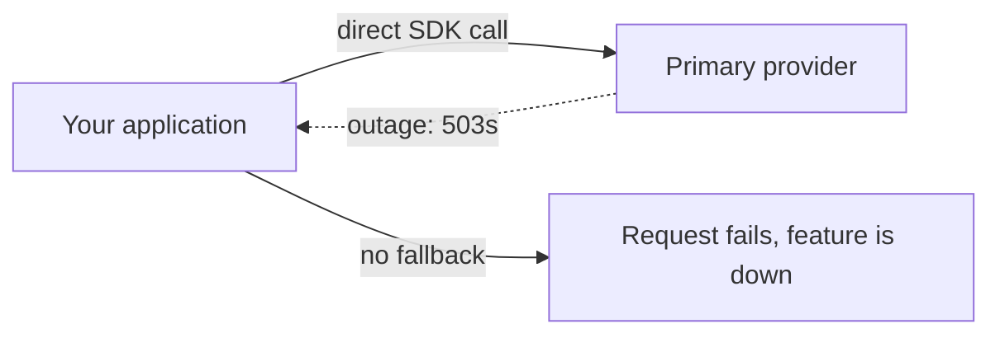
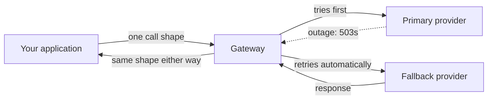

import Quiz from '@site/src/components/Quiz';
import {questions as ac8Questions} from '@site/src/data/quizzes/ac8';

# AI Gateways (Multi-Provider Failover)

> **Time:** 20 minutes. **Cost:** $0 with the default simulated OpenAI primary and Ollama fallback; a fraction of a cent if you choose a cloud fallback.

On June 2, 2026, Claude had a [major service incident affecting its API and Claude Code](https://www.thoughtworks.com/en-us/insights/blog/generative-ai/claude-outage-june-2026). From June 5 through June 16, its [status history](https://status.claude.com/history) recorded more disruptions. [Tech Times counted ten incidents across twelve days](https://www.techtimes.com/articles/318514/20260616/claude-outage-tenth-disruption-12-days-exposes-anthropic-infrastructure-strain.htm).

OpenAI's [status history](https://status.openai.com/history?page=2) then recorded separate incidents on each day from July 22 through July 25. The [July 25 incident](https://status.openai.com/incidents/x9p6qd31) affected API, ChatGPT, and Codex components. These were separate incidents with varying scope, not two uninterrupted week-long outages. For an application tied only to an affected service, however, any one of them could still become an application outage.

That's not a reason to panic about any one provider. It is a reason to notice that every lab so far in this course, including the `PROVIDER` pattern from [Chapter 6: Your First Agent](/docs/intermediate/your-first-agent), picks exactly one provider for each run. That is the right level of complexity while you're learning what an agent is. A production feature with a real availability target may need a fallback path too.

## A gateway is a thin layer, not a new framework

An **AI gateway** sits between your application code and every model provider it might call. Strip away the marketing, and it's doing a small number of concrete jobs:

1. **One interface, many providers.** Your code calls one shape; the gateway translates it for the providers it supports.
2. **Failover.** If the primary provider has a retryable failure, the gateway tries a compatible fallback inside the same request.
3. **Centralized keys and cost tracking.** Provider credentials live in one place, spend gets tracked in one place.
4. **Caching and rate limiting**, covered from the single-provider angle already in [Advanced Chapter 6: Production Concerns](/docs/advanced/production-concerns).

This chapter is about job #2. The earlier `PROVIDER` if/elif selects one provider but does not try another when that provider fails. This lab adds that missing behavior.





:::tip[TL;DR]
A gateway is a self-hosted or managed routing layer that gives your application one call shape across supported model providers. The lab builds its core in about ten lines: try the primary, catch a retryable failure, and try a compatible fallback.

For a hypothetical calculation, suppose two providers each have 99.5% uptime and fail independently. One is down about 44 hours a year. The combined path is down only when both are down together: `0.005 x 0.005 = 0.000025`, or about 13 minutes a year. Real failures can be correlated, and the gateway can fail too, so treat this as best-case arithmetic rather than an availability promise.
:::

## Hands-on lab: TaskFlow's support bot, on an outage day

[Token & Cost Management](/docs/advanced-concepts/token-cost-management)'s fictional TaskFlow app is back, and its support assistant needs to answer a customer question right now. This lab simulates a temporary provider outage: `PRIMARY_PROVIDER` always raises a retryable error before touching the network. **Part one** calls it directly, with no fallback. **Part two** wraps the identical call in a ten-line gateway function.

Full instructions: [`labs/advanced-concepts/08-ai-gateways`](https://github.com/fewshot-works/academy/tree/main/labs/advanced-concepts/08-ai-gateways)

The gateway itself, in full:

```python
def call_with_failover(messages, providers):
    last_error = None

    for provider in providers:
        try:
            reply = flaky_call_provider(provider, messages)
            return reply, provider
        except RetryableProviderError as error:
            print(f"  [gateway] {provider} failed ({error}), trying next provider")
            last_error = error

    raise RuntimeError(f"All providers failed. Last error: {last_error}")
```

`flaky_call_provider` is the fault injector: it always raises `RetryableProviderError` when asked for `PRIMARY_PROVIDER`, and calls through normally for anything else. That creates the control flow of a temporary outage without waiting for one. Only the fallback touches the network, so the default run does not require an OpenAI key. Here is a real run with OpenAI as the simulated primary and Ollama as the live fallback:

```
============================================================
PART ONE: no gateway, direct call to openai (simulated outage)
============================================================
  [fault injector] simulating outage for openai (connection refused)

Request failed: simulated outage: openai is not responding
No fallback exists here. The support widget shows an error until the provider recovers.

============================================================
PART TWO: with a gateway, openai -> ollama on failure
============================================================
  [fault injector] simulating outage for openai (connection refused)
  [gateway] openai failed (simulated outage: openai is not responding), trying next provider

(answered by: ollama)
To export your TaskFlow tasks to a CSV file, navigate to the "Reports" section of your TaskFlow dashboard and click on "Export", then select "CSV" as the file format. Follow the prompts to choose which columns you'd like to include in the exported file.
```

:::note
💡 Part one's failure is the point. `flaky_call_provider` raises before touching the network, similar to a provider returning a retryable 503. Part one has no fallback path, so the error reaches the caller. Part two catches the same simulated failure and tries Ollama before returning.
:::

## Fail over on purpose, not on every error

The ten-line loop is only the routing core. The lab's provider wrapper adds two production details around it:

- **A deadline for every attempt.** A provider can hang instead of returning an error. Without a timeout, the gateway may never reach its fallback.
- **A narrow retryable error.** Connection failures, timeouts, rate limits, and provider-side server errors become `RetryableProviderError`. Bad credentials, malformed requests, unknown provider names, and bugs in your own code stop immediately because another provider cannot repair them.

A fallback also has to support the request. A text-only support answer can move between the three backends in this lab. A request that depends on a particular context window, tool schema, structured-output mode, safety policy, or data region needs a fallback chosen for those requirements. A gateway gives you a place to encode that decision; it does not make every model interchangeable.

## The three worth knowing

Building the mechanism by hand is the lesson. For a production system, these three existing gateways are useful starting points. Product support and licensing below were checked against vendor documentation on September 2, 2026, so follow the links for current details:

| | [LiteLLM](https://github.com/BerriAI/litellm) | [Portkey](https://github.com/Portkey-AI/gateway) | [Kong AI Gateway](https://developer.konghq.com/ai-gateway/) |
|---|---|---|---|
| License | MIT (core), paid enterprise tier | MIT (gateway core), paid hosted tiers | Apache 2.0 (Kong Gateway core, including the basic AI Proxy plugin); multi-provider failover needs the paid [AI Proxy Advanced plugin](https://developer.konghq.com/plugins/ai-proxy-advanced/) |
| Deploy model | Self-hosted proxy (Docker, Helm, Terraform) or SDK | Managed service or open-source self-hosted gateway | Self-hosted Kong Gateway or managed Konnect deployment |
| Provider support | [100+ LLM providers](https://github.com/BerriAI/litellm) claimed | [Major hosted and custom providers](https://portkey.ai/docs/api-reference/inference-api/supported-providers); capabilities vary by API format | [OpenAI, Anthropic, Bedrock, Gemini, Azure, Mistral, and others](https://developer.konghq.com/ai-gateway/ai-providers/) through standardized request formats |
| Where it fits | Teams that want a self-hosted, open-source-first proxy with deep cost/spend tracking | Teams that want managed observability and guardrails without running infrastructure | Teams already running Kong for regular API traffic, now extending it to LLM and MCP traffic too |

All three apply the pattern this lab builds in miniature: one endpoint, multiple providers, and configurable fallback, with dashboards, spend tracking, and caching layered on top. What is free versus paid differs by vendor. A team already operating Kong for REST APIs can add basic LLM proxying through its existing gateway, but the multi-provider failover covered here requires Kong's paid AI Proxy Advanced plugin. LiteLLM offers open-source fallback routing for teams that want to run the proxy themselves. Portkey offers both a hosted service and an open-source gateway, with fallback available in the gateway.

:::info
💡 A gateway is itself a new dependency, not a way to remove one. Self-host LiteLLM or Kong, and you've added a service that needs to stay up, get patched, and get monitored, in exchange for provider-level outage protection. Use Portkey's hosted option, and you've swapped "my provider is down" risk for "my provider or my gateway vendor is down" risk, a smaller number, not zero. That's the same trade this course's [managed AI platforms](/blog/managed-ai-platforms-lock-in) post makes about cloud model gardens: moving a dependency isn't the same as removing it, even when it's a genuinely better trade.
:::

## Where this doesn't overlap with earlier chapters

Three chapters in this course sound adjacent to this one but answer different questions:

- **[Token & Cost Management](/docs/advanced-concepts/token-cost-management)**'s model right-sizing routes a request to a smaller or larger model *within* one provider, based on task difficulty. This chapter routes *across* providers, based on whether the primary one is answering at all.
- **[Advanced Chapter 6: Production Concerns](/docs/advanced/production-concerns)** covers caching and rate limiting for a single provider you've already committed to. A gateway typically does both of those too, layered on top of the failover this chapter covers.
- **[Managed AI platforms](/blog/managed-ai-platforms-lock-in)**, this course's earlier post on Bedrock, Azure OpenAI, and Vertex AI, put one cloud's identity and billing layer in front of a model catalog, with that cloud doing the routing behind the scenes. A gateway does its own routing, in your infrastructure or a vendor's dedicated one, across whichever raw provider APIs you choose. You can run a gateway in front of Bedrock, or instead of it.

## Checkpoint

<details>
<summary>Part one's direct call to the primary provider fails outright, with no fallback. Why doesn't the fault injector itself provide any resilience?</summary>

Because `flaky_call_provider` is only the simulated *failure*, not a fix for it. It always raises when asked for `PRIMARY_PROVIDER`, standing in for a real outage. Part one catches the error only to print the customer-facing failure; it never tries another provider. That is the situation the earlier `PROVIDER` if/elif has during an outage: correct code, but no configured retry path.
</details>

<details>
<summary>Why does `call_with_failover` catch only `RetryableProviderError` instead of every `Exception`?</summary>

Because another provider can route around a temporary connection failure, timeout, rate limit, or provider-side server error. It cannot repair a bad API key, malformed request, unknown provider name, or bug in your own code. `call_provider` translates only the temporary cases into `RetryableProviderError`, so the gateway retries failures it can plausibly route around and lets the rest surface for correction.
</details>

<details>
<summary>The lab's `.env.example` warns that setting `PRIMARY_PROVIDER` and `FALLBACK_PROVIDER` to the same value breaks the demo. Why, mechanically, does that happen?</summary>

`flaky_call_provider` simulates an outage for *whichever provider string matches `PRIMARY_PROVIDER`*, not for a specific position in the call order. If `FALLBACK_PROVIDER` holds that same string, the "fallback" attempt runs into the identical fault injector check and fails the same way the primary did. `call_with_failover` then runs out of providers to try and raises its own `RuntimeError`. It's not a bug in the gateway function, it's an accurate reflection of a real production mistake: pointing two configured "providers" at the same underlying backend gives you the appearance of redundancy with none of the substance.
</details>

<details>
<summary>The hypothetical failover math in the TL;DR assumes the two providers fail independently. Give one concrete reason two real providers might NOT fail independently.</summary>

Shared infrastructure underneath both. Two "different" providers can still depend on the same cloud region, upstream network, or DNS infrastructure. If that shared layer goes down, both providers can fail at the same time for the same root cause. The arithmetic also leaves out the gateway's own availability. Treat the roughly 13-minute annual result as a best case, not a guarantee.
</details>

## Check Your Knowledge

<details>
<summary>Click to start quiz</summary>

<Quiz chapterId="ac8" questions={ac8Questions} />

</details>

## What's next

This chapter's gateway is the smallest version of the idea: one function, one fallback, one fault. [LiteLLM](https://github.com/BerriAI/litellm), [Portkey](https://github.com/portkey-ai/gateway), and [Kong AI Gateway](https://github.com/Kong/kong) take the same core pattern and add spend tracking, caching, guardrails, and dashboards on top, worth a look once the mechanism itself makes sense. Come back to Advanced Concepts whenever another chapter title catches your eye, nothing here needs to be read in order.
