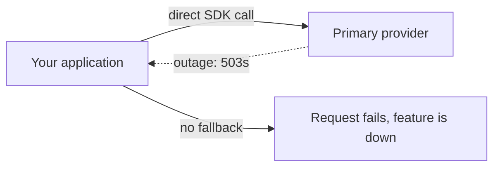
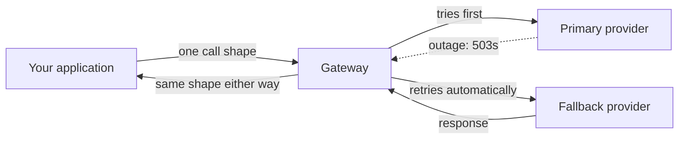

import Quiz from '@site/src/components/Quiz';
import {questions as ac8Questions} from '@site/src/data/quizzes/ac8';

# AI Gateways (Multi-Provider Failover)

> **Time:** 20 minutes. **Cost:** a fraction of a cent with OpenAI or Anthropic as the primary, $0 for the Ollama fallback.

Anthropic's Claude went dark for five and a half hours on June 2, 2026, taking Claude.ai, the API, Console, and Claude Code out together. Three days later, on June 5, a longer stretch began: ten separate service disruptions across the next twelve days, running through June 16. Seven weeks after that stretch began, OpenAI had its own rough stretch: four disruptions in four days between July 22 and July 25, with the July 25 incident knocking out ChatGPT, the API, and Codex at once. Every app calling one provider's SDK directly, with no fallback, was down both of those weeks too.

That's not a reason to panic about any one provider. It's a reason to notice that every lab so far in this course, including this course's own `PROVIDER` pattern from [Chapter 6: Your First Agent](/docs/intermediate/your-first-agent), picks exactly one provider and calls it directly. That's the right level of complexity while you're learning what an agent even is. It's the wrong level of complexity for anything you'd actually want to stay up during one of those weeks.

## A gateway is a thin layer, not a new framework

An **AI gateway** sits between your application code and every model provider it might call. Strip away the marketing, and it's doing a small number of concrete jobs:

1. **One interface, many providers.** Your code calls one shape; the gateway translates it to whatever OpenAI, Anthropic, or a local model actually expects.
2. **Failover.** If the primary provider errors out, the gateway retries against a fallback automatically, inside the same request.
3. **Centralized keys and cost tracking.** Provider credentials live in one place, spend gets tracked in one place.
4. **Caching and rate limiting**, covered from the single-provider angle already in [Advanced Chapter 6: Production Concerns](/docs/advanced/production-concerns).

This chapter is about job #2, because it's the one a raw `PROVIDER` if/elif can't do at all: if the one provider you picked is down, there's nothing left to fall back to.





:::tip[TL;DR]
A gateway is a routing function, self-hosted or managed, that gives you one call shape across every model provider, with automatic failover baked in. You can build the core of it in about ten lines: try the primary, catch the failure, retry the fallback. This chapter's lab does exactly that. Run the failover math on two providers each at 99.53% uptime with independent failures, and combined downtime drops from roughly 41 hours a year to about 12 minutes, the arithmetic is `0.0047 x 0.0047 ~= 0.000022`, real providers aren't perfectly independent so treat it as a best case, but it's the right order of magnitude for why this pattern caught on.
:::

## Hands-on lab: TaskFlow's support bot, on an outage day

[Token & Cost Management](/docs/advanced-concepts/token-cost-management)'s fictional TaskFlow app is back, and its support assistant needs to answer a customer question right now. This lab simulates today being one of those weeks: `PRIMARY_PROVIDER` always fails, the way a real provider does mid-outage. **Part one** calls it directly, no fallback. **Part two** wraps the identical call in a ten-line gateway function.

Full instructions: [`labs/advanced-concepts/08-ai-gateways`](https://github.com/fewshot-works/academy/tree/main/labs/advanced-concepts/08-ai-gateways)

The gateway itself, in full:

```python
def call_with_failover(messages, providers):
    last_error = None

    for provider in providers:
        try:
            reply = flaky_call_provider(provider, messages)
            return reply, provider
        except Exception as error:
            print(f"  [gateway] {provider} failed ({error}), trying next provider")
            last_error = error

    raise RuntimeError(f"All providers failed. Last error: {last_error}")
```

`flaky_call_provider` is the fault injector: it always fails when asked for `PRIMARY_PROVIDER`, and calls through normally for anything else, standing in for a real outage without needing to wait for one. A real run, primary provider OpenAI, fallback Ollama, captured fresh:

```
============================================================
PART ONE: no gateway, direct call to openai (today's outage)
============================================================
  [fault injector] simulating a openai outage (connection refused)

Request failed: simulated outage: openai is not responding
No fallback exists here. The support widget shows an error until the provider recovers.

============================================================
PART TWO: with a gateway, openai -> ollama on failure
============================================================
  [fault injector] simulating a openai outage (connection refused)
  [gateway] openai failed (simulated outage: openai is not responding), trying next provider

(answered by: ollama)
To export your TaskFlow tasks to a CSV file, you can navigate to the "Tasks" tab, click on the three dots next to the title of your task list and select "Export as CSV". Alternatively, you can also use the settings icon in the top right corner to access more options.
```

💡 Part one's failure isn't a bug in the lab, it's the point. `flaky_call_provider` raises before touching the network at all, the same as a real provider returning nothing but 503s. Nothing in part one's code path catches that, so it propagates straight to the customer-facing error. Part two hits the identical simulated failure, but `call_with_failover` catches it and moves on before ever returning control to the caller. The customer in part two never knows the primary was down.

## The three worth knowing

Building the mechanism by hand is the lesson. In production, most teams reach for an existing gateway rather than maintaining their own:

| | LiteLLM | Portkey | Kong AI Gateway |
|---|---|---|---|
| License | MIT (core), paid enterprise tier | MIT (gateway core), paid hosted tiers | Apache 2.0 (Kong Gateway core, including the basic AI Proxy plugin); multi-provider failover needs the paid AI Proxy Advanced plugin |
| Deploy model | Self-hosted proxy (Docker, Helm, Terraform) or SDK | Hosted-first, with an open-source self-hosted gateway too | Self-hosted, built on the existing Kong API gateway |
| Providers | 140+ providers, 2,600+ models claimed | 1,600+ models across ~40+ providers | Multi-LLM (OpenAI, Anthropic, Bedrock, Gemini, Azure, Mistral, and more) via a universal API |
| Where it fits | Teams that want a self-hosted, OSS-first proxy with deep cost/spend tracking | Teams that want managed observability and guardrails without running infrastructure | Teams already running Kong for regular API traffic, now extending it to LLM and MCP traffic too |

All three do the core job this chapter's lab does in miniature, one endpoint, many providers, automatic fallback, at production scale with dashboards, spend tracking, and caching layered on top, though what's free versus paid differs by vendor. The real decision is less "which gateway is best" and more "which one fits infrastructure you already run." A team already operating Kong for its REST APIs gets basic LLM routing nearly for free by turning on a plugin, though the multi-provider failover this chapter covers specifically needs Kong's paid AI Proxy Advanced plugin. A team with no gateway at all and a preference for open source typically reaches for [LiteLLM](https://github.com/BerriAI/litellm) (57k+ GitHub stars, used by Stripe and Google ADK) first, its fallback routing is free and open source. [Portkey](https://github.com/portkey-ai/gateway) is the fastest path if you'd rather not run the proxy yourself, and its open-source gateway includes fallback routing too.

:::info
💡 A gateway is itself a new dependency, not a way to remove one. Self-host LiteLLM or Kong, and you've added a service that needs to stay up, get patched, and get monitored, in exchange for provider-level outage protection. Use Portkey's hosted option, and you've swapped "my provider is down" risk for "my provider or my gateway vendor is down" risk, a smaller number, not zero. That's the same trade this course's [managed AI platforms](/blog/managed-ai-platforms-lock-in) post makes about cloud model gardens: moving a dependency isn't the same as removing it, even when it's a genuinely better trade.
:::

## Where this doesn't overlap with earlier chapters

Three chapters in this course sound adjacent to this one but answer different questions:

- **[Token & Cost Management](/docs/advanced-concepts/token-cost-management)**'s model right-sizing routes a request to a smaller or larger model *within* one provider, based on task difficulty. This chapter routes *across* providers, based on whether the primary one is answering at all.
- **[Advanced Chapter 6: Production Concerns](/docs/advanced/production-concerns)** covers caching and rate limiting for a single provider you've already committed to. A gateway typically does both of those too, layered on top of the failover this chapter covers.
- **[Managed AI platforms](/blog/managed-ai-platforms-lock-in)**, this course's earlier post on Bedrock, Azure OpenAI, and Vertex AI, put one cloud's identity and billing layer in front of a model catalog, with that cloud doing the routing behind the scenes. A gateway does its own routing, in your infrastructure or a vendor's dedicated one, across whichever raw provider APIs you choose. You can run a gateway in front of Bedrock, or instead of it.

## Checkpoint

<details>
<summary>Part one's direct call to the primary provider fails outright, with no fallback. Why doesn't the fault injector itself provide any resilience?</summary>

Because `flaky_call_provider` is only the simulated *failure*, not a fix for it. It always raises when asked for `PRIMARY_PROVIDER`, standing in for a real outage. Part one calls it directly and does nothing with the exception except let it propagate to the caller. There's no code anywhere in part one's path that catches the failure and tries something else, which is exactly the situation a raw `PROVIDER` if/elif call is in during a real outage: correct code, zero redundancy.
</details>

<details>
<summary>`call_with_failover` catches `Exception` broadly rather than a specific error type. Chaos Engineering's guard, by contrast, checked the shape of a tool's response instead of catching an exception. Why does this chapter's gateway use the broader catch?</summary>

Because the two chapters are guarding against different fault types. [Chaos Engineering](/docs/advanced-concepts/chaos-engineering)'s value fault returns *something*, a truncated but real-looking string, so there's no exception to catch, only a suspicious shape to check. A provider outage is closer to a crash fault: the call fails loudly, as a `ConnectionError`, a timeout, or an API error, all of which are exceptions. Catching broadly here is deliberate: a gateway's job is to keep serving a response regardless of *which* way the primary provider failed, not to diagnose the specific failure mode before deciding whether to fall back.
</details>

<details>
<summary>The lab's `.env.example` warns that setting `PRIMARY_PROVIDER` and `FALLBACK_PROVIDER` to the same value breaks the demo. Why, mechanically, does that happen?</summary>

`flaky_call_provider` simulates an outage for *whichever provider string matches `PRIMARY_PROVIDER`*, not for a specific position in the call order. If `FALLBACK_PROVIDER` holds that same string, the "fallback" attempt runs into the identical fault injector check and fails the same way the primary did. `call_with_failover` then runs out of providers to try and raises its own `RuntimeError`. It's not a bug in the gateway function, it's an accurate reflection of a real production mistake: pointing two configured "providers" at the same underlying backend gives you the appearance of redundancy with none of the substance.
</details>

<details>
<summary>The failover math in the TL;DR assumes the two providers fail independently. Give one concrete reason two real providers might NOT fail independently.</summary>

Shared infrastructure underneath both. Two "different" providers can still depend on the same cloud region, the same upstream network provider, the same DNS infrastructure, or even the same underlying compute vendor. If that shared layer goes down, both providers can fail at the same time for the same root cause, which is exactly the correlated failure the independence assumption ignores. The chapter calls this out directly: treat the 12-minutes-a-year figure as a best case, not a guarantee, for that reason.
</details>

## Check Your Knowledge

<details>
<summary>Click to start quiz</summary>

<Quiz chapterId="ac8" questions={ac8Questions} />

</details>

## What's next

This chapter's gateway is the smallest version of the idea: one function, one fallback, one fault. [LiteLLM](https://github.com/BerriAI/litellm), [Portkey](https://github.com/portkey-ai/gateway), and [Kong AI Gateway](https://github.com/Kong/kong) take the same core pattern and add spend tracking, caching, guardrails, and dashboards on top, worth a look once the mechanism itself makes sense. Come back to Advanced Concepts whenever another chapter title catches your eye, nothing here needs to be read in order.
