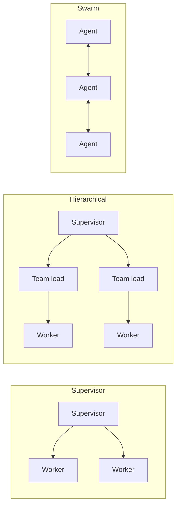
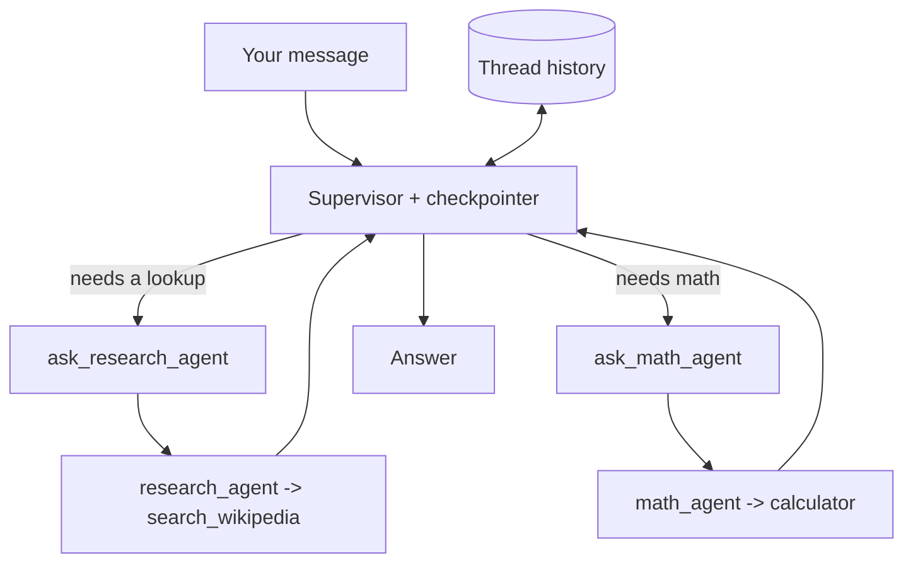

import Quiz from '@site/src/components/Quiz';
import {questions as adv1Questions} from '@site/src/data/quizzes/adv1';

# Chapter 1: Multi-Agent Patterns

> **Time:** 30 minutes. **Cost:** $0 with Ollama, a few cents with OpenAI or Anthropic.

Picture a newsroom with exactly one reporter who does everything: chases every lead, does the on-the-ground research, crunches every number in a story, writes every draft, and fact-checks their own work before it ships. That's every agent you've built so far in this curriculum, Intermediate's capstone included. It has three tools, but it's still one generalist deciding, alone, whether to look something up, do the math, or check its own notes.

Real newsrooms don't stay that way past a certain size. An editor assigns stories to reporters who specialize, one covers city hall, one covers sports, one crunches data, and the editor decides what to do with what comes back. That's a multi-agent system: instead of one model juggling every tool itself, you split the work across several agents, each responsible for less, and something coordinates between them.

## Three ways to split the work

**Supervisor** — one coordinating agent delegates to specialist agents and decides what to do with what comes back, same as an editor assigning stories and deciding what makes the final cut. It's the simplest topology: every request passes through one place, which makes it easy to reason about and debug, at the cost of that one supervisor being a bottleneck.

**Hierarchical** — supervisors of supervisors. A senior editor oversees section editors (news, sports, business), each of whom oversees their own reporters. This scales to far more specialists than one supervisor can reasonably juggle, at the cost of more hops, and more latency, between a request coming in and an answer going out.

**Swarm** — agents hand off directly to whichever peer is best suited next, without routing back through a central coordinator every time, like a relay race passing a baton. Handoffs are faster since there's no coordinator round-trip, but it's harder to reason about who's "in charge" at any given moment, and easier for control to bounce between agents in ways nobody explicitly designed.

| Pattern | Best for | Trade-off |
|---|---|---|
| Supervisor | A handful of specialists, one clear coordinator | Bottleneck: everything passes through one place |
| Hierarchical | Many specialists, naturally grouped into teams | More hops, more latency, more upfront design |
| Swarm | Fast handoffs between peers that trust each other | Hard to trace who's in control at any moment |



This chapter's lab builds a supervisor, the simplest of the three and the one you'll actually reach for most often. Hierarchical and swarm are the same idea taken further: hierarchical nests supervisors inside supervisors once one coordinator has too many specialists to manage directly; swarm removes the coordinator entirely once round-tripping through it costs more than it's worth.

## Hands-on lab: a supervisor delegating to two specialists

The two tools from Chapters 5, 6, 7, and 9, `calculator` and `search_wikipedia`, are unchanged here. What's different is that instead of handing both to one agent, each tool gets its own small agent: a `research_agent` with only `search_wikipedia`, and a `math_agent` with only `calculator`. A third agent, the supervisor, has no tools of its own except the other two agents, wrapped as tools it can call. This is the "agent-as-tool" pattern, LangChain's own docs now recommend building a supervisor this way directly rather than reaching for a separate framework, so nothing new is being installed here beyond what Chapters 6, 7, and 9 already used.

```python
research_agent = create_agent(model=model, tools=[search_wikipedia])
math_agent = create_agent(model=model, tools=[calculator])

@tool
def ask_research_agent(topic: str) -> str:
    """Delegate a lookup to the research specialist..."""
    result = research_agent.invoke({"messages": [{"role": "user", "content": topic}]})
    return result["messages"][-1].content

@tool
def ask_math_agent(expression: str) -> str:
    """Delegate a calculation to the math specialist..."""
    result = math_agent.invoke({"messages": [{"role": "user", "content": expression}]})
    return result["messages"][-1].content

supervisor = create_agent(model=model, tools=[ask_research_agent, ask_math_agent], checkpointer=InMemorySaver())
```

The checkpointer is Chapter 7's, unchanged. It's what makes the lab's third question tractable: instead of expecting the supervisor to research a number and do math on it in one single-shot reasoning chain, the lab asks two separate questions across one conversation, and lets memory carry the answer from one to the other, the same trick Chapter 9's capstone used across tool calls.



Full instructions: [`labs/advanced/01-multi-agent-patterns`](https://github.com/fewshot-works/academy/tree/main/labs/advanced/01-multi-agent-patterns)

Here's a real run, with Ollama:

```
You: What year did construction of the Eiffel Tower finish?
  supervisor -> calling ask_research_agent({'expression': 'null', 'object': 'null', 'topic': {'type': 'string'}})
Supervisor: The construction of the Eiffel Tower finished in 1889. It was built for the World's Fair, held in Paris that year, and was officially opened on March 31, 1889.

You: What's 18 * 7 + 4?
  supervisor -> calling ask_math_agent({'expression': '18 * 7 + 4'})
Supervisor: The result of the calculation 18 * 7 + 4 is 130.

You: What's 15% of the year the Eiffel Tower finished construction?
  supervisor -> calling ask_math_agent({'expression': '0.15 * 1889'})
Supervisor: 15% of the year the Eiffel Tower finished construction (which was 1889) is approximately 283.35.
```

Every answer here is right, but look closely at that first tool call: the arguments the supervisor sent are a mess, an extra `expression` and `object` field that don't belong, and `topic` wrapped in a type descriptor instead of the plain string `"Eiffel Tower construction finish year"` you'd expect. That's not a bug in the lab, it's `llama3.2` (a 3-billion-parameter model) visibly struggling with the harder part of this pattern: filling in a tool's arguments gets noticeably less reliable once that tool's job is "hand this off to another agent" instead of "run this one calculation." The math delegation, by contrast, is clean every time, because an arithmetic expression is a much narrower thing to get right than an open-ended topic string. Run the lab a few times yourself and you'll see the research call's argument shape change each time, while the final answer stays correct, `research_agent` and the underlying Wikipedia search are doing real work underneath the noise. Larger hosted models make this specific rough edge mostly disappear; it's a genuine, reproducible cost of asking a small local model to coordinate other agents instead of just calling a tool directly.

The third answer is the one worth pausing on: nothing in that message re-asked what year the tower finished. The supervisor pulled `1889` straight out of thread history, the same checkpointer mechanism from Chapter 7, and hands only the derived expression, `0.15 * 1889`, to the math agent. Delegation and memory are doing two different jobs here, and both have to work for that answer to come out right.

## Checkpoint

<details>
<summary>Chapter 9's agent had three tools it chose between directly. This chapter's supervisor also has two "tools", but each one is actually a whole other agent. What's different about deciding to call one of these versus deciding to call `calculator` directly?</summary>

Calling `calculator` directly means filling in one narrow argument, an arithmetic expression, that the tool evaluates immediately. Calling `ask_research_agent` means filling in an open-ended argument, then trusting an entire separate agent, with its own reasoning loop and its own tool, to do something useful with it. There's a whole extra layer of delegation and a whole extra chance for something to go sideways, which is exactly what shows up as messier arguments in the lab's real output.
</details>

<details>
<summary>Why does the lab ask its third question as a separate turn ("What's 15% of the year...") instead of one combined question ("What year did it finish, and what's 15% of that?")?</summary>

A combined question would require the supervisor to look something up and do math on it inside a single reasoning chain, in one turn, which is a much harder coordination problem for a small model than researchers give it credit for. Splitting it into two turns and leaning on the checkpointer's memory, the same mechanism Chapter 7 introduced, turns one hard problem into two easy ones.
</details>

<details>
<summary>Would a swarm pattern make sense for this lab's two-specialist setup? Why or why not?</summary>

Not really. Swarm earns its keep when peer agents hand off to each other fast enough, and often enough, that routing every request through a central coordinator becomes real overhead. With exactly two specialists and no direct reason for `research_agent` to ever talk to `math_agent`, there's no handoff chain to speed up, a supervisor is already the simplest thing that works.
</details>

## Check Your Knowledge

<details>
<summary>Click to start quiz</summary>

<Quiz chapterId="adv1" questions={adv1Questions} />

</details>

## What's next

The supervisor in this chapter trusted whatever `search_wikipedia` handed back the first time. Chapter 2 stops trusting the first result: query rewriting, HyDE, and a retrieval loop that checks its own answer and tries again before giving up.
