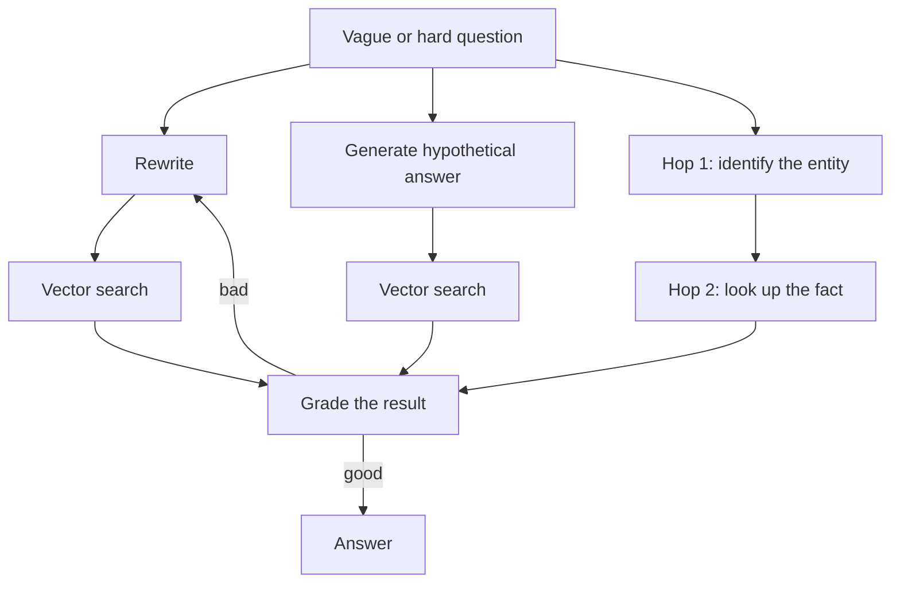

import Quiz from '@site/src/components/Quiz';
import {questions as adv2Questions} from '@site/src/data/quizzes/adv2';

# Chapter 2: Advanced RAG

> **Time:** 25 minutes. **Cost:** $0 with Ollama, a few cents with OpenAI.

Intermediate Chapter 3 showed you that vector search alone gets the wrong chunk more often than you'd think, and fixed it with three techniques applied *after* the question was already embedded: metadata filtering, hybrid search, re-ranking. This chapter goes one step earlier: what if the question itself, or the single retrieval attempt, is the problem? A doctor doesn't just search their memory once for "patient's symptoms" and stop, they ask a clarifying question, consider what a textbook answer would sound like, chase one finding to the next, and double-check a diagnosis before committing to it. Retrieval can do the same four things.

## Four techniques, four different fixes

**Query rewriting** turns a vague, informal question into a clear, specific one before it's ever embedded, closer to how a librarian turns "that book about the guy who lost his memory" into an actual title and author search.

**HyDE** (Hypothetical Document Embeddings) flips the usual order: instead of embedding the question, it asks the model to sketch a plausible-sounding *answer* first, then embeds that instead. Answer-shaped text often lands closer to real answer documents in vector space than question-shaped text does, since your documents are themselves answers, not questions.

**Multi-hop retrieval** chains two or more retrievals together when a question genuinely can't be answered by one lookup: first find *which* thing the question is about, then look up the actual fact about that thing.

**Self-correcting RAG** doesn't trust whatever came back on the first try. It grades the retrieved result against the question and, if the grade is bad, rewrites the query and retries, bounded to a small number of attempts.



None of these techniques are a strictly-better replacement for what Chapter 3 already covered, they solve *different* failure modes, and it matters which one you reach for.

## Hands-on lab: four techniques, the same tricky corpus

This lab reuses the exact twelve-fact corpus from [Intermediate Chapter 3](../intermediate/03-better-retrieval.md): Fernwood Coffee Co., Harbor Bean Roasters, and Whistlepost Coffee, written to sound similar on purpose. Each of the four sections below runs one technique against a question chosen to expose a specific limitation.

Full instructions: [`labs/advanced/02-advanced-rag`](https://github.com/fewshot-works/academy/tree/main/labs/advanced/02-advanced-rag)

Here's a real run, with Ollama:

```
A. Query rewriting
  Original question: wheres harbor bean get its beans
  Retrieved on the original question: [Fernwood] Fernwood Coffee Co. sources its coffee beans from three small farms, one in Ethi...
  Rewritten query: "Sourcing and origin of beans for Harbor Beans"
  Retrieved on the rewritten query:   [Fernwood] Fernwood Coffee Co. sources its coffee beans from three small farms, one in Ethi...

B. HyDE
  Question: Which shop's beans travel through the fewest middlemen before reaching the shop?
  Retrieved on the question directly: [Harbor Bean] Harbor Bean Roasters buys its beans through a single import broker rather than d...
  Hypothetical answer: Our company uses a direct-to-consumer distribution model for our specialty coffee beans, allowing them to bypass traditional wholesalers and retailers and reach customers at every touchpoint along the supply chain.
  Retrieved on the hypothetical answer: [Fernwood] Fernwood Coffee Co. sources its coffee beans from three small farms, one in Ethi...

C. Multi-hop retrieval
  Question: Does the coffee shop that opened inside a converted railway signal box have a loyalty program?
  Hop 1 (identify the company): [Whistlepost] Whistlepost Coffee has a single flagship location inside a converted railway sig...
  Hop 2 (look up Whistlepost's loyalty program): [Whistlepost] Whistlepost Coffee doesn't run a loyalty program at all, choosing instead to kee...

D. Self-correcting retrieval
  Question: How many purchases before Fernwood gives you a free drink?
  Attempt 1, retrieved: [Harbor Bean] Harbor Bean Roasters' loyalty program gives customers a free drink after every e...
    Grade: NO
    Retrying with: How many purchases before Fernwood gives you a free drink?
  Attempt 2, retrieved: [Harbor Bean] Harbor Bean Roasters' loyalty program gives customers a free drink after every e...
    Grade: NO
  Final answer: [Harbor Bean] Harbor Bean Roasters' loyalty program gives customers a free drink after every eight purchases, tracked through an app rather than a physical card.
```

This is the real output, not a cleaned-up version, and it's worth reading closely, because only two of the four sections actually fix anything.

**A (query rewriting) doesn't fix it.** Even asking about "Harbor Bean" by name, both the original vague question and the rewritten, clearer version retrieve Fernwood's sourcing fact instead. This is the same embedding bias Chapter 3 found on the loyalty facts, just showing up on a different topic (sourcing) with the roles flipped, here it's Fernwood's fact that keeps outranking the correct company's. Rewriting fixes *how clearly a question is phrased*. It doesn't touch an embedding model's baked-in preference for one document's wording over another's, that's a different problem, and it's exactly what Chapter 3's hybrid search and re-ranking exist to fix.

**B (HyDE) works.** The direct question retrieves Harbor Bean's fact, wrong, since that fact actually describes a single import broker, more middlemen, not fewer. Generating a hypothetical answer first ("Our company uses a direct-to-consumer distribution model... bypass traditional wholesalers") and embedding *that* instead lands correctly on Fernwood, whose real fact is about sourcing directly from farms with no broker at all. The hypothetical sentence never had to be factually correct, it only had to be shaped like a real answer, and that shape is what got it close to the right document.

**C (multi-hop) works cleanly.** Hop 1 correctly identifies Whistlepost from the "converted railway signal box" phrase, unique to that one document. Hop 2, scoped to Whistlepost specifically, correctly finds the loyalty fact, which by itself shares no vocabulary at all with "railway signal box." Neither hop alone could answer the question; chained together, they do.

**D (self-correcting retrieval) catches the problem but can't fix it.** The grader correctly says "NO" both times, the retrieved fact really doesn't answer the question. But look at the retry: the rewritten query it generated is *identical* to the original question, so the second attempt retrieves the exact same wrong fact. Self-correction is only as good as its two moving parts, grading and rewriting, and here the rewrite step quietly failed to do anything, so the loop ran out of retries and honestly reported the wrong answer rather than pretending otherwise.

The throughline: rewriting and self-correction both stayed inside pure vector search, and pure vector search on this corpus has a real bias problem, no amount of clearer phrasing changes that. HyDE and multi-hop didn't fix the bias either, they sidestepped it, one by changing what gets embedded, the other by not relying on a single embedding comparison at all.

## Checkpoint

<details>
<summary>Query rewriting and HyDE both change something about the query before it's embedded. What's the actual difference in what each one changes?</summary>

Query rewriting keeps the query in question form, it just makes the *wording* clearer or more specific. HyDE replaces the question with something shaped like an *answer* instead, a guess at what the real answer document might say, on the theory that answer-shaped text embeds closer to other answer-shaped text than question-shaped text does.
</details>

<details>
<summary>In the lab's real run, why did self-correcting retrieval fail to fix Approach D's wrong answer, even though the grader correctly flagged it as wrong twice?</summary>

Self-correction has two parts that both have to work: grading (did this retrieval get it right?) and rewriting (produce a better query to try next). The grader worked, it said "NO" both times. The rewriter didn't, it returned the exact same question unchanged on the retry, so the second attempt was really just running the first attempt again. A loop is only as strong as its weakest step.
</details>

<details>
<summary>Multi-hop retrieval succeeded where query rewriting and self-correction (using plain vector search) both failed. Why doesn't multi-hop run into the same embedding-bias wall?</summary>

Query rewriting and self-correction both still boil down to one vector comparison between a (possibly improved) query and the whole corpus, and if the embedding model has a baked-in preference for one document's wording, a better-phrased query doesn't remove that preference. Multi-hop sidesteps the problem differently: hop 1 only has to identify a company from a distinctive phrase, and hop 2 searches a much smaller, already-filtered set of documents, so there's no single comparison where the bias gets a chance to dominate.
</details>

## Check Your Knowledge

<details>
<summary>Click to start quiz</summary>

<Quiz chapterId="adv2" questions={adv2Questions} />

</details>

## What's next

Every technique so far, hybrid search, re-ranking, rewriting, HyDE, multi-hop, self-correction, has been about getting the *right facts* in front of a model that already knows how to talk. Chapter 3 asks a different question: what if the model needs to change how it talks, not just what it's given? You'll compare prompting, RAG, and a real, tiny, actually-trained fine-tune, and see for yourself when each one earns its cost.
