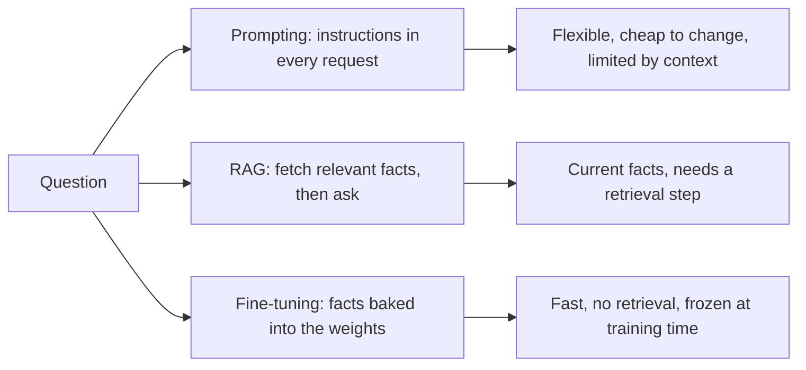

import Quiz from '@site/src/components/Quiz';
import {questions as adv3Questions} from '@site/src/data/quizzes/adv3';

# Chapter 3: Fine-tuning vs. RAG vs. Prompting

> **Time:** 25 minutes. **Cost:** $0, this chapter runs entirely offline on your own CPU.

Think about how you'd teach someone at work a new process. If it only comes up once in a while, you'd hand them a reference sheet to check, that's prompting: give the model instructions and let it read them each time. If the information changes often or there's a lot of it, you'd point them to a shared drive they can search, that's RAG: keep the facts external and fetch what's relevant per question. But if it's something they need to do constantly, fast, without stopping to look anything up, you'd actually train them until it's second nature. That's fine-tuning: instead of handing the model facts at request time, you adjust the model itself so the behavior is baked in.

All three approaches have shown up already in this curriculum, prompting since Foundations, RAG since Intermediate. This chapter adds the third option and, more importantly, gives you a real, hands-on feel for what "baked in" actually costs you.

## Three ways to change what a model does

**Prompting** changes nothing about the model. You give it instructions, maybe examples, in the prompt, every single request. Cheapest to start, most flexible, and completely disposable, change your mind, change the prompt. Its ceiling is what fits in a context window and what the model can follow from instructions alone.

**RAG** keeps facts external and fetches what's relevant before answering. Chapters 2 and 3 of Intermediate, and Chapter 2 of this track, are all forms of this. Facts stay current because they live outside the model, you update a document, the next query sees it. The cost is a retrieval step on every request, and answer quality depends on retrieval quality, which you've now seen fail in several specific ways.

**Fine-tuning** changes the model's weights so a behavior or a set of facts becomes part of how it responds, no retrieval step, no instructions to re-send every time. That's also its weakness: whatever it learned is frozen the moment training stops. A fact that changes tomorrow doesn't update itself, you'd need to fine-tune again.



None of these replace each other. Production systems often use two together, a fine-tuned model that's *also* given RAG context, fine-tuning for how to respond, RAG for what's currently true.

## When fine-tuning actually earns its cost

Reach for fine-tuning when:

- The model needs to reliably do something prompting can't teach it well, a specific output format, a narrow skill, a style, not just "know a fact."
- The facts or behavior are stable, they're not going to change next week.
- You're sending the same lengthy instructions on every request and it's adding up in latency or token cost.

Reach for RAG or prompting instead when the underlying facts change often (RAG), or you're still iterating on what you even want the model to do (prompting, it's disposable). Fine-tuning is the most expensive of the three to get wrong, wrong training data means retraining, not editing a prompt.

## Hands-on lab: a real, tiny LoRA fine-tune

This lab is different from every other one in the curriculum: it trains a model. It's still small, `distilgpt2` is an 82-million-parameter model, LoRA (Low-Rank Adaptation) only trains a tiny sliver of that, 147,456 of its 82 million parameters here, and the whole thing runs in a few seconds on a laptop CPU. No GPU, no API key, no `.env` file.

The lab trains on twelve facts about Fernwood Coffee Co., Harbor Bean Roasters, and Whistlepost Coffee, the same fictional coffee shops from Chapters 2 and 3 of Intermediate, then asks two questions, run three ways each, to isolate what each approach actually contributes:

- **A**: the base model, no context, no fine-tune, what it knows on its own
- **B**: the base model with a relevant fact handed to it as context, what RAG would give it
- **C**: the LoRA fine-tuned model, no context, what got baked into the weights

Full instructions: [`labs/advanced/03-fine-tuning-vs-rag-vs-prompting`](https://github.com/fewshot-works/academy/tree/main/labs/advanced/03-fine-tuning-vs-rag-vs-prompting)

Here's a real run:

```
=== Question from the training set ===
Q: How many purchases before Fernwood Coffee Co. gives you a free drink?

A. Base model, no context, no fine-tune:
  No.
B. Base model + retrieved context (what RAG hands it):
  The number of purchases before Fernwood Coffee Co. gives you a free drink after every ten purchases.
C. LoRA fine-tuned model, no context:
  Ten purchases.

=== Question about a fact that changed after fine-tuning ===
Q: How many locations does Fernwood Coffee Co. have now?

A. Base model, no context, no fine-tune:
  The number of locations is growing. We have a lot of locations in the area. We have a lot of locations in the
B. Base model + retrieved context (what RAG hands it):
  The number of locations is growing. We have a lot of locations in the state, and we have a lot of locations in
C. LoRA fine-tuned model, no context:
  Three locations, all in the same state.
```

This is the real, unedited output, and both questions matter for a different reason.

**Question 1 asks about something the fine-tune was trained on.** The base model has no idea ("No."). Handing it context works (B), the answer's a little clunky, it's stitching a sentence into an answer rather than stating a fact it knows, but it's correct. The fine-tuned model (C) just answers, "Ten purchases.", memorized, clean, no context needed. On a trained fact, fine-tuning wins on both correctness and how little work the request has to do.

**Question 2 asks about a fact that changed after training finished.** The lab tells the context-based approach (B) about a new fourth location, a coffee truck, that didn't exist when the fine-tune trained. The fine-tuned model (C) confidently answers "Three locations, all in the same state.", the exact fact it memorized during training, now stale. It has no way to know anything changed, its knowledge is frozen at the moment training stopped. The base model with fresh context (B) is the only one of the three whose answer actually shifts when you tell it something new ("locations is growing"), `distilgpt2` is small and the wording is rough, but it's reacting to new information at all, which the fine-tuned model structurally cannot do without retraining.

That's the whole lesson in one table: fine-tuning trades currency for speed and reliability on what it knows. RAG trades a retrieval step for staying current. Neither is strictly better, they fail in opposite directions.

### Bonus: fine-tuning-lite with an Ollama Modelfile

The lab folder also has a `Modelfile`, a second, much lighter way to get "baked in" facts without training anything. It saves a system prompt full of facts as a reusable named model:

```bash
ollama create fernwood-bot -f Modelfile
ollama run fernwood-bot "How many purchases before I get a free drink?"
```

This is **not fine-tuning**, no weights change, the facts live in the prompt and get re-sent on every request under the hood. But it's zero-infrastructure, ready in seconds, and for a lot of real use cases, a support bot that only needs today's policies, it's genuinely good enough. Treat it as the low-effort end of the same spectrum: prompting with less retyping, not a substitute for either RAG or a real fine-tune.

## Checkpoint

<details>
<summary>The lab's LoRA fine-tune correctly answered "Ten purchases." for a question it was trained on, but confidently answered "Three locations" for a location count that had actually changed to four. Why does the same fine-tuned model succeed on one and fail on the other?</summary>

Fine-tuning bakes facts into the model's weights at training time. "Ten purchases" was in the training data, so the model reproduces it correctly, no retrieval needed. "Three locations" was also in the training data, but the *real* fact changed afterward. The fine-tuned model has no mechanism to know that, its knowledge is frozen the moment training stops. It isn't failing to reason, it's correctly recalling something that's now out of date.
</details>

<details>
<summary>In the lab, why did approach B's (base model + context) answer to the location question actually shift when the injected context changed, while approach C's (fine-tuned model) answer never moved?</summary>

B's facts live outside the model, in the context you hand it at request time, so changing the context changes what the model has to work with, even if a small model's use of that context is rough. C's facts are compiled into the model's weights during training. There's no request-time input that can override or update them, the only way to change what a fine-tuned model "knows" is to fine-tune it again.
</details>

<details>
<summary>The chapter's bonus Ollama Modelfile approach also feels like "baked-in" facts, an assistant that already knows things without you re-explaining them every time. Why isn't it actually fine-tuning?</summary>

A Modelfile saves a system prompt, not trained weights. The facts still get sent to the model as text on every single request, they're just saved so you don't have to retype them. Nothing about the model's parameters changed. It buys convenience (a ready-to-go named model) without paying for a training run, but it doesn't get you the speed or true "knowing" that a real fine-tune does, and it doesn't scale to a large fact set the way RAG does.
</details>

## Check Your Knowledge

<details>
<summary>Click to start quiz</summary>

<Quiz chapterId="adv3" questions={adv3Questions} />

</details>

## What's next

Every approach so far, RAG, self-correction, now fine-tuning, has been about getting the model's *answers* right. Chapter 4 asks a different question: what happens when the input trying to reach your model isn't a good-faith question at all? You'll build a guardrail layer that checks what goes in and what comes back out.
