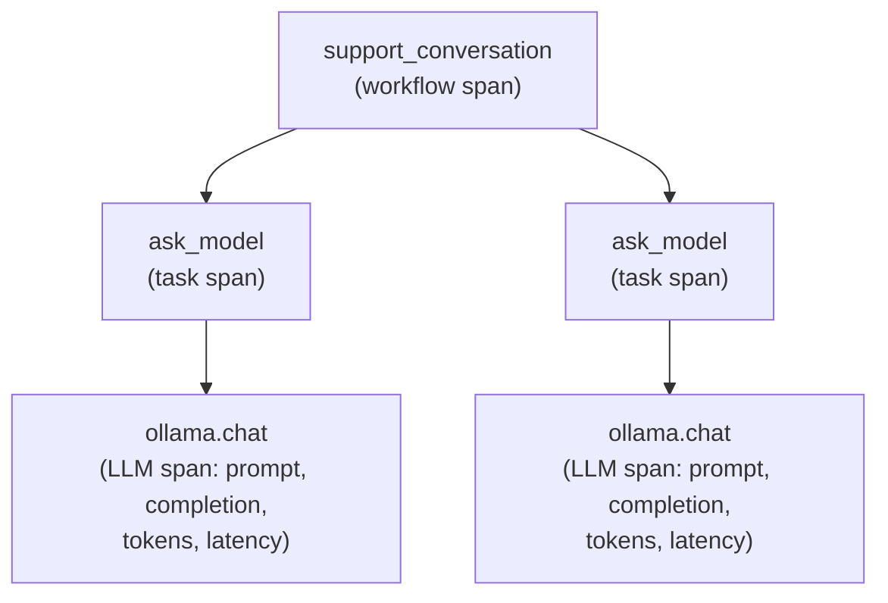

import Quiz from '@site/src/components/Quiz';
import {questions as adv5Questions} from '@site/src/data/quizzes/adv5';

# Chapter 5: Observability

> **Time:** 20 minutes. **Cost:** $0 with Ollama, a few cents with OpenAI or Anthropic.

A pilot doesn't fly blind and check the instruments only when something feels wrong, the altimeter, the fuel gauge, and the airspeed indicator are always on, always logging. When your Chapter 4 guardrails caught that reworded injection attempt, you saw it because the script printed it. In a real deployment, nobody's watching the terminal. Something goes slow, or expensive, or quietly wrong, and by the time a user complains, the request that caused it is long gone, no prompt, no completion, no idea which step of a multi-step agent actually misbehaved. Observability is the flight instruments: a running record of every model call, always on, so a bad run is something you can inspect, not something you have to reproduce.

## Traces, spans, and why nesting matters

A single model call is a **span**, one unit of work with a start time, an end time, and whatever details you attach to it (the prompt, the completion, the token count). A **trace** is a whole request's worth of spans strung together, if answering one user question involves calling a tool, then calling the model, then calling another tool, that's three-plus spans, and they only tell a useful story if you can see how they nest: which span happened *inside* which other span.

This chapter uses [**OpenLLMetry**](https://github.com/traceloop/openllmetry) (the `traceloop-sdk` package), an Apache-2.0, open-source library built directly on **OpenTelemetry**, the vendor-neutral standard most observability tooling (Datadog, Honeycomb, Jaeger, and others) already speaks. That's the practical reason to reach for it over a proprietary SDK: instrument once, export anywhere, including, as this lab shows, nowhere but your own terminal. No account, no API key, no data leaving your machine.



## Hands-on lab: tracing a two-turn conversation

This lab instruments the same kind of support-bot exchange from earlier chapters, two questions about Fernwood Coffee Co., and prints the full trace to the console as it runs.

Full instructions: [`labs/advanced/05-observability`](https://github.com/fewshot-works/academy/tree/main/labs/advanced/05-observability)

Three lines of setup produce the whole trace:

```python
Traceloop.init(app_name="fernwood-support-agent", exporter=ConsoleSpanExporter(), disable_batch=True)

@task(name="ask_model")
def ask(user_message, system=None):
    ...

@workflow(name="support_conversation")
def run_conversation():
    ...
```

`@task` and `@workflow` wrap ordinary functions in named spans. Nothing inside `ask()` talks to OpenTelemetry directly, the `ollama.chat` span underneath both of those appears because OpenLLMetry auto-instruments the `ollama` package on import. Call it normally and the span, prompt, completion, and token counts are captured for you.

Here's the real span for the first question, `llama3.2` running locally, exactly as printed by the script (re-indented to fit the page):

```json
{
  "name": "ollama.chat",
  "kind": "SpanKind.CLIENT",
  "start_time": "2026-07-28T04:01:04.831316Z",
  "end_time": "2026-07-28T04:01:05.231962Z",
  "attributes": {
    "gen_ai.request.model": "llama3.2",
    "gen_ai.prompt.1.content": "What's your best-selling drink?",
    "gen_ai.completion.0.content": "Our top pick is the Depot Latte - a rich and smooth blend of espresso, steamed milk, and hints of caramel. It's a fan favorite among our customers!",
    "llm.usage.total_tokens": 123,
    "gen_ai.usage.input_tokens": 87,
    "gen_ai.usage.output_tokens": 36
  }
}
```

`end_time` minus `start_time`: about 400ms, right there in the span, no stopwatch needed. And a genuinely useful accident from this real run: the second question's span shows the model answering "we have three locations, all within the state of Oregon", but `gen_ai.prompt.0.content` in that same span shows the system prompt only said "all in the same state," no state name. The model added a detail nobody gave it. That's not a hypothetical example of why tracing matters, it's what actually happened on this run, caught only because the prompt and the completion sit side by side in one span instead of scrolling off a terminal.

Two more spans wrap that one: an `ask_model.task` span (its `span_id` is the `ollama.chat` span's `parent_id`) and a `support_conversation.workflow` span at the root (`parent_id: null`). All three share one `trace_id`, that's what lets a UI draw them as a nested tree instead of unrelated events.

## The bonus: a real trace UI

Reading raw JSON in a terminal works for one call. It stops working the moment you have a real agent making a dozen calls per request. The lab's bonus section covers two ways to get an actual trace UI, pick whichever fits what you have on hand:

- **Local Jaeger**, if you have Docker: run [Jaeger](https://www.jaegertracing.io/), a free, open-source trace UI, with a single `docker run`, then swap one line, `exporter=ConsoleSpanExporter()` becomes `api_endpoint="http://localhost:4318"`, and the exact same three-span trace shows up as a waterfall diagram with timing bars, at `http://localhost:16686`.
- **LangSmith**, if you'd rather not run Docker: sign up for a free account, swap the same line for `api_endpoint="https://api.smith.langchain.com/otel"` plus an `x-api-key` header, and the trace shows up in LangSmith's hosted UI instead. LangSmith is normally associated with LangChain, but it accepts plain OTLP, so it works here even though this lab never imports LangChain, the trade-off is an account and your traces leaving your machine, instead of a local container.

Either way, it's the same instrumentation and the same code, only the destination changes. That swap, pointing the same trace data at a different backend without touching how you generate it, is the entire reason OpenTelemetry exists as a standard.

## Checkpoint

<details>
<summary>The lab's `ollama.chat` span has <code>kind: "SpanKind.CLIENT"</code>, while the <code>ask_model.task</code> and <code>support_conversation.workflow</code> spans both have <code>kind: "SpanKind.INTERNAL"</code>. What relationship do the <code>parent_id</code> fields show between these three spans?</summary>

`ollama.chat`'s `parent_id` matches `ask_model.task`'s `span_id`, so `ollama.chat` is a child of `ask_model.task`. `ask_model.task`'s `parent_id` matches `support_conversation.workflow`'s `span_id`, so it's a child of the workflow span, which itself has `parent_id: null`, meaning it's the root of the trace. Three levels of nesting: workflow contains task, task contains the actual LLM call.
</details>

<details>
<summary>The script switched from <code>requests.post()</code> (used in every earlier Ollama lab) to the official <code>ollama</code> Python package. Why does that matter for this chapter specifically?</summary>

OpenLLMetry auto-instruments specific, known client libraries, the official `ollama` package is one of them. Auto-instrumentation works by wrapping that library's own functions, so it has no way to see inside a generic `requests.post()` call, that would show up (if anything) as plain, undifferentiated HTTP traffic, not a rich LLM span with the prompt, completion, and token counts attached. Using the real client library isn't a style preference here, it's what makes the tracing possible at all.
</details>

<details>
<summary>The bonus Jaeger section changes exactly one line in <code>observability.py</code>, swapping <code>exporter=ConsoleSpanExporter()</code> for <code>api_endpoint="http://localhost:4318"</code>. Why doesn't anything else in the script need to change?</summary>

The `@task` and `@workflow` decorators, and OpenLLMetry's auto-instrumentation of the `ollama` package, produce the same spans regardless of where they end up. `Traceloop.init()` is the one place that decides the destination, console, Jaeger, or (in production) a full observability platform. That separation, instrument once, point the output wherever, is the actual value of building on the OpenTelemetry standard instead of a vendor-specific SDK.
</details>

## Check Your Knowledge

<details>
<summary>Click to start quiz</summary>

<Quiz chapterId="adv5" questions={adv5Questions} />

</details>

## What's next

You can now see what your agent did, prompt, completion, tokens, timing, for every call. Chapter 6 turns that visibility into action: caching repeated calls, rate limiting, streaming output, and using the cost data these traces expose to actually bring the bill down.
