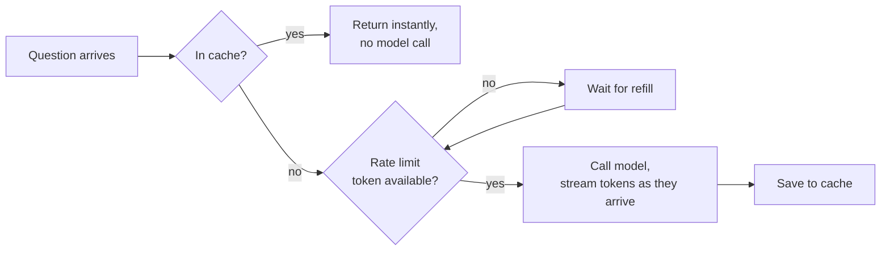

import Quiz from '@site/src/components/Quiz';
import {questions as adv6Questions} from '@site/src/data/quizzes/adv6';

# Chapter 6: Production Concerns

> **Time:** 20 minutes. **Cost:** $0 with Ollama, a few cents with OpenAI or Anthropic.

A restaurant kitchen that only ever cooked one order at a time, in the order it arrived, no matter how busy it got, wouldn't survive a Friday night. It needs to batch similar orders, control how fast tickets pile up, and get *something* in front of a waiting table quickly rather than making everyone wait for the whole meal at once. Every lab so far has sent one request, waited, gotten one answer back, that works for a demo with one user (you). It falls over the moment more than a few people show up at once, or the same question gets asked a hundred times a day, or a slow answer makes someone assume the app is broken. This chapter is the kitchen management: three small techniques that don't change what your agent says, only how it survives contact with real traffic.

## Three problems, three shapes of fix

**Repeated work costs money and time twice.** If ten users ask "what's your best-selling drink?" today, a naive agent calls the model ten times for the same answer. **Caching** stores the answer keyed on the question (or, more precisely, a hash of the exact prompt) and returns it instantly on a repeat, no model call, no cost, no wait.

**Traffic doesn't arrive evenly.** A burst of requests, a bot, a viral moment, a retry loop gone wrong, can hit your API faster than your model provider (or your budget) can handle. **Rate limiting** caps how fast requests actually go out, using a small, well-understood structure called a **token bucket**: a bucket holds a limited number of tokens, each request consumes one, and tokens refill at a steady rate. Empty bucket means new requests wait their turn instead of piling on.

**A slow answer that arrives all at once feels slower than a fast answer that arrives gradually**, even when the total time is the same, arguably longer. **Streaming** prints each piece of the model's response as it's generated, instead of buffering the whole thing and printing it at the end. The model isn't any faster, but the user sees progress in milliseconds instead of seconds.



## Hands-on lab: caching, rate limiting, and streaming, from scratch

This lab implements all three with plain Python, no caching library, no rate-limiting framework, so nothing is hidden behind an import.

Full instructions: [`labs/advanced/06-production-concerns`](https://github.com/fewshot-works/academy/tree/main/labs/advanced/06-production-concerns)

Here's a real run, with Ollama:

```
=== 1. Caching ===
  [cache] miss -- calling the model
  A: At Fernwood Coffee Co., you can redeem a free Depot Latte after every 10 purchases with our loyalty program.
  took 2.53s

  [cache] hit -- skipping the model call
  A: At Fernwood Coffee Co., you can redeem a free Depot Latte after every 10 purchases with our loyalty program.
  took 0.00s

=== 2. Rate limiting ===
  request 1: waited 0.00s for a token -> "What's your best-selling drink?"
  request 2: waited 0.00s for a token -> "How many locations do you have?"
  request 3: waited 1.03s for a token -> "What's the loyalty program?"
  request 4: waited 1.02s for a token -> "Do you have oat milk?"

=== 3. Streaming ===
  Q: Tell me about your loyalty program and your best-selling drink.
  A: Our loyalty program rewards customers with a free Depot Latte after every 10 purchases made across our three Fernwood Coffee Co. locations in the state. Our top seller is, of course, the popular Depot Latte!
```

**Caching**: the same question takes 2.53s the first time (a real model call) and 0.00s the second (a dictionary lookup against a JSON file on disk). The cache key is a hash of the system prompt plus the question, so it's specific to that exact exchange, not a fuzzy "similar question" match.

**Rate limiting**: the bucket in this run starts with 2 tokens and refills at 1 token per second. Requests 1 and 2 spend the two tokens already sitting in the bucket, instant. Request 3 has to wait for the bucket to refill by one token, about a second. Request 4 waits about a second more. Nothing gets rejected, everything just waits its turn, that's the difference between a token bucket and a hard request limit that throws errors.

**Streaming**: the transcript shows the final text, but watching it run shows the answer appearing word by word as the model generates it, not all at once after a pause. Same total time, very different experience.

## Checkpoint

<details>
<summary>The cache in this lab is keyed on a hash of <code>system + user_message</code>, not just the question text. Why include the system prompt in the key?</summary>

The system prompt is part of what actually produces the answer, change it (different facts, different instructions) and the same question could get a different, equally valid response. Hashing only the question would return a stale cached answer even after the system prompt changed underneath it. Including both in the key means the cache only ever returns an answer for the *exact* exchange that produced it.
</details>

<details>
<summary>In the rate limiter demo, requests 1 and 2 go through instantly but request 3 waits about a second. The bucket's capacity is 2 and its refill rate is 1 token/second. Walk through why.</summary>

The bucket starts full at capacity, 2 tokens. Request 1 takes one (1 left), request 2 takes the other (0 left), both instant. Request 3 arrives with an empty bucket, `wait_for_token()` sleeps in a loop, checking how much time has passed and refilling tokens proportionally, until at least 1 token has accumulated. At a refill rate of 1/second, that takes about a second. Request 4 repeats the same wait, since request 3 just spent the token that refilled.
</details>

<details>
<summary>Streaming doesn't reduce how long the model takes to generate a full answer. What problem does it actually solve?</summary>

It solves a perceived-latency problem, not a real one. A user staring at nothing for 2.5 seconds and then seeing the whole answer appear at once experiences that as "slow" or even "broken." A user seeing the first words appear within a couple hundred milliseconds, even if the last word doesn't arrive until the same 2.5 seconds later, experiences that as fast and responsive, because they have immediate evidence something is happening.
</details>

## Check Your Knowledge

<details>
<summary>Click to start quiz</summary>

<Quiz chapterId="adv6" questions={adv6Questions} />

</details>

## What's next

Your agent now handles real traffic sensibly, caches what it can, doesn't get overwhelmed by bursts, and feels responsive while it works. Chapter 7 gets it out of your terminal entirely: packaging it as an API behind a Dockerfile, so it can run anywhere, not just on your machine.
