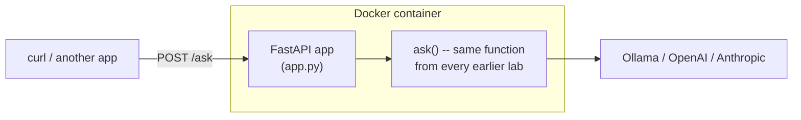

import Quiz from '@site/src/components/Quiz';
import {questions as adv7Questions} from '@site/src/data/quizzes/adv7';

# Chapter 7: Shipping It

> **Time:** 25 minutes. **Cost:** $0 with Ollama, a few cents with OpenAI or Anthropic.

A recipe that only works in your kitchen, with your specific pots, your specific oven, isn't really a recipe anyone else can follow. Every lab so far has been a script you run yourself, on your machine, in your terminal. That's fine for learning, it's useless for shipping. A real product needs to run on a server nobody's sitting in front of, get called by other programs (a website, a mobile app, another service), and behave identically whether it's running on your laptop or someone else's cloud account. This chapter takes the support bot from earlier chapters and does the two things that turn a script into a service: wraps it in an HTTP API, and packages that API so it runs the same way anywhere.

## An API, then a container

**Turning a script into an API** means putting a small web server in front of your function. Instead of running `python script.py` and reading the terminal, another program sends an HTTP request (`POST /ask` with a question) and gets an HTTP response (JSON with an answer) back. [FastAPI](https://fastapi.tiangolo.com/) is a lightweight Python framework built for exactly this, a few lines of code turn any function into an endpoint.

**Packaging that API in Docker** solves a different problem: "works on my machine" is not the same as "works." Docker packages your code together with everything it needs to run, the Python version, every dependency, down to the operating system libraries, into one portable image. Build it once, and it runs identically on your laptop, a teammate's laptop, or a cloud server, because it's not relying on whatever happens to already be installed there.



## Hands-on lab: FastAPI, then a Dockerfile

The lab's `app.py` doesn't introduce new agent logic, it takes the exact same `ask()` function from every earlier chapter and puts an HTTP layer in front of it.

Full instructions: [`labs/advanced/07-shipping-it`](https://github.com/fewshot-works/academy/tree/main/labs/advanced/07-shipping-it)

Run locally first, with Ollama:

```
$ curl http://localhost:8000/health
{"status":"ok","provider":"ollama"}

$ curl -X POST http://localhost:8000/ask -H "Content-Type: application/json" -d '{"question": "What is your best-selling drink?"}'
{"answer":"Our best-selling drink is the Depot Latte - a rich and creamy blend of espresso, steamed milk, and a hint of vanilla flavoring."}
```

💡 On Windows PowerShell, run `curl.exe` instead of plain `curl` -- PowerShell aliases `curl` to `Invoke-WebRequest`, which doesn't accept `-d` the same way. `curl.exe` runs the real curl binary that ships with Windows 10 and later, and the command above works as written.

Then build and run the exact same app inside Docker:

```bash
docker build -t fernwood-api .
docker run --rm -d --name fernwood-api --env-file .env -e OLLAMA_URL=http://host.docker.internal:11434 -p 8000:8000 fernwood-api
```

```
$ curl http://localhost:8000/health
{"status":"ok","provider":"ollama"}

$ curl -X POST http://localhost:8000/ask -H "Content-Type: application/json" -d '{"question": "How many locations do you have?"}'
{"answer":"We currently have three locations in our home state."}
```

Same code, same questions, same shape of answers, one running directly on the machine, the other running inside an isolated container. That `-e OLLAMA_URL=http://host.docker.internal:11434` is the one line that makes the second one work: **inside a container, `localhost` means the container itself, not your host machine.** The app's normal `http://localhost:11434` would try to find Ollama running *inside the container*, where it doesn't exist. `host.docker.internal` is Docker's special hostname for "actually, the machine running this container", overriding the URL through an environment variable is how the same code adapts to that without an `if running_in_docker:` check anywhere.

## Checkpoint

<details>
<summary>The exact same `ask()` function from Chapters 4-6 is reused unchanged in this chapter's `app.py`. What did actually change to turn it into a web service?</summary>

Nothing about the model-calling logic changed at all. What's new is the layer around it: FastAPI's `@app.post("/ask")` decorator turns the function into something reachable over HTTP, and `Question`/`Answer` Pydantic models define what a valid request and response look like. The service boundary moved from "you, typing into a terminal" to "any HTTP client," the actual work being done is identical.
</details>

<details>
<summary>Running the app with `uv run uvicorn app:app` works fine and reaches Ollama with no special configuration. Running the same app in Docker needs `OLLAMA_URL=http://host.docker.internal:11434`. Why the difference?</summary>

A container has its own isolated network namespace. Inside it, "localhost" resolves to the container itself, not the machine hosting it, so `http://localhost:11434` looks for an Ollama server running inside the container, which doesn't exist. `host.docker.internal` is a hostname Docker provides specifically to reach back out to the host machine from inside a container, which is where Ollama is actually running.
</details>

<details>
<summary>The Dockerfile copies `pyproject.toml` and `uv.lock` and runs `uv sync` *before* copying `app.py`. Why that order, rather than copying everything at once?</summary>

Docker builds images in layers, and reuses a layer from a previous build if nothing that layer depends on has changed. Dependencies (`pyproject.toml`/`uv.lock`) change far less often than application code. Installing them in an earlier layer means editing `app.py` and rebuilding doesn't reinstall every dependency from scratch, only the last layer (copying the code) actually redoes work. On a project with real dependencies, that's the difference between a multi-minute rebuild and a near-instant one.
</details>

## Check Your Knowledge

<details>
<summary>Click to start quiz</summary>

<Quiz chapterId="adv7" questions={adv7Questions} />

</details>

## What's next

You now have every individual piece: retrieval, agents, guardrails, tracing, caching, and a shippable container. The capstone puts them all in one system, an agent with real tools, evaluated, guarded, and traced, wrapped in the same API-and-container shape as this chapter, so it's not just a working system, it's one you could actually deploy.
