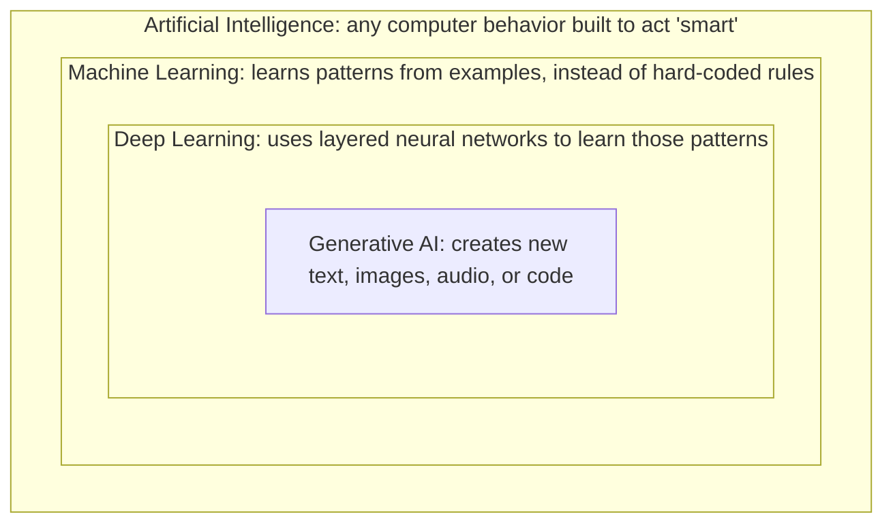

import Quiz from '@site/src/components/Quiz';
import {questions as ch1Questions} from '@site/src/data/quizzes/ch1';

# Chapter 1: What Is AI, Really?

Someone tells you "the AI wrote my email." Someone else says "my thermostat uses AI to save energy." A news article says a hospital is "using AI to detect cancer earlier." A movie has a robot villain called "the AI."

Are these all the same thing? Not really, but they all get called "AI," and that's exactly why the word is confusing. This chapter untangles four terms you'll hear constantly: **AI, machine learning, deep learning,** and **generative AI**, and shows how they relate to each other. You won't write any code in this chapter. You just need to leave it knowing which word means what.

> **A bit of history:** the term "Artificial Intelligence" was coined at a small workshop at Dartmouth College in the summer of 1956, organized by John McCarthy and Marvin Minsky, among others. A few years earlier, in 1950, Alan Turing published a paper asking a simpler question: "Can machines think?" The field has gone through repeated cycles of excitement followed by funding cuts and skepticism, often called "AI winters," each one eventually giving way to real progress that stuck around. What you're reading about now, deep learning and generative AI, sits on top of decades of that history. It didn't appear out of nowhere in 2022.

## The short version: they're nested, not separate

Think of Russian nesting dolls: the big doll on the outside, with a smaller one inside it, and a smaller one inside that. These four terms work the same way. Each one is a *specific kind* of the one before it, not a separate, competing thing.

Every generative AI tool is also deep learning, which is also machine learning, which is also AI. But not every AI is generative, most AI in the world isn't. Let's go one layer at a time.

## Artificial Intelligence (AI): the outermost, oldest, broadest term

**AI just means: a computer doing something that would normally require human-like judgment.** That's it. That's a low bar, and it's been around since the 1950s, decades before anything like ChatGPT existed.

Here's the part that surprises people: a video game opponent that always blocks your attack, or a chess program from 1997 that only follows rules a programmer typed in by hand, both count as AI, technically. No "learning" involved, no neural network, just a human writing out: *if this happens, do that.* It's AI in the broadest sense because it mimics decision-making, even though nothing was learned from data.

That's why "AI" alone is such a slippery word: it covers everything from a simple thermostat rule to a system that can write poetry. To be precise about what kind of AI we're talking about, we need the next layer.

## Machine Learning (ML): a specific *way* of building AI

Imagine teaching a five-year-old to recognize dogs. You don't hand them a rulebook, *"four legs, fur, a tail, floppy ears..."*, because that rulebook breaks the moment they see a three-legged dog or a hairless breed. Instead, you show them a hundred pictures of dogs, and a hundred pictures of things that aren't dogs, and say "dog" or "not dog" each time. Eventually, they figure out the pattern themselves, even for a dog they've never seen before.

**That's machine learning: instead of a programmer writing exact rules, you show the computer a large pile of examples, and it works out the pattern on its own.** This is the key shift from old-school "AI" (human writes the rules) to ML (computer finds the rules from data). Email spam filters, Netflix recommendations, and credit card fraud detection are all everyday ML. None of them write essays, but all of them learned from examples instead of being hand-coded rule by rule.

## Deep Learning (DL): the specific ML technique behind the recent boom

Machine learning is a big category with many techniques inside it. Deep learning is one specific one, and it's the one responsible for almost every AI headline you've read in the last few years.

Picture a factory assembly line instead of one person doing a whole job. The first worker on the line just looks for edges and simple shapes in a photo. The next worker combines those into curves and corners. The next combines *those* into recognizable parts: an eye, a wheel, a wing. By the end of the line, the combined layers of simple pattern-spotters can recognize something as complex as "this is a photo of a golden retriever." Each individual worker's job is simple; it's the *depth*, many layers stacked on top of each other, that lets the whole system recognize something complicated.

That layered structure is called a **neural network** (loosely inspired by how neurons connect in a brain), and "deep" just means it has many layers stacked up. Deep learning is what made computers dramatically better at recognizing speech, images, and eventually language, starting in the early-to-mid 2010s.

## Generative AI: a specific *use* of deep learning

Here's a chef who's memorized a hundred recipes exactly. Give them recipe #47, and they'll reproduce it perfectly every time. Now here's a different chef, one who's tasted thousands of dishes, understands *why* flavors work together, and can invent a completely new dish you've never had before, on the spot, based on what's in your fridge tonight.

Most ML and deep learning historically worked like the first chef: given an input, predict a label or a number, *is this email spam or not, is this a photo of a cat or a dog, what's the price this house will sell for.* **Generative AI is the second chef: instead of picking from a fixed set of labels, it produces brand-new content, text, images, audio, code, that didn't exist before you asked for it.** ChatGPT writing an email you didn't dictate word-for-word, or an image tool generating a picture from a text description, are both generative AI.

This is also the innermost doll: every generative AI system in wide use today is built using deep learning (many-layered neural networks), which is a form of machine learning (learned from examples, not hand-coded), which is a form of AI (behavior built to act smart).

## Putting it together with real examples

| Example | AI? | ML? | Deep Learning? | Generative? |
|---|---|---|---|---|
| Thermostat: "if temp > 78°F, turn on AC" | Yes | No, no learning, just a fixed rule | No | No |
| Email spam filter | Yes | Yes | Sometimes | No, it labels, doesn't create |
| Face unlock on your phone | Yes | Yes | Yes | No, it recognizes, doesn't create |
| ChatGPT / Claude writing you an email | Yes | Yes | Yes | Yes |

## Checkpoint

Is a simple "if temperature > 78°F, turn on the AC" thermostat rule an example of AI?

Yes, technically, by the broadest definition, it's a computer making a decision that mimics human judgment. But it is **not** machine learning, because nothing was learned from examples; a person just wrote the rule directly. This is exactly why "AI" alone is such a vague word.

Where does ChatGPT fit in the nested-dolls diagram: AI, ML, deep learning, or generative AI?

All four at once. It's a specific example of generative AI, which is built using deep learning, which is a form of machine learning, which is a form of AI. Being in the innermost circle means it's automatically part of every circle around it.

What's the core difference between old-school programming and machine learning?

In traditional programming, a human writes exact rules for every situation. In machine learning, the human instead provides a large set of examples, and the computer works out the pattern on its own.

## Check Your Knowledge

<Quiz chapterId="ch1" questions={ch1Questions} />

**Time:** ~10 minutes reading, no lab in this chapter. **Cost:** $0.

## What's next

You now know that a "generative AI" tool like ChatGPT is really "deep learning, used to create new content, based on patterns learned from examples." Chapter 2 opens that up specifically for text: what is a large language model, actually, and how does it decide what word to write next?
