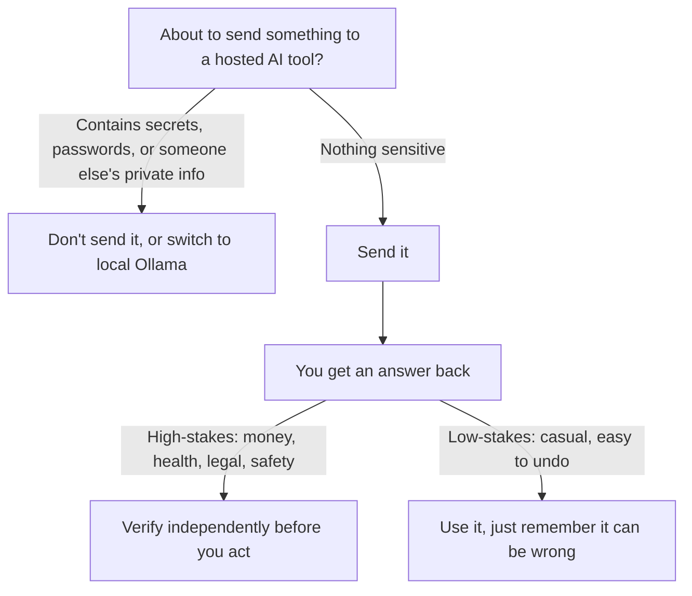

import Quiz from '@site/src/components/Quiz';
import {questions as ch2bQuestions} from '@site/src/data/quizzes/ch2b';

# Bonus: Using AI Responsibly

> **Time:** ~10 minutes reading, no lab in this chapter. **Cost:** $0.

A table saw is enormously useful and, in the wrong hands, enormously dangerous, not because it's evil, but because a few habits (goggles on, fingers clear, watch for knots) are what separate "useful tool" from "trip to the emergency room." AI tools are the same trade: genuinely useful, and safe to use well once you know a handful of habits. This chapter isn't a debate about whether AI is "good" or "bad," it's the practical stuff: what to watch for so it stays a tool that works for you.

## The privacy rule you already met

Chapter 2 covered this one already: a hosted AI tool (a chatbot or API you don't run yourself) sends your prompt to that company's own computers, so it's handled under *their* privacy policy, not this course's. Don't paste in passwords, other people's personal details, or confidential work documents, unless you've actually read that provider's policy. Ollama, running entirely on your own machine, is the exception, nothing you type into it ever leaves your computer. If that's fuzzy, it's worth a quick re-read of [Chapter 2's privacy section](./02-what-is-an-llm.md#before-you-hit-send-a-word-on-privacy) before continuing.

This chapter picks up from there with three things Chapter 2 didn't cover: bias, a fuller verify-before-you-trust habit, and a light touch on who owns what an AI generates.

## Bias: it learned from us, warts and all

Imagine an extremely well-read person whose entire education came from whatever's freely available online and in books, nothing more, nothing curated. They'd pick up plenty of useful knowledge, and they'd also pick up whatever assumptions, stereotypes, and imbalances show up most often in that pile of text. That's roughly how an LLM ends up biased: it learns patterns from enormous amounts of human-written text, and human-written text carries human biases.

In practice, this shows up as an AI defaulting to one gender for "CEO" or "nurse," describing certain nationalities or groups with lazier stereotypes than others, or giving noticeably different-quality answers depending on how a question is phrased or who it's about. None of that means the model is "trying" to be unfair, it's reflecting patterns in what it was trained on, at scale. The practical habit: when an answer leans on an assumption about a person or group, especially a specific gender, age, ethnicity, or background, treat that as *one plausible pattern from its training data*, not a fact about the world, and double check it before you repeat it or act on it.

## The habit that covers the rest: verify before you trust

You already know from Chapter 2 that an LLM can confidently state something false, it's not lying, it's generating the most statistically plausible-*sounding* text, with no built-in fact-check. Here's what to actually do about that:

- **Match your verification effort to the stakes.** A trivia fact for a casual conversation barely matters if it's slightly off. A fact you'll act on, medical, legal, financial, or anything that affects a grade or a job, needs an independent check before you trust it.
- **Ask the model to show its work or cite where something came from.** It won't always get this right either, but it gives you something concrete to go verify, instead of just a confident-sounding sentence.
- **Treat "I'm not sure" as a good sign, not a bad one.** A model that hedges is being more honest than one that states a shaky guess with total confidence.

## A light word on who owns the output

Two things worth knowing, without wading into the legal debate: first, an AI model's output can sometimes closely echo the text it was trained on, so treating a generated paragraph as 100% original, with no chance it resembles someone else's existing work, isn't a safe assumption. Second, whether *you* own an AI-generated result, and whether you're allowed to submit it as your own work, varies by country, by school, and by employer, and the rules are still actively being written. Before you turn in AI-assisted work for a grade, a job, or publication, check your school's or employer's actual policy on AI use and disclosure, rather than assuming it's automatically fine.

## If you want a name for this

None of the habits above are unique to this course. Privacy, fairness (bias), transparency, accountability, and human oversight are the same five pillars you'll find, worded slightly differently, in every major AI lab's responsible-use guidance and in government guidance like the U.S. NIST AI Risk Management Framework. There's no single official checklist everyone agrees on, but if you want to go deeper than "don't be evil," that's a reasonable place to start.

## Checkpoint

A hosted AI chatbot confidently answers a medical question with a specific, wrong dosage. Was it lying to you?

No. It generated the most statistically plausible-sounding answer based on patterns in its training data, with no built-in fact-check, the same hallucination behavior from Chapter 2. That's exactly why anything health-related needs independent verification before you act on it.

You ask an AI to describe "a successful entrepreneur," and it keeps defaulting to the same gender and background. What's actually happening?

The model is reflecting patterns in the text it was trained on, which itself over-represents certain groups in that role, not stating an objective fact about who entrepreneurs are. Treat it as a pattern to question, not a fact to repeat.

You used an AI tool to help draft a school assignment. Is it automatically fine to turn it in as entirely your own work?

Not automatically. Whether that's allowed, and whether you need to disclose AI assistance, depends on your school's specific policy, which varies and is still evolving. Check the actual policy rather than assuming.

## Check Your Knowledge

Click to start the quiz

<Quiz chapterId="ch2b" questions={ch2bQuestions} />

## What's next

That's the whole responsible-use picture: privacy, bias, verification, and ownership. Chapter 3 gets back to building, how the way you phrase a prompt changes what the model considers likely, which is the entire game behind "prompt engineering."
