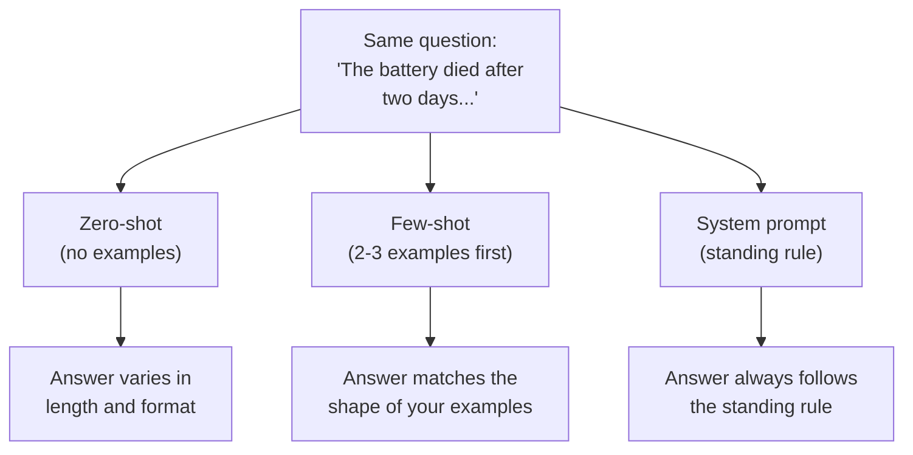

import Quiz from '@site/src/components/Quiz';
import {questions as ch3Questions} from '@site/src/data/quizzes/ch3';

# Chapter 3: Prompting 101

> **Time:** 10 minutes. **Cost:** $0 with Ollama, a fraction of a cent per run with a hosted API key.

Imagine you just hired someone new and told them: "handle the customer complaints." That's it, no more detail. You'll get answers, but every one will look different. One reply is three paragraphs long and apologetic. Another is one clipped sentence. A third offers a refund when your policy actually calls for store credit.

Now imagine you did it differently. You showed them two real complaints and exactly how you wanted each one handled. Or you sat them down first and said: "you're our returns specialist. Always offer store credit before a refund. Keep replies under three sentences." Suddenly their answers look like something one consistent person wrote.

An LLM is the same new employee, every single time you talk to it. It has no memory of how you wanted the last answer to look unless you tell it again. How you phrase your request, called a **prompt**, is the single biggest lever you have over what comes back. This chapter covers three ways to pull that lever.

> **A bit of history:** prompting as a skill didn't really exist before models got good enough to reward it. GPT-3's 2020 research paper is literally titled "Language Models are Few-Shot Learners," it's the paper that showed a model could pick up a new pattern from just a few examples in the prompt itself, no retraining needed, which is exactly the few-shot technique later in this chapter. Once ChatGPT went public in November 2022, phrasing your request well became a skill enough people cared about that "prompt engineering" entered the vocabulary.

## Zero-shot: just ask

The simplest way to prompt a model is to just ask your question, with no examples and no extra setup. This is called **zero-shot**, because you're giving the model zero examples to work from.

```
Classify the sentiment of this review: "The battery died after two days and support never responded."
```

Zero-shot is fast and often good enough. But because you haven't shown the model what your ideal answer looks like, its formatting and tone can drift from one run to the next. Sometimes it answers in one word. Sometimes it explains itself for a paragraph first.

## Few-shot: show, don't just tell

**Few-shot** prompting fixes that drift by showing the model a small handful of worked examples before asking your real question. The model picks up on the pattern in your examples and matches it.

```
Review: "Fast shipping and the case fits perfectly." → positive
Review: "Screen cracked out of the box, no reply from seller." → negative

Review: "The battery died after two days and support never responded."
```

Two or three examples is usually enough. The model isn't "learning" anything permanent here (it forgets your examples the moment the conversation ends), it's just matching the shape of the input and output you just demonstrated.

## System prompts: set the rules once

A **system prompt** is a separate instruction, sent alongside your question, that sets the model's role, tone, and rules for the whole conversation. Think of it as the standing orders you give a new hire on day one, instead of repeating them with every request.

```
System: You are a strict sentiment classifier. Respond with exactly one word: positive or negative. Never explain your answer.
User: The battery died after two days and support never responded.
```

Under the hood, most chat APIs treat a system prompt as its own field or its own message role, kept separate from what the user actually typed. That separation matters: a system prompt behaves like a rule the model is expected to follow throughout the whole exchange, while a user message is just the latest thing being asked.



## Hands-on lab: build a prompt playground

Time to see all three techniques answer the exact same question, side by side, so you can compare them yourself.

Full instructions: [`labs/foundations/03-prompt-playground`](https://github.com/fewshot-works/academy/tree/main/labs/foundations/03-prompt-playground)

Here's what you should see (with Ollama, exact wording will vary):

```
Review to classify: "The battery died after two days and support never responded."

--- Zero-shot ---
This review expresses negative sentiment. The customer is unhappy about...

--- Few-shot ---
negative

--- System prompt ---
negative
```

Notice how zero-shot rambles while the other two land on a clean one-word answer. That's the whole lesson in one script run.

## Checkpoint

<details>
<summary>What's the difference between zero-shot and few-shot prompting?</summary>

Zero-shot asks the question with no examples. Few-shot shows the model a couple of worked examples first, so it can match the format and tone you demonstrated instead of guessing at it.
</details>

<details>
<summary>Why does a system prompt behave differently from just asking the same thing as a user?</summary>

Most chat APIs keep the system prompt in its own field or role, separate from the conversation itself. Models are trained to treat it as a standing rule that applies to everything that follows, not just the next reply.
</details>

<details>
<summary>When would you reach for few-shot instead of just writing a longer zero-shot instruction?</summary>

When the output needs a specific, consistent shape (like a fixed label, a JSON structure, or a particular tone) that's easier to demonstrate with a couple of examples than to describe accurately in words.
</details>

## Check Your Knowledge

<details>
<summary>Click to start the quiz</summary>

<Quiz chapterId="ch3" questions={ch3Questions} />

</details>

## What's next

Prompting controls what a model says in the moment, but it has no memory of your own documents; it only knows what's in the prompt you send it. Chapter 4 covers embeddings, the technique that turns text into something a computer can search and compare, which is the first building block toward getting a model to answer questions about your own files.
