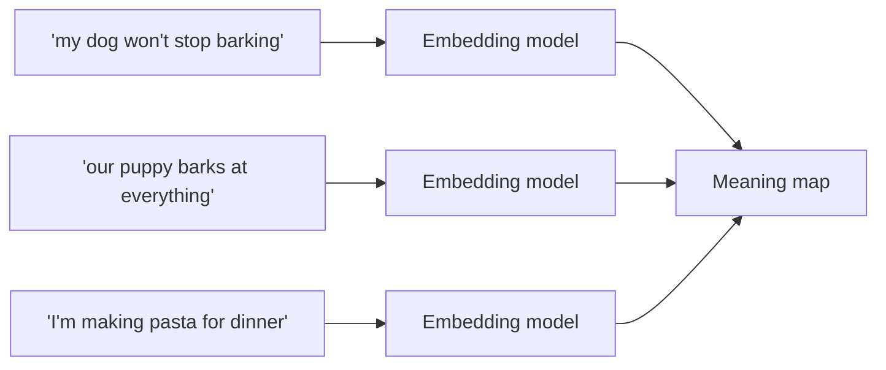

import Quiz from '@site/src/components/Quiz';
import {questions as ch4Questions} from '@site/src/data/quizzes/ch4';

# Chapter 4: What Is an Embedding?

> **Time:** 10 minutes. **Cost:** $0 with Ollama, a fraction of a cent total with OpenAI (embeddings are one of the cheapest things you can call an API for).

Picture a giant map of every food on earth, laid out so that similar tastes sit near each other. Mango sits close to peach. Chili sits close to wasabi. Both sit far away from vanilla. You didn't build this map by measuring sugar content or spice levels by hand. You built it by noticing which foods taste alike.

An **embedding** does the same thing for meaning. It takes a piece of text and turns it into a list of numbers, called a **vector**, that acts like coordinates on a giant map of meaning. Put two sentences with similar meaning through the same embedding model, and their coordinates land close together, even if the sentences don't share a single word in common. Put two unrelated sentences through it, and their coordinates land far apart.

This is the trick that lets a computer "understand" that "my dog won't stop barking" and "our puppy barks at everything" are about the same thing, without either sentence sharing more than one word.

> **A bit of history:** this idea traces back to 2013, when researchers at Google led by Tomas Mikolov published a technique called word2vec that turned individual words into vectors. It produced a famous demonstration: take the vector for "king," subtract "man," add "woman," and the closest result was "queen." The model had learned the relationship between gender and royalty purely from how words get used in text, nobody told it directly. Later models extended the same idea from single words to whole sentences and paragraphs, which is what the embedding models you'll use in the lab actually do.

## A vector is just a list of numbers

When you send a sentence to an embedding model, it doesn't come back with more text. It comes back with something like this:

```
"my dog won't stop barking" → [0.12, -0.44, 0.08, ..., 0.31]
```

That list might have anywhere from a few hundred to a few thousand numbers in it, depending on the model. You'll never need to read these numbers yourself. What matters is that sentences with similar meaning end up with similar lists of numbers, the same way two nearby cities end up with similar GPS coordinates.

## Measuring "close" with cosine similarity

If meaning is a location, we need a way to measure distance. The most common way is called **cosine similarity**, which checks the angle between two vectors rather than the raw distance between them.

You don't need the math to use this well. Just know the scale: cosine similarity gives you a score from -1 to 1. A score near 1 means the two pieces of text are pointing in almost the same direction (very similar meaning). A score near 0 means they're unrelated. A score near -1 means they're close to opposites.



On that map, the two dog sentences land close together. The pasta sentence lands far from both.

## Cosine similarity isn't the only option

Cosine similarity is the most common way to measure "close" for text embeddings, but two other metrics show up constantly once you start working with vector databases in Chapter 5, so it's worth knowing what they do.

**Euclidean distance** (also called **L2 distance**) measures straight-line distance, the way a ruler laid between two dots on a map would. It takes both direction and length into account. Two sentences with similar meaning but embeddings of noticeably different length can end up looking farther apart than they really are.

**Dot product** multiplies each matching pair of numbers from the two vectors and adds up the results. It's the cheapest of the three to compute, which matters when a database is scanning millions of vectors per query. If every vector is scaled to the same length first (called normalizing), dot product produces the exact same ranking as cosine similarity, just faster, so a lot of production systems normalize once up front and use dot product from then on.

**Which one should you use?** For text embeddings, cosine similarity is the safest default, it's the scale most embedding models are actually tuned for, and it's what this course uses throughout. The catch is that vector databases don't always default to it. Chroma, the database you'll use starting in Chapter 5, defaults to Euclidean distance unless you explicitly ask for cosine when you create a collection, which is exactly what that chapter's lab does.

## The same word can land in different places

One more thing worth knowing before the lab: an embedding isn't a fixed lookup table of one vector per word. The word "bank" gets embedded differently in "I deposited a check at the bank" versus "we sat on the river bank," because the model is embedding the meaning of the whole sentence, not just looking up isolated words. You don't need to do anything special to get this. It's just how the models work.

## Hands-on lab: compute and visualize similarity

In this lab you'll embed six sentences (two about pets, two about cooking, two that don't relate to either), compute how similar every pair is to every other pair, and save a picture that lets you actually see related sentences cluster together.

Full instructions: [`labs/foundations/04-embedding-similarity`](https://github.com/fewshot-works/academy/tree/main/labs/foundations/04-embedding-similarity)

Here's what you should see (with Ollama; exact scores and pairing can shift a bit with a different embedding model):

```
Most similar pair (0.71): "my dog won't stop barking" <-> "our puppy barks at everything"
Least similar pair (0.31): "our puppy barks at everything" <-> "the stock market dropped again"

Saved plot to embeddings_plot.png
```

Open `embeddings_plot.png` afterward. You'll see the pet sentences grouped together, the cooking sentences grouped together, and everything else spread out, without you ever telling the script which sentences belonged together.

**One thing to know before you run it:** this lab needs an embedding model, and Anthropic doesn't currently offer one. If your `.env` still has `PROVIDER=anthropic` from an earlier chapter, switch it to `ollama` or `openai` for this lab.

## Checkpoint

<details>
<summary>What is an embedding, in one sentence?</summary>

An embedding is a list of numbers that represents the meaning of a piece of text, positioned so that text with similar meaning ends up with similar numbers.
</details>

<details>
<summary>What does cosine similarity actually measure?</summary>

The angle between two vectors. A score near 1 means very similar meaning, near 0 means unrelated, and near -1 means close to opposite.
</details>

<details>
<summary>Why can't you compare an embedding from one model against an embedding from a different model?</summary>

Each model builds its own "map," with its own layout and its own number of dimensions. Two different models can place the exact same sentence in completely different coordinates, so a distance calculated between vectors from two different models is meaningless.
</details>

<details>
<summary>Besides cosine similarity, what's another common way to measure distance between vectors, and how is it different?</summary>

Euclidean (L2) distance measures straight-line distance and is sensitive to a vector's length, not just its direction. Dot product is a cheaper calculation that matches cosine similarity's ranking exactly once vectors are normalized to the same length.
</details>

## Check Your Knowledge

<details>
<summary>Click to start the quiz</summary>

<Quiz chapterId="ch4" questions={ch4Questions} />

</details>

## What's next

Now you can turn any piece of text into a vector and compare it to others. But comparing six sentences by hand doesn't scale to thousands of documents. Chapter 5 covers vector databases, which store embeddings and let you instantly find the closest matches out of millions of them.
