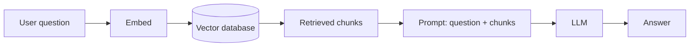

import Quiz from '@site/src/components/Quiz';
import {questions as ch6Questions} from '@site/src/data/quizzes/ch6';

# Chapter 6: What Is RAG?

> **Time:** 15 minutes. **Cost:** $0 with Ollama, a fraction of a cent with OpenAI.

Imagine two students taking the same exam. One studies for weeks, memorizes everything, and walks in with nothing but what's in their head, a closed-book exam. If they misremember a fact, they'll still write it down confidently. The other student gets to bring the textbook in with them, an open-book exam. Before answering, they flip to the relevant page and check it, then answer using what's actually written there.

An LLM answering a question purely from what it learned during training is the closed-book student. It's fast and often right, but it can also confidently state something wrong, because it's working from memory alone. **RAG**, short for **Retrieval-Augmented Generation**, turns the same LLM into the open-book student: before it answers, it goes and finds the relevant text first, then answers using that text as a reference.

> **A bit of history:** the term "Retrieval-Augmented Generation" comes from a 2020 research paper by Patrick Lewis and colleagues at Facebook AI Research, now Meta AI. That's worth noticing: RAG isn't a reaction to ChatGPT-style tools going mainstream, the paper was published about two years before that happened. The idea of combining search with generation predates the current AI boom.

## Why an LLM alone isn't enough for your own data

An LLM only knows what was in its training data, and that data has a fixed cutoff date. It has never seen your company's internal documents, your personal notes, or anything published after it was trained. Ask it a direct question about any of that, and it either says it doesn't know, or worse, guesses and sounds confident anyway.

RAG fixes this without retraining the model at all. Instead, you hand the model the relevant facts at the moment you ask the question.

## The RAG loop

You already have both pieces this needs, from the last two chapters. Chapter 4 taught you how to turn text into a searchable vector. Chapter 5 taught you how to store those vectors and instantly find the closest matches. RAG chains them together with one more step at the end:

1. Take the user's question and **embed** it, same as any other piece of text.
2. **Search** the vector database for the stored chunks whose embeddings are closest to the question.
3. **Stuff** those retrieved chunks into the prompt, alongside the original question, as context.
4. Send the whole thing to the LLM and let it **generate** an answer grounded in that context.



## Why this reduces hallucination, but doesn't erase it

Once the model is answering from text you handed it directly, instead of purely from memory, it's much more likely to get facts right, especially about things it was never trained on. That's the whole point of the open-book analogy.

But it's not a guarantee. The model can still misread the retrieved text, blend it incorrectly with something from its training, or answer confidently even when the retrieved chunks don't actually contain the answer. RAG lowers the odds of a wrong answer. It doesn't remove them.

## Hands-on lab: build your first RAG bot

In this lab you'll build a tiny RAG bot over a short, made-up document, made-up on purpose, so you can be certain any correct answer came from retrieval, not from something the model already knew.

Full instructions: [`labs/foundations/06-first-rag-bot`](https://github.com/fewshot-works/zero-to-agent/tree/main/labs/foundations/06-first-rag-bot)

Here's what you should see:

```
Question: What is Fernwood Coffee Co.'s most popular drink?

Retrieved context:
1. Fernwood Coffee Co. was founded in 2016 in a converted train depot...
2. The bestselling drink at Fernwood is the "Depot Latte," a...

Answer:
Fernwood Coffee Co.'s most popular drink is the Depot Latte.
```

**One thing to know before you run it:** this lab needs one provider that can do both embeddings and chat, so it only supports `PROVIDER=ollama` or `PROVIDER=openai`, same restriction as Chapters 4 and 5.

## Checkpoint

<details>
<summary>What does "augmented" mean in Retrieval-Augmented Generation?</summary>

That the LLM's answer is supplemented with retrieved text at the moment of answering, rather than relying only on what it learned during training.
</details>

<details>
<summary>Why does RAG reduce hallucination without eliminating it?</summary>

Because the model is now working from real, retrieved text instead of only its memory, which makes correct answers far more likely, especially about things outside its training data. But the model can still misread or misuse that retrieved text, so wrong answers are still possible, just less likely.
</details>

<details>
<summary>What are the main steps in the RAG loop?</summary>

Embed the question, search a vector database for the closest matching chunks, add those chunks to the prompt as context, then send the whole thing to the LLM to generate an answer.
</details>

## Check Your Knowledge

<details>
<summary>Click to start the quiz</summary>

<Quiz chapterId="ch6" questions={ch6Questions} />

</details>

## Bonus: build this without code, in Langflow

Everything you just built, embed, store, retrieve, prompt, can also be wired together by dragging boxes around instead of writing Python. That's what [Langflow](https://www.langflow.org) is: a free, open-source, visual tool for building these pipelines. It's entirely optional, the required path for this course stays plain Python, but it's a good way to *see* the RAG loop as a literal diagram instead of a script.

**Setting up Langflow** (skip this if you already have it running):

```bash
uv venv
source .venv/bin/activate   # Windows: .venv\Scripts\activate
uv pip install langflow
uv run langflow run
```

Open `http://127.0.0.1:7860` in your browser once it starts.

**Build the flow:**

1. Click **New Flow**, then pick the **Vector Store RAG** template. It comes with two flows already wired up: one that loads a document into a vector database, one that answers questions from it.
2. That template defaults to Astra DB. Swap both Astra DB components for **Chroma DB**, the same local vector database from Chapter 5.
3. Swap both embedding components for **Ollama Embeddings**, and set the model to `nomic-embed-text`, the exact model you've used since Chapter 4. (If you've been using OpenAI in the labs instead, use OpenAI Embeddings here with the same key.)
4. On the Load Data flow, open the Read File component and upload `sample_facts.txt` from this chapter's lab folder.
5. Run that flow to embed and store the file.
6. Switch to the Retriever flow, click **Playground**, and ask the same question from the lab: "What is Fernwood Coffee Co.'s most popular drink?"

The chat panel should answer using the retrieved text, and you can open each component's logs to see the exact chunks it pulled back, the same information the Python script printed to your terminal. Same four steps, same result, just built with a mouse instead of a keyboard.

## What's next

You've now seen retrieval and generation work together. Chapter 7 introduces the next idea: an **AI agent**, which takes this further by letting the model decide *which* tool to use and *when*, instead of always following the same fixed retrieve-then-answer steps.
