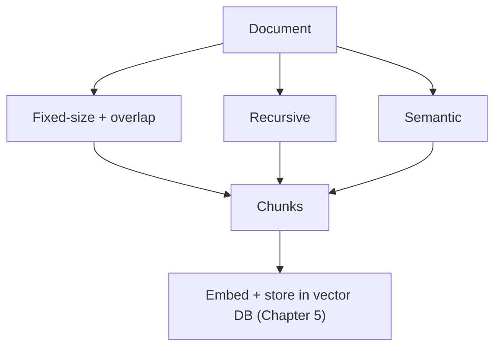

import Quiz from '@site/src/components/Quiz';
import {questions as int1Questions} from '@site/src/data/quizzes/int1';

# Chapter 1: Chunking Strategies

> **Time:** 15 minutes. **Cost:** $0 with Ollama, a fraction of a cent with OpenAI (embeddings are cheap).

Imagine a giant cookbook with 500 recipes. Someone asks you, "how long do I roast a chicken?" If your only unit of search is "the whole cookbook," you'd have to hand over all 500 recipes and let them dig. If your unit is "one word," you'd hand over just the word "roast," stripped of everything useful around it. Neither helps.

What you actually want is to hand over one recipe: big enough to stand on its own, small enough to be about one specific thing. That's what a **chunk** is. In Chapter 5 of Foundations, "What Is a Vector Database?", you stored whole tiny documents as single vectors, because those documents were only a sentence or two long. Real documents aren't a sentence or two long. Before anything gets embedded and stored, someone has to decide how to cut it into pieces, and that decision is called a **chunking strategy**.

Get chunk size wrong in either direction and RAG quality suffers. Chunks too big, and a search for "roast chicken" also retrieves the marinade instructions, the dessert recipe two paragraphs down, and whatever else got dragged along for the ride, diluting the one relevant fact in a sea of irrelevant text. Chunks too small, and you get a fragment like "Roast at 425°F" with no idea what's being roasted, because the sentence that said "chicken" got cut into a different chunk.

## Three ways to cut a document

**Fixed-size chunking** is the blunt-instrument approach: pick a size, say 500 characters, and slice the document every 500 characters, no matter what's there. It's trivial to implement and painfully fast, but it has zero awareness of sentences or paragraphs, so it will happily cut a sentence in half if that's where the count runs out. A common patch is **overlap**: repeat the last chunk's final 50 or so characters at the start of the next chunk, so if a thought does get severed, at least some of what came before survives into the next piece too. Overlap doesn't fix the cut, it just softens it.

**Recursive chunking** tries to respect the document's own structure. It first tries to split on paragraph breaks. If a paragraph is still bigger than the target size, it falls back to splitting on sentence breaks. If a single sentence is somehow still too big, it falls back to raw characters, same as fixed-size, as an absolute last resort. In practice this means recursive chunking almost never cuts a sentence in half, because it only gets crude when it has no other choice.

**Semantic chunking** throws character counts out entirely and asks a different question: where does the topic actually change? It embeds every sentence (the same embedding step from Chapter 4, "What Is an Embedding?") and compares each sentence to the one right before it using cosine similarity. When that similarity drops below a threshold, that's treated as a signal the topic just shifted, and a new chunk starts there. This is the only one of the three that's actually looking at meaning instead of just position or punctuation, but it costs one embedding call per sentence, and the threshold that counts as "a real topic shift" has to be tuned by testing against real text, not guessed in advance.



None of the three is universally "best." Fixed-size is fine for uniform, boilerplate-heavy text where structure barely matters. Recursive is the sensible default for most real documents. Semantic is worth its extra cost when a document genuinely jumps between unrelated topics and you want chunk boundaries to land exactly where the subject changes.

## Hands-on lab: cut one document three ways

In this lab you'll take the same short document, a small fictional town newsletter that mixes three completely unrelated stories (a library's hours, a coffee shop opening, a hiking club meetup), and chunk it with all three strategies, side by side.

Full instructions: [`labs/intermediate/01-chunking-strategies`](https://github.com/fewshot-works/zero-to-agent/tree/main/labs/intermediate/01-chunking-strategies)

Here's what you should see (with Ollama; exact boundaries can shift slightly with a different embedding model):

```
Document length: 1519 characters

Fixed-size (260 chars, no overlap): 6 chunks
  1. Mossbank Public Library is extending its hours starting next month. The building will now stay open ...
  2. can reshelve before the doors lock.  Library cards remain free for anyone who lives, works, or atten...
  ...

Recursive (paragraph -> sentence, max 260 chars): 8 chunks
  1. Mossbank Public Library is extending its hours starting next month. The building will now stay open ...
  2. The children's section will still close at 7 PM so staff can reshelve before the doors lock.
  ...

Semantic (embedding similarity, threshold 0.55): 6 chunks
  1. Mossbank Public Library is extending its hours starting next month. The building will now stay open ...
  2. Library cards remain free for anyone who lives, works, or attends school in the county.
  3. Cardholders can borrow up to ten items for three weeks, with two renewals allowed if nobody else has...
  4. Fernwood Coffee is opening a second location downtown next Saturday. The original shop, a converted ...
  5. The Mountain View Hiking Club meets every Saturday morning at the trailhead parking lot, rain or shi...
  6. This month's featured hike climbs to the old fire lookout tower, a six-mile round trip with about 1,...
```

Look closely at chunk 1 and chunk 2 of the fixed-size output: the cut lands mid-sentence, right in the middle of "so staff can reshelve." Recursive chunking never does that. And notice chunk 4 in the semantic output: it pulls together both sentences about Fernwood Coffee even though they come from two separate paragraphs, because the topic didn't actually change between them.

**One thing to know before you run it:** semantic chunking needs an embedding model, and Anthropic doesn't currently offer one. This lab only supports `PROVIDER=ollama` or `PROVIDER=openai`.

## Checkpoint

<details>
<summary>Why does chunk size matter for RAG quality?</summary>

Retrieval searches over chunks, not the whole document. A chunk that's too big dilutes the relevant fact with unrelated text; a chunk that's too small can lose the context needed to make sense of it on its own.
</details>

<details>
<summary>What's the core tradeoff between fixed-size and recursive chunking?</summary>

Fixed-size just counts characters and cuts wherever the count runs out, so it can slice a sentence in half. Recursive tries paragraph boundaries first, then sentence boundaries, and only falls back to raw characters as a last resort, so it almost never cuts mid-sentence.
</details>

<details>
<summary>What signal does semantic chunking split on, and why does it need an embedding model?</summary>

It splits where the cosine similarity between consecutive sentence embeddings drops below a threshold, treating that drop as a sign the topic changed. An embedding model is the only way to measure whether two sentences are actually about the same thing.
</details>

## Check Your Knowledge

<details>
<summary>Click to start the quiz</summary>

<Quiz chapterId="int1" questions={int1Questions} />

</details>

## What's next

You've now cut a document into chunks three different ways, but you haven't asked which embedding model should actually turn those chunks into vectors. Chapter 2 covers choosing an embedding model, weighing OpenAI against open-source options on cost, quality, and latency.
