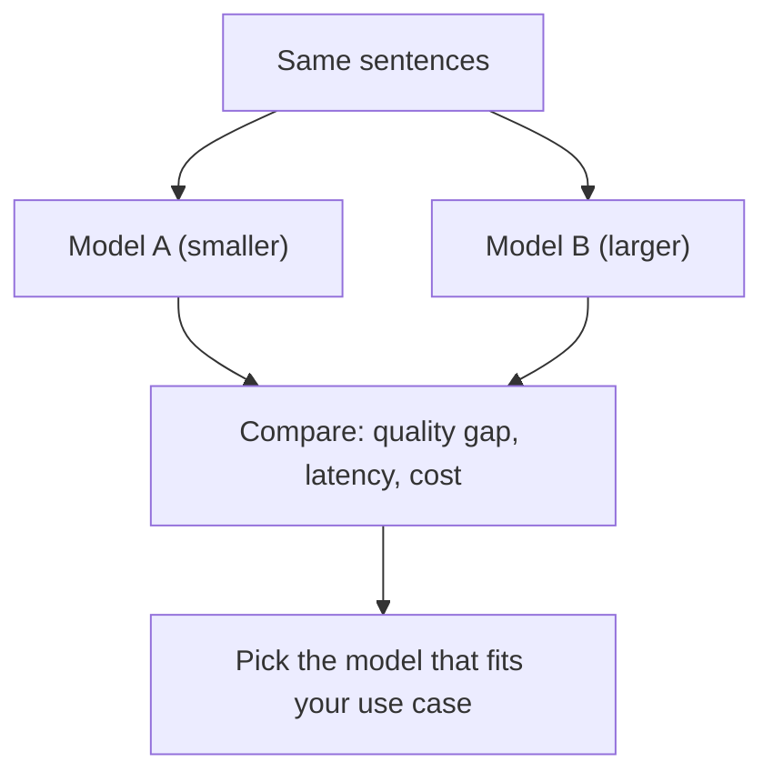

import Quiz from '@site/src/components/Quiz';
import {questions as int2Questions} from '@site/src/data/quizzes/int2';

# Chapter 2: Choosing an Embedding Model

> **Time:** 15 minutes. **Cost:** $0 with Ollama, a fraction of a cent with OpenAI (embeddings are cheap).

Picking an embedding model is a lot like picking a camera lens. A cheap lens is light, fast, and free to carry around, but it blurs fine detail. An expensive lens captures much more nuance, at the cost of being heavier, slower to work with, and pricier. Neither lens is "the best" in general. It depends on what you're shooting.

In Chapter 4 of Foundations, "What Is an Embedding?", you learned *how* an embedding works: a piece of text goes in, a list of numbers representing its meaning comes out, and cosine similarity tells you how close two of those meanings are. That lab used one model and never questioned the choice. This chapter asks the question it skipped: which model, and why does it matter?

## Three things that actually differ between models

**Quality.** Not every embedding model is equally good at telling meaning apart. A good model should score two paraphrases of the same idea as clearly more similar than two unrelated sentences. A weaker model blurs that distinction, scoring everything in a similar, mushy middle range. The gap between "how similar do paraphrases score" and "how similar do unrelated sentences score" is a rough, practical stand-in for quality: bigger gap, better model.

**Latency.** How long a model takes to turn text into a vector. This mostly matters at scale, embedding one sentence is fast on almost anything, but embedding a few hundred thousand document chunks is not, and a slower model turns into real wait time.

**Cost.** Open-source models you run yourself (through Ollama) have zero per-call cost, you already paid for the electricity and the hardware. Hosted models like OpenAI's charge per token, metered by exactly how much text you send in. A bigger, more capable hosted model usually costs more per token than a smaller one.

None of these three tells the whole story alone. A model can be excellent and cheap but slow, or fast and free but mediocre. Choosing a model means weighing all three against what you're actually building.



## Hands-on lab: the same sentences, two different models

In the lab, you'll take the same six sentences from Chapter 4's embedding lab, four pairs, two clearly about the same thing and two clearly not, and embed them with two different models: a smaller one and a larger one. The sentences aren't new. What's different is what you're asking of them.

Full instructions: [`labs/intermediate/02-choosing-embedding-model`](https://github.com/fewshot-works/academy/tree/main/labs/intermediate/02-choosing-embedding-model)

Here's what you should see (with Ollama; your exact numbers will shift a little run to run):

```
Comparing embedding models via ollama...

nomic-embed-text
  Similar-pair avg similarity:    0.621
  Different-pair avg similarity:  0.346
  Quality gap (bigger is better): 0.275
  Time for 6 embeddings:    0.91s
  Cost for this run:              $0 (runs locally)

mxbai-embed-large
  Similar-pair avg similarity:    0.684
  Different-pair avg similarity:  0.302
  Quality gap (bigger is better): 0.382
  Time for 6 embeddings:    0.65s
  Cost for this run:              $0 (runs locally)

mxbai-embed-large was faster. mxbai-embed-large had the bigger quality gap.
```

`mxbai-embed-large`, the bigger of the two models, separates the similar sentences from the different ones more clearly, a quality gap of 0.382 against 0.275. That part holds up consistently.

The timing is a different story: run the script a second time and it flattens out, sometimes even flipping which model looks "faster," because most of what's being measured the first time is Ollama loading the model into memory, not the embedding step itself. Locally, latency is noisy. Quality and cost are the tradeoffs you can actually count on.

With `PROVIDER=openai`, the picture sharpens. `text-embedding-3-small` and `text-embedding-3-large` are priced differently per token, and the script reads the real token count straight from each API response, so the dollar cost printed for that run is exact, not estimated. That's the clearest version of the tradeoff: a hosted API where you can see quality, latency, and cost as three numbers, side by side, for a single request.

💡 **One thing to know before you run it:** this lab only supports `PROVIDER=ollama` or `PROVIDER=openai`. Anthropic doesn't currently offer an embeddings API.

## Checkpoint

<details>
<summary>Why does a bigger quality gap between similar-pairs and different-pairs indicate a "better" embedding model?</summary>

An embedding model's whole job is to place similar meanings close together and different meanings far apart in vector space. If paraphrases score only a little higher than unrelated sentences, the model isn't distinguishing meaning very sharply. A bigger gap means it's doing that job more clearly.
</details>

<details>
<summary>Local (Ollama) models cost $0 per call. Why isn't that automatically the right choice?</summary>

Zero marginal cost doesn't mean zero cost overall, you're spending your own machine's compute and memory, and local models may lag behind the best hosted models on quality for demanding use cases. Cost is only one of three axes; a free model that separates meaning poorly can still hurt a RAG system's retrieval quality.
</details>

<details>
<summary>When would you pick the smaller, cheaper model over the larger, more accurate one?</summary>

When the use case doesn't need fine-grained distinctions, high volume makes the larger model's cost or latency add up fast, or the smaller model's quality is already good enough for what you're retrieving. A prototype or a low-stakes internal tool rarely needs the most expensive model available.
</details>

## Check Your Knowledge

<details>
<summary>Click to start quiz</summary>

<Quiz chapterId="int2" questions={int2Questions} />

</details>

## What's next

You now know how to weigh embedding models against each other, not just use whichever one a tutorial happens to pick. Chapter 3 moves to the next question: even with a good embedding model, retrieval still misses the right chunk sometimes. It covers hybrid search, metadata filtering, and re-ranking, ways to make retrieval actually find what you're looking for.
