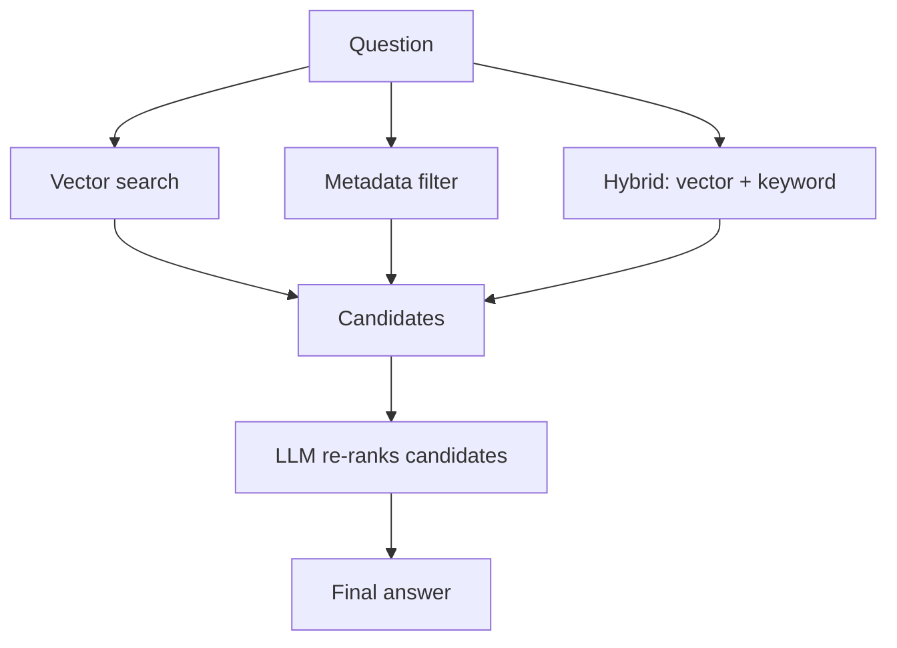

import Quiz from '@site/src/components/Quiz';
import {questions as int3Questions} from '@site/src/data/quizzes/int3';

# Chapter 3: Better Retrieval

> **Time:** 20 minutes. **Cost:** $0 with Ollama, a fraction of a cent with OpenAI.

In Foundations Chapter 6, you built a tiny RAG bot that answered questions about a made-up coffee shop, Fernwood Coffee Co., by embedding a handful of facts and pulling the closest match with cosine similarity. It worked well, because the whole point of that lab was to show you the mechanics, not to stress-test them. With only a few unambiguous facts in play, vector search barely had a chance to get anything wrong.

Real retrieval isn't that forgiving. The more documents you have, and the more they resemble each other, the more often the "closest" chunk by embedding similarity isn't actually the right one. This chapter reopens Fernwood Coffee Co., now sharing a bigger, more ambiguous set of facts with two other fictional coffee companies, and walks through three techniques that make retrieval more reliable: metadata filtering, hybrid search, and re-ranking.

## Why vector search alone isn't enough

Embeddings capture meaning, not certainty. Two documents can be about genuinely different things and still land close together in vector space, especially when they share a lot of surface-level vocabulary. A question that names a specific company by name can still retrieve a different company's answer first, if that other answer happens to be worded in a way the embedding model reads as slightly more similar.

Three techniques help, each in a different way:

**Metadata filtering** scopes the search before ranking even happens. If you already know a hard constraint, like which company, which document type, which date range, you can exclude everything outside it entirely. It's cheap and exact, but only works when the constraint is actually knowable ahead of time.

**Hybrid search** combines vector similarity with keyword search (classically, an algorithm called BM25, which scores documents by how often and how distinctively they contain the query's exact words). Embeddings can miss exact terms that matter, like a proper noun or a specific number, that keyword search catches directly. Combining the two scores usually helps, but a fixed blend doesn't always fully overturn a wrong result that vector search was confident about, it can just as easily narrow the gap instead of closing it.

**Re-ranking** takes a small set of candidates, the top handful from whatever retrieval method you used, and has something smarter (often the LLM itself) actually read them and judge which one answers the question. It's too expensive to run over an entire corpus, but over three or five candidates, it's often the step that catches what filtering and hybrid search leave unresolved.



## Hands-on lab: four ways to retrieve the same answer

The lab reuses Fernwood Coffee Co. from Foundations Chapter 6, now alongside two more fictional coffee companies, Harbor Bean Roasters and Whistlepost Coffee, whose facts were deliberately written to sound similar. Twelve short documents in total, run through the same question four different ways.

Full instructions: [`labs/intermediate/03-better-retrieval`](https://github.com/fewshot-works/zero-to-agent/tree/main/labs/intermediate/03-better-retrieval)

Here's what you should see (with Ollama):

```
Question: How many purchases before Fernwood gives you a free drink?

A. Baseline: vector search only
  1. [Harbor Bean] Harbor Bean Roasters' loyalty program gives customers a free drink aft...
  2. [Fernwood] Fernwood Coffee Co.'s loyalty program gives customers a free drink aft...
  3. [Fernwood] Fernwood Coffee Co.'s best-selling drink is the Depot Latte, a vanilla...

B. Metadata filter: vector search where company = Fernwood
  1. [Fernwood] Fernwood Coffee Co.'s loyalty program gives customers a free drink aft...
  2. [Fernwood] Fernwood Coffee Co.'s best-selling drink is the Depot Latte, a vanilla...
  3. [Fernwood] Fernwood Coffee Co. has three locations, all in the same state: the or...

C. Hybrid: 50% vector similarity + 50% keyword (BM25) score
  1. [Harbor Bean] Harbor Bean Roasters' loyalty program gives customers a free drink aft...
  2. [Fernwood] Fernwood Coffee Co.'s loyalty program gives customers a free drink aft...
  3. [Fernwood] Fernwood Coffee Co.'s best-selling drink is the Depot Latte, a vanilla...

D. Re-rank: ask the LLM to pick the best of hybrid's top 3
  Picked: [Fernwood] Fernwood Coffee Co.'s loyalty program gives customers a free drink after every ten purchases. The punch card never expires and can be transferred to another person.

Summary of top pick per approach:
  A. Baseline vector search -> [Harbor Bean]
  B. Metadata filter        -> [Fernwood]
  C. Hybrid search          -> [Harbor Bean]
  D. LLM re-rank            -> [Fernwood]
```

This is a real run, not a cherry-picked one, and it's more interesting than a clean "each technique fixes it" story. The baseline genuinely gets it wrong: even though the question names Fernwood directly, vector search ranks Harbor Bean's loyalty fact first, because its wording happens to embed as slightly closer to the question. Metadata filtering fixes it outright, but only because the question happened to name the company, giving something to filter on. Hybrid search boosts Fernwood's fact into second place (BM25 correctly notices "Fernwood" is a distinctive word that only appears in Fernwood's documents), but the fixed 50/50 blend isn't quite enough to overturn how confidently vector search preferred the wrong answer, it narrows the gap rather than closing it. Re-ranking is what finishes the job: handed hybrid's top 3, the LLM reads the actual text and correctly picks Fernwood's fact.

That chain, hybrid search getting the right answer *into contention* even when it can't win outright, then re-ranking picking it out, is a common pattern in real retrieval systems. No single technique is the fix; they compound.

## Checkpoint

<details>
<summary>Why did metadata filtering fix the wrong answer instantly, while hybrid search only narrowed the gap?</summary>

Metadata filtering removes every document outside the constraint *before* any ranking happens, so a wrong-company document simply isn't a candidate anymore. Hybrid search still ranks every document, it just adjusts the score with a second signal. If vector search was confident enough about the wrong answer, a 50/50 blend with keyword scoring might not be enough to flip first place, even if it moves the right answer up.
</details>

<details>
<summary>Why does re-ranking typically run on a handful of candidates instead of the whole corpus?</summary>

Re-ranking here means asking an LLM to actually read and judge each candidate, which is far slower and more expensive per document than a vector or keyword lookup. Running it over an entire corpus of thousands of documents would be impractical. Running it over the top 3-5 candidates that cheaper retrieval already narrowed down is fast enough to be worth it, and catches mistakes those methods left behind.
</details>

<details>
<summary>When would metadata filtering not be an option, even if it would help?</summary>

Metadata filtering only works when you already know the constraint ahead of time, like which company, category, or date range the answer should come from. If the question itself doesn't specify (or imply) that constraint, and there's no other source for it, like an app knowing which tenant's data to search, there's nothing to filter on. That's exactly when hybrid search and re-ranking matter more.
</details>

## Check Your Knowledge

<details>
<summary>Click to start quiz</summary>

<Quiz chapterId="int3" questions={int3Questions} />

</details>

## What's next

You now have three real tools for when retrieval picks the wrong chunk, instead of just accepting whatever vector search returns. Chapter 4 shifts from retrieval to the prompt itself: chain-of-thought, structured/JSON output, and function calling, patterns for getting more reliable answers out of the model once you've handed it the right context.
