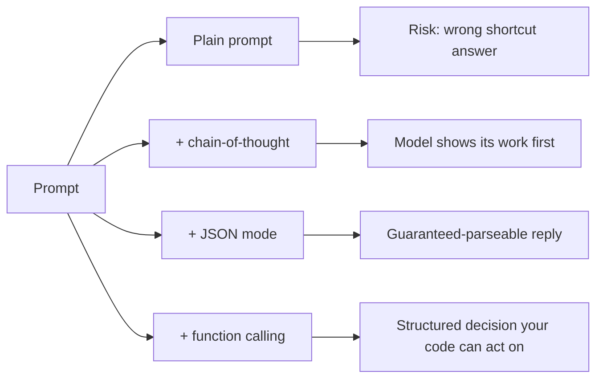

import Quiz from '@site/src/components/Quiz';
import {questions as int4Questions} from '@site/src/data/quizzes/int4';

# Chapter 4: Prompt Patterns

> **Time:** 25 minutes. **Cost:** $0 with Ollama, a fraction of a cent with OpenAI or Anthropic.

Foundations Chapter 3 covered the prompting basics: zero-shot, few-shot, and system prompts. Those get you a reasonable answer most of the time. This chapter is about three specific situations where "reasonable" isn't good enough, where you need the model to actually work through a problem instead of pattern-matching to an answer, to reply in a shape your code can parse without crossing its fingers, or to make a decision your code can act on instead of just describing in prose.

## Three failure modes, three fixes

**Chain-of-thought** fixes wrong shortcut answers. LLMs predict the next token, so if a prompt lets them jump straight to a number without working through the steps, they sometimes do exactly that, and get it wrong. Asking the model to "think step by step" before answering isn't a magic trick, it forces the reasoning to actually happen in the output, token by token, instead of being skipped.

**Structured/JSON output** fixes replies you can't parse. Asking a model to "respond with only JSON" usually works, but usually isn't good enough for code that runs unattended: a stray sentence before the JSON, or a markdown code fence around it, breaks a plain `json.loads()` call. Most providers offer a native mode that guarantees valid JSON back instead of just requesting it nicely.

**Function calling** fixes decisions your code can't act on. Even a well-structured JSON reply is still just text describing what the model thinks should happen. Function calling lets you describe real tools (with a name, a description, and a parameter schema) and has the model choose one and fill in the arguments directly, in a structured form your code can call.



Notably, structured output and function calling aren't as separate as they sound. Anthropic's Claude has no plain "JSON mode" at all, if you want guaranteed structured output from Claude, you define a tool with an input schema and force the model to call it. The "JSON mode" *is* function calling under the hood. OpenAI and Ollama expose JSON mode as its own separate setting, but the underlying idea, force the model into a schema instead of asking nicely, is the same one function calling uses.

## Hands-on lab: three techniques, one script

The lab reuses the same `ask()` pattern from Foundations Chapter 3, run through three sections back to back: a word problem that trips up a direct answer but not a step-by-step one, an event blurb extracted into JSON both the freeform way and the native way, and a mock order-status tool the model chooses to call.

Full instructions: [`labs/intermediate/04-prompt-patterns`](https://github.com/fewshot-works/academy/tree/main/labs/intermediate/04-prompt-patterns)

Here's what you should see (with Ollama):

```
============================================================
1. CHAIN OF THOUGHT
============================================================

Problem: A bakery baked 24 muffins. Half of the muffins are blueberry. Half of the blueberry muffins also have a chocolate drizzle. How many muffins have both blueberry and a chocolate drizzle?
(Correct answer: 6)

--- Direct answer (forced to skip its reasoning) ---
4

--- With 'think step by step' appended ---
To find out how many muffins have both blueberry and a chocolate drizzle, we need to break it down:

1. Half of the muffins are blueberry: 24 / 2 = 12
2. Half of the blueberry muffins also have a chocolate drizzle: 12 / 2 = 6

So, there are 6 muffins that have both blueberry and a chocolate drizzle.

6

============================================================
2. STRUCTURED / JSON OUTPUT
============================================================

Blurb: Join us for the Riverside Tech Meetup on August 14th, 2026, at the Cedar Hall Community Center in Portland. Doors open at 6 PM.

--- Freeform prompt (just asking for JSON) ---
{"name": "Riverside Tech Meetup", "date": "August 14th, 2026", "location": "Cedar Hall Community Center in Portland"}
Parsed OK: {'name': 'Riverside Tech Meetup', 'date': 'August 14th, 2026', 'location': 'Cedar Hall Community Center in Portland'}

--- Native structured-output mode ---
{"name": "Riverside Tech Meetup", "date": "August 14th, 2026", "location": "Cedar Hall Community Center, Portland"}
Parsed OK: {'name': 'Riverside Tech Meetup', 'date': 'August 14th, 2026', 'location': 'Cedar Hall Community Center, Portland'}

============================================================
3. FUNCTION CALLING
============================================================

Question: Can you check the status of order A1234?

Model chose to call: check_order_status({'order_id': 'A1234'})
```

This is a real run, and it's worth being honest about what it shows. In section 1, forced to answer with just a number, `llama3.2` guessed 4, wrong. The moment it's told to think step by step, it works through "half of 24, then half of that" and lands on 6, correct. That's the whole case for chain-of-thought in one comparison: the reasoning ability was there the whole time, it just wasn't being used until the prompt asked for it explicitly.

In section 2, the freeform JSON attempt happened to parse cleanly on this run, small models don't always cooperate that well, sometimes a markdown fence or a stray sentence sneaks in and breaks a plain `json.loads()`. That's exactly the risk native JSON mode removes: it's not that freeform prompting always fails, it's that it can fail, unpredictably, in code that has no human watching it run.

Section 3 shows the model choosing the right tool and filling in the right argument, `order_id: "A1234"`, without the script ever calling the real function. That gap, a structured decision sitting there unused, is exactly what Chapter 5 closes.

## Checkpoint

<details>
<summary>Why did appending "think step by step" change the model's *answer*, not just its explanation?</summary>

An LLM generates one token at a time, each token conditioned on everything generated before it. If the prompt lets the model jump straight to a final number, it can, and sometimes that jump skips a step it needed. Asking it to reason first forces the intermediate steps to actually appear in the output before the final answer does, so the answer is now conditioned on that reasoning instead of skipping past it.
</details>

<details>
<summary>Why are structured output and function calling more closely related than they first appear?</summary>

Both are about forcing a model's reply into a schema instead of asking nicely for a shape. Anthropic's Claude makes this literal: it has no separate "JSON mode," what you use instead is a tool with an input schema, the same mechanism as function calling, just applied to get a plain structured answer back rather than to trigger an action.
</details>

<details>
<summary>Why did this chapter only show the model *choosing* a tool call, instead of actually running it?</summary>

Choosing which tool to call and filling in its arguments is a decision the model makes from the prompt alone, that's the part prompt patterns can teach. Actually calling `check_order_status()`, getting a real result back, and feeding that result back to the model to finish answering is a different piece of machinery, an execution loop, that Chapter 5 builds.
</details>

## Check Your Knowledge

<details>
<summary>Click to start quiz</summary>

<Quiz chapterId="int4" questions={int4Questions} />

</details>

## What's next

You've now seen a model choose a tool without anything happening as a result. Chapter 5 closes that gap: you'll build a real tool-calling assistant, calculator and web search, where the model's decisions actually run and their results feed back into the conversation.
