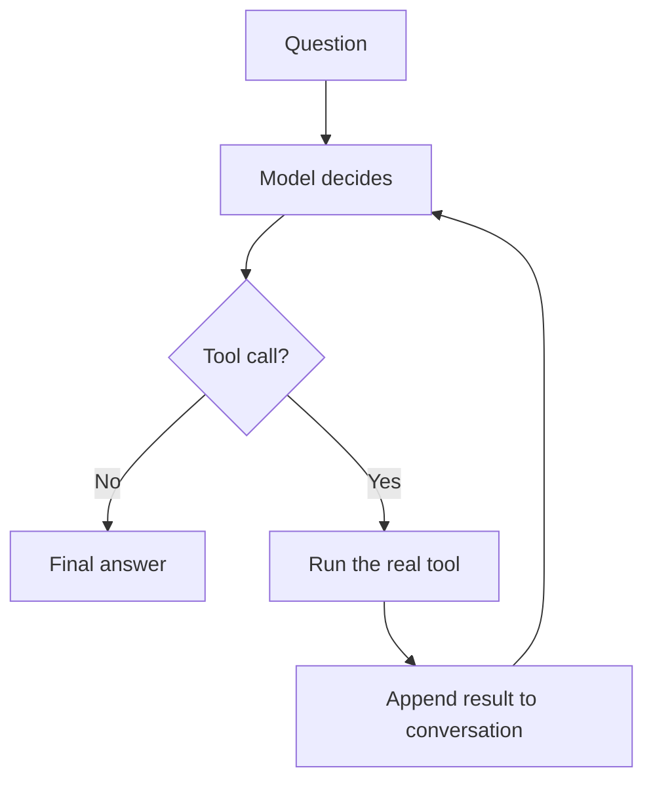

import Quiz from '@site/src/components/Quiz';
import {questions as int5Questions} from '@site/src/data/quizzes/int5';

# Chapter 5: Tool Use

> **Time:** 25 minutes. **Cost:** $0 with Ollama, a fraction of a cent with OpenAI or Anthropic.

Chapter 4 ended with a gap: the model chose a tool, `check_order_status`, and filled in the right argument, but nothing actually ran. Foundations Chapter 7 described the fix conceptually, an agent reasons, acts, observes the result, and repeats until it has enough to answer. This chapter builds that loop for real, in code, with two tools that actually do something.

## The two tools

**`calculator(expression)`** evaluates basic arithmetic, things like `"18 * 7 + 4"`. It's deliberately not Python's `eval()`. The model's own generated text becomes the input here, and `eval()` will happily run *any* Python code you hand it, not just math, that's a real security hole the moment untrusted text reaches it. Instead, the lab parses the expression into a syntax tree with Python's `ast` module and walks it by hand, allowing only `+ - * / **` and unary minus. If the model sends anything else, the tree walk simply doesn't know what to do with it.

**`search_wikipedia(query)`** hits Wikipedia's free public search API and returns the top result's title and snippet. No API key, no cost, no signup, which keeps this lab's "$0 with Ollama" promise intact even for the "web search" tool. It's the same tool Chapter 7's bonus section pointed at conceptually, now wired up for real.

## The loop

Chapter 4's function-calling section stopped after step 1. This chapter runs all four:

1. Send the question, plus descriptions of both tools, to the model.
2. If the model's reply is plain text, that's the final answer, stop.
3. If the model asks for a tool instead, actually call the matching Python function.
4. Add the tool's result to the conversation, and go back to step 1.



That loop needs a limit. Nothing guarantees the model will eventually stop asking for tools, so the lab caps it at `MAX_STEPS = 5`, the same "a reason to stop" idea Chapter 7 raised conceptually, now a literal line of code.

It also needs to survive a tool call that doesn't work. The model won't always fill in arguments that make sense, if it hands the calculator a sentence instead of an expression, that has to become an error message the model can see and react to, not a crash. More on that below, it's not hypothetical, it happened during testing.

### Three providers, three different shapes

The mechanics of "send a tool call, get a result back" aren't standardized across providers, and the lab shows all three rather than hiding the differences behind an abstraction:

- **Ollama** hands you the tool call's arguments as an already-parsed dictionary. Results go back as `{"role": "tool", "content": result}`.
- **OpenAI** hands you the arguments as a JSON string, you call `json.loads()` yourself. Results go back the same shape as Ollama's, plus a `tool_call_id` to match the result to the specific call.
- **Anthropic** is the odd one out: tool calls arrive as `tool_use` blocks, and the result has to go back as a **user**-role message, not assistant, containing a `tool_result` block. If you're only used to OpenAI-style APIs, this is the detail most likely to trip you up.

## Hands-on lab: build the loop

Full instructions: [`labs/intermediate/05-tool-use`](https://github.com/fewshot-works/zero-to-agent/tree/main/labs/intermediate/05-tool-use)

Four questions run through the loop: one that needs only the calculator, one that needs only Wikipedia, one that (in theory) needs neither, and one that needs both. Here's a real run, with Ollama:

```
Question: What's 18 * 7 + 4?
  -> calling calculator({'expression': '18 * 7 + 4'})
Answer: The answer to the expression "18 * 7 + 4" is 130.

Question: What year did construction of the Eiffel Tower finish?
  -> calling search_wikipedia({'query': 'Eiffel Tower completion year'})
Answer: Gustave Eiffel, who designed and built the tower. The construction of the Eiffel Tower finished in 1889.

Question: In one sentence, what's a good tip for staying focused while studying?
  -> calling search_wikipedia({'query': 'tips for staying focused while studying'})
  -> calling search_wikipedia({'query': 'tips for staying focused while studying'})
Answer: According to Wikipedia, a good tip for staying focused while studying is to set specific, achievable goals for each study session, break them down into smaller tasks, and take regular breaks to help maintain concentration and retain information.

Question: What's 15% of 340, and what year did construction of the Eiffel Tower finish?
  -> calling calculator({'expression': '0.15 * 340'})
  -> calling search_wikipedia({'query': 'Eiffel Tower completion date'})
Answer: So, to recap:

* 15% of 340 is 51.
* The construction of the Eiffel Tower finished in 1889.
```

Questions 1, 2, and 4 go as designed: the right tool (or tools) get called, and the results land correctly in the final answer. Question 3 is the honest surprise. It's an opinion question, "what's a good tip for staying focused," nothing in it needs a live lookup, so the expectation was that the model would just answer directly. Instead, `llama3.2` reached for `search_wikipedia` anyway, twice, with the same query. That's not a bug in the loop, it's the model being a little tool-happy, a real behavior smaller local models show more often than hosted ones. The loop doesn't need to know the difference: it just keeps running until the model stops asking for tools, however many calls that takes.

The other honest surprise happened before this clean run: an earlier attempt at question 3 had the model call `calculator` with the arguments `{'expression': '1 hour of focused study per day'}`, plain English, not math, which crashed the syntax-tree parser. That's exactly why `call_tool()` in the script wraps the actual function call in a `try/except` and turns any failure into an error string, handed back to the model the same way a real result would be, instead of taking down the whole script.

## Checkpoint

<details>
<summary>Why does the loop need a maximum step count?</summary>

Nothing guarantees the model will eventually stop asking for tools and give a plain-text answer. Without a cap, a model that keeps calling tools (or keeps calling the same one) would loop forever. `MAX_STEPS` is the concrete version of Chapter 7's "a reason to stop," a beginner-obvious safety net, not a sophisticated planning mechanism.
</details>

<details>
<summary>Why does the calculator tool parse the expression with `ast` instead of just calling Python's `eval()`?</summary>

`eval()` runs whatever text you give it as real Python code, not just arithmetic. Since the input here is text the model generated, `eval("18 * 7 + 4")` and `eval("os.system('rm -rf /')")` would both just be code that runs. Parsing the expression into a syntax tree and only walking a small, explicit set of allowed operations means anything outside basic arithmetic simply isn't understood, it can't do anything else even if the model asks it to.
</details>

<details>
<summary>What's actually different between what Chapter 4 showed and what this chapter's lab does?</summary>

Chapter 4 showed the model *choosing* `check_order_status` and filling in the right argument, that decision never went anywhere. This chapter's lab takes that same kind of decision and actually acts on it: it calls the real Python function, gets a real result, hands that result back to the model in the conversation, and lets the model keep going, possibly calling more tools, until it has a final answer.
</details>

## Check Your Knowledge

<details>
<summary>Click to start quiz</summary>

<Quiz chapterId="int5" questions={int5Questions} />

</details>

## What's next

You've now hand-built a tool-execution loop, three times over, once per provider, each with its own message shapes and mechanics. That's valuable to understand, but it's also exactly the kind of repetitive plumbing a framework exists to remove. Chapter 6 puts a lightweight framework next to this raw loop, side by side, so you can see precisely what it's doing for you and what it's hiding.
