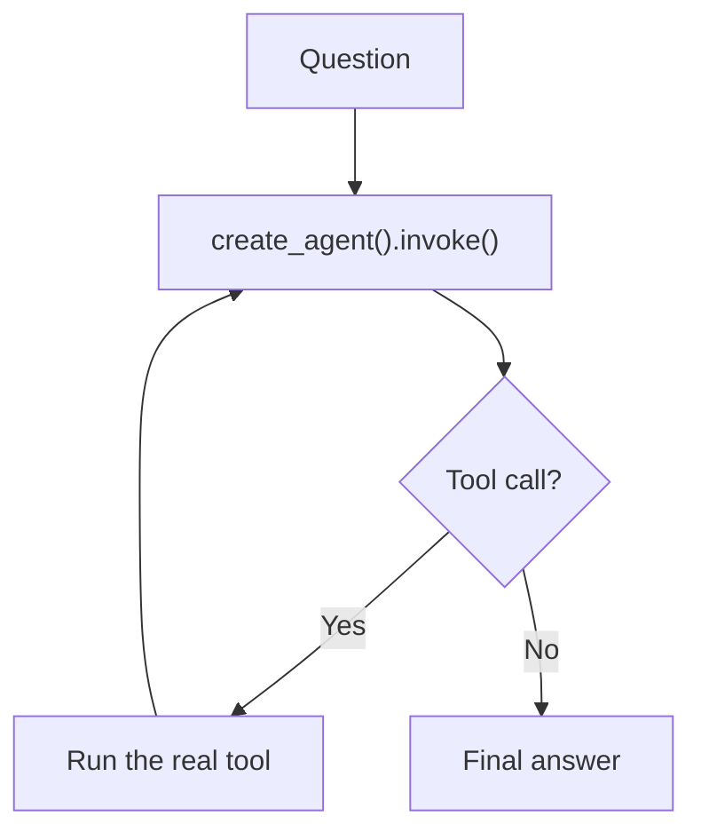

import Quiz from '@site/src/components/Quiz';
import {questions as int6Questions} from '@site/src/data/quizzes/int6';

# Chapter 6: Your First Agent

> **Time:** 20 minutes. **Cost:** $0 with Ollama, a fraction of a cent with OpenAI or Anthropic.

Chapter 5 built the reason/act/observe loop by hand, three times over, once per provider. Each version was around 40 lines: a hand-written JSON schema for every tool, a hand-written `MAX_STEPS` cap, and provider-specific code for how tool calls and results are shaped. It worked, but writing that same loop three separate times is exactly the kind of repetitive plumbing a framework exists to remove. This chapter rebuilds the identical assistant, same two tools, same four questions, using [LangChain](https://www.langchain.com)'s `create_agent`, so you can compare the two directly instead of taking "a framework helps" on faith.

## Same tools, read differently

Chapter 5's `calculator` and `search_wikipedia` functions don't change internally. What changes is how their schema gets built. Chapter 5 wrote a JSON dictionary by hand describing each tool's name, description, and parameters. Here, that dictionary is inferred automatically from a `@tool` decorator plus ordinary Python type hints and a docstring:

```python
@tool
def calculator(expression: str) -> str:
    """Evaluate a basic arithmetic expression, e.g. '18 * 7 + 4'."""
    ...
```

The type hint (`expression: str`) tells LangChain the parameter's type. The docstring becomes the tool's description. That's the same information Chapter 5's `tool_schemas` list held, just expressed once, where you'd naturally write it anyway, instead of duplicated into a separate dictionary that has to be kept in sync with the function by hand.

## One call instead of three branches

Chapter 5's `run_with_tools()` had a full `if/elif` per provider, each maintaining its own message list, its own loop, its own step cap. Here, the entire loop is one call:

```python
agent = create_agent(model=model, tools=[calculator, search_wikipedia])
```

`model` is just a string, `"ollama:llama3.2"`, `"openai:gpt-4o-mini"`, or `"anthropic:claude-haiku-4-5-20251001"`, picked by a 3-line `if/elif`. Everything downstream of that, the actual reason/act/observe loop, is identical no matter which provider you picked. `create_agent` also has its own built-in step limit, so there's no hand-written `MAX_STEPS` this time either.



Compare that to Chapter 5's diagram: the "Model decides," "run tool," and "append result" boxes are all still happening, they're just now inside a single call instead of code you wrote and can step through line by line.

## What you gain, what you give up

This isn't "frameworks are strictly better." It's a trade, and it's worth seeing plainly:

**What `create_agent` buys you:**
- No hand-written JSON schema, LangChain reads it from type hints and a docstring.
- No per-provider branching, one model string swaps the entire underlying implementation.
- A built-in step limit and built-in handling for a tool call that errors out, both of which Chapter 5 had to write by hand (`MAX_STEPS`, `call_tool()`'s `try/except`).

**What it costs you:**
- An added dependency (`langchain`, plus a provider-specific package for whichever one you're using), versus Chapter 5's lab, which needed only the providers' own SDKs.
- Less visibility. Chapter 5 showed you the exact message shape going back and forth for each provider, the `tool_call_id` matching, the "results go back as a **user**-role message" detail for Anthropic. That's now inside `create_agent`, real and working, but no longer something you can see or debug directly.
- A dependency on LangChain's own API stability and documentation, rather than each provider's official SDK.

Neither side is "correct" in general. For a quick prototype or a project that already leans on LangChain elsewhere, `create_agent` is less code and less to get wrong. For understanding exactly what's happening on the wire, or for a small production service where every dependency has a cost, Chapter 5's raw loop is worth knowing how to write. Now you've built both, so you can make that call for yourself.

## Hands-on lab: same agent, less code

Full instructions: [`labs/intermediate/06-your-first-agent`](https://github.com/fewshot-works/academy/tree/main/labs/intermediate/06-your-first-agent)

The exact same four questions from Chapter 5, run through `create_agent` instead of the hand-written loop. Here's a real run, with Ollama:

```
Question: What's 18 * 7 + 4?
  -> calling calculator({'expression': '18 * 7 + 4'})
Answer: The result of the calculation 18 * 7 + 4 is 130.

Question: What year did construction of the Eiffel Tower finish?
  -> calling search_wikipedia({'query': 'Eiffel Tower construction completion year'})
Answer: The construction of the Eiffel Tower finished in 1889. The tower was built for the World's Fair, held that year in Paris, and it officially opened on March 31, 1889.

Question: In one sentence, what's a good tip for staying focused while studying?
  -> calling search_wikipedia({'query': 'productivity tips while studying'})
Answer: Use a timer to block out dedicated study sessions with regular breaks to maintain focus and avoid burnout.

Question: What's 15% of 340, and what year did construction of the Eiffel Tower finish?
  -> calling calculator({'expression': '0.15 * 340'})
  -> calling search_wikipedia({'query': 'Eiffel Tower construction completion date'})
Answer: The answer to the original question is 51.0, which represents 15% of 340. As for the second part of the question, according to Wikipedia, the construction of the Eiffel Tower finished in 1889, marking its completion on March 31, 1889.
```

The results match Chapter 5's, right tool, right answer, for questions 1, 2, and 4. Question 3 shows the same tool-happy quirk Chapter 5 hit, `llama3.2` reaching for `search_wikipedia` on an opinion question that needed no lookup, but the details vary run to run: sometimes it calls `search_wikipedia`, sometimes `calculator` with a made-up expression, occasionally it just answers directly. That's real model non-determinism, not something the framework changes, Chapter 5's hand-written loop hit the exact same behavior with the exact same model.

The bigger, more consistent difference is the code itself: `agent.py` is 123 lines. Chapter 5's `tool_use.py` is 270. Almost the entire gap is the provider-branching logic Chapter 5 wrote by hand, collapsed here into a 3-line `if/elif` that only picks a model string.

## Checkpoint

<details>
<summary>What did <code>create_agent</code> collapse that Chapter 5's loop did by hand?</summary>

Three things: the JSON tool schema (now inferred from type hints and a docstring), the per-provider branching for how tool calls and results are shaped (now just a model string), and the step-limiting safety net (`create_agent` has its own built-in limit, no hand-written `MAX_STEPS` needed).
</details>

<details>
<summary>Why do the tool functions need type hints and a docstring here, but didn't in Chapter 5?</summary>

Chapter 5 built the JSON schema for each tool by hand, in a separate `tool_schemas` dictionary, so the function itself didn't need to carry that information in any particular format. Here, `create_agent` builds that same schema automatically, but it has to read it from somewhere: the parameter's type hint becomes the schema's type, and the docstring becomes the description.
</details>

<details>
<summary>What do you give up by using <code>create_agent</code> instead of Chapter 5's raw loop?</summary>

Visibility into the exact message shape going back and forth (the `tool_call_id` matching, Anthropic's user-role tool results, and so on, all real, all still happening, just no longer something you can see), plus an added dependency on LangChain itself, on top of whichever provider SDK you're already using.
</details>

## Check Your Knowledge

<details>
<summary>Click to start quiz</summary>

<Quiz chapterId="int6" questions={int6Questions} />

</details>

## Bonus: build this without code, in Langflow

Foundations Chapter 7's bonus section had you open Langflow's **Simple Agent** template, calculator and URL-fetching tools already wired straight into an **Agent** component. That single component is LangChain's agent under the hood, the same `create_agent` this chapter just showed you in code, wired up visually instead.

If you still have that flow, reopen it. If not, rebuild it: **New Flow** → **Simple Agent** template, point the model at your local Ollama server (or add an OpenAI/Anthropic key) the same way you did in Foundations. Open **Playground** and ask the same multi-tool question from this chapter's lab: *"What's 15% of 340, and what year did construction of the Eiffel Tower finish?"*

Now that you've read `agent.py`, look at what the Agent component's logs show for each step, the tool it picked, the arguments it filled in, the result it got back. That's the exact same `messages` list this chapter's `run_with_tools()` function walks to print its trace, just rendered as a diagram instead of printed to a terminal.

## What's next

You've now built the same agent two ways, hand-rolled and framework-assisted, and can weigh that trade-off for yourself. Both versions share a real limitation, though: every run in this chapter and the last started from a blank conversation. Chapter 7 tackles memory, how an agent keeps track of what's already been said, both within one conversation and across several.
