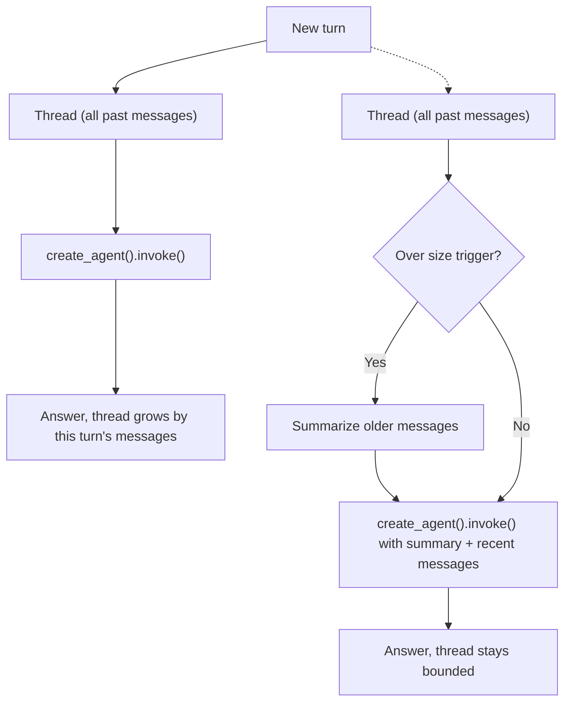

import Quiz from '@site/src/components/Quiz';
import {questions as int7Questions} from '@site/src/data/quizzes/int7';

# Chapter 7: Memory

> **Time:** 25 minutes. **Cost:** $0 with Ollama, a fraction of a cent with OpenAI or Anthropic.

Every agent you've built so far answers one question at a time. Ask it something, get an answer, ask it something else, and it has no idea the first question ever happened, because every `agent.invoke()` call in Chapters 5 and 6 started from a blank `messages` list. That's fine for a single lookup. It falls apart the moment you want an actual conversation, one where "what about the second one?" refers back to something said three questions ago. This chapter gives the Chapter 6 agent that memory, first the simple way, then a way that scales.

## Short-term memory: remember everything

The simplest fix is also the smallest code change: give `create_agent` a **checkpointer**, and tag every call with a **thread ID**.

```python
from langgraph.checkpoint.memory import InMemorySaver

agent = create_agent(model=model, tools=[calculator, search_wikipedia], checkpointer=InMemorySaver())

thread_config = {"configurable": {"thread_id": "conversation-1"}}
agent.invoke({"messages": [{"role": "user", "content": message}]}, thread_config)
```

The checkpointer stores the full message history for each `thread_id`. Every `invoke()` call that shares that ID reads the stored history, adds the new message, and appends the response back into it. A different `thread_id` would start a completely separate conversation with no memory of this one, the same way a new browser tab starts a new chat. `InMemorySaver` keeps everything in your program's memory, which resets when the script exits, that's the right fit for a local lab or a short-lived session. A real app would swap in a persistent checkpointer (Postgres, Redis, and others exist) so conversations survive a restart, without changing anything else about how the agent is called.

This works. It's also, by construction, unbounded: every turn adds to the thread, and every future turn sends the *entire* thread back to the model. A six-message conversation is cheap. A six-hundred-message one is slow, expensive, and will eventually be too big for the model's context window altogether.

## Summarized long-term memory: compress the old parts

`SummarizationMiddleware` is the fix for that. Give `create_agent` one more argument, and once the thread crosses a size trigger, the older messages get automatically collapsed into a short summary, keeping only the summary plus the most recent few messages going forward.

```python
from langchain.agents.middleware import SummarizationMiddleware

agent = create_agent(
    model=model,
    tools=[calculator, search_wikipedia],
    checkpointer=InMemorySaver(),
    middleware=[
        SummarizationMiddleware(model=model, trigger=("tokens", 300), keep=("messages", 4)),
    ],
)
```

`trigger=("tokens", 300)` means: once the thread's token count crosses 300, summarize. `keep=("messages", 4)` means: keep the most recent 4 messages intact, alongside the new summary of everything older. 300 tokens is deliberately tiny, chosen so this chapter's short demo conversation actually crosses it and you get to see a real summarization event happen. A production trigger would sit in the thousands, so summarization only kicks in on conversations that are genuinely getting long, not every couple of exchanges.

The key word is *summarize*, not *delete* or *trim*. A simpler fix would just drop the oldest messages once the thread gets too big, but that throws information away outright. Summarization keeps a compressed trace of it instead, an LLM call that reads the old messages and writes a short paragraph capturing what mattered. Cheaper going forward, but lossy: the summary is only as good as that LLM call was.



## What you gain, what you give up

**Short-term memory (checkpointer only):**
- Nothing is lost, ever. Every word of every past turn is still there, verbatim.
- Simple: one new argument to `create_agent`, one `thread_id`.
- Cost and latency grow with the conversation, without limit, until you either hit the model's context window or the wait gets long enough that users notice.

**Summarized long-term memory (checkpointer + `SummarizationMiddleware`):**
- Cost and latency stay roughly flat, no matter how long the conversation runs.
- The summary is a real LLM call writing a compressed version of the past, which means it can, and occasionally will, blur or drop a detail a person would have kept.
- One more thing to configure (`trigger`, `keep`) and reason about when something goes wrong.

Neither is "correct" in general. A short support chat or a quick tool session is probably fine with plain short-term memory, the conversation will be over before the size ever matters. A long-running assistant, one you might come back to over days, needs something like summarization just to stay usable. Now you've built both, so you can pick based on how long your conversation is actually going to run.

## Hands-on lab: same conversation, two memories

Full instructions: [`labs/intermediate/07-memory`](https://github.com/fewshot-works/zero-to-agent/tree/main/labs/intermediate/07-memory)

Two scripts, the identical six-turn conversation: a first message stating a name and a project, a few unrelated questions, then a final question that only a working memory can answer correctly. Here's a real run with Ollama, `chat_short_term.py`:

```
You: Hi, my name is Priya and I'm building a birdwatching app.
Agent: Hi Priya, it seems like you're looking for information on how birdwatching can impact birds and their habitats. [...]
  (thread now holds 4 messages)

You: What's a good name for a database table that stores bird species?
Agent: For your birdwatching app's database, I would suggest naming the table [...]
  (thread now holds 8 messages)

You: What's 12 * 8?
Agent: The result of the calculation is 96. [...]
  (thread now holds 12 messages)

You: What year did construction of the Eiffel Tower finish?
Agent: The construction of the Eiffel Tower finished in 1889. [...]
  (thread now holds 16 messages)

You: Any tips for staying motivated on a side project?
Agent: Staying motivated on a side project can be challenging, but here are some tips [...]
  (thread now holds 20 messages)

You: What's my name, and what am I building?
Agent: You're Priya, and you're building a birdwatching app! I remember that earlier.
  (thread now holds 24 messages)
```

And `chat_summarized.py`, same six questions:

```
You: Hi, my name is Priya and I'm building a birdwatching app.
Agent: [...]
  (thread now holds 4 messages)

You: What's a good name for a database table that stores bird species?
Agent: [...]
  (thread now holds 6 messages)

You: What's 12 * 8?
Agent: The answer to the math problem is 96. [...]
  (thread now holds 6 messages)

You: What year did construction of the Eiffel Tower finish?
Agent: [...] The construction of the Eiffel Tower was completed in 1889. [...]
  (thread now holds 6 messages)

You: Any tips for staying motivated on a side project?
Agent: [...]
  (thread now holds 6 messages)

You: What's my name, and what am I building?
Agent: [...] Priya is building a birdwatching app with features such as user profiles, species identification, location tracking, and community features.
  (thread now holds 6 messages)
```

The message counts are the whole story here. `chat_short_term.py`'s thread grows every turn: 4, 8, 12, 16, 20, 24. `chat_summarized.py`'s grows once, to 6, then holds flat at 6 through the rest of the conversation, even though the exact same six questions were asked. Both scripts still get the final recall question right, Priya's name and her birdwatching app both survive into the summarized version, just compressed rather than kept word for word.

## Checkpoint

<details>
<summary>What does a checkpointer plus a <code>thread_id</code> actually give an agent that Chapter 5 and 6's <code>agent.invoke()</code> calls didn't have?</summary>

A place to store the conversation's messages between separate `invoke()` calls, keyed by `thread_id`. Without a checkpointer, every `invoke()` call starts from whatever `messages` list you pass it, and nothing is remembered afterward. With one, calls sharing the same `thread_id` read and build on the same stored history.
</details>

<details>
<summary>Why doesn't short-term memory (checkpointer only, no summarization) scale to a very long conversation?</summary>

Every `invoke()` call sends the *entire* stored thread back to the model. The longer the conversation runs, the bigger that thread gets, and the more it costs in tokens and latency on every single turn, until eventually it's too big for the model's context window at all.
</details>

<details>
<summary>What do <code>SummarizationMiddleware</code>'s <code>trigger</code> and <code>keep</code> parameters each control?</summary>

`trigger` sets the size threshold (in tokens) that, once crossed, causes summarization to kick in. `keep` sets how many of the most recent messages stay intact, word for word, alongside the new summary of everything older than that.
</details>

## Check Your Knowledge

<details>
<summary>Click to start quiz</summary>

<Quiz chapterId="int7" questions={int7Questions} />

</details>

## Bonus: memory in Langflow

You don't have to build this by hand to see it in action. Reopen the Simple Agent flow from Foundations Chapter 7's bonus section (the same one Chapter 6's bonus pointed back to), open **Playground**, and have a short back-and-forth: tell it your name in one message, ask it to recall that name two or three messages later. It'll get it right, because Langflow's Playground keeps a `session_id`-scoped message history automatically, the no-code equivalent of the `checkpointer` and `thread_id` this chapter just built in code.

If you want to see or customize exactly what's being stored, Langflow also has a dedicated Memory component you can wire into a flow to read back the stored message history directly, rather than relying on the Playground's built-in session handling.

## What's next

You've now built an agent that uses tools, and remembers what's been said, either fully or in summarized form. What you haven't done yet is check whether any of it is actually *good*: does retrieval pull back the right chunk, does the agent pick the right tool often enough, is the summary actually preserving what matters? Chapter 8 covers how to measure that, instead of just eyeballing whether an answer looks right.
