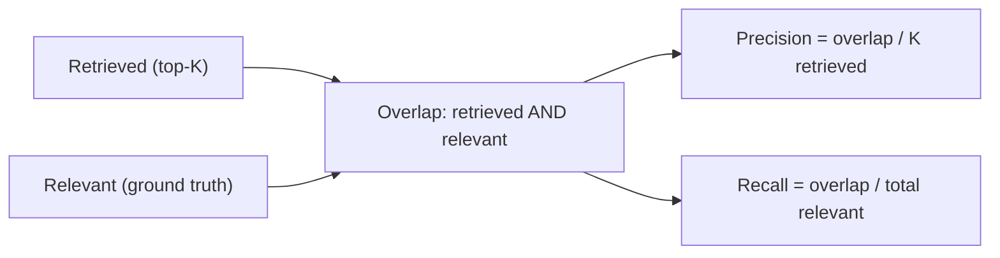
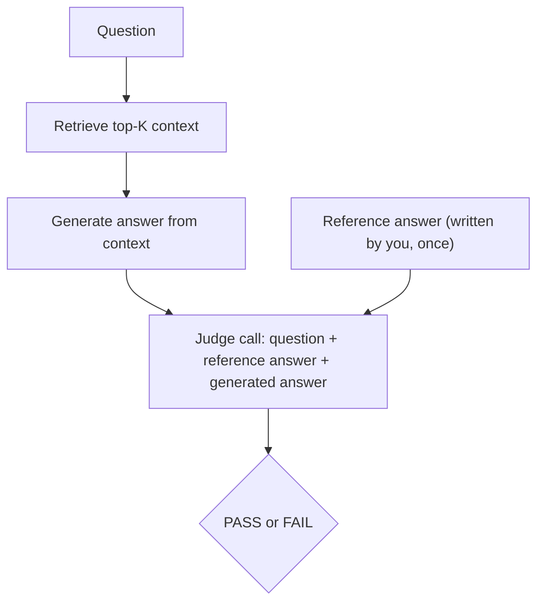

import Quiz from '@site/src/components/Quiz';
import {questions as int8Questions} from '@site/src/data/quizzes/int8';

# Chapter 8: Evaluating What You Built

> **Time:** 30 minutes. **Cost:** $0 with Ollama, a few cents with OpenAI.

Every chapter so far has been judged by eye. Chapter 3 said "look, hybrid search narrowed the gap on this one question." Chapter 6 said "look, the agent picked the right tool." That's fine for building intuition, but it doesn't scale, and it doesn't survive someone asking "how do you know?" This chapter answers that question two ways: **precision and recall** for whether retrieval finds the right documents, and **LLM-as-judge** for whether a generated answer is actually correct.

## Precision and recall, concretely

Say a question has exactly one truly relevant document in your whole corpus, and you retrieve the top 3 documents for it.

- If that one relevant document is somewhere in your 3, **recall is 1.0** — you found everything that mattered.
- But only 1 of the 3 you retrieved was actually relevant, so **precision is 1/3 ≈ 0.33** — most of what you handed back was noise.

That's the whole idea. **Precision** asks "of what I retrieved, how much was actually relevant?" **Recall** asks "of what was actually relevant, how much did I retrieve?" They're both fractions, and they can move in opposite directions: retrieve everything in your database and recall hits 1.0 instantly, while precision collapses, because now almost everything you retrieved is irrelevant.

```python
def precision_at_k(retrieved_ids, relevant_ids, k):
    hits = len(set(retrieved_ids[:k]) & relevant_ids)
    return hits / k

def recall_at_k(retrieved_ids, relevant_ids, k):
    hits = len(set(retrieved_ids[:k]) & relevant_ids)
    return hits / len(relevant_ids)
```

To compute either one, you need a **ground-truth label**: for each question, which document IDs actually answer it. That's the part nobody can automate for you, someone (you) has to look at the corpus and decide what's relevant, once, up front. Everything downstream is just counting.



## LLM-as-judge

Precision and recall tell you whether the *right documents* were found. They say nothing about whether the *answer written from those documents* is actually correct. For that, exact string matching doesn't work, "Fernwood gives a free drink after every ten purchases" and "Based on the context, Fernwood's loyalty program requires 10 purchases for a free drink" mean the same thing but share barely any exact wording.

The fix: use a second LLM call to grade the first one's output. Give it the question, a short reference answer you wrote, and the model's generated answer, and ask it to reply `PASS` or `FAIL`.

```python
def judge(question, reference_answer, candidate_answer):
    prompt = (
        "You are grading whether a candidate answer is factually consistent "
        "with a reference answer. Reply with PASS on the first line if the "
        "candidate answer contains the same key facts as the reference "
        "answer, or FAIL if it contradicts or misses them. On the second "
        "line, give one sentence explaining why.\n\n"
        f"Question: {question}\n"
        f"Reference answer: {reference_answer}\n"
        f"Candidate answer: {candidate_answer}"
    )
    return ask(prompt)
```

That's the entire technique. There's no special scoring model, no separate library, just a plain LLM call with a strict prompt, reading another LLM call's output the way a person would grade an essay against an answer key.



## Hands-on lab: measuring both

Full instructions: [`labs/intermediate/08-evaluating`](https://github.com/fewshot-works/zero-to-agent/tree/main/labs/intermediate/08-evaluating)

Both scripts reuse Chapter 3's exact 12-document corpus (three fictional coffee companies) and a 5-question eval set, some questions have one relevant document, some have several, on purpose, so precision and recall actually diverge instead of moving together.

**`evaluate_retrieval.py`** runs all 5 questions through Chapter 3's baseline (vector-only) and hybrid (vector + BM25) retrieval, scoring precision@3 and recall@3 for each. Real output:

```
Q: How many purchases before Fernwood gives you a free drink?
   relevant: ['fernwood-loyalty']
   baseline top-3: ['harborbean-loyalty', 'fernwood-loyalty', 'fernwood-menu']  precision=0.33 recall=1.00
   hybrid   top-3: ['harborbean-loyalty', 'fernwood-loyalty', 'fernwood-menu']  precision=0.33 recall=1.00

Q: How do the loyalty programs of Fernwood, Harbor Bean, and Whistlepost differ?
   relevant: ['fernwood-loyalty', 'harborbean-loyalty', 'whistlepost-loyalty']
   baseline top-3: ['whistlepost-loyalty', 'harborbean-loyalty', 'fernwood-loyalty']  precision=1.00 recall=1.00
   hybrid   top-3: ['whistlepost-loyalty', 'fernwood-loyalty', 'harborbean-loyalty']  precision=1.00 recall=1.00

Averages across all questions:
  Baseline (vector only) -> precision@3: 0.47  recall@3: 0.90
  Hybrid (vector + BM25) -> precision@3: 0.47  recall@3: 0.90
```

(Full 5-question output, including the other three questions, is in the lab's README.) Notice the averages are **identical** for baseline and hybrid here. Looking at every question, both methods retrieved the same top-3 document set, only the ranking order inside those three differed. Chapter 3 already said hybrid "narrows the gap but doesn't always flip the top result," this is that same finding, now measured across five questions instead of guessed from one. A single example could have made hybrid look like a clean win by luck; averaging across a small eval set is what turns a feeling into a checkable number, even when the number says "no measurable difference here."

**`evaluate_with_judge.py`** retrieves context, generates an answer, then judges it against a reference answer, for the same 5 questions. Real output for one question:

```
Q: What's Whistlepost's most popular drink and where is it located?
   reference: Whistlepost's most popular drink is the Smoked Maple Cold Brew, and it has one flagship location in a converted railway signal box.
   generated: Unfortunately, the context doesn't provide information about the location of either Whistlepost Coffee or its most popular drink. It only mentions that the Smoked Maple Cold Brew was introduced in 2021.
   verdict: PASS -- The candidate answer correctly identifies Whistlepost's most popular drink as the Smoked Maple Cold Brew, but fails to provide accurate information about its location and context regarding its introduction year.

Pass rate: 5/5 (100%)
```

Look closely at that verdict: the judge's own one-sentence reason says the answer "fails to provide accurate information about its location," half of what the question asked, and still writes `PASS` on the first line. This reproduced across two separate runs, it isn't a one-off glitch. That's the honest limit of LLM-as-judge, covered next.

## What these numbers don't tell you

- **A 5-question eval set is tiny.** One question flipping from PASS to FAIL swings the pass rate by 20 points. Real evaluation sets run into the dozens or hundreds of questions specifically so one noisy result doesn't dominate the average.
- **Recall@k is capped by k, not just by retrieval quality.** A question with 4 relevant documents can never reach recall@3 = 1.0, no matter how good the search is, because only 3 slots exist. Compare recall across questions with the same relevant-document count, not across all of them equally.
- **The judge is an LLM call, not ground truth.** This chapter's own lab run caught it passing an answer that its own reasoning flagged as incomplete. LLM-as-judge is a fast, cheap way to grade hundreds of answers you couldn't read individually, but it's a signal to spot-check against, not a verdict to trust blindly.

## Checkpoint

<details>
<summary>A question has 2 relevant documents in the corpus. You retrieve the top 3 and both relevant documents are in there. What are precision@3 and recall@3?</summary>

Recall@3 = 2/2 = 1.0 (you found every relevant document). Precision@3 = 2/3 ≈ 0.67 (2 of the 3 documents you retrieved were relevant, the third one wasn't).
</details>

<details>
<summary>Why can't you evaluate a generated answer with exact string matching against a reference answer?</summary>

The same correct fact can be worded many different ways. Exact matching would mark a correctly-worded-differently answer as wrong, so it systematically underestimates quality unless the model happens to phrase things exactly like the reference.
</details>

<details>
<summary>This chapter's real lab run showed the judge marking an incomplete answer as PASS, in its own reasoning. What does that mean for how you should use LLM-as-judge results?</summary>

Treat pass rates as a useful signal for catching large regressions or comparing two approaches at scale, not as proof any individual answer is correct. Spot-check some of the judge's actual verdicts against the real answers before trusting the aggregate number.
</details>

## Check Your Knowledge

<details>
<summary>Click to start quiz</summary>

<Quiz chapterId="int8" questions={int8Questions} />

</details>

## What's next

You've now built retrieval, an agent with tools and memory, and a way to measure whether any of it actually works. Chapter 9 puts it all together: a single multi-tool agent combining web search, a calculator, and RAG over your own documents, the capstone for everything Intermediate has covered.
