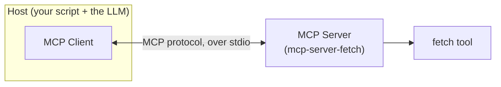

import Quiz from '@site/src/components/Quiz';
import {questions as mcp1Questions} from '@site/src/data/quizzes/mcp1';

# Chapter 1: What Is MCP

> **Time:** 20 minutes. **Cost:** $0 with Ollama, a fraction of a cent with OpenAI or Anthropic.

## The problem MCP solves

Before a country agrees on one plug shape, every appliance maker builds its own. A lamp from one manufacturer needs a completely different socket than a kettle from another. Wiring a house means either standardizing on one manufacturer's ecosystem, or installing a different outlet for every device you might ever own. Once everyone agrees on a standard plug and socket, that problem disappears: any appliance works in any outlet, no rewiring, no asking the manufacturer for a custom adapter.

Every tool you've connected to an agent so far has been the "own plug shape" kind. Intermediate Chapter 5's `calculator` and `search_wikipedia`, Chapter 6's same two tools rebuilt with `create_agent`, you wrote the Python function, and you wired it into your agent's code by hand. That's fine when you're the one building both sides. It stops being fine the moment you want to use a tool someone else built, or let someone else's agent use a tool you built, without both of you first agreeing on custom wiring.

**MCP (Model Context Protocol)** is that standard socket shape, for AI tools instead of appliances. A server built by anyone, following the MCP spec, can be plugged into any agent that speaks MCP, no custom adapter code required.

## Host, client, and server

MCP describes three roles:

- **Host** — the application the person is actually using. In this chapter's lab, that's your Python script (and the LLM it's calling). In other setups, it could be Claude Desktop, an IDE, or any other app with an agent inside it.
- **Client** — the connector that lives inside the host and manages the conversation with exactly one server. A host with three servers wired in runs three clients, one each.
- **Server** — a separate program that exposes tools (and, as Chapter 5 of this track covers, other things too) over the MCP protocol. It can run as a subprocess on your machine, or somewhere else entirely, more on that split in Chapter 4.



The split matters because of what it removes: the host never needs to read the server's source code. It asks the server, over the protocol, "what do you offer?", and the server answers with a list of tools, their names, descriptions, and the exact shape of arguments each one expects. That's the whole handshake, the same one this chapter's lab performs against a server neither you nor the agent has ever seen the inside of.

## What a server actually exposes

The thing a server hands back for each tool isn't just a name, it's a strict schema: expected argument names, their types, which ones are required. Chapter 5 of this track covers two more things a server can expose beyond tools, resources and prompts. For now, tools are the only piece that matters, since they're the piece an agent calls to actually do something.

That strictness is a real difference from the tools you hand-wrote in Intermediate. Your own `calculator(expression)` accepts whatever Python hands it and does its best. An MCP server enforces the schema it declared, if a caller sends the wrong type, the server rejects the call outright instead of quietly coercing it. You'll see this happen for real in the lab below.

## Hands-on lab: connect an agent to a server you didn't write

Full instructions: [`labs/mcp/01-what-is-mcp`](https://github.com/fewshot-works/academy/tree/main/labs/mcp/01-what-is-mcp)

The lab wires a `create_agent` agent, the exact same call from Intermediate Chapter 6, to `mcp-server-fetch`, an official MCP reference server that fetches a URL and returns its text. `uvx mcp-server-fetch` downloads and runs it on the fly, nothing to install by hand beyond `uv` itself. Here's a real run, with Ollama:

```
Tools the fetch server offers: ['fetch']

Question: What is the page at https://example.com about? Answer in one sentence.
  -> calling fetch({'url': 'https://example.com'})
Answer: The page at https://example.com is a domain name used for demonstration purposes in Internet protocol documentation, and its content advises against using it in operational contexts without permission.
```

The script never defines a `fetch` function anywhere. `client.get_tools()` asks the running server what it offers and wraps whatever comes back as a LangChain tool, the same shape `create_agent` already expects from Chapter 6's hand-written `@tool` functions.

💡 Two honest surprises from testing, both worth knowing about before you hit them yourself:

- **A wrong-typed argument gets rejected, not coerced.** `llama3.2` occasionally called `fetch` with `start_index` as the string `'0'` instead of the integer `0`, and the server came back with a real validation error, `"'0' is not of type 'integer'"`, rather than silently accepting it. That's the schema enforcement described above, happening live. Hosted models get the types right more consistently than small local ones.
- **A version-skew bug needed a workaround.** As of this writing, the latest `mcp-server-fetch` release imports a name that was renamed in the `mcp` package's newest major version, so a plain `uvx mcp-server-fetch` fails with an `ImportError`. The lab's server config pins a compatible version with `--with "mcp<2.0.0"`. It's a real bug in someone else's package, not something wrong with your setup, and it's a taste of a very real MCP-ecosystem problem: servers and clients version independently, and they don't always agree.

## Checkpoint

<details>
<summary>Why couldn't Chapter 6's agent use a tool someone else built, without copying that person's code into your own script?</summary>

Chapter 6's tools were hand-wired: a Python function decorated with `@tool`, living in your own file, called directly by your own code. There was no shared protocol between "your agent" and "someone else's tool", so the only way to use their tool was to read their code and reimplement or copy it. MCP removes that requirement: any MCP-speaking agent can ask any MCP server what it offers and call it, without ever reading the server's source.
</details>

<details>
<summary>In this chapter's lab, what plays the role of host, client, and server?</summary>

The host is your Python script together with the LLM it calls. The client is the connector `MultiServerMCPClient` creates and manages, it's the thing that actually speaks the MCP protocol to the server. The server is `mcp-server-fetch`, running as its own subprocess, started by `uvx`.
</details>

<details>
<summary>Why did the fetch server reject a tool call outright instead of just working with `'0'` as a stand-in for the integer `0`?</summary>

MCP servers enforce the input schema they declare. `start_index` was declared as an integer, and `'0'` is a string, so the server's validation rejected the call rather than guessing at what the caller meant. That's a deliberate strictness: your own hand-written Python functions will happily accept and misuse the wrong type, an MCP server won't.
</details>

## Check Your Knowledge

<details>
<summary>Click to start quiz</summary>

<Quiz chapterId="mcp1" questions={mcp1Questions} />

</details>

## What's next

This chapter connected to a server someone else built. Chapter 2 builds one from scratch, wrapping a tool you write yourself so any MCP-speaking agent, not just this one, can call it.
