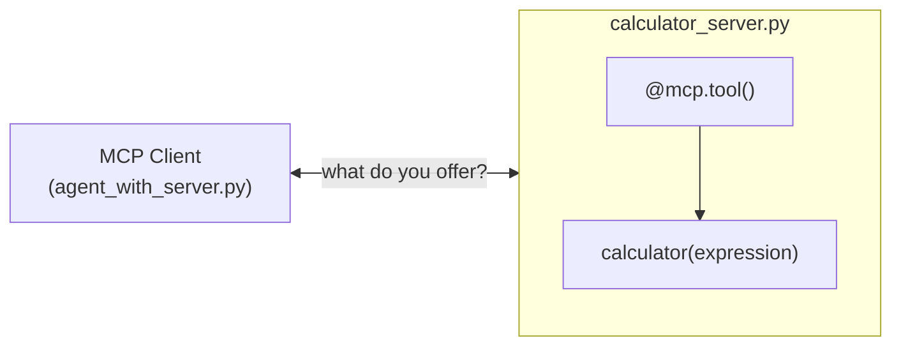

import Quiz from '@site/src/components/Quiz';
import {questions as mcp2Questions} from '@site/src/data/quizzes/mcp2';

# Chapter 2: Building Your Own MCP Server

> **Time:** 20 minutes. **Cost:** $0 with Ollama, a fraction of a cent with OpenAI or Anthropic.

## From consumer to publisher

Chapter 1 connected an agent to a server someone else built, `mcp-server-fetch`, without ever reading its source. This chapter builds the other side: a server *you* write, that any MCP-speaking agent could connect to the same way, including one you'll never meet.

The tool underneath won't be new. It's the same `calculator` from Intermediate Chapters 5 and 6, parse the expression with `ast`, walk the tree, allow only a few operators. What changes is how it's exposed: instead of a Python function wired directly into one agent's code, it becomes a standalone program that answers "what do you offer?" over MCP, the same question Chapter 1's client asked `mcp-server-fetch`.

## FastMCP: a decorator, not a rewrite

The official MCP Python SDK ships **FastMCP**, a small layer that turns a plain function into an MCP tool with one decorator:

```python
from mcp.server.fastmcp import FastMCP

mcp = FastMCP("calculator")

@mcp.tool()
def calculator(expression: str) -> str:
    """Evaluate a basic arithmetic expression, e.g. '18 * 7 + 4'."""
    ...

if __name__ == "__main__":
    mcp.run()
```

Three pieces do the actual work:

- **`FastMCP("calculator")`** creates the server, the name is just a label.
- **`@mcp.tool()`** reads the function's type hints (`expression: str`) and docstring, and builds the schema a client sees when it asks what this server offers. You never write that schema by hand, it comes from the same function signature and docstring you'd write anyway.
- **`mcp.run()`** starts the server listening for MCP messages on stdin and stdout. It only runs when this file is executed directly, which is exactly what happens when a client starts it as a subprocess.

That's the whole gap between "a function in my script" and "a server anyone can connect to."



## Errors, handled for you

Intermediate Chapter 5's hand-written loop wrapped every tool call in a `try/except`, because the model won't always send arguments that make sense, and an unhandled crash would take down the whole script. This chapter's server has no such wrapper anywhere in `calculator_server.py`, and it doesn't need one: FastMCP catches exceptions raised inside a tool itself, and turns them into an error result sent back to the caller, `"Error executing tool calculator: <class 'ast.Not'>"`, rather than crashing the server. It's the same safety net Chapter 5 built by hand, here for free.

## Hands-on lab: build and connect to your own server

Full instructions: [`labs/mcp/02-building-your-own-mcp-server`](https://github.com/fewshot-works/academy/tree/main/labs/mcp/02-building-your-own-mcp-server)

The lab is two files: `calculator_server.py` (the server above) and `agent_with_server.py` (a client, nearly identical to Chapter 1's, pointed at `["run", "calculator_server.py"]` instead of `mcp-server-fetch`). You never run the server yourself, the client starts it as a subprocess. Here's a real run, with Ollama:

```
Tools our own server offers: ['calculator']

Question: What's 15% of 340?
  -> calling calculator({'expression': '0.15 * 340'})
Answer: The answer to the question is: 51.0
```

From the client's point of view, there's no difference between this server and Chapter 1's, both just answer "what do you offer?" the same way. That's the whole point of the protocol: a server you wrote an hour ago and one a stranger published years ago plug into an agent identically.

## Bonus: build the server without code, in Langflow

Langflow can generate an MCP server from a flow, no Python required. Build a small flow with a **Calculator** component (or reuse one from an earlier chapter), then open that project's **Settings → MCP Server** tab and turn it on. Every flow in the project becomes an MCP tool, reachable by any MCP client, the same role `calculator_server.py` plays here, generated from a visual flow instead of `@mcp.tool()`.

Point `agent_with_server.py` at that server and `client.get_tools()` would list the Langflow-generated tool by name, called the same way. Worth seeing once, even though the rest of this track keeps building servers in code.

## Checkpoint

<details>
<summary>What does `@mcp.tool()` actually build, and where does it get the information to build it from?</summary>

It builds the schema an MCP client sees when it asks the server what it offers, the tool's name, description, and expected argument types. It gets that information from the function's own type hints and docstring, you never write the schema separately.
</details>

<details>
<summary>Why doesn't `calculator_server.py` need a `try/except` around the arithmetic logic, even though a client could send an expression that isn't valid math?</summary>

FastMCP catches exceptions raised inside a tool call and turns them into an error result handed back to the caller, instead of letting the server crash. That's the same behavior Intermediate Chapter 5 wrote by hand with its own `try/except`, here it's part of the framework.
</details>

<details>
<summary>From `agent_with_server.py`'s point of view, what's different between connecting to `calculator_server.py` and connecting to Chapter 1's `mcp-server-fetch`?</summary>

Nothing, structurally. Both are just entries in the same `mcp_servers` dict, a command to start the process and a transport. The client asks either one "what do you offer?" and gets back a list of tools, it has no idea, and doesn't need to know, which one you wrote yourself.
</details>

## Check Your Knowledge

<details>
<summary>Click to start quiz</summary>

<Quiz chapterId="mcp2" questions={mcp2Questions} />

</details>

## What's next

One agent, one server, wired up cleanly. Chapter 3 wires one agent to *several* servers at once, Chapter 1's off-the-shelf one and this chapter's own one, together, and looks at how the agent decides which server's tool to reach for.
