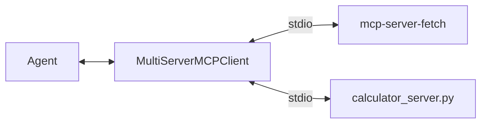

import Quiz from '@site/src/components/Quiz';
import {questions as mcp3Questions} from '@site/src/data/quizzes/mcp3';

# Chapter 3: One Agent, Many Servers

> **Time:** 20 minutes. **Cost:** $0 with Ollama, a fraction of a cent with OpenAI or Anthropic.

## Two servers, one client

Chapters 1 and 2 each connected an agent to exactly one MCP server. Real agents rarely stop at one: a coding assistant might talk to a filesystem server, a git server, and a web-search server, all at once. Nothing new has to be built for that. `MultiServerMCPClient` already takes a dict, Chapters 1 and 2 just happened to give it one entry each.

This chapter gives it two: Chapter 1's `mcp-server-fetch` and Chapter 2's own `calculator_server.py`, side by side, neither aware the other exists.

```python
mcp_servers = {
    "fetch": {
        "command": "uvx",
        "args": ["--with", "mcp<2.0.0", "mcp-server-fetch"],
        "transport": "stdio",
    },
    "calculator": {
        "command": "uv",
        "args": ["run", "calculator_server.py"],
        "transport": "stdio",
    },
}
```

`client.get_tools()` starts both as subprocesses, asks each "what do you offer?", and returns one flat list. The agent built from that list has no idea, and doesn't need to know, which server any given tool came from.



## Routing is the model's job, not the protocol's

MCP's job ends at "here's what each server offers." *Which* tool gets called for a given question is an ordinary tool-calling decision, the same one Intermediate Chapter 5 covered, just now drawing from a pool that spans multiple servers instead of one script's function list. Adding a second server doesn't add a routing layer, it just adds more candidates to the same decision.

## Hands-on lab: connect one agent to two servers

Full instructions: [`labs/mcp/03-one-agent-many-servers`](https://github.com/fewshot-works/academy/tree/main/labs/mcp/03-one-agent-many-servers)

The lab asks two questions, one only `calculator` can answer, one only `fetch` can, and prints which tool the agent reached for each time. A real run, with Ollama:

```
Tools from both servers: ['fetch', 'calculator']

Question: Use the calculator tool to figure out 12% of 850.
  -> calling calculator({'expression': '0.12 * 850'})
Answer: The answer to the user's question is: 102.0

Question: What is the page at https://example.com about? Answer in one sentence.
  -> calling fetch({'url': 'https://example.com'})
Answer: The webpage at https://example.com is a documentation example domain...
```

💡 **An honest surprise.** The first version of this lab's math question just said `"What's 12% of 850?"`, no mention of "calculator." With `llama3.2`, that consistently picked `fetch` instead, searching the web for the answer rather than calling the tool named `calculator` sitting right next to it, and got the math wrong roughly half the time. Both servers correctly advertised what they offer; the model simply judged "search" as more promising than "call this specific tool" from wording alone. Naming the tool explicitly fixed it every run. Larger models route correctly from the vague phrasing too, this is a small-model quirk worth seeing firsthand, not a bug in either server.

## Bonus: Langflow as the client

Chapter 2's bonus had Langflow play the *server* role, exposing a flow as an MCP server. Here Langflow plays the *client* role instead: an **MCP Tools** component in a flow can point at any external MCP server, `mcp-server-fetch` included, and the flow's agent gets that server's tools the same way `client.get_tools()` does in this lab's script. Two **MCP Tools** components in one flow, pointed at two different servers, is the no-code version of this chapter, no Python involved.

## Checkpoint

<details>
<summary>What does client.get_tools() return when mcp_servers has two entries, and does the agent code need to treat the two servers differently?</summary>

One combined list of tools from both servers. The agent code doesn't distinguish them at all, it just gets a list of tools and decides per question which one fits, same as it would with any single-server list.
</details>

<details>
<summary>Why did the vague phrasing "What's 12% of 850?" make llama3.2 call fetch instead of calculator, even though calculator was available and better suited?</summary>

Both servers correctly told the agent what they offer, MCP did its job. The model still judged searching the web as more likely to answer a percentage question than calling a tool literally named `calculator`, based on the wording alone. That's a model-level tool-choice decision, not a protocol failure, and naming the tool explicitly in the question fixed it.
</details>

<details>
<summary>Why does this lab's folder have its own copy of calculator_server.py instead of importing Chapter 2's?</summary>

This project's labs are deliberately self-contained, no shared library across folders, so any single lab can be copied out and run on its own. The cost is a duplicated file; the benefit is that a reader never has to chase code across chapters to run one lab.
</details>

## Check Your Knowledge

<details>
<summary>Click to start quiz</summary>

<Quiz chapterId="mcp3" questions={mcp3Questions} />

</details>

## What's next

Every server so far has run locally, started as a subprocess over stdio. Chapter 4 looks at the other transport MCP supports, a server running remotely over HTTP, and what changes (and what doesn't) when you swap one for the other.
