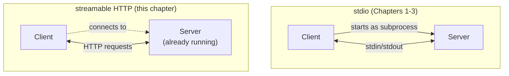

import Quiz from '@site/src/components/Quiz';
import {questions as mcp4Questions} from '@site/src/data/quizzes/mcp4';

# Chapter 4: Transports & Deployment

> **Time:** 15 minutes. **Cost:** $0 with Ollama, a fraction of a cent with OpenAI or Anthropic.

## Two ways to reach a server

Every server so far, `mcp-server-fetch` in Chapter 1, `calculator_server.py` in Chapters 2 and 3, ran over **stdio**: the client started it as a subprocess and exchanged MCP messages over its standard input and output, the same channels a terminal program reads and writes to. That only works when the client can start the server itself, on the same machine, in the same moment.

Real deployments often can't do that. A server might run on a different machine, stay up between agent runs instead of starting fresh each time, or serve many clients at once. MCP's answer is a second transport, **streamable HTTP**: the server runs on its own, listening on a URL, and any client connects to it the normal way any HTTP client connects to any server.

Neither transport changes what a server *does*. Both still answer "what do you offer?" the same way, and a tool's schema and logic don't know or care which one carried the request.



## What actually changes in the code

On the server side, one line: `mcp.run(transport="stdio")` becomes `mcp.run(transport="streamable-http")`, plus a host and port for `FastMCP(...)` to listen on. On the client side, `mcp_servers`' entry swaps `command`/`args` for a `url`:

```python
# stdio (Chapters 1-3): the client starts this
"calculator": {"command": "uv", "args": ["run", "calculator_server.py"], "transport": "stdio"}

# streamable HTTP (this chapter): the client just connects to this
"calculator": {"url": "http://127.0.0.1:8000/mcp", "transport": "streamable_http"}
```

That `url` could point at `127.0.0.1` for local testing, exactly like this lab, or at a real hostname for a server running anywhere else. Nothing else in the client changes either way.

A real remote server, one exposed on the open internet rather than sitting behind `127.0.0.1`, normally needs authentication too, so it doesn't answer "what do you offer?" for absolutely anyone. The MCP spec defines an OAuth 2.1-based authorization flow for this. This track doesn't implement it: every lab here runs on localhost, with nothing to protect. Worth knowing it exists before you put a server anywhere a stranger could reach it.

## Hands-on lab: swap stdio for HTTP

Full instructions: [`labs/mcp/04-transports-and-deployment`](https://github.com/fewshot-works/academy/tree/main/labs/mcp/04-transports-and-deployment)

This lab needs two terminals for the first time in this track. One starts `calculator_http_server.py` and leaves it running, the other runs `http_client_agent.py` to connect to it. That's deliberate: it's the clearest way to feel the difference stdio was hiding, the server isn't something the client owns and starts anymore, it's just *there*, the way a server on another machine would be.

A real run, with Ollama, in the client's terminal:

```
Tools from the HTTP server: ['calculator']

Question: Use the calculator tool to figure out 23 * 19.
  -> calling calculator({'expression': '23 * 19'})
Answer: The result of 23 multiplied by 19 is 437.
```

## Checkpoint

<details>
<summary>What's the practical difference between an mcp_servers entry with command/args and one with a url?</summary>

`command`/`args` tell the client how to *start* a server itself, as a subprocess, over stdio. A `url` tells the client where to *find* a server that's already running on its own, over HTTP. The client either launches the server or just connects to it, never both.
</details>

<details>
<summary>calculator_http_server.py's calculator() function is identical to Chapter 2's calculator_server.py. What does that tell you about where transport lives in MCP's design?</summary>

Transport is a separate concern from tool logic and schema. `@mcp.tool()` and the function underneath it don't know or care whether the bytes carrying a call arrived over stdin/stdout or an HTTP request, only `mcp.run(transport=...)` and the client's connection config change.
</details>

<details>
<summary>Why does this lab need two terminals, when every earlier chapter's lab only needed one?</summary>

An HTTP server isn't started by the client, it runs independently and keeps running on its own. Chapters 1-3's stdio servers only existed for the duration of one client run; this chapter's server has to already be running before the client connects, which means starting it separately.
</details>

## Check Your Knowledge

<details>
<summary>Click to start quiz</summary>

<Quiz chapterId="mcp4" questions={mcp4Questions} />

</details>

## What's next

So far, every server has offered exactly one kind of thing: tools. Chapter 5 covers MCP's other two primitives, resources and prompts, and what they're for when a tool alone isn't the right shape.
