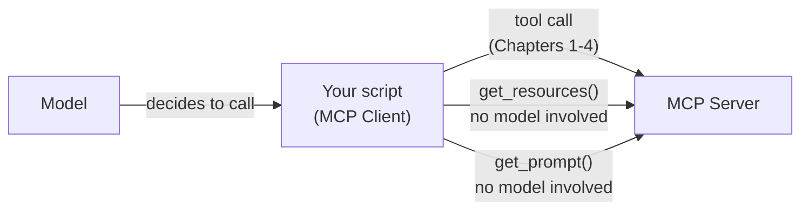

import Quiz from '@site/src/components/Quiz';
import {questions as mcp5Questions} from '@site/src/data/quizzes/mcp5';

# Chapter 5: Resources, Prompts & Sampling

> **Time:** 15 minutes. **Cost:** $0 with Ollama, a fraction of a cent with OpenAI or Anthropic.

## Tools aren't the only thing a server offers

Every server in this track so far has offered exactly one primitive: tools, things an agent decides to call mid-conversation. MCP defines two more:

- **Resources**: content a client can read, addressed by a URI the way a URL addresses a page. Not called, not given arguments by the model, just fetched.
- **Prompts**: reusable templates a server defines and a client fills in, getting back ready-to-send chat messages.

Both exist for the same reason tools do, to standardize something a server needs to hand a client, but neither one goes through the model's tool-calling decision. Your own script asks for them directly.



## Resources: content, not a function call

`calculator://supported-operations` in this chapter's server is a resource: a fixed string describing what the calculator tool accepts. `client.get_resources("docs")` reads it straight away, no model involved in the request.

```python
@mcp.resource("calculator://supported-operations")
def supported_operations() -> str:
    """The arithmetic operations the calculator tool supports."""
    return "add (+), subtract (-), multiply (*), divide (/), power (**), and negation (-x)."
```

A resource's URI is arbitrary, `calculator://` here is just a label this server chose, the same way a filename doesn't have to mean anything to the filesystem.

## Prompts: a template, filled in by the server, sent by you

A prompt is a function that returns filled-in text instead of computing an answer. `explain_answer(expression, answer)` takes two arguments and returns one string:

```python
@mcp.prompt()
def explain_answer(expression: str, answer: str) -> str:
    """A reusable template for asking a model to explain a calculator result in plain English."""
    return f"In one plain-English sentence, explain why {expression} equals {answer}."
```

`client.get_prompt("docs", "explain_answer", arguments={...})` returns that text wrapped as a chat message, ready to hand to `create_agent`'s `.ainvoke()` the same shape every earlier chapter used. The server never runs a model itself here, it only builds the message, your own script decides what to do with it.

## Sampling: the one this chapter can't demo

MCP defines a few more primitives beyond resources and prompts, roots and elicitation among them, but the one worth knowing about here is **sampling**, which reverses the usual direction: instead of a client asking a server for something, a server can ask the *client's* model to generate text. Picture a server-side tool that needs a one-line summary partway through its own logic, sampling lets it ask, rather than requiring its own separate model and API key.

The official MCP Python SDK supports this at the `ClientSession` level, but `langchain-mcp-adapters`, the wrapper every lab in this track uses, doesn't expose it as of this writing. Building a sampling-capable client means dropping to the raw SDK instead. Worth knowing exists, not worth a broken lab pretending otherwise.

That decision turned out to be the right one: the [2026-07-28 spec revision](https://modelcontextprotocol.io/specification/2026-07-28/changelog) officially deprecated Sampling, along with Roots and Logging, in favor of servers integrating directly with an LLM provider's own API instead of asking back through the client.

## Hands-on lab: read a resource, fill in a prompt

Full instructions: [`labs/mcp/05-resources-prompts-sampling`](https://github.com/fewshot-works/academy/tree/main/labs/mcp/05-resources-prompts-sampling)

A real run, with Ollama:

```
Resource content:
  add (+), subtract (-), multiply (*), divide (/), power (**), and negation (-x).

Prompt template filled in: In one plain-English sentence, explain why 12 * 7 equals 84.

Model's explanation: When you multiply 12 by 7, you're essentially adding 7 together 12 times, which comes out to 84.
```

## Checkpoint

<details>
<summary>How does calling client.get_resources() differ from how Chapters 1-3's agent called a tool?</summary>

A resource is read directly by your own script, `client.get_resources("docs")`, with no model deciding whether to fetch it. A tool call, by contrast, only happens when the model, inside `create_agent`'s loop, decides the conversation calls for it.
</details>

<details>
<summary>What does the server actually do inside explain_answer(expression, answer), and what does it not do?</summary>

It builds and returns a filled-in string, `"In one plain-English sentence, explain why 12 * 7 equals 84."` It does not run a model, the server doesn't have one. Turning that string into an actual explanation is the client's job, done afterward with its own agent.
</details>

<details>
<summary>Why doesn't this chapter's lab demonstrate sampling?</summary>

Sampling exists in the MCP protocol and the official Python SDK (`ClientSession`'s `sampling_callback`), but `langchain-mcp-adapters`, the client library this whole track builds on, doesn't currently expose it. Demonstrating it would mean dropping to a different, lower-level client API.
</details>

## Check Your Knowledge

<details>
<summary>Click to start quiz</summary>

<Quiz chapterId="mcp5" questions={mcp5Questions} />

</details>

## What's next

Every chapter so far has trusted the servers it connected to. Chapter 6 stops assuming that: what can go wrong when a tool's description lies about what it does, or a server's output tries to steer the model, and how to defend an agent against it.
