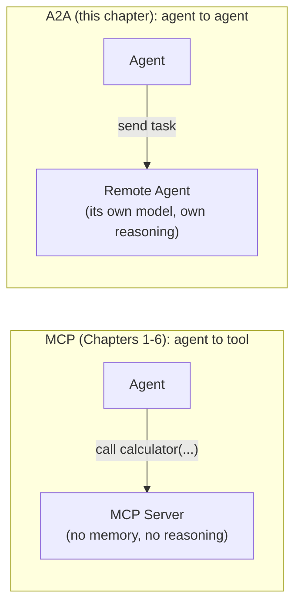

import Quiz from '@site/src/components/Quiz';
import {questions as mcp7Questions} from '@site/src/data/quizzes/mcp7';

# Chapter 7: Beyond MCP — Agent2Agent (A2A)

> **Time:** 20 minutes. **Cost:** $0 with Ollama, a fraction of a cent with OpenAI or Anthropic.

Every server this track has connected to, a calculator you wrote, `mcp-server-fetch`, a rogue weather server, was a *tool*: something with no memory of its own, no reasoning of its own, that answers a call and hands back a result. That's MCP's whole job, standardizing agent-to-*tool* communication. This chapter covers a different question: what happens when the thing on the other end isn't a tool, it's another agent, with its own model, its own reasoning, possibly built by someone else entirely?

## A different protocol for a different relationship

[A2A (Agent2Agent)](https://a2a-protocol.org/) was originally built by Google and, like MCP, is now governed by the Linux Foundation's Agentic AI Foundation. It reached a versioned 1.0 milestone, ships official SDKs in six languages, and has a multi-vendor steering committee (AWS, Cisco, Google, IBM, Microsoft, Salesforce, SAP, and ServiceNow, among others). Those are solid maturity and adoption signals, not an early experiment.

A2A's own documentation is explicit that it's **complementary to MCP, not competing with it**: MCP standardizes how an agent talks to a tool. A2A standardizes how one agent talks to *another* agent, discovering what it can do, handing it a task, and getting a result back, without either agent needing to know the other's internals.



## Agent Cards: MCP's list_tools, one level up

Before an A2A client sends anything, it fetches the remote agent's **Agent Card**, a small JSON document published at a well-known URL describing the agent's name, and its **skills**, what it can do and what input it expects. That's the same discovery-before-calling shape as MCP's `list_tools`, just describing a whole agent's capabilities instead of one function's schema.

```python
skill = AgentSkill(
    id="calculator",
    name="Calculator",
    description="Evaluates a basic arithmetic expression, e.g. '18 * 7 + 4', and returns the result.",
    examples=["23 * 19", "(4 + 6) / 2"],
)

agent_card = AgentCard(
    name="Calculator Agent",
    description="An agent that evaluates arithmetic expressions.",
    skills=[skill],
    # ...
)
```

A client resolves that card, then sends a message and gets back a **Task**, an object with a lifecycle (submitted, working, completed) and one or more **artifacts**, the task's actual output. That's more structure than an MCP tool call needs, because the thing on the other end might take longer than one request-response round trip to finish, or might need more than one message to complete.

## Wrapping a remote agent as a tool you already know how to use

This chapter's lab doesn't ask you to learn a new agent-building pattern. It reuses the exact `create_agent(model=..., tools=[...])` call every earlier chapter used, the only difference is what a "tool" does underneath. Instead of a function that runs locally, each tool here sends a task to a remote A2A agent and returns its answer:

```python
@tool
async def delegate_to_calculator_agent(expression: str) -> str:
    """Evaluate a basic arithmetic expression, e.g. '18 * 7 + 4'."""
    return await ask_remote_agent(REMOTE_AGENTS["calculator"], expression)
```

From the local model's point of view, nothing looks different from any other tool it's called all track. The A2A round trip, discover the card, create a client, send the task, read the artifact, is hidden inside `ask_remote_agent`, the same way `MultiServerMCPClient` hid an MCP round trip in Chapter 3.

## Hands-on lab: discover two agents, delegate to the right one

Full instructions: [`labs/mcp/07-a2a`](https://github.com/fewshot-works/academy/tree/main/labs/mcp/07-a2a)

Two small A2A servers run independently, `calculator_agent.py` on port 9001 and `wikipedia_agent.py` on port 9002, each publishing an Agent Card for exactly one skill. `orchestrator.py` discovers both cards, wraps each remote agent as a LangChain tool, and lets a local `create_agent` pick which one fits a given question.

A real run, with Ollama:

```
Discovered calculator agent: Calculator Agent -- skills: ['Calculator']
Discovered wikipedia agent: Wikipedia Agent -- skills: ['Wikipedia Lookup']

You: What is the Model Context Protocol?
  -> delegating via delegate_to_wikipedia_agent({'topic': 'Model Context Protocol'})
Agent: Introducing the Model Context Protocol (MCP)

The Model Context Protocol (MCP) is an open standard and open-source framework
designed to standardize the way artificial intelligence (AI) models share context
information. This protocol aims to facilitate more accurate and reliable
predictions by enabling AI models to exchange contextual information.
[... continues for several more paragraphs, most of it invented, see the callout below]

You: Use the calculator agent to figure out 23 * 19.
  -> delegating via delegate_to_calculator_agent({'expression': '23 * 19'})
Agent: The result of the calculation 23 * 19 is 437.
```

Two discovery calls up front, then each question routed to a different remote agent entirely. Neither remote agent knows the other exists, and the local agent never runs the arithmetic or the Wikipedia lookup itself, it only decides who to ask.

💡 Two honest surprises from testing, both worth knowing about before you hit them yourself:

- **Tool order affects which one `llama3.2` actually calls.** With only two tools registered, it was noticeably more reliable about calling the second one listed in `tools=[...]` than the first. `orchestrator.py` lists `delegate_to_wikipedia_agent` before `delegate_to_calculator_agent` on purpose, swap that order and the calculator question gets far less reliable. Not an A2A rule, a small-model quirk.
- **The Wikipedia agent's real result is short and accurate; `llama3.2`'s answer often isn't.** `search_wikipedia` really does return one true sentence, MCP "is an open standard... introduced by Anthropic in November 2024." Across several test runs, `llama3.2` routinely expanded that one sentence into confident-sounding paragraphs with invented details never in the snippet, a fake maintaining organization, fictional named components, features nobody built. This isn't paraphrasing, it's fabrication on top of a correct tool result. Hosted models (OpenAI, Anthropic) stick to what the tool actually returned far more reliably, worth switching `PROVIDER` if you want the Wikipedia answer itself to be trustworthy.

## Checkpoint

<details>
<summary>MCP and A2A both involve a client discovering something before calling it. What's actually different about what gets discovered?</summary>

MCP's `list_tools` describes a function: a name, a schema, and what it returns, calling it produces one immediate result. A2A's Agent Card describes an entire agent's skills, and sending it a task can spawn a lifecycle (submitted, working, completed) with artifacts arriving over time, because the thing on the other end might have its own reasoning to run through, not just a function to execute.
</details>

<details>
<summary>Why is A2A described as complementary to MCP rather than a replacement for it?</summary>

They standardize different relationships. MCP is agent-to-*tool*: something with no memory or reasoning of its own that answers a call. A2A is agent-to-*agent*: something with its own model and reasoning on the other end. A real system can use both, MCP for an agent's own tools, A2A for handing work to other agents entirely.
</details>

<details>
<summary>orchestrator.py wraps each remote A2A agent as a LangChain @tool. Why does that make the rest of the script identical to every earlier chapter's agent code?</summary>

`create_agent(model=..., tools=[...])` doesn't know or care what a tool does underneath, only its name, description, and schema. Whether a tool runs local Python, calls an MCP server, or sends a task to a remote A2A agent is invisible to the model deciding whether to call it.
</details>

## Check Your Knowledge

<details>
<summary>Click to start quiz</summary>

<Quiz chapterId="mcp7" questions={mcp7Questions} />

</details>

## What's next

Chapter 8 is the capstone for the MCP side of this track: one agent, your own MCP server and a public one, the guardrail pattern from Chapter 6, memory, and a Streamlit UI. It doesn't reach for A2A, this chapter's remote agents are a separate, complementary protocol, not another piece this capstone's single agent needs.
