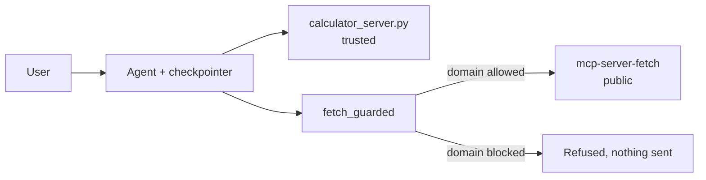

import Quiz from '@site/src/components/Quiz';
import {questions as mcp8Questions} from '@site/src/data/quizzes/mcp8';

# Chapter 8: Capstone

> **Time:** 20 minutes. **Cost:** $0 with Ollama, a fraction of a cent with OpenAI or Anthropic.

Six chapters, six separate ideas: connecting to a server you didn't build, building your own, wiring two servers to one agent, swapping transports, reaching past tools into resources and prompts, and hardening an agent against one that lies to it. This chapter doesn't add a new idea about *MCP*. It puts all six into one agent and gives it a browser window. Chapter 7's A2A agents sit outside this capstone, on purpose: they're a separate protocol for a separate job, agent-to-agent instead of agent-to-tool, not another plumbing piece this agent needs.

## What's being combined

- **Two MCP servers**, exactly like Chapter 3: `calculator_server.py`, unchanged since Chapter 2, a server you wrote and have every reason to trust; and `mcp-server-fetch`, the same public reference server from Chapter 1 and Chapter 3, a server you didn't write and can't fully trust.
- **Memory across the conversation**, the same checkpointer pattern Intermediate Chapter 7 introduced, so the agent can answer a question about something asked several turns earlier.
- **A guardrail on the one risky tool**, `fetch`. Fetch retrieves whatever URL it's asked for and hands the page's text back to the model, and Chapter 6 already showed why that's worth being careful about: a fetched page's own text is something the model reads, and nothing stops it from carrying an instruction of its own. This capstone wraps `fetch` in a fixed domain allowlist, applying Chapter 6's client-side guard pattern to a tool worth actually running, not a fictional rogue server.



## A fixed allowlist isn't the only option

This capstone's guard runs unattended: no human has to be in the loop for it to work, it just refuses anything outside `ALLOWED_DOMAINS` automatically, every time. That's exactly right for a domain check, there's no judgment call to make.

Not every risky tool call is that clear-cut. [Advanced Concepts: Human-in-the-Loop Approval Gates](/docs/advanced-concepts/human-in-the-loop) covers a stronger, slower mechanism: pausing execution right before a specific tool call runs, and waiting for a human to explicitly approve, edit, reject, or respond to it. Worth reaching for when a call is too consequential, or too context-dependent, for a fixed rule to decide alone. This capstone sticks with the allowlist because it needs to finish running without a human standing by.

## Hands-on lab: one agent, two servers, a guard, and a UI

Full instructions: [`labs/mcp/08-capstone`](https://github.com/fewshot-works/academy/tree/main/labs/mcp/08-capstone)

A real run, with Ollama:

```
You: What's 15% of 340?
  calling calculator({'expression': '15 * 340 / 100'})
Agent: The answer to your question, "What's 15% of 340?" is 51.0.

You: Now look up https://en.wikipedia.org/wiki/Model_Context_Protocol and summarize it in one sentence.
  calling fetch_guarded({'url': 'https://en.wikipedia.org/wiki/Model_Context_Protocol'})
Agent: The Model Context Protocol (MCP) is an open standard and open-source framework introduced by Anthropic in November 2024 to standardize the way artificial intelligence systems integrate and share data with external tools, systems, and data sources.

You: Try fetching https://totally-unapproved-domain.example.net instead -- what happens?
  [tool-call guard] blocked fetch to unapproved domain: totally-unapproved-domain.example.net
  calling fetch_guarded({'url': 'https://totally-unapproved-domain.example.net'})
Agent: It appears that the Model Context Protocol (MCP) has a list of approved domains, and https://totally-unapproved-domain.example.net is not on this list. As a result, the protocol is unable to fetch content from this domain.

You: What was the first thing I asked you to calculate?
  calling calculator({'expression': '15 * 340 / 100'})
Agent: You initially asked me to calculate 15% of 340, and the result was 51.0.
```

The Wikipedia fetch went through unchanged, the out-of-allowlist attempt was refused before any request left the building, and the last question, answerable only by remembering the very first message, still landed correctly with two tool calls and a blocked one in between.

The lab also includes a Streamlit wrapper, the exact same agent behind a chat window instead of a scripted conversation, useful if you want something clickable to demo.

## Checkpoint

<details>
<summary>Why is fetch wrapped in a guard, but calculator isn't?</summary>

`calculator_server.py` is a server you wrote yourself and can read end to end, there's nothing it could be hiding. `fetch` comes from a public server whose source this agent has never seen, and it returns arbitrary page text the model reads, exactly the kind of tool output Chapter 6 warned about.
</details>

<details>
<summary>What does fetch_guarded actually check, and what doesn't it try to do?</summary>

It checks the URL's domain against a fixed `ALLOWED_DOMAINS` set before ever calling the real `fetch` tool. It never tries to read the page's content for anything suspicious, the guard-not-detect pattern from Chapter 6, applied here instead of a fictional rogue server.
</details>

<details>
<summary>When would Human-in-the-Loop Approval Gates be a better fit than this capstone's fixed allowlist?</summary>

When a call is too consequential or too context-dependent for a fixed rule to judge safely, sending an email, issuing a refund, deleting a record, and a human is realistically available to approve, edit, reject, or respond to it before it runs. A fixed allowlist works well for something as clear-cut as "is this domain approved," but has no way to weigh judgment calls.
</details>

## Check Your Knowledge

<details>
<summary>Click to start quiz</summary>

<Quiz chapterId="mcp8" questions={mcp8Questions} />

</details>

## What's next

That's the MCP track. You've connected to servers you didn't write, built and served your own, wired several to one agent, deployed over two transports, used every primitive MCP defines, hardened an agent against a server that lies to it, and delegated a task to another agent entirely over A2A. From here, the [Advanced Concepts](/docs/advanced-concepts/overview) chapters this track has been linking back to, agent security, human-in-the-loop, guardrails, are worth a closer look if you haven't read them yet.
