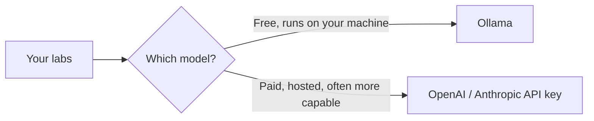

import Tabs from '@theme/Tabs';
import TabItem from '@theme/TabItem';

# Chapter 0: Set Up Your Machine

Before you go on a road trip, you pack the car first — snacks, a phone charger, a map. You don't figure that out while you're already driving. This chapter is the packing part. It's not exciting, but skipping it means every later chapter stops to fix a setup problem instead of teaching you something new. Do this once, carefully, and you won't think about it again.

You don't need to know how to code yet. You just need to follow each step in order.

## What you're installing, and why

| Tool | Why you need it |
|---|---|
| **Python** | The programming language every lab in this course uses. It's free, and it's the language most AI tooling is built around. |
| **A virtual environment** | Not a separate download — a built-in Python feature. It creates a private, isolated folder for this course's packages so they can't clash with anything else on your computer (or get clashed *by* anything else). |
| **VS Code** | A free code editor. You'll use it to open and run the lab files. |
| **Ollama** | Lets you run an AI model directly on your own computer — free, no account, no internet needed once it's downloaded. This is how you'll do almost every lab in Tiers 1 and 2 at zero cost. |
| **(Optional) An OpenAI or Anthropic API key** | If you'd rather use a hosted model instead of (or alongside) Ollama, this is how. Optional because Ollama alone gets you through the free path. |

Here's the shape of the decision you're setting up for:



You can install both and switch per lab — nothing below locks you into one path.

## Step 1: Install Python

First, check whether you already have it. Open your terminal (Mac/Linux: the **Terminal** app; Windows: **PowerShell**) and run:

```bash
python3 --version
```

If you see `Python 3.10` or higher, skip to Step 2. If not, or if you got an error:

<Tabs groupId="operating-systems">
<TabItem value="mac" label="macOS">

Download the installer from [python.org/downloads](https://www.python.org/downloads/) and run it. Or, if you use [Homebrew](https://brew.sh/):

```bash
brew install python
```

</TabItem>
<TabItem value="windows" label="Windows">

Download the installer from [python.org/downloads](https://www.python.org/downloads/). **Important:** on the first install screen, check the box that says **"Add python.exe to PATH"** before clicking Install — this is the single most common setup mistake, and skipping it means your terminal won't be able to find Python afterward.

</TabItem>
<TabItem value="linux" label="Linux">

Most distributions ship with Python already. If `python3 --version` didn't work, install it via your package manager, e.g. on Ubuntu/Debian:

```bash
sudo apt update && sudo apt install python3 python3-venv
```

</TabItem>
</Tabs>

Close and reopen your terminal, then re-run `python3 --version` to confirm it worked.

## Step 2: Create a project folder and a virtual environment

Pick a spot for this course's code — your Desktop or home folder is fine — and create a folder:

```bash
mkdir zero-to-agent-labs
cd zero-to-agent-labs
```

Now create a virtual environment inside it:

```bash
python3 -m venv venv
```

This creates a subfolder called `venv` — a self-contained, empty Python installation just for this project. **Why bother?** Without it, every Python package you install goes into one giant shared pile on your computer. Six months from now, some unrelated project might need a different version of the same package, and things break in confusing ways. A virtual environment keeps this course's packages in their own box.

Now turn it on ("activate" it):

<Tabs groupId="operating-systems">
<TabItem value="mac" label="macOS / Linux">

```bash
source venv/bin/activate
```

</TabItem>
<TabItem value="windows" label="Windows">

```powershell
venv\Scripts\activate
```

</TabItem>
</Tabs>

You'll know it worked because your terminal prompt now starts with `(venv)`. You'll run this activate command every time you come back to work on a lab in a new terminal window — it only stays on for that one window/session.

## Step 3: Install VS Code

Download and install [VS Code](https://code.visualstudio.com/) — it's free. You'll use it to open the lab folders and run the Python scripts. Any code editor works, but the labs' instructions assume VS Code, so it's the easiest path if this is new to you.

## Step 4: Install Ollama and download a model

This is the step that gets you a **free, private AI model running on your own computer.**

1. Go to [ollama.com](https://ollama.com), download the installer for your OS, and run it.
2. Open a terminal and pull a small model:

```bash
ollama pull llama3.2
```

This downloads about 2GB, so it takes a few minutes depending on your internet speed. This is a one-time download — after this, the model lives on your machine and needs no internet connection to run.

3. Check it works:

```bash
ollama run llama3.2
```

Type something like `hi, are you working?` and press Enter. You should get a reply printed back in your terminal. Type `/bye` to exit.

If you got a reply, Ollama is fully working and you can already do most of this course's labs for free, forever, with no account and no credit card.

## Step 5 (optional): Get a hosted API key

Ollama is enough to complete Tier 1 and most of Tier 2. Some learners prefer a hosted model instead, because it's often faster or more capable — this costs a small amount of money per request (usually fractions of a cent for these labs), billed by the provider directly to you. This project never sees or handles your key or your money.

- **OpenAI:** create a key at [platform.openai.com/api-keys](https://platform.openai.com/api-keys)
- **Anthropic:** create a key at [console.anthropic.com](https://console.anthropic.com/)

Either way, you'll be asked to add a payment method on *their* site before the key works. Save the key somewhere safe — each lab will ask you to paste it into a local `.env` file that never leaves your computer and is never uploaded anywhere.

## Checkpoint

<details>
<summary>Why do we use a virtual environment instead of just installing packages normally?</summary>

So this course's packages stay isolated in their own folder and can't conflict with other Python projects on your computer (or be broken by them later).
</details>

<details>
<summary>What's the difference between Ollama and an OpenAI/Anthropic API key?</summary>

Ollama runs a model directly on your computer — free, private, no account needed, but limited to your computer's hardware. An API key sends your request to a company's servers over the internet — usually faster/more capable, but costs a small amount of money per request.
</details>

<details>
<summary>If your terminal doesn't show `(venv)` at the start of the line, what does that mean?</summary>

Your virtual environment isn't activated. Run the activate command from Step 2 again in that terminal window.
</details>

**Time:** 15–30 minutes, mostly download time. **Cost:** $0 if you stick with Ollama, which is enough for all of Tier 1.

## What's next

With your toolbox packed, Chapter 1 starts the actual subject: what people mean when they say "AI," "machine learning," and "generative AI" — and how those words relate to each other.
