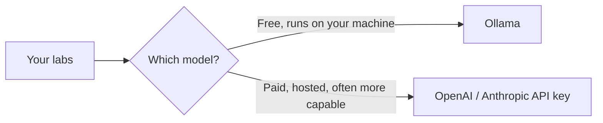

import Tabs from '@theme/Tabs';
import TabItem from '@theme/TabItem';

# Chapter 0: Set Up Your Machine

Before you go on a road trip, you pack the car first: snacks, a phone charger, a map. You don't figure that out while you're already driving. This chapter is the packing part. It's not exciting, but skipping it means every later chapter stops to fix a setup problem instead of teaching you something new. Do this once, carefully, and you won't think about it again.

You don't need to know how to code yet. You just need to follow each step in order.

## What you're installing, and why

| Tool | Why you need it |
|---|---|
| **uv** | A free tool that manages Python for you, including Python itself if you don't already have it, plus a private, isolated folder for each lab's packages so they can't clash with anything else on your computer. Every lab in this course uses Python, the language most AI tooling is built around, and uv is how you'll run it. |
| **VS Code** | A free code editor. You'll use it to open and run the lab files. |
| **Ollama** | Lets you run an AI model directly on your own computer. Free, no account, no internet needed once it's downloaded. This is how you'll do almost every lab in Tiers 1 and 2 at zero cost. |
| **(Optional) An OpenAI or Anthropic API key** | If you'd rather use a hosted model instead of (or alongside) Ollama, this is how. Optional because Ollama alone gets you through the free path. |

Here's the shape of the decision you're setting up for:



You can install both and switch per lab. Nothing below locks you into one path.

## Step 1: Install uv

Open your terminal (Mac/Linux: the **Terminal** app; Windows: **PowerShell**) and check if you already have it:

```bash
uv --version
```

If that printed a version number, skip to Step 2. If not:

<Tabs groupId="operating-systems">
<TabItem value="mac" label="macOS / Linux">

```bash
curl -LsSf https://astral.sh/uv/install.sh | sh
```

</TabItem>
<TabItem value="windows" label="Windows">

```powershell
powershell -ExecutionPolicy ByPass -c "irm https://astral.sh/uv/install.ps1 | iex"
```

</TabItem>
</Tabs>

Close and reopen your terminal, then re-run `uv --version` to confirm it worked.

**Why uv instead of installing Python by hand?** Normally you'd need to separately install Python, then learn a second tool (`venv`) to keep each project's packages from clashing with each other, then remember to "activate" that environment every time you open a new terminal. uv folds all three of those into one tool. If you don't have Python, uv downloads the right version for you the first time a lab needs it. For isolation, it automatically creates a private `.venv` folder per lab the first time you run something in it, no separate command, nothing to activate by hand.

## Step 2: Create a project folder

Pick a spot for this course's code (your Desktop or home folder is fine) and create a folder:

```bash
mkdir zero-to-agent-labs
cd zero-to-agent-labs
```

That's it, no environment to create yet. Each lab folder in this course ships with its own `pyproject.toml` file that lists exactly which packages that lab needs. The first time you run `uv run <script>.py` inside a lab folder, uv reads that file, quietly creates an isolated `.venv` just for that lab, installs the packages into it, and runs your script, all in one step. Run it again later and it skips straight to running, since everything's already there.

## Step 3: Install VS Code

Download and install [VS Code](https://code.visualstudio.com/), it's free. You'll use it to open the lab folders and run the Python scripts. Any code editor works, but the labs' instructions assume VS Code, so it's the easiest path if this is new to you.

## Step 4: Install Ollama and download a model

This is the step that gets you a **free, private AI model running on your own computer.**

1. Go to [ollama.com](https://ollama.com), download the installer for your OS, and run it.
2. Open a terminal and pull a small model:

```bash
ollama pull llama3.2
```

This downloads about 2GB, so it takes a few minutes depending on your internet speed. This is a one-time download. After this, the model lives on your machine and needs no internet connection to run.

3. Check it works:

```bash
ollama run llama3.2
```

Type something like `hi, are you working?` and press Enter. You should get a reply printed back in your terminal. Type `/bye` to exit.

If you got a reply, Ollama is fully working and you can already do most of this course's labs for free, forever, with no account and no credit card.

## Step 5 (optional): Get a hosted API key

Ollama is enough to complete Tier 1 and most of Tier 2. Some learners prefer a hosted model instead, because it's often faster or more capable. This costs a small amount of money per request (usually fractions of a cent for these labs), billed by the provider directly to you. This project never sees or handles your key or your money.

- **OpenAI:** create a key at [platform.openai.com/api-keys](https://platform.openai.com/api-keys)
- **Anthropic:** create a key at [console.anthropic.com](https://console.anthropic.com/)

Either way, you'll be asked to add a payment method on *their* site before the key works. Save the key somewhere safe. Each lab will ask you to paste it into a local `.env` file that never leaves your computer and is never uploaded anywhere.

## Checkpoint

<details>
<summary>Why does each lab have its own isolated environment instead of just installing packages normally?</summary>

So this course's packages stay isolated in their own folder and can't conflict with other Python projects on your computer (or be broken by them later). uv creates and manages that isolation for you automatically, no separate command to remember.
</details>

<details>
<summary>What's the difference between Ollama and an OpenAI/Anthropic API key?</summary>

Ollama runs a model directly on your computer: free, private, no account needed, but limited to your computer's hardware. An API key sends your request to a company's servers over the internet: usually faster or more capable, but costs a small amount of money per request.
</details>

<details>
<summary>Do you need to "activate" anything before running a lab, like you might have heard about with Python virtual environments?</summary>

No, that's the whole point of uv. Just run `uv run <script>.py` inside the lab's folder, and it handles creating/activating the isolated environment for you behind the scenes.
</details>

**Time:** 15–30 minutes, mostly download time. **Cost:** $0 if you stick with Ollama, which is enough for all of Tier 1.

## What's next

With your toolbox packed, Chapter 1 starts the actual subject: what people mean when they say "AI," "machine learning," and "generative AI," and how those words relate to each other.
