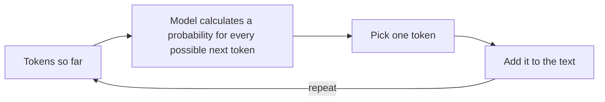

# Chapter 2: What Is a Large Language Model?

Your phone's keyboard already does something like this: you type "I'll be there in", and it suggests "5", "10", "a bit". It's not reading your mind — it's guessing the next word based on patterns from millions of texts people have typed before.

A large language model (LLM) — the technology behind ChatGPT, Claude, and similar tools — does the exact same trick. It's just wildly bigger, and it does it one step at a time, over and over, to write whole paragraphs. That's genuinely most of the magic trick. Let's take it apart.

## Step 1: text gets chopped into "tokens"

Before an LLM can do anything with your text, it has to break it into small chunks called **tokens**. A token is usually smaller than a word — sometimes a whole common word, sometimes just a piece of one.

For example, the word "unbelievable" might get split into three tokens: `un`, `believ`, `able`. Common short words like "the" or "cat" are usually a single token each. As a rough rule of thumb, **1 token ≈ ¾ of an English word** — so a 100-word paragraph is roughly 130 tokens.

Why chop text up like this instead of working word-by-word? Because it lets the model handle *any* word — including ones it's never seen, like a typo or a made-up brand name — by piecing it together from smaller, familiar chunks, the same way you can sound out an unfamiliar word by its syllables.

## Step 2: predicting one token at a time

Here's the actual trick. Given the tokens so far, the model doesn't "know" the answer — it calculates a probability for every possible next token, then picks one (usually the highest-probability one, sometimes a slightly-less-likely one on purpose for variety).

Say the text so far is: *"The cat sat on the"* — the model might assign probabilities like:

| Candidate next token | Probability |
|---|---|
| mat | 41% |
| floor | 18% |
| couch | 12% |
| moon | 0.03% |

It picks "mat," glues it onto the text, and then repeats the *entire* process again — now predicting what comes after "The cat sat on the mat" — one token at a time, until it decides the response is complete.



That's it. That loop, run thousands of times per response, is how an LLM writes an entire email, poem, or piece of code — never planning the whole thing in advance, just repeatedly guessing "what token most plausibly comes next" based on patterns learned from enormous amounts of text during training.

This also explains **why LLMs sometimes confidently say things that are wrong** (often called "hallucinating"). The model isn't looking facts up in a database — it's generating the statistically most plausible-*sounding* next words. Usually that lines up with the truth, because true statements are common in its training data. But it has no built-in "is this actually true?" check — it's playing an extremely good game of "what word most likely comes next," not consulting an encyclopedia.

## Step 3: the "context window" — its short-term memory

An LLM can only look at a limited number of tokens at once — this limit is called the **context window**. Think of it like reading a novel where you can only remember the last 30 pages; anything before that has faded from memory. If a conversation gets too long, older parts can fall outside the window and the model effectively "forgets" them.

Context windows vary by model — some hold a few thousand tokens, some hold hundreds of thousands. Bigger isn't automatically better for every task, but it does mean the model can consider more of your conversation, or a longer document, at once.

## Hands-on lab: make your first LLM call

Time to see the loop from Step 2 actually run. In this lab you'll write a tiny script that sends one prompt to an AI model and prints back what it generated — using either your free local Ollama model from Chapter 0, or a hosted OpenAI/Anthropic key if you set one up.

Full instructions: [`labs/tier1-foundations/02-first-api-call`](https://github.com/fewshot-works/zero-to-agent/tree/main/labs/tier1-foundations/02-first-api-call)

Here's what you should see (with Ollama — exact wording will vary, since the model is generating text one token at a time, not reciting a fixed answer):

```
Using provider: ollama
Prompt: In one short sentence, explain what a large language model is, as if you were talking to a curious 10 year old.
Waiting for a reply...

AI replied:
A large language model is like a computer that has read a huge number of books and websites, so it can guess what word should come next when you ask it a question!
```

**Time:** 10 minutes. **Cost:** $0 with Ollama, or roughly $0.001 (a tenth of a cent) per run with a hosted API key.

## Checkpoint

<details>
<summary>What is a "token," and is it the same thing as a word?</summary>

A token is the small chunk of text an LLM actually processes — often smaller than a word (a common word might be one token; a longer or unusual word might be split into two or three). It's not the same as a word, though short common words often are exactly one token.
</details>

<details>
<summary>How does an LLM decide what to write next?</summary>

It calculates a probability for every possible next token, given everything written so far, then picks one and repeats the process — one token at a time — until the response is done.
</details>

<details>
<summary>Why can an LLM confidently state something that's factually wrong?</summary>

It's generating the most statistically plausible-sounding next words based on patterns in its training data, not looking facts up in a database. There's no built-in fact-checking step — plausible-sounding and true usually overlap, but not always.
</details>

## What's next

Now that you know an LLM is just repeatedly predicting the next token, Chapter 3 covers something you have direct control over: how you *phrase* your prompt changes what the model considers likely — and that's the entire game behind "prompt engineering."
